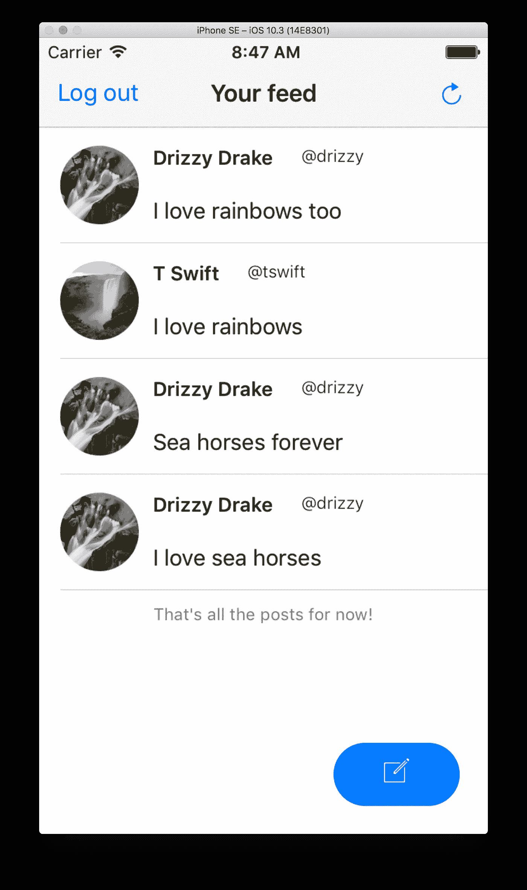

# 如何用 React Native 制作一个简单的 Twitter 克隆

> 原文：<https://medium.com/hackernoon/how-to-make-a-simple-twitter-clone-with-react-native-4b6c45940583>



在本教程中，我们将使用 React Native 创建一个小型的类似 Twitter 的移动应用程序。通过我们的应用程序，用户将能够创建帐户并登录，查看自己和其他用户创建的所有帖子的提要，并向提要添加自己的帖子。我们所有用户和帖子的数据将由 Cosmic JS 管理。

# TL；速度三角形定位法(dead reckoning)

[在 GitHub 上查看源代码](https://github.com/cosmicjs/react-native-twitter-clone)
[在 Cosmic JS 上安装 app(还需要本地运行)](https://cosmicjs.com/apps/react-native-twitter-clone)

# 入门指南

您需要安装 node.js 和 yarn 或 npm。对于这个项目，我使用的是 yarn 和 node v8.1.2。

有许多方法可以启动一个新的 React 原生项目；对于这一个，我使用了 [create-react-native-app](https://github.com/react-community/create-react-native-app) 。我们可以通过运行以下命令来全局安装 CRNA 并启动一个新项目:

```
$ yarn global add create-react-native-app
$ create-react-native-app twitter-clone
$ cd twitter-clone/
$ yarn start
```

我还使用了 Expo SDK，这样我就不用安装 Xcode 和 Android Studio 了。这也将为我提供一些功能，如加载字体和允许用户上传照片到应用程序。要开始使用 Expo，请参考文档。

# 属国

我们将在这个项目中使用几个工具；这里我们就讲几个关键的。

*   Native Base 是一个组件库，它允许我们快速制作一个跨平台的有吸引力的用户界面。
*   [React Native Router Flux](https://github.com/aksonov/react-native-router-flux) 将帮助我们在应用程序的不同屏幕之间导航。
*   [React-Redux](https://github.com/reactjs/react-redux) 将把我们应用程序的不同组件连接到我们的商店，我们将在那里保存关于我们应用程序状态的数据。
*   Axios 是一个基于承诺的 HTTP 客户端，我们将用它来调用 Cosmic JS API。

继续将以下内容复制并粘贴到 package.json 中，然后再次运行 yarn install。

```
{
  "name": "twitter-clone",
  "version": "1.0.0",
  "private": true,
  "devDependencies": {
    "jest-expo": "~1.0.1",
    "react-native-scripts": "0.0.30",
    "react-test-renderer": "16.0.0-alpha.6"
  },
  "main": "./node_modules/react-native-scripts/build/bin/crna-entry.js",
  "scripts": {
    "start": ""react-native-scripts start",
    "eject": "react-native-scripts eject",
    "android": "react-native-scripts android",
    "ios": "react-native-scripts ios",
    "test": "node node_modules/jest/bin/jest.js --watch"
  },
  "jest": {
    "preset": "jest-expo"
  },
  "dependencies": {
    "@expo/vector-icons": "^5.0.0",
    "axios": "^0.16.1",
    "expo": "^17.0.0",
    "form-data": "^2.2.0",
    "native-base": "^2.1.4",
    "react": "16.0.0-alpha.6",
    "react-native": "^0.44.0",
    "react-native-router-flux": "^3.39.2",
    "react-redux": "^5.0.5",
    "redux": "^3.6.0",
    "redux-devtools-extension": "^2.13.2",
    "redux-logger": "^3.0.6",
    "redux-thunk": "^2.2.0",
  }
}
```

# 目录结构

与其他一些样板文件相比，CRNA 对我们如何在应用程序中构造文件没有太大的偏见；它只是给了我们一个 index.ios.js 和 index.android.js 和 App.js 作为起点。

我们将让我们的 App.js 指向一个名为 App 的文件夹，它将保存我们所有的组件、布局、配置文件以及 redux 存储和 reducers。以下是我发现的最适合我的脚手架。我不会在这篇文章中详细讨论每个文件的内容，但是你可以在源代码中看到所有的内容。

这是我们的应用程序文件夹的外观:

```
.
├── assets
│   └── fonts
│       └── Pacifico.ttf
├── components
│   ├── FeedNavbar
│   │   ├── FeedNavbar.js
│   │   ├── index.js
│   │   └── styles.js
│   ├── SinglePost
│   │   ├── SinglePost.js
│   │   ├── index.js
│   │   └── styles.js
│   ├── SmallButton
│   │   ├── SmallButton.js
│   │   ├── index.js
│   │   └── styles.js
│   └── TextField
│       ├── TextField.js
│       ├── index.js
│       └── styles.js
├── config
│   ├── cosmic.js
│   └── routes.js
├── layouts
│   ├── feed
│   │   ├── Feed.js
│   │   ├── index.js
│   │   └── styles.js
│   ├── login
│   │   ├── Login.js
│   │   ├── index.js
│   │   └── styles.js
│   ├── newPost
│   │   ├── NewPost.js
│   │   ├── index.js
│   │   └── styles.js
│   ├── signup
│   │   ├── Signup.js
│   │   ├── index.js
│   │   └── styles.js
│   └── welcome
│       ├── Welcome.js
│       ├── index.js
│       └── styles.js
└── redux
    ├── reducers
    │   ├── index.js
    │   ├── posts.js
    │   └── users.js
    └── store.js
```

# 应用

我们的 App.js 文件中将会发生一些事情。我们将:

*   拉进我们的路线，导航到我们的各种布局
*   将我们的提供者连接到我们的商店，这将让我们的布局访问我们的应用程序状态
*   提供对 Natve Base 使用的一些字体的访问
*   用 AppRegistry 建立我们的根组件

您可以将以下内容复制并粘贴到项目根目录下的 App.js 文件中:

```
import React, { Component } from 'react';
import { AppRegistry, View } from 'react-native';
import { Provider, connect } from 'react-redux';
import { Font, AppLoading } from 'expo';
import store from './app/redux/store';
import Router from './app/config/routes';export default class App extends Component {
  constructor(){
    super();
    this.state = {
      isReady: false,
    }
  } async componentWillMount() {
    await Font.loadAsync({
      'Roboto': require('native-base/Fonts/Roboto.ttf'),
      'Roboto_medium': require('native-base/Fonts/Roboto_medium.ttf'),
      'Pacifico': require('./app/assets/fonts/Pacifico.ttf'),
      'Ionicons': require('native-base/Fonts/Ionicons.ttf'),
    }); this.setState({isReady: true});
  } render() {
    if (!this.state.isReady) {
      return <AppLoading />;
    }
    return (
      <Provider store={store}>
        <Router />
      </Provider>
    );
  }
}AppRegistry.registerComponent('main', () => App);
```

接下来，让我们看看 routes.js 文件:

```
import React from 'react';
import { Scene, Router, Actions, ActionConst } from 'react-native-router-flux';
import Welcome from '../layouts/welcome';
import Login from '../layouts/login';
import Signup from '../layouts/signup';
import NewPost from '../layouts/newPost';
import Feed from '../layouts/feed';const scenes = Actions.create(
  <Scene key="root">
    <Scene key="welcome" component={Welcome} title="Welcome" initial={true} />
    <Scene key="login" component={Login} title="Login" type={ActionConst.REPLACE} />
    <Scene key="signup" component={Signup} title="Create New Account" type={ActionConst.REPLACE} />
    <Scene key="feed" component={Feed} title="Your Feed" type={ActionConst.REPLACE} hideNavBar />
    <Scene key="newPost" component={NewPost} title="Make a new post" />
  </Scene>
);export default () => (
  <Router scenes={scenes} />
);
```

使用 React Native Router Flux，我们刚刚创建了一系列场景，我们可以在应用程序中的任何位置轻松导航到这些场景。

我们的第一个场景是欢迎布局，用户将在登录和创建新帐户之间进行选择。看起来是这样的:

```
import React from 'react';
import {
  Container,
  Content,
  Icon,
  Text,
  Button,
} from 'native-base';
import { View } from 'react-native';
import { Actions } from 'react-native-router-flux';import styles from './styles'; export default () => (
  <Container style={styles.container}>
    <Content>
      <View style={styles.iconBox}>
        <Icon
          style={styles.icon}
          ios="ios-happy-outline"
          android="md-happy"
        />
        <Text style={styles.welcome}>Welcome</Text>
      </View>
      <View style={styles.buttonContainer}>
        <Button
          block
          style={styles.button}
          onPress={() => Actions.login()}
        >
          <Text>Log in</Text>
        </Button>
        <Text style={styles.or}>OR</Text>
        <Button
          block
          style={styles.button}
          onPress={() => Actions.signup()}
        >
          <Text>Sign up</Text>
        </Button>
      </View>
    </Content>
  </Container>
)
```

在这里，我们刚刚创建了两个具有本地基础的按钮，它们将导航到登录和注册布局。

让我们看看我们的注册布局，看看当用户创建一个新帐户时会发生什么。

```
import React, { Component } from 'react';
import { connect } from 'react-redux';
import { ImagePicker } from 'expo';
import { Actions } from 'react-native-router-flux';
import {View} from 'react-native';
import {
  Container,
  Content,
  Button,
  Text,
  Form,
  Thumbnail,
  Icon
} from 'native-base';
import axios from 'axios';import TextField from '../../components/TextField';
import styles from './styles';
import { addUser } from '../../redux/reducers/users';
import cosmicConfig from '../../config/cosmic';const mapDispatchToProps = {addUser};const validate = form => {
  let errorMessage = '';
  if (form.username.includes(" ")){
    errorMessage = "Username cannot contain spaces";
  }
  if (form.password.includes(" ")){
    errorMessage = "Password cannot contain spaces";
  }
  Object.keys(form).slice(0, 5).map(field => {
    if (!form[field]){
      errorMessage = 'All fields must be filled';
    }
  })
  return errorMessage;
}class Signup extends Component {
  constructor() {
    super();
    this.state = {
      firstName: '',
      lastName: '',
      username: '',
      password: '',
      image: null,
      error: '',
    };
  } onSubmit(){
    const error = validate(this.state);
    if (error) {
      this.setState({ error })
    } else {
      this.checkUsername(this.state.username);
    }
  } checkUsername(username){
    axios.get(`https://api.cosmicjs.com/v1/${cosmicConfig.bucket.slug}/object-type/users/search?metafield_key=username&metafield_value=${username}`)
    .then(res => res.data)
    .then(data => {
      if (data.objects) {
        this.setState({ error: 'Username not available'})
      } else {
        this.props.addUser(this.state);
      }
    })
  } uploadImage = async () => {
    let result = await ImagePicker.launchImageLibraryAsync({
      allowsEditing: true,
      aspect: [4, 3],
    });
    if (!result.cancelled) {
      this.setState({ image: result.uri });
    }
  }; render(){
    return (
      <Container style={styles.container}>
        <Content>
          <Form style={styles.mar10}>
            <TextField
              name="First Name"
              value={this.state.firstName}
              onChangeText={(text) => this.setState({firstName: text})}
            />
            <TextField
              name="Last Name"
              value={this.state.lastName}
              onChangeText={(text) => this.setState({lastName: text})}
            />
            <TextField
              name="Username"
              value={this.state.username}
              onChangeText={(text) => this.setState({username: text})}
            />
            <TextField
              secureTextEntry
              name="Password"
              value={this.state.password}
              onChangeText={(text) => this.setState({password: text})}
            />
          </Form>
          <Text style={styles.addPic}>Add a profile picture</Text>
          {
            !this.state.image &&
            <Button
              primary
              bordered
              onPress={this.uploadImage}
              style={styles.uploadButton}>
              <Icon
                ios='ios-camera'
                android='md-camera'
              />
            </Button>
          }
          {
            this.state.image &&
            <Thumbnail
              size={80}
              source={{uri: this.state.image}}
              style={styles.thumbnail}
            />
          }
          <Button
            block
            style={styles.mar10}
            onPress={() => this.onSubmit()}
          >
            <Text>Create account</Text>
          </Button>
          <Text style={styles.formMsg}>{this.state.error}</Text>
          <Button
            transparent
            style={styles.loginBtn}
            onPress={() => Actions.login()}
          >
            <Text style={styles.loginTxt}>Already have an account?</Text>
          </Button>
        </Content>
      </Container>
    );
  }
}export default connect(null, mapDispatchToProps)(Signup);
```

这里发生了几件事:

*   当用户填写表单时，我们保持表单字段的内容不变。
*   当用户提交时，我们做一些简单的验证，以确保他们已经用有效的输入填写了字段。
*   然后，我们第一次调用 Cosmic JS API，以确保他们选择的用户名没有被使用。
*   最后，当所有字段都包含有效输入时，我们用 addUserfunction 将表单作为新用户提交给 Cosmic JS API。

addUser 函数是在我们的 usersreducer 中定义的；看起来是这样的:

```
export const addUser = user => dispatch => {
  let data = new FormData();
  data.append('media', {
        uri: user.image,
        type: 'image/jpeg',
        name: 'image'
      }); return axios.post(`https://api.cosmicjs.com/v1/${cosmicConfig.bucket.slug}/media`, data)
  .then(res => res.data.media)
  .then(media => {
    return axios.post(`https://api.cosmicjs.com/v1/${cosmicConfig.bucket.slug}/add-object`, {
      title: user.firstName + ' ' + user.lastName,
      type_slug: 'users',
      metafields: [
        {
          key: 'name',
          type: 'text',
          value: user.firstName + ' ' + user.lastName,
        },
        {
          key: 'username',
          type: 'text',
          value: user.username,
        },
        {
          key: 'password',
          type: 'text',
          value: user.password,
        },
        {
          key: 'profile_picture',
          type: 'file',
          value: media.name,
              }
            ]
          }
        )}
      )
      .then(res => formatUser(res.data))
      .then(formattedUser => dispatch(createUser(formattedUser)))
      .then(() => Actions.feed())
      .catch(err => console.error(`Creating user unsuccessful`, err))
}
```

这里我们对 Cosmic JS API 进行了两次调用。第一个调用将用户的个人资料图片作为媒体发布到我们的 bucket 中，第二个调用将使用我们获得的图片的引用来发布作为新用户的所有用户信息。

如果用户已经创建了帐户，他们可以登录:

```
import React, { Component } from 'react';
import { connect } from 'react-redux';
import {
  Container,
  Content,
  Icon,
  Text,
  Button,
} from 'native-base';
import { View } from 'react-native';
import { Actions } from 'react-native-router-flux';
import TextField from '../../components/TextField';
import styles from './styles';import { authenticate } from '../../redux/reducers/users';const mapDispatchToProps = {authenticate};const validate = form => {
  let errorMessage = '';
  if (form.username.includes(' ') || form.password.includes(' ')){
    errorMessage = 'Username and password cannot contain spaces';
  }
  if (form.username === '' || form.password === ''){
    errorMessage = 'All fields must be filled';
  }
  return errorMessage;
}class Login extends Component {
  constructor(props) {
    super(props);
    this.state = {
      username: '',
      password: '',
      error: '',
    };
  } onSubmit(){
    const error = validate(this.state);
    if (error) {
      this.setState({ error })
    } else {
    this.login();
    }
  } login(){
    this.props.authenticate(this.state)
      .then(res => {
        if (res === 'Username invalid' || res === 'Password invalid'){
          this.setState({
            error: res,
            username: '',
            password: '',
          })
        } else {
          Actions.feed();
        }
      });
  } render(){
    return (
      <Container style={styles.container}>
        <Content>
          <Text style={styles.formMsg}>{this.state.error}</Text>
          <Icon
            style={styles.icon}
            ios="ios-happy-outline"
            android="md-happy"
          />
          <View style={styles.loginBox}>
            <TextField
            name="Enter Username"
            type="big"
            value={this.state.username}
            onChangeText={(text) => this.setState({username: text})}
            />
            <TextField
            secureTextEntry
            name="Enter Password"
            type="big"
            value={this.state.password}
            onChangeText={(text) => this.setState({password: text})}
            />
          <Button
            block
            style={styles.button}
            onPress={() => this.onSubmit()}
          >
            <Text>Log in</Text>
          </Button>
          </View>
          <Button
            transparent
            style={styles.signupBtn}
            onPress={() => Actions.signup()}>
            <Text style={styles.signupTxt}>Sign up for an account</Text>
          </Button>
        </Content>
      </Container>
    );
  }
}export default connect(null, mapDispatchToProps)(Login);
```

同样，我们检查以确保字段具有有效的输入，然后使用我们的 authenticatefunction 对照我们的 bucket 中的内容检查登录信息:

```
export const authenticate = user => dispatch => {
  return axios.get(`https://api.cosmicjs.com/v1/${cosmicConfig.bucket.slug}/object-type/users/search?metafield_key=username&metafield_value=${user.username}`)
    .then(res => res.data)
    .then(data => {
      console.log('RESPONSE: ', data);
      if (data.objects) {
        const userData = data.objects[0];
        return {
          password: userData.metadata.password,
          username: userData.metadata.username,
          name: userData.metadata.name,
          profilePicture: userData.metadata.profile_picture,
          slug: userData.slug,
          id: userData._id,
        }
      } else {
        return 'Username invalid';
      }
    })
    .then(data => {
      if (data === 'Username invalid'){
        return data;
      } else if (data.password === user.password){
        dispatch(login({
          name: data.name,
          username: data.username,
          profilePicture: data.profilePicture,
          slug: data.slug,
          id: data.id,
        }))
      } else {
        return 'Password invalid';
      }
    })
    .catch(error => console.error('Login unsuccessful', error))
}
```

顺便提一下，我们通常不希望在没有某种加密的情况下将用户凭证直接存储到我们的数据库中，但是我们现在就让它这样，作为我们如何使用 Cosmic API 管理数据的简单说明。

用户登录后，将直接进入提要布局，如下所示:

```
import React, { Component } from 'react';
import { connect } from 'react-redux';
import { Actions } from 'react-native-router-flux';
import {
  Container,
  Content,
  List,
  Button,
  Icon,
  Text,
} from 'native-base';import SinglePost from '../../components/SinglePost';
import FeedNavbar from '../../components/FeedNavbar';
import { loadPosts } from '../../redux/reducers/posts';
import { logoutUser } from '../../redux/reducers/users';
import styles from './styles';const mapStateToProps = ({ posts }) => ({ posts });const mapDispatchToProps = { loadPosts, logoutUser };const renderPost = (post, index) => (
  <SinglePost
    key={index}
    name={post.name}
    username={post.username}
    profilePicture={post.profilePicture}
    content={post.content}
  />
)class Feed extends Component {
  componentDidMount(){
    this.props.loadPosts();
  } render(){
    const endMsg = this.props.posts.length === 0 ? "There aren't any posts yet!" : "That's all the posts for now!" return (
      <Container>
        <FeedNavbar logout={this.props.logoutUser} refresh={this.props.loadPosts} />
        <Content>
          <List>
            {
              !!this.props.posts.length && this.props.posts.map(renderPost)
            }
          </List>
          <Text style={styles.end}>{endMsg}</Text>
        </Content>
        <Button
          rounded
          style={styles.button}
          onPress={() => Actions.newPost()}
        >
          <Icon
            name="create"
            style={{padding: 5}}
          />
        </Button>
      </Container>
    );
  }
}export default connect(mapStateToProps, mapDispatchToProps)(Feed);
```

当提要布局挂载时，我们调用 Cosmic API 将我们的 bucket 中的所有帖子加载到我们的应用程序状态中。在我们的 posts 缩减器中，loadPostsfunction 看起来像这样:

```
export const loadPosts = () => dispatch => {
  return axios.get(`https://api.cosmicjs.com/v1/${cosmicConfig.bucket.slug}/object-type/posts`)
    .then(res => res.data.objects ? formatPosts(res.data.objects) : [])
    .then(formattedPosts => formattedPosts.sort(postSorter))
    .then(sortedPosts => dispatch(init(sortedPosts)))
    .catch(err => console.error(`Could not load posts`, err));
};
```

我们将所有的文章放入我们的桶中，以一种容易获得我们想要的数据的方式对它们进行格式化，并将它们加载到 state 中。然后它们会显示在提要中。

从提要中，用户可以点击一个按钮来发表新的帖子。然后它们被带到新的 Postlayout:

```
import React, { Component } from 'react';
import { connect } from 'react-redux';
import {
  Container,
  Content,
  Text,
  Button,
} from 'native-base';
import { View } from 'react-native';
import TextField from '../../components/TextField';
import styles from './styles';import { createPost } from '../../redux/reducers/posts';const mapStateToProps = state => ({
  user: state.user,
})const mapDispatchToProps = { createPost };class NewPost extends Component {
  constructor(){
    super();
    this.state = {
      content: '',
      error: '',
    }
  }
  onSubmit() {
    if (this.state.content){
      this.props.createPost({
        user: this.props.user,
        content: this.state.content,
      })
    } else {
      this.setState({error: 'You have to write something!'});
    }
  } render(){
    return (
      <Container style={styles.container}>
        <Content>
          <Text style={styles.formMsg}>{this.state.error}</Text>
          <View style={styles.input}>
            <TextField
              big
              name="What's up?"
              value={this.state.post}
              onChangeText={(text) => this.setState({content: text})}
            />
            <Button
              rounded
              style={styles.button}
              onPress={() => this.onSubmit()}
            >
              <Text>Post</Text>
            </Button>
          </View>
        </Content>
      </Container>
    );
  }
}export default connect(mapStateToProps, mapDispatchToProps)(NewPost);
```

当他们提交帖子时，我们会将其发送到我们的邮箱:

```
export const createPost = post => dispatch => {
  return axios.post(`https://api.cosmicjs.com/v1/${cosmicConfig.bucket.slug}/add-object`, {
      title: post.user.username + ' post',
      type_slug: 'posts',
      content: post.content,
      metafields: [
        {
          type: 'object',
          title: 'User',
          key: 'user',
          object_type: 'users',
          value: post.user.id
        },
      ]
    })
      .then(res => formatPost(res.data, post))
      .then(formattedPost => dispatch(create(formattedPost)))
      .then(() => Actions.feed({type: 'popAndReplace'}))
      .catch(error => console.error('Post unsuccessful', error))
}
```

然后重定向回提要，提要将获取更新的帖子列表。用户还可以刷新他们的提要来查看新的帖子，并从提要中注销。

# 结论

我们使用 React Native 制作了一个类似 Twitter 的应用程序，它利用了 Cosmic JS API 的强大功能来轻松维护我们的用户和帖子的所有数据。我们能够通过几个简单的操作快速启动并运行，这些操作将我们的数据发送到我们的 Cosmic JS Bucket 或从其中获取数据。

> 这篇文章最初出现在[宇宙 JS 博客](https://cosmicjs.com/blog/how-to-make-a-simple-twitter-clone-with-react-native)上。

[](http://bit.ly/HackernoonFB)[](https://goo.gl/k7XYbx)[](https://goo.gl/4ofytp)

> [黑客中午](http://bit.ly/Hackernoon)是黑客如何开始他们的下午。我们是 [@AMI](http://bit.ly/atAMIatAMI) 家庭的一员。我们现在[接受投稿](http://bit.ly/hackernoonsubmission)并乐意[讨论广告&赞助](mailto:partners@amipublications.com)机会。
> 
> 如果你喜欢这个故事，我们推荐你阅读我们的[最新科技故事](http://bit.ly/hackernoonlatestt)和[趋势科技故事](https://hackernoon.com/trending)。直到下一次，不要把世界的现实想当然！

