# 零经验如何做一个 VR app

> 原文：<https://medium.com/hackernoon/how-to-make-a-vr-app-with-zero-experience-927438e2dede>

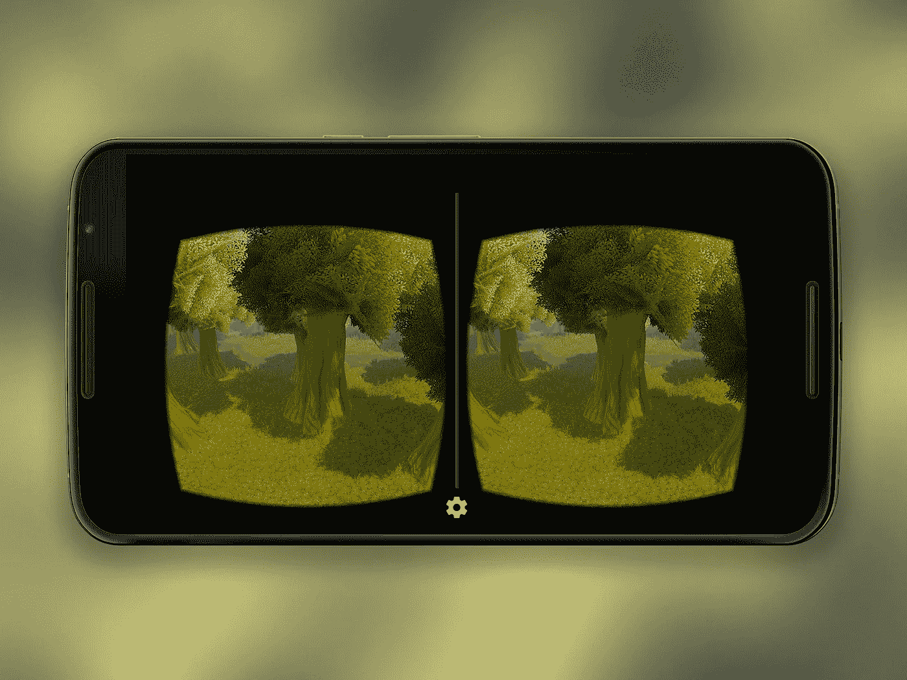

除非你一直生活在岩石下，否则你应该很着迷(或者至少很好奇？)通过 VR。查看一些给了我灵感的文章:

*   [从产品设计到虚拟现实，Jean-Marc Denis 著](/google-design/from-product-design-to-virtual-reality-be46fa793e9b#.9cw3qwi0n)
*   [朱利叶斯·塔恩在虚拟现实中设计的一个月](/facebook-design/a-month-designing-in-vr-62474aef1f1c#.q2u3awfec)
*   [us two](https://ustwo.com/blog/designing-for-virtual-reality-google-cardboard/)为虚拟现实设计

经过一些调查，事实证明，即使你没有任何 3D 或编码经验，制作一个虚拟现实应用程序其实并不难。给你一个例子，这是我用这种方法做的一个应用程序。

## **你需要的工具:**

*   一个 VR 头戴设备(我有 [Google Cardboard](https://www.google.com/get/cardboard/) ，但是其他的也可以。)
*   [Unity](http://unity3d.com/get-unity) (下载安装免费版)
*   [Android SDK](http://developer.android.com/sdk/index.html#Other) (仅从 *SDK 工具*部分下载。我用 Android 作为例子，但是 iOS 应该也可以。)
*   [Cardboard Unity SDK](https://github.com/googlesamples/cardboard-unity) (从 Github repo 下载)
*   一个由尤普·奥托制作的[自动行走脚本(从 Github repo 下载)](https://github.com/JuppOtto/Google-Cardboard)

我们将制作的应用程序是一个简单的虚拟环境之旅。您可以使用 VR 头戴式耳机中的触发器来切换自动行走。

## **第一步:创建虚拟环境**

*   开放团结。在弹出窗口中创建一个项目。此时不需要修改任何设置。

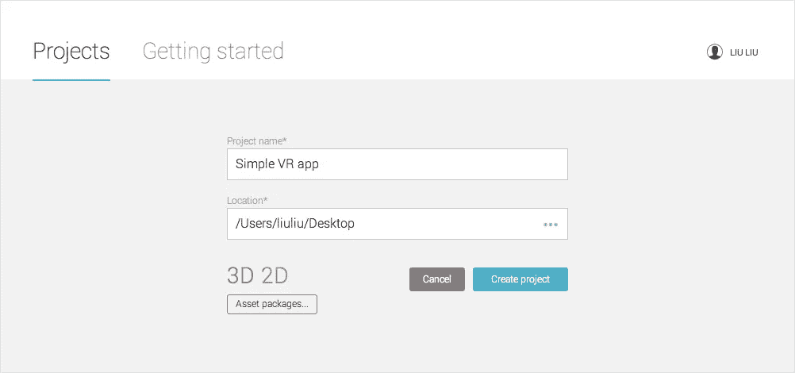

*   我将使用由 Patryk Zatylny 创建的这个免费的[森林环境](https://www.assetstore.unity3d.com/en/#!/content/35361)资产，但是你可以使用任何你喜欢的资产。打开网址，点击“在 Unity 中打开”。Unity 会将其加载到*资产存储*面板中。然后点击“下载”(Unity 不允许直接从网页下载资产)。

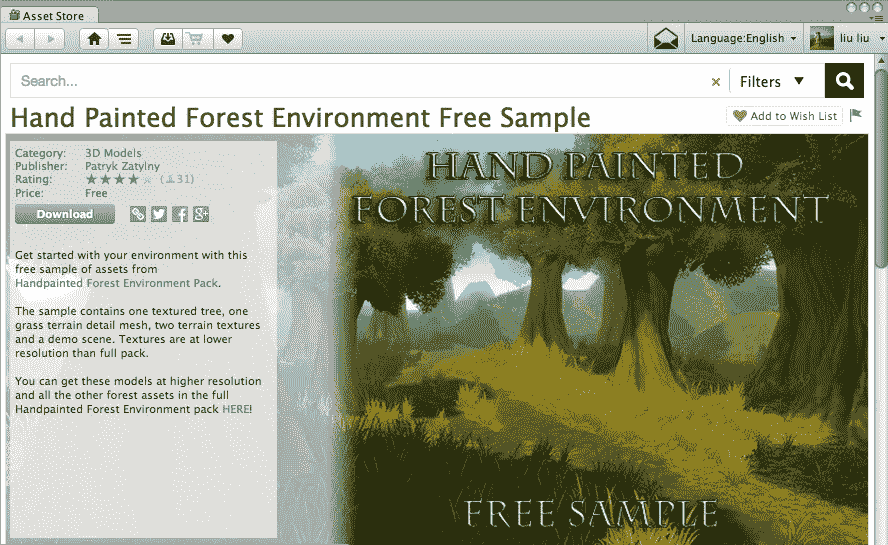

*   下载完成后，您会看到一个弹出窗口。点击“导入”。

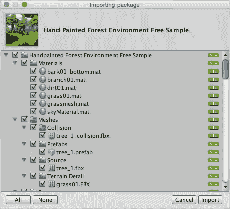

*   导航到您的*项目*面板(如果您找不到它，请转到顶部菜单栏，窗口>布局>默认)。双击文件结构中的 *demoScene_free* 文件(使用右下角的滑块改变缩略图大小)。现在你可以在*场景*面板中看到美丽的景色。

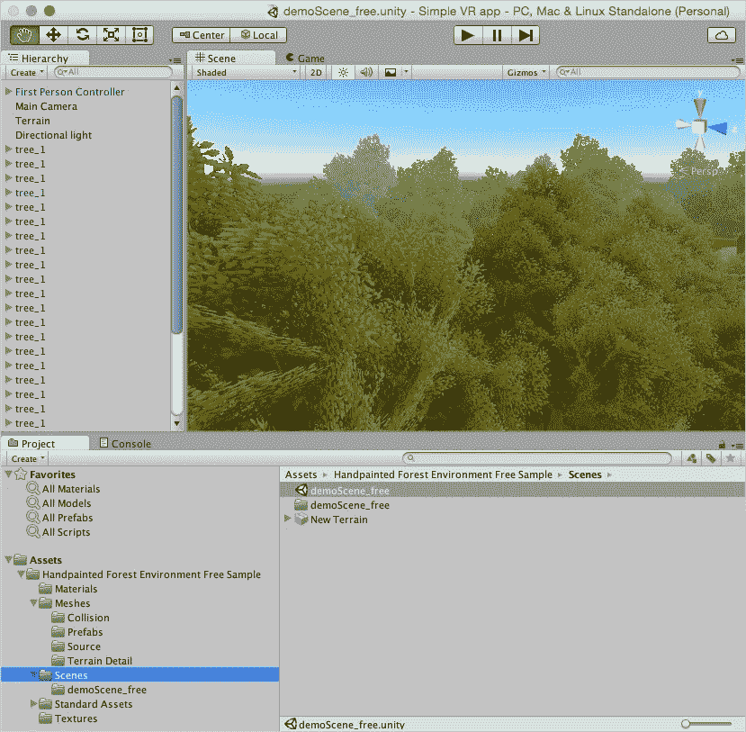

## 步骤 2:设置 Cardboard Unity SDK

*   在*层级*面板中，删除*第一人称控制器*和*主摄像机。*

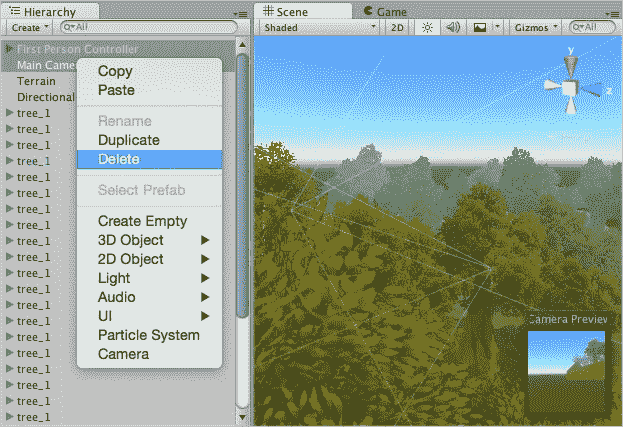

*   解压你从 [Github repo](https://github.com/googlesamples/cardboard-unity) 下载的 Cardboard SDK，你会得到一个 *cardboard-unity-master* 文件夹。在顶部菜单栏中，转到资产>导入包>自定义包，在 *cardboard-unity-master* 文件夹中选择 *CardboardSDKForUnity* 。在接下来的弹出窗口中，点击“导入”。

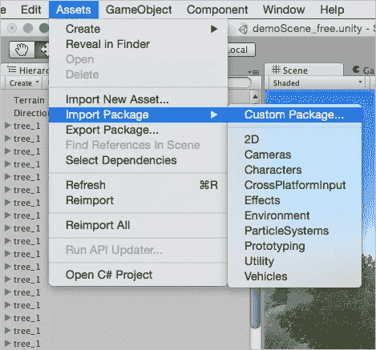

*   在你的*项目*面板中，你会看到一个*纸板*文件夹。转到*预置*子文件夹，拖动 *CardboardMain* 放到*场景*中。

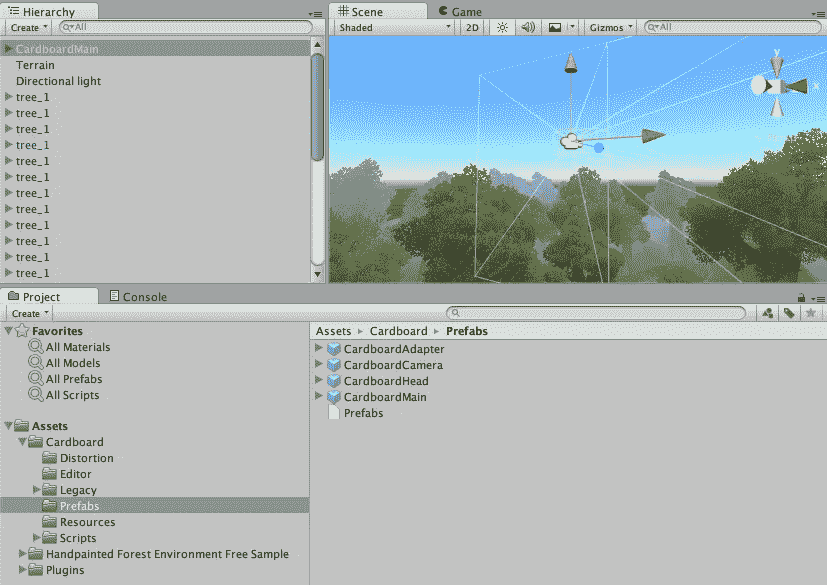

*   点击播放按钮进行测试。使用鼠标/触控板和 alt/control 键来模拟摄像机平移/倾斜。当您不在播放模式时，您可以使用最右边的*检查器*面板中的**变换*部分，或者使用左上角工具栏中的变换工具来修改 *CardboardMain* 的初始位置。([关于如何在 Unity 中摆放物品的更多细节](http://docs.unity3d.com/Manual/PositioningGameObjects.html))*

*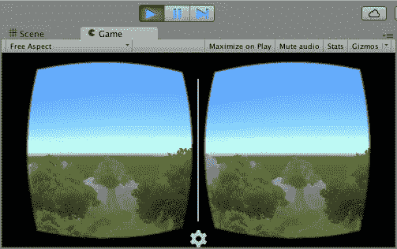*

## *步骤 3:添加自动行走功能*

*   *解压缩你从 [Github repo](https://github.com/JuppOtto/Google-Cardboard) 下载的自动行走脚本，你会得到一个*Google-Cardboard-master*文件夹。拖动 *Autowalk.cs* 文件，将其放入*项目*面板的*资产*文件夹中。*

*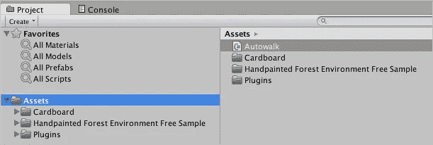*

*   *在*层级*面板中点击选择 *CardboardMain* ，在*检查器*面板中一直点击“添加组件”，找到 *Autowalk* 并选择它。*

*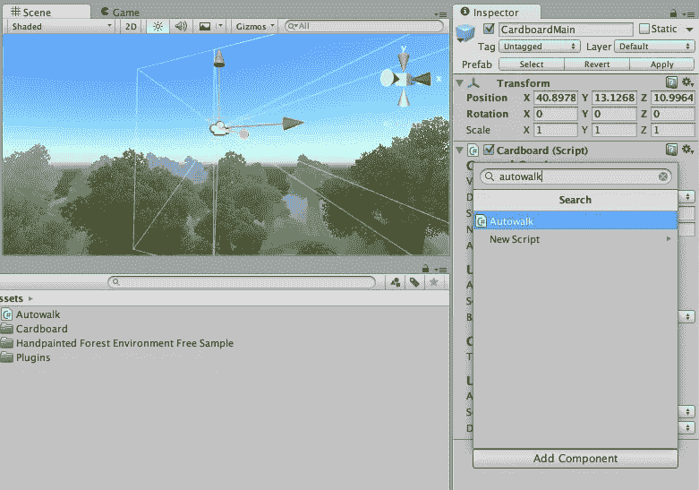*

*   *你会在检查面板中看到一个新的*自动行走*部分。选中“触发时行走”并将速度设置为 1(或任何你喜欢的值)。现在，在播放模式下，您可以使用鼠标点击/触控板点击来模拟触发器，以查看 autowalk 的运行情况！*

*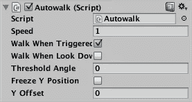*

## ***第四步:打包 app***

*   *转到顶部菜单栏，文件>构建设置。选择 Android，点击“播放器设置”。输入一个*公司名称*(在顶部)和一个*捆绑包标识符*(在底部的*其他设置*部分)。在*分辨率和演示*部分，将*默认方向*更改为横向向左。*

*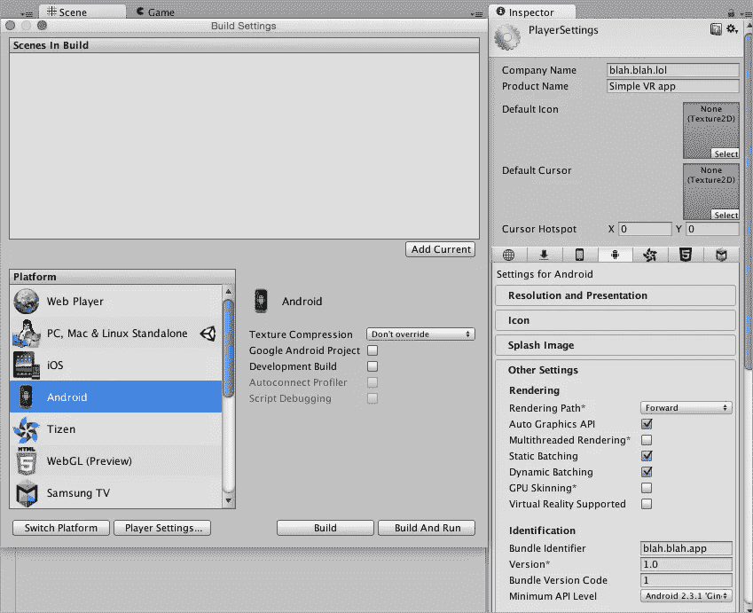*

*   *向下滚动到*出版设置*。如果您没有密钥库，请选中“创建新的密钥库”，输入您的密码，然后单击“浏览密钥库”。在弹出窗口中，输入密钥库的名称，然后单击“保存”。现在，您应该在“浏览密钥库”旁边看到您的密钥库的文件路径。([关于签署 Android 应用程序的更多详情](http://developer.android.com/intl/zh-cn/tools/publishing/app-signing.html))*

*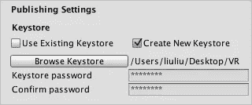*

*   *在下面的“密钥”部分的别名下拉列表中，选择“创建新密钥”。在弹出窗口中输入您的信息，然后单击“创建密钥”。*

*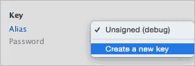*

*   *您也可以在*图标*部分添加您的应用图标。在“构建设置”窗口中单击“构建”。在这个过程中，你可能会被要求选择根 Android SDK 文件夹。解压下载的 [Android SDK](http://developer.android.com/sdk/index.html#Other) 文件，选择该文件夹。你也可能被要求更新 SDK。确认更新即可。构建完成后，你可以在你的 Android 手机上安装应用程序，用你的 VR 耳机测试，甚至上传到谷歌 Play 商店！(有时当你转动头部时，相机并不跟着你转动。退出并重新打开应用程序应该可以解决这个问题。可能和 SDK 版本&安卓版本有关。如果你发现更多关于这个 bug 的细节，请告诉我。)*

*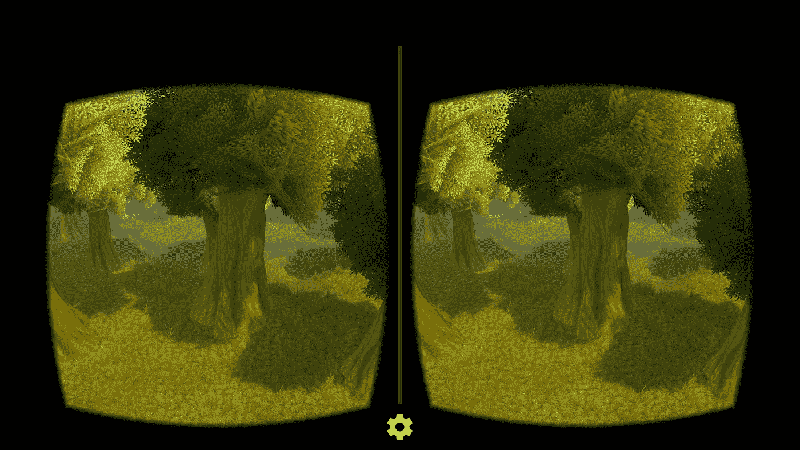*

*你完了！这并不太难，是吗？*

## *漫谈*

*   *管理你的期望。你不太可能在第一次尝试中就建立下一个[土地尽头](http://www.landsendgame.com/)或[谷歌纸板设计实验室](https://play.google.com/store/apps/details?id=com.google.vr.cardboard.apps.designlab)。从小事开始，并在此基础上不断积累。降低你的期望，少承诺，多兑现。*
*   *如果我们想让 VR 成功，我们需要更好的工具，因为你见过 Unity 界面吗？需要像“虚拟现实广场”这样的东西来降低门槛，让更多的人参与进来。*

******

> *[黑客中午](http://bit.ly/Hackernoon)是黑客如何开始他们的下午。我们是 [@AMI](http://bit.ly/atAMIatAMI) 家庭的一员。我们现在[接受投稿](http://bit.ly/hackernoonsubmission)，并乐意[讨论广告&赞助](mailto:partners@amipublications.com)机会。*
> 
> *如果你喜欢这个故事，我们推荐你阅读我们的[最新科技故事](http://bit.ly/hackernoonlatestt)和[趋势科技故事](https://hackernoon.com/trending)。直到下一次，不要把世界的现实想当然！*

**