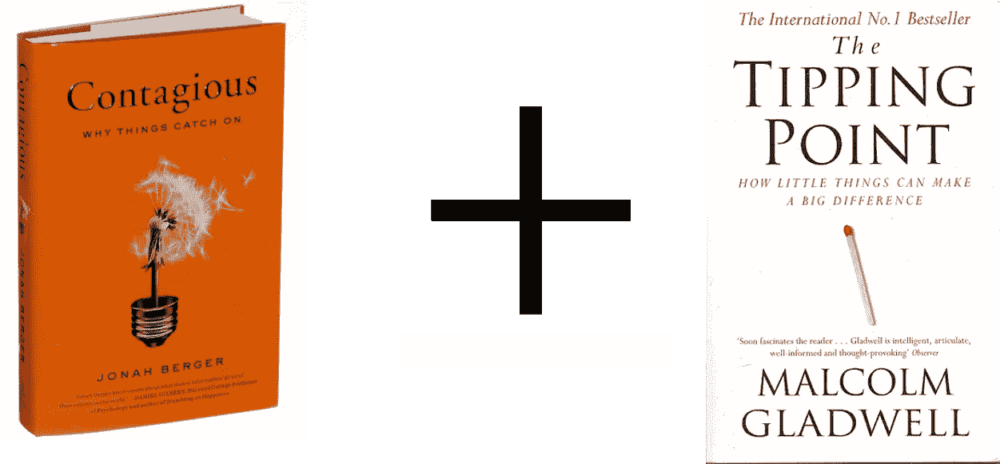

# 如何让任何东西(几乎)像病毒一样传播

> 原文：<https://medium.com/hackernoon/how-to-make-almost-anything-go-viral-ac094ba4311>

这篇文章的一个版本曾出现在《福布斯》杂志上。

关于如何让任何事情[病毒化](https://hackernoon.com/tagged/viral)，有两个思想流派。在[的引爆点](http://www.amazon.com/The-Tipping-Point-Little-Difference/dp/0316346624)，马尔科姆·格拉德威尔强调了信使的重要性。相比之下，乔纳·伯杰的[传染性:为什么事情会流行起来](http://www.amazon.com/Contagious-Why-Things-Catch-On/dp/1451686579)宣称一个结构合理的信息会让信息传递者变得无关紧要。哪种方法是正确的？

正如大多数从课堂迁移到现实世界的商业策略一样，“正确的方法”包括结合多种理论中的适当元素，并将它们应用到你的具体情况中。

如果你还没有订阅，现在就订阅免费的每周 JohnGreathouse.com 文章吧！

**假反格拉德威尔**

伯杰教授的出版商西蒙和舒斯特将“传染性”定位为流行文化临界点的科学计数器。他们希望，对这本非常受欢迎的书采取有争议的立场，将有助于《传染》从每年出版的 1.1 万本商业书籍中脱颖而出。他们的方法取得了一定的成功，谷歌搜索“引爆点”(The Tipping Point)和“乔纳·伯杰”(Jonah Berger)大约有 3000 次点击就证明了这一点

在接受采访时，伯杰采取了比他的出版商更外交的方式，称赞格拉德威尔，但同时指出，“我喜欢在课堂上说，‘百分之五十的临界点’是错误的。我的工作是向你展示哪一半。"

**点燃森林大火**

为了证明信息比信使更重要，伯杰教授写道，*“…想想一场森林大火。它能不能接住，并不取决于最初火花的大小。它依赖于有很多准备好捕捉火花的树木。”*

这当然是真实的说法。然而，一个错误的篝火火花远不像一个雷击导致一棵大树燃烧起来那样可能烧毁一片森林。因此，在设计一个病毒式的[营销活动时，信息和信息传达者都应该被考虑。](https://hackernoon.com/tagged/marketing)

格拉德威尔会见伯杰

格拉德威尔先生将最适合帮助点燃森林大火的信使大致分为:联络人(拥有大量可以影响的熟人的超级网络者)、专家(收集“知情”信息的人)和推销员(讲述引人注目的故事的推销者)。

伯杰教授使用首字母缩写 STEPPS 将高度病毒化的信息分成六个方面。对这些原则的描述来自于 2013 年伯杰教授在沃顿商学院[的演讲](http://knowledge.wharton.upenn.edu/article/contagious-jonah-berger-on-why-things-catch-on/)。

*   **社交货币:** *“都是关于人们谈论事情让自己看起来好，而不是坏。”*
*   **触发:** *“这都是关于‘顶尖，舌尖’的想法。”我们谈论我们头顶上的事物。”*
*   **情感:** *“当我们关心时，我们分享。我们越关心一条信息，或者我们越感到生理上的兴奋，我们就越有可能传递一些信息。”*
*   **公众:** *“当我们看到别人在做某件事时，我们更有可能去模仿它。”*
*   **实用:** *“基本上，就是你可以利用的新闻的想法。我们分享信息是为了帮助他人，让他们过得更好。”*
*   **故事:** *“我们如何分享那些常常被包裹在故事或叙述中的事物。”*

如果你精心设计了一条体现伯杰传染原则的信息，然后诱使格拉德威尔的引爆点信使去推广它，你可能会发现伯杰和格拉德威尔都是“正确的”

*可以在推特上关注约翰:*[***@ johngreathouse***](https://twitter.com/#!/johngreathouse)*。*

*图片来源:西蒙&舒斯特*

> [黑客中午](http://bit.ly/Hackernoon)是黑客如何开始他们的下午。我们是 [@AMI](http://bit.ly/atAMIatAMI) 家庭的一员。我们现在[接受投稿](http://bit.ly/hackernoonsubmission)并乐意[讨论广告&赞助](mailto:partners@amipublications.com)机会。
> 
> 如果你喜欢这个故事，我们推荐你阅读我们的[最新科技故事](http://bit.ly/hackernoonlatestt)和[趋势科技故事](https://hackernoon.com/trending)。直到下一次，不要把世界的现实想当然！

