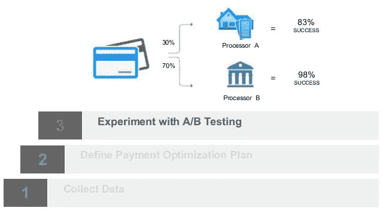
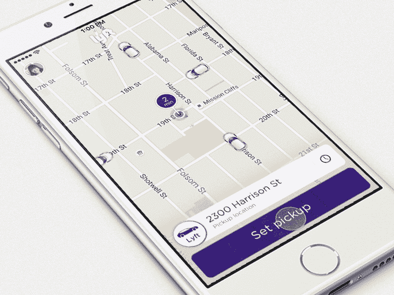
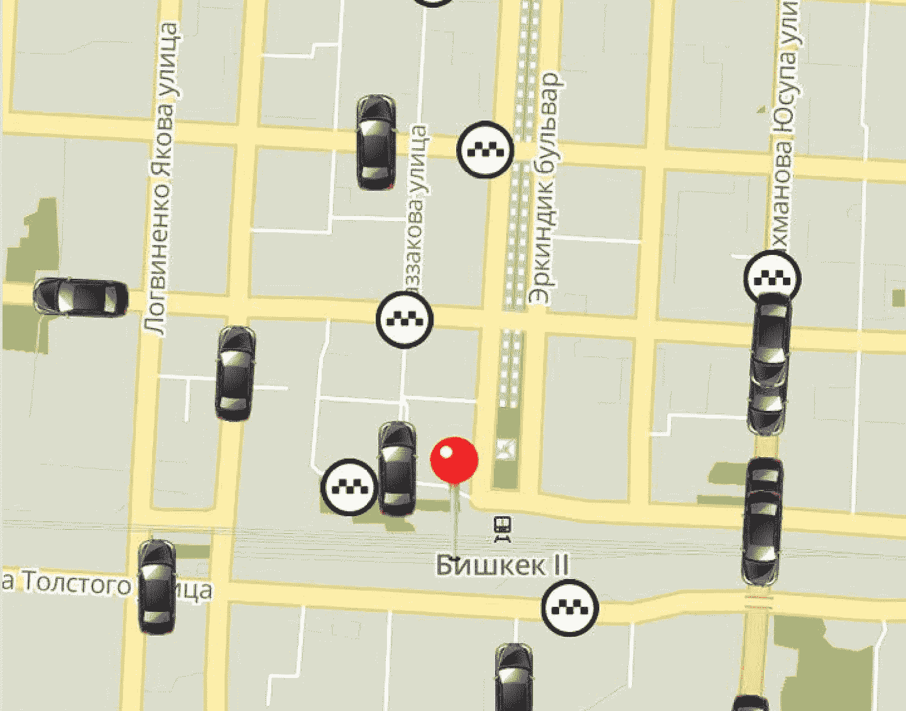
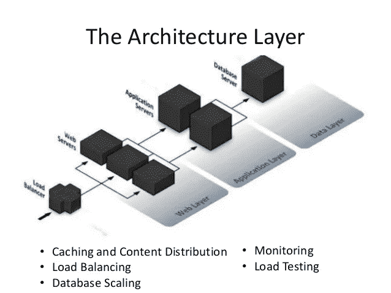

# 如何制作一个像优步一样的应用程序:百万美元指南

> 原文：<https://medium.com/hackernoon/how-to-make-an-app-like-uber-a-million-dollar-guide-bd289d892d15>

你想开发一个像优步一样的应用吗？如果是的话，你可能被建议不要构建它，因为有 2000 多个这样的应用程序。

你知道吗，在 2015 年，Rob Sadow 发现了**按需拼车行业**的一个巨大问题:

1.  85%的职场人士每天开车上班
2.  他们排放了 6.2 吨二氧化碳

Rob 想填补这个空白，推出了自己的手机应用。不久，在推出该应用程序 4 个月后，Rob 看到了高达 20，000 多次的骑行，并获得了 520 万美元的资金。

> 现在，大多数人可能从未听说过 Scoop，而按需应用程序可以填补类似的空白。不幸的是，许多企业家不知道这种应用程序是如何构建的，并在不知不觉中忽略了构建这种应用程序的好处。

# 你将在这里学到什么:

**1。构建 MVP 所需的功能和技术**

**2。如何实现那些特性**

**3。为您的应用构建完美的后端**

**4。为您的 MVP 选择营销技术组合**

像优步这样的应用程序，即使是最基本的形式，也应该允许用户请求乘车并进行无现金支付。整个生态系统应该提供服务器和应用程序之间的实时交互，并在完成乘坐后自动处理支付。

除此之外，退款和司机评级是建立一个经济可行的市场的另一个关键因素。

**让我们看看 MVP 的这些重要特性，以及如何构建它们。**

●每个人想到的第一个功能是实时跟踪和通知。建设，这需要优化代码的性能，套接字编程和与各种谷歌地图的 API 通信。

●该应用程序还应允许用户使用手机注册。在适当的安全设置支持下，用户输入的详细信息将存储在为此应用程序设计的数据库中。

●为了请求出租车，该应用程序利用谷歌地图，允许用户在地图上放一个大头针。当乘客确认一个出租车请求时，一个通知被发送给最近的司机。使用谷歌地图 API 可以很容易地返回距离 ETA。

●预订出租车时，需要发送推送通知。该应用程序的服务器组件可以是自定义创建的，也可以使用第三方提供商实施。对于应用程序 MVP，我们更喜欢亚马逊的 SNS，因为它是轻量级的，对初创公司来说几乎没有成本。

●发送推送通知还需要 SSL 连接，这可能是最难实现的部分。

●为了方便通过应用程序进行支付，Braintree 为 iOS 和 Android 都提供了 SDK。整合这些 SDK 可以让你自动扣款，开发票和退款。

为了开始对乘坐进行计费，该应用程序可以利用运动检测。

> 简而言之，你的第一个 MVP 产品应该能够让用户请求服务(乘车)，发送推送通知，处理实时支付，并使用谷歌地图 API 锁定位置。这一切都可以在一个可扩展和可靠的后端架构上实现。

当然啦！这只是一个概述…构建一个应用程序需要更多的东西。除非你是一个博学的人，否则你需要雇佣具备以下技能的开发人员:

1.  移动应用程序:Objective-C、Java、Swift
2.  应用程序的后端服务:Node.js 和 PHP
3.  应用数据库:MongoDB 和 MySQL

**现在，如果…**

让我们假设你已经用最好的可用技术构建了这个应用程序，你的应用程序非常棒，它是建立在推荐算法之上的，可以完全自动化你的任务。

但是..你后来发现，你需要改变产品才能生存。但是现在你已经耗尽了你的预算，你不能把重点放在产品的市场适合度上。

**实话实说……**

> 你不需要一个确切的优步技术来测试热水和获取用户。你需要一个最小的基于特性的产品来测试你是否在朝着正确的方向前进，然后随着你的进展构建更多的产品。

在它的最初阶段，优步没有艺术建筑，他们过去是边发展边建造。
**如此..什么样的技术最适合 MVP？**

基于以下内容构建的简单应用程序将能够轻松处理成千上万的用户，并允许在突然激增时进行扩展:

1.  基于 Objective-C 和 Java 等编程语言的高性能本地构建的面向消费者的应用程序，您也可以在这里使用 Swift。
2.  PHP 和/或 node.js 上经过良好优化的 web 服务堆栈
3.  MySQL + MongoDB 上设计良好的数据库存储将能够轻松处理负载。

早在 2011 年，Twitter 曾经依靠一个简单的 MySQL 堆栈来处理 2.5 亿条推文。在这种情况下，MySQL 和 MongoDB 可以轻松处理任何突然的激增。

**但是软件开发是有风险的……**

这就是为什么我们追求 MVP 和适当的项目管理方法。以下是正确规划和执行应用程序开发计划应该做的事情:

1.  将你的项目和任务划分成优先顺序。
2.  确保任务被恰当地分配给设计师、开发人员和项目经理。
3.  为每项任务设定期限
4.  列出每位团队成员的前 5 项优先任务。
5.  及时了解项目进展、问题和迭代
6.  与您的开发团队交流，积极参与开发过程

# 为您的应用程序构建完美的后端

人们从错误中学习，但是你没有犯过错误。那么，你会如何学习呢？

> 我们已经构建了数百个应用程序，其中一些在一个月内就有数百万用户使用。与我们一起工作的团队经常惊慌失措，我们花了几个晚上来修复应该处理大量用户的架构。

那是在 2011 年，当初创公司进入 MVP 阶段时，他们很少关心后端和功能的可扩展性。在那些日子里，即使是优步也在努力应对激增。

【2011 年后，节点。Js 发生了…

**建筑物实时定位、显示和跟踪**

要构建 so 功能，您需要更加关注数据提取和优化。

1.  **你知道吗，一个类似优步的应用程序每 4 秒钟就与服务器通信，提供实时信息。** 
    *根据您希望跟踪驾驶室位置的精确程度或宽松程度，您可以更改通信频率。*
2.  **如果您想知道，该应用程序经常需要传达 eta、GPS 位置、计算最短距离以及其他可能需要的信息。**

    *该应用利用以下 API 来收集信息:谷歌地图方向 API、距离矩阵 API、地理围栏、谷歌地点 API、谷歌地图地理编码 API。*
3.  **这将是构建实时体验的最重要部分。一个半双工插座，可以在您的服务器和移动应用程序之间推送实时信息。这些协议之所以如此重要，是因为它们有助于减少通信开销。

    在没有套接字的情况下，每当服务器接收到请求时，就必须打开和关闭一个端口。此外，HTTP 协议是为拉数据而构建的，如果服务器想要推数据，它必须进行轮询。与这些 HTTP 协议不同，连接到服务器的套接字总是保持一个端口开放，以方便信息交换。**
4.  综上所述，你应该把 Nginx 作为你的网络服务器。Apache 是另一种流行的服务器，但是它不能很好地处理实时、动态的信息。

# **通过 app 处理支付**

Braintree 是此类应用的首选支付网关，在接下来的两分钟里，我们将向您展示原因:

1.  您是否知道，在总计高达 50，000 美元的交易中，Braintree 不会向您收取任何费用？多棒啊。
2.  使用 Braintree 的另一个原因是它有助于自动支付、退款、每月/每周/每两周定期支付。如果您想添加分期付款功能，Braintree 还可以帮助您整合这一功能。
3.  “但是我想建立我自己的支付网关……”等等，在你想到那个主意之前，打消那个念头！作为一家创业公司，建立自己的支付网关是不可行的。涉及合规多、技术复杂、成本高。我们建议使用现有的支付网关。
4.  *但是数据安全呢？*

PCI 合规性问题…大多数应用开发者会告诉你不要担心，因为大多数支付网关都是 PCI 合规的。

在向支付网关注册您的账户时，他们大多会要求您填写并提交一份 PCI SAQ_A-EP 表格。这是对您的数据安全性进行自我审计的一部分，也是您遵守合规性声明的一部分。

即使你不懂技术，也请和你的开发者谈谈，确保你填写了正确的细节。

> 一句**提醒的话**你仍然需要确保你在数据安全和自我审计方面尽到了自己的职责。当你的应用程序完成 20，000 笔交易时，你就会在 VISA 的雷达下。

1.  如果看起来很多，不要担心剩下的不多了。询问您的开发人员，确保他将 SDK 与您的应用程序正确集成。开发者经常集成 PG 的 API，而不是将 SDK 与移动应用集成。

> 这是一个糟糕的实现，会使敏感的信息流通过易受攻击的网络。

**除此之外，你还需要:**

1.确保使用 SSL 加密
2。切勿在本地存储任何信用卡信息
3。尽可能使用 Braintree iFrames

# **行程安排和预约乘车**

Lyft

乘车预订或调度机制可以两种方式工作:

1.当用户请求搭车时，该请求会发送给最近的最高评级司机。然后，司机会收到一个通知，他可以选择响应或忽略。如果他选择忽略，该请求将发送到下一个最近的司机。

或

2。当用户请求搭车时，该请求将发送给附近的所有司机。谁先接受，谁就可以得到这辆车。一个简单的调度算法已经针对这样一个应用进行了很好的优化，看起来像这样:

F **公式:0.7 *驾驶员接近度+0.9 *驾驶员评分+ 0.7*UPR + 0.4*路线交通**

# **使用 PHP 和 Javascript 构建后端服务**

理想的并不总是正确的。您总是可以在 node 上构建整个堆栈。但这样的实现会带来额外的成本，这对于一个刚起步的企业来说是令人望而生畏的。

> 这类应用程序的完美后端应该是基于 PHP 和 Javascript 构建的 web 服务。

一个完整的节点。Js 后端需要使用两到三台 MongoDB 服务器，这可能会大大增加运营成本。通过在 PHP 上构建一些 web 服务，你可以通过包含 MySQL 来降低运营成本。

此外，PHP 与 MySQL 的配合比 Node.js 好得多。

> 所以，两三个 MongoDB 服务器以及 MySQL 和 PHP/Node。Js 将成为测试你的 MVP 的完美后台。

**节点。Js 对于构建实时应用非常非常重要。节点的有用性。Js 最好描述如下:**

1。就处理实时特性而言，它通过向事件循环发送一个异步任务来实现，并带有一个回调函数，然后执行程序的其余部分。
2
。它使用运行在 TCP 上的实时 websocket 再次加速了工作，减少了由 HTTP 引起的任何延迟。

接下来，您需要有两个独立的基于 PHP-Laravel 的实现来构建 web app 和 REST API。有了这样的实现，任何未来的升级都很容易，不需要升级 web 应用程序。

# **构建可扩展的架构**

优步开始的时候用了一个简单的 LAMP(Linux，Apache，MySQL 和 PHP)栈。

**结果…**

灯栈因性能问题而双重调度无法交付，或者，用柯蒂斯钱伯斯的话说就是优步灯栈

> 导致双重派遣的问题
> —柯蒂斯·钱伯斯，优步

他们不得不迅速改变并构建新的东西，因为他们进一步面临扩展的问题。简单地说，这就是我们需要 node.Js 的地方

理解这个架构真的很容易。我们把三个成分彼此分开:
1。存储和处理实时定位数据的服务
2。实时逻辑
3。业务逻辑

让我们解释一下我们所说的实时逻辑和业务逻辑是什么意思。任何与支付、发票、短信和其他业务相关的东西通常部署在一个服务器上，我们称之为业务逻辑。这一部分还处理第三方 SDK 和 API。

任何与实时数据和跟踪、通知有关的事情都将由我们的“实时逻辑”负责，它有自己的服务器，独立于业务逻辑运行。

*此类应用中 90%的传入数据都是基于位置的信息。*这些数据应该存储在 MongoDB 服务器上，这样 web 服务就可以在需要的时候请求这些信息。

这种架构也能防止总系统故障。想象一个场景，你的第三方支付提供商失败了。您的系统目前正在循环以获得响应。旅程已经结束，由于系统没有反应，司机无法确定付款，他也无法再次乘坐。

通过逻辑分离，两个系统可以独立运行。其中一个的失败不会导致整个系统的失败。

如果响应速度低于 500 毫秒，用户会发现系统很慢。提议的架构有可能提供低至约 200 毫秒的响应时间。

现在的 app 一目了然:
1。开发了最少的可行功能
2。性能优化
3。针对可扩展性进行了优化

现在，您未来的增长取决于您获得的用户类型以及您将为他们设定的 KPI。你不太可能看到你的用户使用这个应用程序。

那么，你将如何理解他们在你的应用内部做什么？你如何确保获得正确的用户？您如何知道用户卸载您的应用程序的原因？

在接下来的问题中，我们希望回答你的一些问题。

像优步这样的应用程序的营销技术栈

为了建立一个高效的市场经济，应用程序开发人员做出的大多数决定都应该基于用户行为。

理解用户行为的第一步是…

# **细分您的应用用户并监控关键绩效指标**

将你的应用程序的用户分成不同的部分，可以让你发现他们行为的差异。

例如，您可能观察到游乐设施增加了 100%,但如果这种增加仅来自四个细分市场中的两个呢？

> Upsight SDK 允许您发现您的用户，了解他们的属性并构建细分。创建细分后，您可以执行有针对性的营销并检查结果。

Upsight 提供了 metrics explorer，帮助开发人员了解不同的变量如何影响他们的核心 KPI。Upsight 允许您构建特定于每个用户群的 KPI。

可以使用 Upsight 提取的一些常见增长 KPI 有:

1.  月平均用户数
2.  每日平均用户数
3.  每用户平均收入
4.  按细分市场/用户划分的总乘车次数

**崩溃报告** Crashlytics 是创业公司最喜欢使用的崩溃报告工具之一。

无论何时你的应用程序崩溃，你都可以通过一个漂亮的有见地的报告获得实时崩溃分析。

我们最近对 Playstore 上表现最好的应用程序进行了调查，Crashlytics 是 90%的类别定义应用程序中使用最多的工具之一。

**提供应用内客户支持** 应用商店在向数十亿用户分发你的应用方面做得很好，但它们往往会在应用开发者和用户之间造成巨大的脱节。大多数情况下，对某个应用程序感到失望的用户最终会留下一个星评来反映不满。这降低了应用程序在应用程序商店中的可发现性。

**提供基于 ZenDesk 的应用内客户服务有助于缩小这一差距，让用户直接与应用开发者取得联系。使用 ZenDesk 的其他一些好处有:**

1。ZenDesk 自动收集设备信息，否则需要频繁的来回电子邮件，这往往会让客户感到沮丧。

2.ZenDesk 还为支持团队提供了一个配套的移动应用程序，它提供了一种易于使用的类似微博的网站体验。

许多人反对 ZenDesk 的唯一一点是支持票的参与。这也是为什么其他人更喜欢使用对讲机。这完全是主观的。

**增长黑客——获得更多的应用评论和评级** 
请求评级和评论很重要。我们看到的一个常见的坏习惯是在完成一些事件后提示用户。对于大多数应用程序用户来说，这经常会让人觉得打扰和沮丧。

到现在，你应该知道快乐的用户不太可能放评论，愤怒的用户也很可能。

我们唯一建议你改变的是“问的方式”。使用 Apptentive…

Apptentive 利用专有算法识别用户情绪，并在适当的时候提示用户获得想要的评分

**减少 app 卸载** 
Uninstall.io 是一个分析工具，帮助 app 开发者理解导致高卸载的重要信号。它通过以下方式帮助您减少应用卸载:

1.  确定用户在应用程序中面临的问题，或者导致这些卸载的令人沮丧的功能/体验。
2.  识别无法留住用户且极其昂贵的广告活动。
3.  找到卸载了你的应用程序的用户，并提供一个重新定位流失客户的渠道。

**A/B 测试
但是，如果您无法在两个特性之间做出选择，并且希望在不影响整个用户群的情况下尽快测试它们，该怎么办呢？

使用 Optimizely SDK，你可以将你的应用程序的用户划分为不同的部分。这些部分将会看到不同的特征。您可以收集关于哪些功能表现最佳、哪些功能不起作用的信息，并利用这些见解推进您的产品开发战略。**

**加入病毒元素** 还记得你第一次从认识的人那里收到免费使用优步的短信/Whatsapp 吗？为了影响基于信任的购买决策，我们建议使用 Appvirality 进行推荐营销。

使用这样的工具来营销你的应用程序的最大好处在于，它不仅把推荐人的权威带给了联系人，也带给了他们的社交网络。

Appvirality analytics dashboard 通过使用邀请、点击、安装和收入来为目标营销提供数据驱动的方法。

**滴滴电子邮件** 我们认为使用滴滴活动是建立拼车市场的重要组成部分。市场永远不会停滞不前，它会成长，需要客户和用户一起成长。

滴滴电子邮件营销软件使得安排滴滴电子邮件活动变得非常容易。

根据您的目标受众，您可以推送再次参与电子邮件、关于应用程序中新的更新和功能的电子邮件，让他们接受与您所在市场相关的成长秘诀/良好实践的培训，并分享客户故事以激励他们。

还在为你的 MVP 奋斗，在[推特](https://twitter.com/mihir_simform)上打个招呼吧。