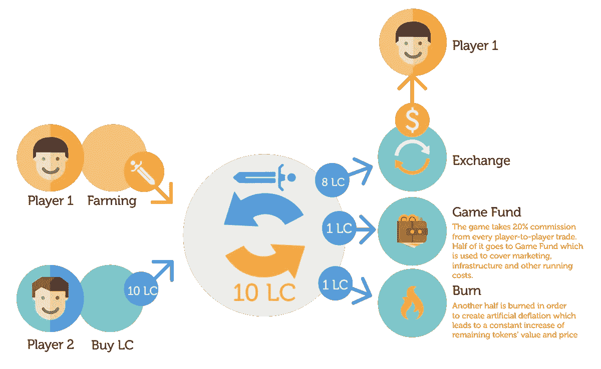

# 如何制作一个包含加密货币的在线多人游戏

> 原文：<https://medium.com/hackernoon/how-to-make-an-online-multiplayer-game-with-crypto-currency-involved-8932b12dae45>

在线游戏是技术领域中最繁荣和稳定的部分之一，由忠实的游戏玩家和移动技术的传播以及高速互联网连接的全球扩张来支持。后两个因素也有助于发展数字经济，尤其是虚拟货币市场。到 2017 年，虚拟货币已经占据了全球货币交易的 0.1%——这真的意义重大。相比之下，世界第七大最常用货币人民币的份额为 1.78%。

因此，难怪所有这一切使得在这两个前景广阔且有利可图的市场交汇处做生意的想法成为可能。例如，如果你把加密货币整合到一个在线游戏的经济中会怎么样？企业已经找到了几种方法来做到这一点。例如，大鱼和 Zynga 接受比特币作为支付方式。其他人走得更远，允许游戏玩家在游戏中挖掘货币，然后将其转换为普通(法定)货币——如 EverDream Soft，其游戏 ORB Project 允许用户通过区块链提供的游戏钱包交易游戏中的物品和角色，以换取真实的货币。或者是 Active Games，他们刚刚推出了一款手机游戏 Lordnmacer II，提供了同样的选择:任何游戏玩家都可以投资购买游戏中的物品和货币，反之亦然，通过出售它们获得实实在在的利润。

所有这些商业想法实际上都有很长的历史:早在这一切之前，2003 年，Project Entropia 就成为了开拓者，选择将游戏中的货币 PED (Project Entropia Dollar)变成法定货币，并支持游戏的经济概念。这是一个成功:成千上万的游戏玩家加入了“安特罗皮亚计划”,因为玩 MMO 游戏有可能真的赚到钱。另一个大型项目“第二人生”很快重复了这一成功。在大约 11 年后的 2014 年，潮流引领者(从 Entropia Universe 的 Project Entropia 更名而来)也将比特币引入了他们的支付系统，使得将数字资产转换为比特币、用比特币存款等成为可能。现在，在 2017 年，Active Games 的 [Lordmancer II](http://lordmancer2.io) 开始了另一种趋势——这是首批暗示将成熟的加密货币集成到移动设备在线多人游戏中的游戏之一。Lordmancer II 中的玩家可以通过他们在区块链的 Lordmancer 钱包将游戏中的主币(LC)兑换成游戏中的货币和以太币。

然而，掌握新的领域从来都不容易。加密货币市场仍然相对较新，还在发展中，还有许多陷阱等待着企业，比如潜在的立法问题和技术问题。除此之外，仍然有一些“老的”游戏产业问题需要避免——比如“黑市”问题。让我们快速浏览一下所有这些潜在的问题及其可能的解决方案。

可能的立法问题是由于不同国家对加密货币的监管方法存在很大差异。这就是为什么要特别注意这些法规在你优先考虑的国家是如何制定的，并开发一个不违反当地法律的货币化模式。例如，在韩国——最大的在线游戏市场之一——反赌博法禁止任何形式的数字资产交易。但这并不意味着一款涉及虚拟货币的游戏不可能进入这个国家的市场。例如，在 Lordmancer II 中，不存在为菲亚特交易虚拟商品的“自由”市场:玩家之间的所有交易都是用游戏内货币或 LC 进行的，只有 LC 可以转换为菲亚特货币或以太坊，所有交易都以固定的汇率进行。除了反赌博法，比特币等货币在一些司法管辖区仍面临严格限制——例如，比特币和其他虚拟货币在大多数非洲和阿拉伯国家都被禁止。但相反，在大多数发达国家，如瑞士、日本、美国或挪威，虚拟货币是允许的，并受到良好的监管。当然，这意味着，在这些国家，虚拟货币的所有利润都将被征税，但另一方面，这些国家已经有专门的法律来保护使用这种货币的企业，包括你自己的企业，如果你进入市场的话。最后，如果你计划为游戏项目发行特殊的加密令牌，并不是每个国家都适合这样做——例如，中国虽然是加密经济的主要贡献者之一，但已经在 2017 年禁止了 ICO。

技术问题大多与区块链技术有关。与其他现代技术相比，所有区块链平台的运行速度仍然非常慢，它们需要大量的计算资源，并且不能处理大量的流量。这就是为什么现在还不可能在游戏架构中放置任何区块链平台。但有一个有效的解决办法:通过一个简单的钱包将虚拟货币平台与游戏连接起来，钱包将位于游戏本身之外，但作为交换操作的中介。进行此类交易的一个高效平台是以太坊，由于其“智能合约”系统，比特币作为游戏基础设施之外的支付手段更受欢迎——例如，用于购买游戏、LC 或存款。

说到游戏行业特有的“老”问题，第一个出现的总是“黑市”。Bot 农民一直困扰着网络游戏，通过非法出售稀有物品、角色或货币换取法定货币，使游戏内的金钱变得廉价，并破坏了游戏平衡。不过这个问题也是可以解决的，有几种方法。到目前为止，最流行的方法是追踪可疑账户并禁止它们——就像暴雪和许多其他大型开发商所做的那样。但对于像 Lordmancer II 或 ORB Project 这样的游戏，所有传统的“黑市”选项都是官方的，life 可能会容易得多。由于任何玩家都可以用真钱买卖角色或任何其他游戏内资产，因此非法交易毫无意义。当然，总有办法滥用这个系统，但这是传统方式如禁止可以应用的地方。

除了防止滥用，为游戏的金融基础设施制定有效的货币政策也是至关重要的，这既能让用户对游戏提供的选项感兴趣，又能让游戏所有者获利。例如， [Lordmancer II](http://lordmancer2.io) 是一款免费游戏，但玩家需要购买特殊的游戏内代币——主币，如果他们想在游戏外与其他玩家完成交易，即赚取或花费法定货币或虚拟货币。但这并不意味着用户将不得不花钱:LC 令牌也可以用于购买游戏内物品或游戏内黄金。游戏内部玩家之间的所有交易也有 20%的佣金——这是活跃游戏的额外收入来源，旨在支持游戏的日常需求。开发商还控制游戏内经济，以防止游戏数字市场的通货膨胀和波动:游戏内部花费的 90%的领主币被烧掉，剩下的 10%进入游戏基金，以支持正在进行的游戏运营。除此之外，玩家对玩家交易的 20%佣金中有一半也被烧掉了，而剩下的也进入了游戏基金。通过这种方式，游戏市场得到控制，通货紧缩的可能性降到最低。

因此，总的来说，用加密货币启动 MMORPG 并不是一个非常新鲜的想法，但在这个领域仍然有很多事情要做:许多不同的新商业模式可以应用或发现，因此，制作有利可图和有趣的游戏的新方法。

更多关于 Lordmancer II 的信息在网站 [lordmancer2.io](http://lordmancer2.io)