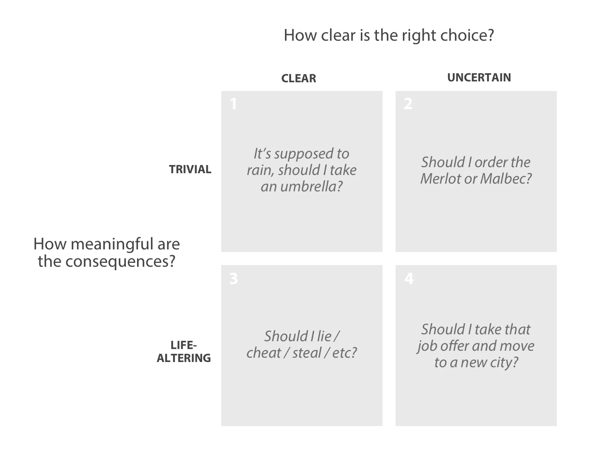
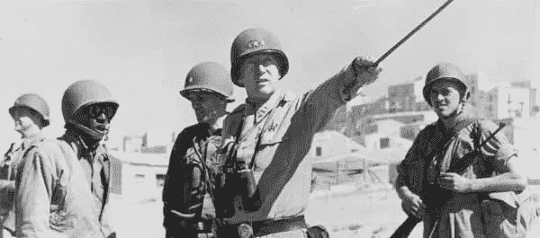

# 如何做出艰难的决定

> 原文：<https://medium.com/hackernoon/how-to-make-hard-decisions-c914a9d57831>

你所做的每一个选择都符合以下四个条件之一:

[学习](https://hackernoon.com/tagged/learning)处理第四类决定(右下角方框中的那些)是成长过程中最困难的部分之一。

随着生活的继续，你的责任越来越大，风险也越来越高。另外，随着你获得经验和智慧，你会更好地看到问题的两面。你的战斗伤疤教会你对自己预测未来的能力保持谦逊。

无论你如何分析和辩论一个特定决策的逻辑，有时都感觉不可能选择一方。

那么，你是怎么处理的呢？

虽然没有灵丹妙药，但我非常相信思想实验。没有什么比一个精心[设计的](https://hackernoon.com/tagged/designed)问题更能帮助你的头脑(和心灵)在一个艰难的决定中获得信念。

例如，去年我决定离开我的工作，开始[一家新公司](https://www.hardbound.co)。一路走来，我们面临着自己的生存抉择:

*   我们应该创造我们自己的故事，还是只专注于吸引其他人去做？
*   我们是应该简化我们的格式，让其他人更容易创作故事，还是应该专注于尽可能创作最好的故事？
*   应该编什么样的故事？
*   我们应该花多少努力来吸引广告客户？我们应该直接向用户收费吗？

没有简单的答案。

以下是我和我的共同创始人乔问自己的一些问题，以帮助我们做出这些决定:

*   即使我们失败了，如果我们以这种方式去做，还值得尝试吗？
*   如果我们这样做并且成功了，我们会为我们所做的感到骄傲吗？
*   当我老了，向我未来的孙子解释我们做了什么会是什么感觉？
*   如果我过去崇拜的英雄能够回来和我共进晚餐，我想对他们说些什么呢？
*   如果是我的孩子在这种情况下，我会建议他们怎么做？

这些问题都有一个共同点:它们帮助你走出恐惧，并切入手边决定的道德核心。它们迫使你决定什么对你最重要，并引导你做出最能体现你价值观的选择。

大多数第四类决策的问题是，任何一个选择都可能是好的。世界上没有一种“正确”的导航方式。有无数种方式，而找到最能体现我们价值观的方式取决于我们。

在这样的决定中找到道德上的明确性是很重要的，因为比做出一个糟糕的决定更糟糕的事情是对你的决定犹豫太久。或者当比你更有经验的人出现并说他们会以不同的方式做事时，你会过多地质疑自己。

因为毕竟巴顿是对的:

> 现在暴力执行的好计划胜过下周执行的完美计划。

# 结束了

*(如果你喜欢这个，看看***，在那里你可以看到更多这样的故事，甚至更好:它们是可视化的和动画的！)**

******

> *[黑客中午](http://bit.ly/Hackernoon)是黑客如何开始他们的下午。我们是 [@AMI](http://bit.ly/atAMIatAMI) 家庭的一员。我们现在[接受投稿](http://bit.ly/hackernoonsubmission)并乐意[讨论广告&赞助](mailto:partners@amipublications.com)机会。*
> 
> *如果你喜欢这个故事，我们推荐你阅读我们的[最新科技故事](http://bit.ly/hackernoonlatestt)和[趋势科技故事](https://hackernoon.com/trending)。直到下一次，不要把世界的现实想当然！*

**