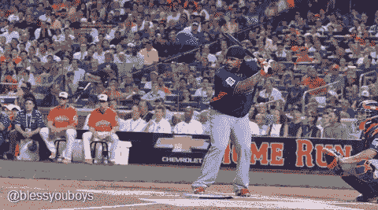

# 如何在天使投资中赚钱——为栅栏而摇摆！

> 原文：<https://medium.com/hackernoon/how-to-make-money-angel-investing-swing-for-the-fences-b5f17d47c185>

不久前，我和一个朋友共进午餐，我们谈论了我们在市场上看到的一些公司，以及我们的投资组合表现如何。一般来说，当这种情况发生时，你会爆发出夸张和隐喻，所以我们开始开玩笑，如果我们要去皮特罗斯(大多数单打)或巴里·邦兹(大多数全垒打)。

每个人投资都有自己的原因，但如果你想赚钱(比你投资的多)，你至少需要明白怎么做。这意味着当你做一项投资时，你必须假设当它退出时，潜在的结果(倍数)可能是什么。

希望获得成功投资组合的行业标准假设是，你至少需要进行 10 项投资。你很可能会把 6 本书当作完全的损失，2 本书可能会收支平衡或者给你一点回报，希望你的最后一本是本垒打。这个本垒打至少需要 10 倍以上才能赚回你所有的钱，甚至更多。

简单的数学(平均天使投资为 25，000 美元)

*   10 项投资 x 25，000 美元= 250，000 美元的投资额
*   1 次全垒打= 10 x 25，000 美元= 250，000 美元(赚回您的钱)
*   1 grandslam = 30 x 25，000 美元= 750，000 美元(货币对货币)

让我也澄清一下，我们投资的公司的平均估值约为 500 万美元，因此为了实现这些退出，该公司需要以 10 倍的价格退出 5000 万美元，以 30 倍的价格退出 1.5 亿美元。你也不应该期待至少 5 年以上的任何潜在回报，因为这是建立一个有任何收购潜力的可行公司所需要的时间。

现在希望这是有意义的，为什么当你向投资者推销时，他们想知道你在追求一个大市场，希望能产生大量收入，并有一些大公司可以收购你。

> [黑客中午](http://bit.ly/Hackernoon)是黑客如何开始他们的下午。我们是 [@AMI](http://bit.ly/atAMIatAMI) 家庭的一员。我们现在[接受投稿](http://bit.ly/hackernoonsubmission)，并乐意[讨论广告&赞助](mailto:partners@amipublications.com)机会。
> 
> 如果你喜欢这个故事，我们推荐你阅读我们的[最新科技故事](http://bit.ly/hackernoonlatestt)和[趋势科技故事](https://hackernoon.com/trending)。直到下一次，不要把世界的现实想当然！

