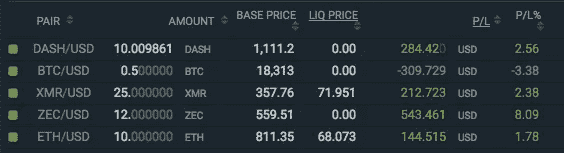
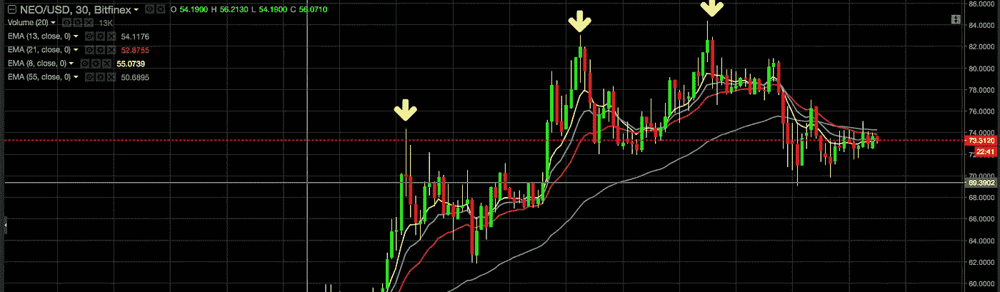
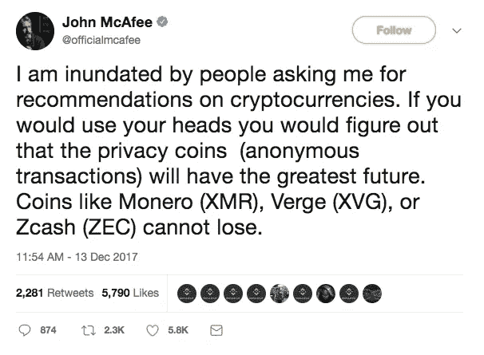
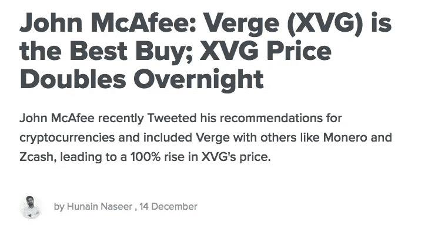
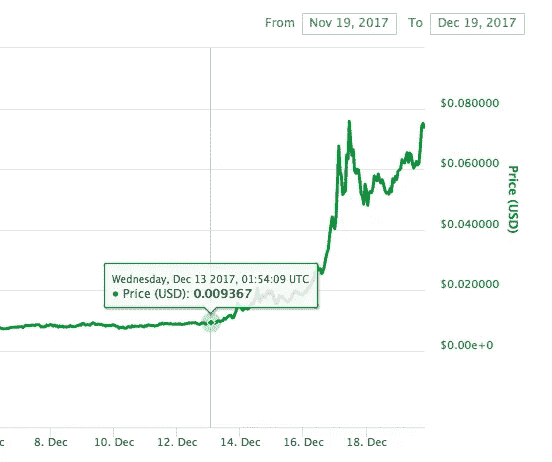

# 如何在疯狂的加密牛市中赚更多的钱

> 原文：<https://medium.com/hackernoon/how-to-make-more-money-in-a-crazy-crypto-bull-market-5c6f2cfb3e43>

加密货币现在正处于狂热阶段。需求是如此之高，所以最安全的赌注和最高的回报来自购买和持有，或做多。这里有一些最大化收入潜力的策略。

披露:我不是你的财务顾问。交易风险自担。你是个交易密码的白痴，但你可能已经知道了。

**持续持有保证金多头头寸**

To get green, you gotta go green.

如果你不熟悉保证金交易，谷歌一下。保证金交易允许你用你现有的资产作为抵押来借钱。在一些交易所，你可以用高达 3.33 倍的杠杆进入头寸！这意味着，如果你有价值 1000 美元的抵押品，你可以购买/做空价值高达 3333 美元的密码。但是要注意清算价格(如果你的头寸减少，交易所将会平仓并没收你的资产)。

所以我喜欢用乙醚(ETH)作为保证金抵押品，因为它似乎具有最大的价格稳定性，这对于在市场低迷时不会被清算非常重要。在使用支持资产做多这些资产时要小心，因为由于价格波动的综合影响，清算价格可能会非常接近。

你应该选择哪些硬币做多？现在市场是如此的乐观，这甚至没有关系。但从根本上说，当使用杠杆时，你的风险被放大了，所以我避免高风险的硬币，而选择更高交易量/更高市值的硬币。我通常持有几天到几周的多头头寸，这取决于我对动量的预期。请记住，你每天都要支付利息，所以如果价格持平，最好是获利离场。

如果你看多，你可以要求你的头寸(买入你有保证金头寸的资产，而不是卖出并获得现金利润)。如果你预计价格会上涨，想要拥有它，但目前没有现金可用，这是无意中“锁定”价格的一个好方法。保证金交易的好处是疯狂的！

**空头硬币创历史新高**

3 all time highs immediately followed by quick decline. The best you could have done was about 10% in a couple hours after each peak.

这是一个明显的策略。当一枚硬币到达最高点时，它通常会回落，并横向交易一段时间。困难的部分是评估做空哪些硬币。你想要更小的硬币，因为它们更不稳定，更有可能在几个小时内跌得更快更狠。但也不至于小到新投资者可以投入新的资金，因为押注的成本非常低，因此很难识别峰值是否真的是峰值。你通常会对新闻事件和每分钟的图表分析感到失望。

我个人使用功利主义的方法来决定做空哪种硬币(相对于竞争对手，今天哪种硬币的效用最小？).因此，我对来自中国的硬币有一种偏见，原因是定性的，我不会在这里讨论。但是你应该遵循你自己的研究和信仰体系。一旦达到目标，立即平仓，减少敞口，不要在牛市中贪婪。我很乐意接受 2%到 3%的短期收益。如果你有毅力坚持下去，争取更多的力量。

**高风险代币投资组合(又名 Shitfolio)**

如果你觉得风险特别大，你可以建立一个高风险的代币投资组合，由甚至还没有产品的硬币组成，纯粹是靠炒作攀升。以目前 crypto 背后的势头，一个受欢迎的人物或正面消息的支持可以让硬币暴涨。这是最终的快速致富计划，这些代币的大部分将导致无处可去，也不会为社会提供长期价值。你要尽快把它们翻过来。

John McAffee endorses a Verge token (XVG) and it quickly takes off in price and news coverage.

密码市场现在有点疯狂。人们正在购买预先发布的“公告”(“下周我们有重大消息要宣布！”然后新闻是无关紧要的，价格下跌)。大群体和鲸鱼的非法抽水和倾倒操作很普遍。如果你对加密货币的技术细节或交易概念一无所知，最好在深入研究之前研究一下这些东西。按照目前的情况，政府取缔、监管或彻底禁止交易只是时间问题。

在那之前，聪明点，兑现利润，增加你的 HODL 头寸。不懂就不要用最大保证金。享受旅程吧！