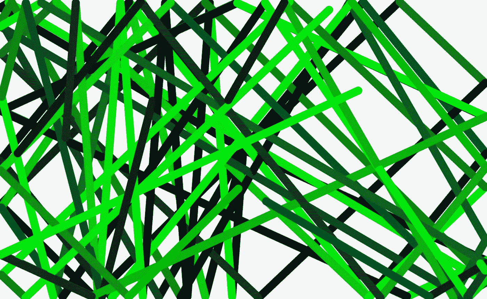
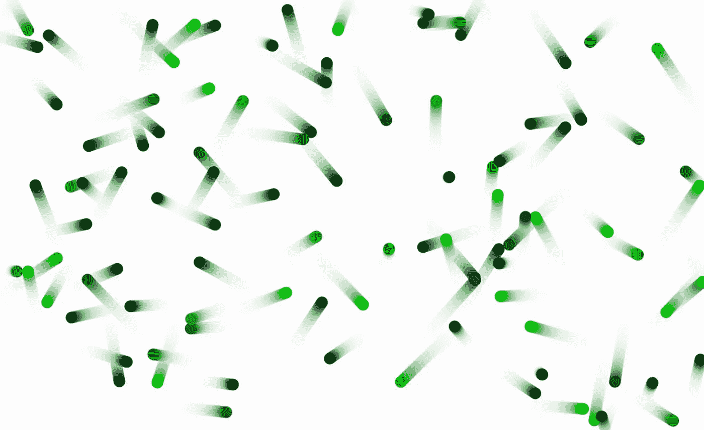
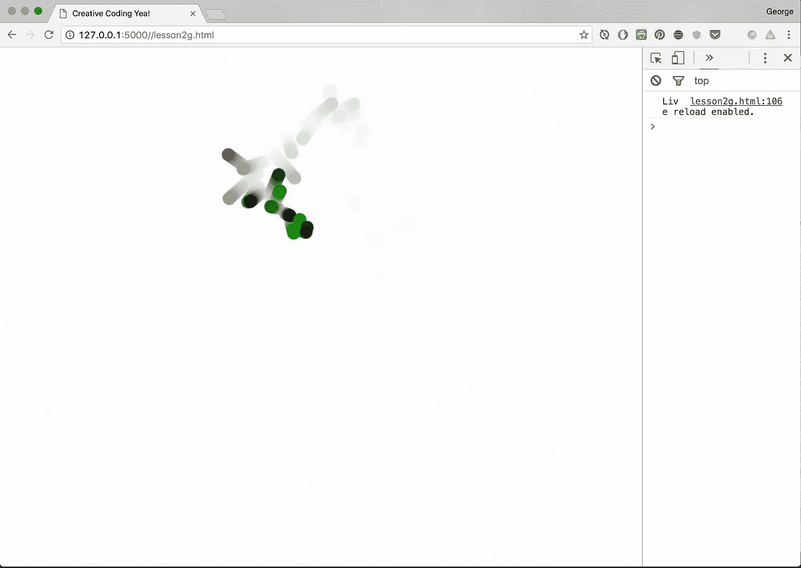

# 如何用 Javascript 创建粒子引擎

> 原文：<https://medium.com/hackernoon/how-to-make-particles-1cbeee937593>

## 构建自主对象

[第一部分](/@radarboy3000/creative-coding-basics-4d623af1c647#.hn9zzliob)和[第二部分](/@radarboy3000/creative-coding-basics-4d623af1c647#.hn9zzliob)

这些教程的所有代码和库都可以在这里找到:【https://github.com/GeorgeGally/creative_coding 

我们已经做了一些相当基础的东西，所以让我们把它提升一个等级。

在之前的文章中，我向你展示了如何让一个球在屏幕上弹跳。如果我们想要很多球呢？

但是在我们到达那里之前，清理一下代码，把绘图和计算部分分成单独的函数总是好的。这会让我们看到这样的情况:

```
var ctx = createCanvas("canvas1");
var ball_size = 20;
var ball_x = width/2;
var ball_y = height/2;
var speed_x = randomInt(-15, 15);
var speed_y = randomInt(-15, 15);
ctx.fillStyle = rgb(randomInt(255),randomInt(255),0); function draw(){ //ctx.background(255, 0.2);
  moveBall();
  drawBall();} function moveBall(){ ball_x = ball_x + speed_x;
  ball_y = ball_y + speed_y; if (bounce(ball_x, 0, w, ball_size)) {
    speed_x *=-1;
    ctx.fillStyle = rgb(randomInt(255),randomInt(255),0);
  } if (bounce(ball_y, 0 ,h, ball_size)) {
    speed_y *=-1;
    ctx.fillStyle = rgb(0, randomInt(255),randomInt(255));
  }} function drawBall(){
  ctx.fillEllipse(ball_x, ball_y, ball_size, ball_size);
}
```

让我们通过将球构建成一个对象来提取更多的代码。这允许我们通过点语法访问 balls 变量。我们像这样创建一个对象:

```
var ball = {
  x:  width/2,
  y: height/2,
  speed_x: random(-5, 5),
  speed_y: random(-5, 5),
  size: 20,
  colour: rgb(0)
}
```

现在我们可以像这样访问球的属性:

```
ball.x = ball.x + ball.speed_x;
```

完整的重构代码现在看起来像这样:

```
var ctx = createCanvas("canvas1");var ball = {
  x: width/2,
  y: height/2,
  speed_x: random(-5, 5),
  speed_y: random(-5, 5),
  size: 20,
  colour: rgb(0)
}function draw(){ //ctx.background(255, 0.2);
  moveBall();
  drawBall();}function moveBall(){ // bounce() is a function I created, essentially the same as going 
 // if (ball.x < ball.size/2 || ball.x > w - ball.size/2)
 if (bounce(ball.x, 0, w, ball.size)) {
    ball.speed_x *=-1;
    ctx.fillStyle = rgb(randomInt(255),randomInt(255),0);
  } if (bounce(ball.y, 0 ,h, ball.size)) {
    ball.speed_y *=-1;
    ctx.fillStyle = rgb(0, randomInt(255),randomInt(255));
  } ball.x += ball.speed_x;
  ball.y += ball.speed_y;}function drawBall(){
  ctx.fillEllipse(ball.x, ball.y, ball.size, ball.size);
}
```

是时候说说*数组*了。我会说得很快，因为网上到处都有很多这方面的内容。数组本质上只是可以容纳对象、变量和字符串的容器，用逗号分隔。像这样:

```
var my_array = [ 1, 2, 3 ]; 
```

数组的第一个值由 my_array[0]访问，第二个值由 my_array[1]访问，依此类推。我们可以通过说 my_array.length 得到一个数组的长度，所以…

```
var balls = []; // declare a variable with an empty array
var colours = ['red', 'green', 'blue', 'indigo', 'violet'];

console.log(colours.length); //outputs 5
console.log(colours[0]); //outputs red
console.log(colours[4]); //outputs violet
```

如果我们想在数组末尾添加一些东西，我们可以使用 push:

```
var colours = ['red'];
console.log(colours); *//outputs red*
colours.push('green'); *//add to the front of the array*
console.log(colours); *//outputs red, green*
```

编码的另一个好朋友是循环的*，它看起来像这样:*

```
// this will loop 10 times
for (var i = 0; i < 10; i++) {
  // do something
}
```

循环的*循环，直到满足特定条件。在这种情况下，我们将临时变量 *i* 从 0 递增 1，直到它不再满足小于 10 的条件。*

你可以在这里阅读更多关于 for 循环的内容:[https://developer . Mozilla . org/en-US/docs/Web/JavaScript/Guide/Loops _ and _ iteration](https://developer.mozilla.org/en-US/docs/Web/JavaScript/Guide/Loops_and_iteration)

我们的粒子系统只是一个球的阵列。我们通过创建一个球对象，然后将它放入数组来构建它:

```
var number_of_balls = 10;
var balls = [];*// push a ball and it's values into the array*for (var i = 0; i < number_of_balls; i++) { var ball = {
   x:  200,
   y: height/2,
   speed_x: random(-5, 5),
   speed_y: random(-5, 5),
   size: 20,
   colour: rgb(0)
  } balls.push(ball);}
```

要访问球的属性，我们现在可以:

```
console.log(ball[2].x); //outputs 200
```

我们可以像这样循环遍历所有的球:

```
for (var i = 0; i < balls.length; i++) { balls[i].x += balls[i].speed_x;
 balls[i].y += balls[i].speed_y;}
```

但是当操作和绘制我们的粒子时，键入 balls[i]是乏味和重复的，所以我们可以改为分配一个临时变量来表示 balls[i]，就像这样:

```
for (var i = 0; i < balls.length; i++) { var b = balls[i];
 b.x = b.x + b.speed_x;
 b.y = b.y + b.speed_y;}
```

我们对这个临时变量所做的任何改变，也会改变实际的粒子值。

综上所述，我们现在有:

```
var ctx = createCanvas("canvas1");
var number_of_balls = 10;
var balls = [];// push a ball and it's values into the array
for (var i = 0; i < number_of_balls; i++) {
  var ball = {
    x:  width/2,
    y: height/2,
    speed_x: random(-5, 5),
    speed_y: random(-5, 5),
    size: 20,
    colour: rgb(0)
  }
  balls.push(ball);
}function draw(){ //ctx.background(255, 0.2);
  moveBall();
  drawBall();}function moveBall(){for (var i = 0; i < balls.length; i++) {
    var b = balls[i];
    b.x = b.x + b.speed_x;
    b.y = b.y + b.speed_y;if (bounce(b.x, 0, w, b.size)) {
      b.speed_x *=-1;
      b.colour = rgb(randomInt(55),randomInt(255),0);
    }if (bounce(b.y, 0 ,h, b.size)) {
      b.speed_y *=-1;
      b.colour = rgb(0, randomInt(255),randomInt(55));
    }}}function drawBall(){
  for (var i = 0; i < balls.length; i++) {
    var b = balls[i];
    ctx.fillStyle = b.colour;
    ctx.fillEllipse(b.x, b.y, b.size, b.size);
  }
}
```

嘣，我们有了一个粒子系统:



Look Ma, particles!!

取消对 ctx.background 的注释以查看各个球，让我们将球的数量增加到 100:



ctx.background(255, 0.2);

让我们在移动鼠标时添加球。让我们创建一个 *addBall()* 函数，它将新球的位置设置为鼠标的位置:

```
function addBall(){
  var ball = {
    **x: mouseX,
    y: mouseY,**
    speed_x: random(-5, 5),
    speed_y: random(-5, 5),
    size: 20,
    colour: rgb(0)
  }
  balls.push(ball);
}
```

为了检查我们是否移动了鼠标，为了避免麻烦，我在我的库中添加了一个监听器和全局变量，名为 *mouseMoved* :

```
*// check if mouse has moved and add if so, add a new ball*
if (mouseMoved) {
  addBall();
}
```

我的库中的 mouseMoved 变量是用 eventListener 构建的:

```
var mouseMoved = false;
window.addEventListener('mousemove', function(e) {
  mouseMoved = true;
});
```

然后在我的 requestAnimationFrame()循环中，我将它重置为 false。

如果我们不停地移动鼠标，最终会有太多的球，我们的计算机会变慢并最终死机，所以我们需要一种方法来移除球，最好是最老的球，这非常简单，通过在我们的 *addBall()* 函数的末尾添加一个对最大球长度的检查:

```
// syntax: splice(start, length)
if (balls.length > 1000) balls.splice(0,1);
```

Splice 简单地从某一点按一定的量剪切一个数组，在我们的例子中是从球数组的位置 0(也是最老的球)开始按 1 剪切。

如果我们将数字减少到 20，那么我们开始得到一些有趣的尾迹效果:

```
var ctx = createCanvas("canvas1");
var max_balls = 10;
var balls = [];// push a ball and it's values into the array
function addBall(){
  var ball = {
    x: mouseX,
    y: mouseY,
    speed_x: random(-5, 5),
    speed_y: random(-5, 5),
    size: 20,
    colour: rgb(randomInt(55),randomInt(255),0)
  }
  balls.push(ball);
  if (balls.length > max_balls) balls.splice(0,1);
}function draw(){ctx.background(255, 0.2);
  if (mouseMoved) {
    addBall();
  }
  moveBall();
  drawBall();
}function moveBall(){for (var i = 0; i < balls.length; i++) {
    var b = balls[i];
    b.x = b.x + b.speed_x;
    b.y = b.y + b.speed_y;if (bounce(b.x, 0, w, b.size)) {
      b.speed_x *=-1;
      b.colour = rgb(randomInt(55),randomInt(255),0);
    }if (bounce(b.y, 0 ,h, b.size)) {
      b.speed_y *=-1;
      b.colour = rgb(0, randomInt(255),randomInt(55));
    }}}function drawBall(){
  for (var i = 0; i < balls.length; i++) {
    var b = balls[i];
    ctx.fillStyle = b.colour;
    ctx.fillEllipse(b.x, b.y, b.size, b.size);
  }
}
```



Mousetrails

所以，这就是第三部分。试着随着球变老而减小它的大小，一旦太小就把它拿掉。乱七八糟的颜色和背景的透明度，以及其他任何能让你开心的东西。下次再见，快乐编码…

**在 Instagram 上关注我这里:**[**https://www.instagram.com/radarboy3000/**](https://www.instagram.com/radarboy3000/)

**又如我这里的脸书页:**[](https://www.facebook.com/radarboy3000)

**创意编码入门第一部分:[https://medium . com/@ radarboy 3000/Creative-Coding-basics-4d 623 af 1c 647 # . HN 9 zzliob](/@radarboy3000/creative-coding-basics-4d623af1c647#.hn9zzliob)**

**创意编码入门第二部分:[https://medium . com/@ radarboy 3000/introduction-to-Creative-Coding-Part-2-d 869832 d9 FB # . fzxcom 541](/@radarboy3000/introduction-to-creative-coding-part-2-d869832d9ffb#.fzxcom541)**

**这些教程的所有代码和库都可以在这里找到:[https://github.com/GeorgeGally/creative_coding](https://github.com/GeorgeGally/creative_coding)**

**[](http://bit.ly/HackernoonFB)****[](https://goo.gl/k7XYbx)****[](https://goo.gl/4ofytp)**

> **[黑客中午](http://bit.ly/Hackernoon)是黑客如何开始他们的下午。我们是 [@AMI](http://bit.ly/atAMIatAMI) 家庭的一员。我们现在[接受投稿](http://bit.ly/hackernoonsubmission)，并乐意[讨论广告&赞助](mailto:partners@amipublications.com)机会。**
> 
> **如果你喜欢这个故事，我们推荐你阅读我们的[最新科技故事](http://bit.ly/hackernoonlatestt)和[趋势科技故事](https://hackernoon.com/trending)。直到下一次，不要把世界的现实想当然！**

****