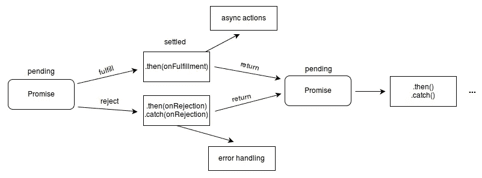
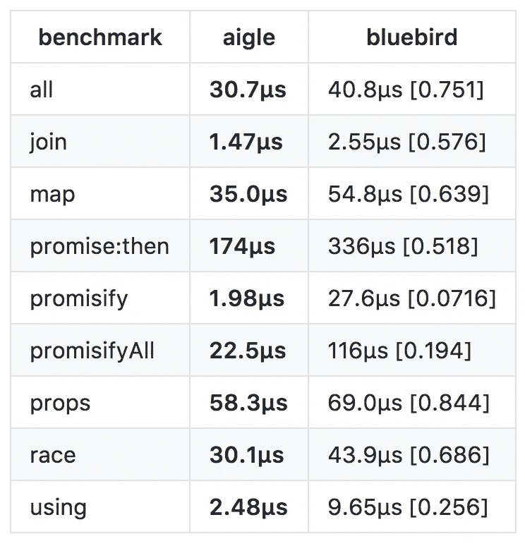

# 如何最快做出承诺库

> 原文：<https://medium.com/hackernoon/how-to-make-the-fastest-promise-library-f632fd69f3cb>

我开发了`[Aigle](https://github.com/suguru03/aigle)`，这是一个快速承诺库。灵感来源于`[Bluebir](https://github.com/petkaantonov/bluebird)d`。该库不仅是一个基准测试，还是一个实现 Promise A+标准的产品化库，而且比 T2 更快。

# **什么是承诺？**

在解释之前，我想提供一些关于承诺的基本信息。一个承诺可以有三种状态:`pending`、`fulfilled`和`rejected`。一旦状态从`pending`变为另一个状态，该状态就不能再改变。



Promise states (quote: [MDN](https://developer.mozilla.org/en-US/docs/Web/JavaScript/Reference/Global_Objects/Promise))

此外，承诺必须总是异步解决，这是最重要的事情之一。

```
**new** Promise(resolve => resolve(1)) // synchronously
  .then(num => {
    // called asynchronously
  });
```

# 高性能库的最佳实践

当我开发库时，我总是遵循这三个原则。

*   避免创建不必要的变量、函数和实例
*   避免执行不必要的功能
*   巧妙处理异步函数

## 避免创建不必要的变量、函数和实例

遵循这一原则有助于避免不必要的内存分配。举个例子，

```
**function** sum(array) {
  **return** array.reduce(**function** iterator(result, num) {
    **return** result **+** num;
  });
}

sum([1, 2, 3]); *// 6*
```

当调用`sum`时，总是会创建`iterator`函数。这是一种不必要的内存分配。代码被重写以遵循下一个例子。

```
**function** iterator(result, num) {
  **return** result **+** num;
}

**function** sum(array) {
  **return** array.reduce(iterator);
}

sum([1, 2, 3]); *// 6*
```

代码避免了不必要的函数。

接下来是另一个额外的内存分配的例子。

```
**function** get(type) {
  **const** array **=** [];
  **const** object **=** {};
  **const** number **=** 0;
  **const** string **=** '';
  **switch** (type) {
  **case** 'array'**:**
    **return** array;
  **case** 'object'**:**
    **return** object;
  **case** 'number'**:**
    **return** number;
  **case** 'string'**:**
    **return** string;
  }
}
get('string');
```

在这种情况下，`string`是唯一必需的变量。`array`、`object`和`number`不需要。代码重写如下:

```
**function** get(type) {
  **switch** (type) {
  **case** 'array'**:**
    **return** [];
  **case** 'object'**:**
    **return** {};
  **case** 'number'**:**
    **return** 0;
  **case** 'string'**:**
    **return** '';
  }
}
get('string');
```

这两个例子之间没有太大的区别，但是如果在函数中创建实例或函数，就会有很大的区别。

## 避免执行不必要的功能

例如，在创建 API 时，有必要检查请求参数。

```
**function** api(req, res) {
  **const** { id } **=** req.body;
  **if** (**!**isNumber(id)) {
     **return** res.sendStatus(400);
  }
  innerFunc(id)
    .then(...)
    .**catch**(...)
}

**function** isNumber(id) {
  **return** **typeof** id **===** 'number';
}

**function** innerFunc(id) {
  **if** (**!**isNumber(id)) {
    **return** Promise.reject(**new** Error('error'));
  }
  ...
}
```

当实现 API 时，最好检查内部函数中的参数，因为该函数可能会被其他函数调用。然而，当实现库时，函数不需要检查参数。在执行内部函数之前，参数已经被检查过了，所以没有必要在内部函数中再次检查它们。

## 巧妙处理异步函数

我想用`Bluebird`的例子来解释这个概念。

# 什么使`Bluebird fast?`

如果你打开`Bluebird`库代码，你会看到`bitField`参数。但是`bitField`并不那么重要。
`Bluebird`大致有两种状态:`pending`与否。处理的最大区别在于两种状态。

## 如果状态为待定:

```
**new** Bluebird(**function** executor(resolve) { 
  // called synchronously
  setTimeout(**function** timer() {
    resolve(1); *// called asynchronously*
  }, 10);
})
.then(**function** onFulfilled(value) {
  *//  called asynchronously*
});
```

这个执行顺序是，

1.  当新的`Bluebird`被调用时，创建`Bluebird`的父实例
2.  执行`executor`
3.  执行`then`。`then`创建`Bluebird`的子实例
4.  执行`resolve`
5.  执行`onFulfilled`

当调用`then`时，[一个子实例被创建](https://github.com/petkaantonov/bluebird/blob/v3.4.7/src/promise.js#L228)。那时，`resolve`还没有被调用，所以父状态是`pending`。当状态为`pending`、[时，子实例作为子实例](https://github.com/petkaantonov/bluebird/blob/v3.4.7/src/promise.js#L416)链接到父实例。之后`[resolve](https://github.com/petkaantonov/bluebird/blob/v3.4.7/src/promise.js#L513)` [被`setTimeout`异步调用](https://github.com/petkaantonov/bluebird/blob/v3.4.7/src/promise.js#L513)。然后，`[onFulfilled](https://github.com/petkaantonov/bluebird/blob/v3.4.7/src/promise.js#L703-L710)`T34 被调用，结果为。
当状态为`pending`时，子实例链接到父实例。调用`resolve`后，调用`onFulfilled`。这很简单。

## 如果状态不是待定:

```
**new** Bluebird(**function** executor(resolve) {
  resolve(); *// called synchronously*
})
.then(**function** onFulfilled(value) {
  *// ensured asynchronously*
});
```

执行顺序是

1.  当新的`Bluebird`被调用时，创建`Bluebird`的父实例
2.  执行`executor`
3.  执行`resolve`
4.  执行`then`。`then`创建`Bluebird`的子实例
5.  执行`onFulfilled`

调用`then`时，父状态已经不是`pending`。在这种情况下，如果在没有任何东西的情况下调用`onFulfilled`，则函数同步执行。出于这个原因，库需要[调用一个异步函数](https://github.com/petkaantonov/bluebird/blob/v3.4.7/src/promise.js#L263-L270)。在调用该函数之前，`onFulfilled`被[设置为](https://github.com/petkaantonov/bluebird/blob/v3.4.7/src/async.js#L88) a `[queue](https://github.com/petkaantonov/bluebird/blob/v3.4.7/src/async.js#L88)`，这个`[schedule](https://github.com/petkaantonov/bluebird/blob/v3.4.7/src/async.js#L159)` [函数被称为](https://github.com/petkaantonov/bluebird/blob/v3.4.7/src/async.js#L159)。Node.js 上的`schedule`是`setImmediate`，然后`[setImmediate](https://github.com/petkaantonov/bluebird/blob/v3.4.7/src/async.js#L144)` [异步调用所有排队的函数](https://github.com/petkaantonov/bluebird/blob/v3.4.7/src/async.js#L144)。
当状态不是`pending`时，将`onFulfilled`置为`queue`，然后由异步函数执行排队函数。

你可能想知道为什么`onFulfilled`被设置为`queue`。这是`Bluebird`中最聪明的想法。

## 如何灵活处理异步函数

我想用这个例子来解释一下。

```
Bluebird.resolve(1) *// synchronously*
  .then(num **=>** console.log(num)); *// asynchronously*
Bluebird.resolve(2) *// synchronously*
  .then(num **=>** console.log(num)); *// asynchronously*
Bluebird.resolve(3) *// synchronously*
  .then(num **=>** console.log(num)); *// asynchronously*
```

如果没有使用`queue`，异步函数将被调用三次。但是如果使用了一个`queue`,这个函数会立刻执行所有排队的函数。我不确定`bitField`是否会带来很大的好处。但是我觉得`Bluebird`为什么快是因为简单。

# 是什么让 Aigle 快速？

我刚刚遵循了这些重要的原则，

*   避免创建不必要的变量、函数和实例
*   避免执行不必要的功能
*   巧妙处理异步函数

如果你遵循它们，你将能够创建好的图书馆。我做了一个[基准](https://github.com/suguru03/aigle/tree/master/benchmark#benchmark)来检查`Aigle`和`Bluebird`之间的性能。基准测试结果在这里。

*   节点 6.9.1
*   Aigle v0.5.0
*   蓝鸟 3.5.0 版



Aigle vs Bluebird

`Aigle`实现非常简单，因此比`Bluebird`快。如果你对`Aigle`感兴趣，我希望你能为它做出贡献。

## 适用于生产环境

最重要的部分是`aigle-core`依赖。
在`Bluebird`中，每个 promise 实例都必须是`Bluebird`的实例。选中实例时，调用`instanceof`函数。但是`Bluebird`只检查实例是否是由当前**的**类`**Bluebird**`生成的。所以如果用了很多版本，`Bluebird`会变慢。避免性能损失的关键是拥有相同的依赖性。`Aigle`有`aigle-core`依赖，因此每个`Aigle`实例都由同一个`AigleCore`类扩展。`Aigle`会保持高性能。

我想向[展示一下基准示例](https://github.com/suguru03/aigle-benchmark)。

```
$ npm list
aigle-benchmark@0.0.0 
├─┬ aigle@0.5.0 <- aigle@0.5.0 has aigle-core@0.2.0
│ └── aigle-core@0.2.0
├─┬ benchmark@2.1.3
│ └── platform@1.3.3
├── bluebird@3.5.0
├── lodash@4.17.4
├── minimist@1.2.0
└─┬ promise-libraries@0.3.0
  ├── aigle@0.4.0 <- aigle@0.4.0 has aigle-core@0.2.0 too
  └── bluebird@3.4.6
```

如您所见，不同的`aigle`依赖项有相同的`aigle-core`子依赖项。使用`aigle@0.4.0`时，共享`aigle-core`。

*   节点 6.9.1
*   `Aigle` v0.4.0，v0.5.0
*   `Bluebird`版本 3.4.6，版本 3.5.0

```
$ node --expose_gc . -t then
======================================
[Aigle] v0.5.0
[Bluebird] v3.5.0
======================================
[promise:then:same] Preparing...
--------------------------------------
[promise:then:same] Executing...
[1] "aigle" 180μs[1.00][1.00]
[2] "bluebird" 341μs[0.526][1.90]
======================================
[promise:then:diff] Preparing...
--------------------------------------
[promise:then:diff] Executing...
[1] "aigle" 178μs[1.00][1.00]
[2] "bluebird" 506μs[0.352][2.84]
```

`promise:then:same`使用相同的版本，而`promise:then:diff`使用不同版本的子实例。`Aigle`即使版本混杂也不会慢下来。

# 结论

如果你遵循这三个重要的原则，你会建立一个快速的图书馆。
还有`Aigle`受`[Async](https://github.com/caolan/async)`和`[Neo-Async](https://github.com/suguru03/neo-async)`启发有很多功能。如果你还在使用回调风格，我想鼓励你使用`Aigle`。
如果我能为`Node.js`和`JavaScript`社区做出贡献，我会很高兴成为一名贡献者。

# 参考

*   `[Aigle](https://github.com/suguru03/aigle)`
*   `[Bluebird](https://github.com/petkaantonov/bluebird)`
*   [MDN](https://developer.mozilla.org/en-US/docs/Web/JavaScript/Reference/Global_Objects/Promise)

[](http://bit.ly/HackernoonFB)[](https://goo.gl/k7XYbx)[](https://goo.gl/4ofytp)

> [黑客中午](http://bit.ly/Hackernoon)是黑客如何开始他们的下午。我们是阿妹家庭的一员。我们现在[接受投稿](http://bit.ly/hackernoonsubmission)并乐意[讨论广告&赞助](mailto:partners@amipublications.com)机会。
> 
> 如果你喜欢这个故事，我们推荐你阅读我们的[最新科技故事](http://bit.ly/hackernoonlatestt)和[趋势科技故事](https://hackernoon.com/trending)。直到下一次，不要把世界的现实想当然！

