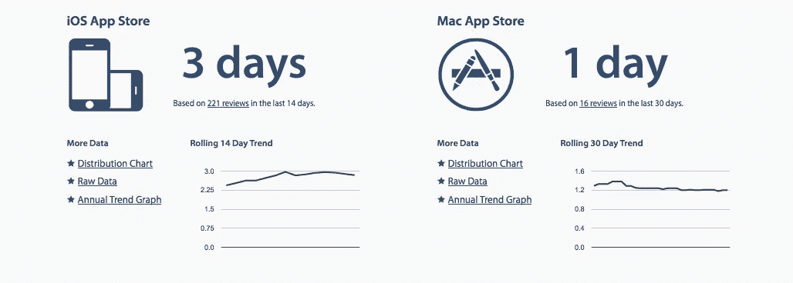
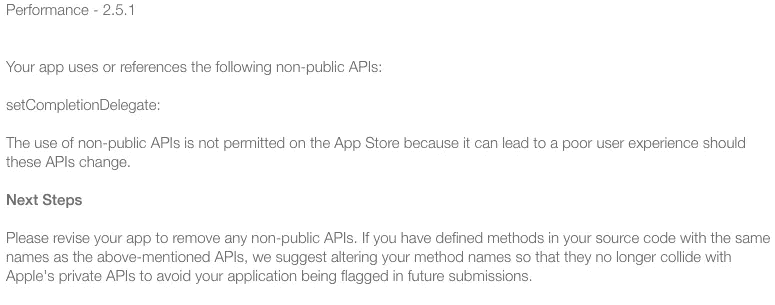
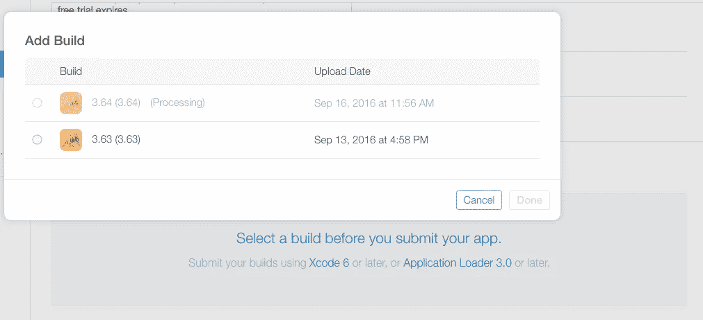

# 如何让 iOS 开发者的生活不那么糟糕——一次 24 小时——致苹果 itunesconnect 团队的公开信

> 原文：<https://medium.com/hackernoon/how-to-make-the-life-an-ios-developer-suck-a-little-less-24-hrs-at-a-time-an-open-letter-to-64df6e11e52c>

据我所知，应用提交的平均审核时间约为 3 天(从[http://appreviewtimes.com/](http://appreviewtimes.com/))

TL；DR(因为你需要回到 YC/500 应用程序)

4 对提交脚本和流程的更改至少可以节省开发人员一天的时间

1.  添加健全性检查，如 nm 检查符号，应用程序不允许使用的功能
2.  检查 DOA 构建，基本上应用程序在启动时崩溃
3.  简化两步提交(1)从 xcode，然后(2)从 itunesconnect
4.  取消构建版本限制，这种限制会迫使用户在每次提交时更新构建版本，即使是在同一个“提交周期”内

average review time for app submission is about 3 days (from [http://appreviewtimes.com/](http://appreviewtimes.com/))

从表面上看，这很棒。我们的应用程序已经审查了 3 个星期。所以很多功劳归于复习时间。他们已经配备了人员和服务器(有了更多的机器)。过去几年的平均值一直徘徊在 8 天左右。

所以你会认为 3 天很棒，对吗？如果你是 T2 的开发者 T3，你就不会这么做，你必须推动代码并等待所有的许可。如果这是你唯一在做的事，太好了！是时候去夏威夷快速旅行了，对吗？但通常情况并非如此。你的“[成长黑客](https://hackernoon.com/tagged/growth-hacking)”团队有 10 个实验需要在昨天完成。你的 bug 分类基本上变成了破碎承诺和未实现愿望的大屠杀。这甚至和你的个人生活都不沾边。

## 真实的故事

所以我们在这里，我们提交了我们最新版本的[瑜伽助手应用](https://itunes.apple.com/app/id919862651)。很多很酷的功能，更重要的是一个关键的错误。我们在星期二晚上提交。周四早上(太平洋时间早上 7 点左右)，该应用程序正在审查中。耶！！大约 3 小时后，我们在仪表盘上看到这条消息。该应用程序因“性能”原因被拒绝(考虑到许多 iOS 开发者都是自我形象受损的家伙，他们可能应该稍微修改一下)。

原来我们使用的是一个名为 setCompletionDelegate 的 API。快速检查一下我们的代码——不，我们不使用这个函数。然后我们看了所有的图书馆。一切都很好。然后我们最后看了一下 pod，瞧，很好的旧分支 API 正在使用这个函数。和 Branch.io 的好朋友们聊了一下，发现我们落后了 3 个版本！在与“pod 更新”和“pod 安装”以及“pod unistall”和“pod wtf”进行了短暂的较量之后，我们用 Branch 更新了所有内容。

因此，我们运行质量保证，存档，提交和…

Waiting for the Sun

你看到时间戳了吗？上面写着上传日期 2016 年 9 月 16 日上午 11 点 56 分。猜猜我们看它的时候是几点？当时是下午 2 点(太平洋时间)。在我们提交后整整两个小时。

最终在下午 2:30 左右，构建可以提交了。我们点击了所有的屏幕，他们问你关于出口的东西。这里的小事情，但为什么这些不能用以前的设置预填充？

反正几个小时后，被拒绝了！又一次。这一次是因为该应用程序缺少 iphone 4 的资产，并且正在崩溃。我是说，这是我们的错。但是现在谁还支持 iphone 4 呢？当然，我们没有在 6 个月内更新 iphone 4 的 QA 脚本。但还是，加油！我们是一个持续的，弱小的创业公司，资源极其有限。

## 我们将何去何从

这里有几件事，我认为可以帮助加快应用程序提交，审查过程。请随意添加到这个列表中，或者在这里高亮显示并评论，或者在底部添加评论。也许我们可以向苹果发送一个编译好的列表，他们总是会听取开发者的意见。

1.  让提交脚本在构建上运行一些检查，对函数、超出限制的符号进行简单的“nm”检查会很好
2.  目前，应用程序提交分为两部分。我们从 xcode 提交。然后，我们等待一到两个小时，让构建“处理”。然后你去 itunesconnect，选择这个版本，然后提交。为什么不删除步骤。基本上这是一个提交，它通过了默认。如果开发人员认为有些不对劲，她可以去中断这个过程。
3.  立即检查 DOA 提交。我以为发生了这种事。显然不是
4.  itunesconnect 因版本未更新而拒绝构建这一恼人的“功能”是怎么回事？开发者已经在 itunes 上升级了内部版本。现在，开发人员必须在每次归档和提交时更新版本。你们浪费了多少时间，因为你提交了一些东西，意识到你错过了一些简单的东西，进行了修复，存档了它，然后它被拒绝了，因为 itunesconnect 也想升级版本。我觉得很烦。

我真的应该把这段时间花在 YCombinator 应用程序上。也许我用这个来逃避另一个繁重的过程。也许我这么做是因为苹果在乎。

> [黑客中午](http://bit.ly/Hackernoon)是黑客如何开始他们的下午。我们是 [@AMI](http://bit.ly/atAMIatAMI) 家庭的一员。我们现在[接受投稿](http://bit.ly/hackernoonsubmission)，并乐意[讨论广告&赞助](mailto:partners@amipublications.com)机会。
> 
> 如果你喜欢这个故事，我们推荐你阅读我们的[最新科技故事](http://bit.ly/hackernoonlatestt)和[趋势科技故事](https://hackernoon.com/trending)。直到下一次，不要把世界的现实想当然！

