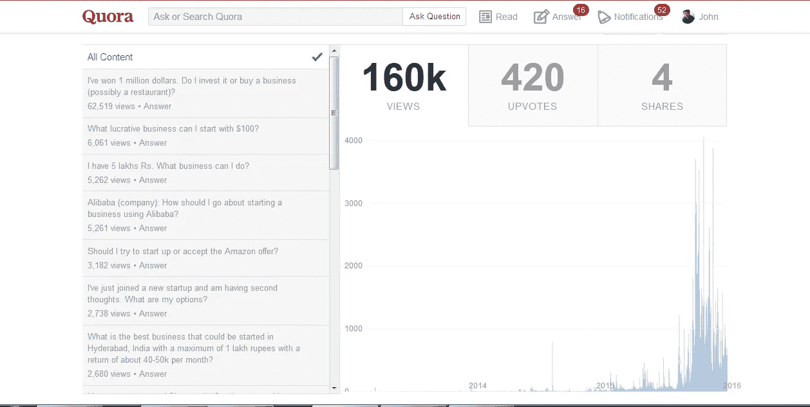

# 如何让你的独立创作成功不可避免

> 原文：<https://medium.com/hackernoon/how-to-make-your-indie-creative-success-inevitable-43f7292f2060>

Photo: Alejandro Escamilla via Unsplash

去年，我开始定期在 Quor a 上写文章，回答我感兴趣的话题，并觉得我有一些东西可以分享。因此，我很自然地写了很多关于小企业的建议，以及这对企业家意味着什么。

My Quora Stats on 01/18/16

当然，[我不认为自己是埃隆·马斯克或史蒂夫·乔布斯](https://www.quora.com/How-can-I-prepare-myself-for-entrepreneurship)。但是，虽然我过去常常想知道我是谁，可以提供这样的建议，但现在我意识到我从一系列独特的经历中吸取了经验。

还有谁帮助过业主购买/出售小企业？

共同创立了一个非盈利的探戈舞者？

在海军中队和 IT 规划司令部服役 10 年？

在房地产投资、贷款签约、实地考察等方面成功或失败的创业..

在电影和电视行业工作..

在线和面对面授课研讨会..

在会议上发言，并出版了两本书..

我们经常太快忽视我们*知道什么和我们*有能力做什么——骗子综合症。我们从一个系统中了解到这一点，该系统告诉我们需要获得他们的批准，以获得他们的认证证书。**

多年来，这意味着要成为作家，你需要出版商接受你的手稿——要成为“真正的”艺术家，你需要画廊来展示你的作品——要成为电影制作人，你需要工作室的资助。

现在这种情况正在慢慢改变。毫无疑问，一场运动已经进行了一段时间。像詹姆斯·阿尔图切这样的人告诉我们选择你自己。停止等待守门人的批准。

我想起了大象出生后就被绑在木桩上的故事。即使在她长得比地上的一小块金属更大更强壮后，大象仍然没有意识到她的力量。

有多少独立创意人还在等着前进？哪些歌曲没有被写出来？哪些电影还没拍完？

在他去世之前，[《活出你的传奇》的斯科特·丁斯莫尔提供了一个简单的愿景“想象一下，一个每个人都做着他们热爱的工作的世界是什么样的”](https://youtu.be/FPDG146hyDU)

这个想法经常被扭曲成流行的口号“追随你的激情”相反，我建议初露头角的企业家试试好奇心——这是我认为在商业中最基本的 T2 技能。

好奇心是探索的意愿..问问题..

好奇心是冒险的勇气..尝试某事..

好奇心是倾听的开放态度，而不是假设你已经知道答案。

好奇心是超越我们昨天的延伸——成为我们明天的能力。

好奇心是活着..这就是人类的意义所在。

虽然我不能说我所有的黑暗日子都结束了，但我现在意识到，甚至没有意识到，好奇心是让我坚持下去并帮助我摆脱困境的主要原因之一。

通过问这样的问题“这就是全部吗？”和“我还能做什么？”我发现，就像我自己的电视连续剧一样，我想看看下一集会发生什么。

因此，作为一名艺术家企业家，这是你想对你的观众做的大多数事情的更简单的答案——不断问“下一步是什么？”这项工作是想出所有的方法，你可以作为一个独立的创意者，用你的手艺来启发这个问题。

这是[挑战](http://goinswriter.com/my500words/)的第 15 天。

更多关于独立创意和企业家精神的信息，请访问[蝴蝶公式](http://butterflyformula.com/)。加入其他不会让你失败的独立创意者，加入我们的 Blab ，或[跟随我的美食旅行冒险或数字游牧之旅，访问 Tango vaga gand](http://www.tangovagabond.com/)。

> [黑客中午](http://bit.ly/Hackernoon)是黑客如何开始他们的下午。我们是 AMI 家庭的一员。我们现在[接受投稿](http://bit.ly/hackernoonsubmission)并乐意[讨论广告&赞助](mailto:partners@amipublications.com)机会。
> 
> 如果你喜欢这个故事，我们推荐你阅读我们的[最新科技故事](http://bit.ly/hackernoonlatestt)和[趋势科技故事](https://hackernoon.com/trending)。直到下一次，不要把世界的现实想当然！

