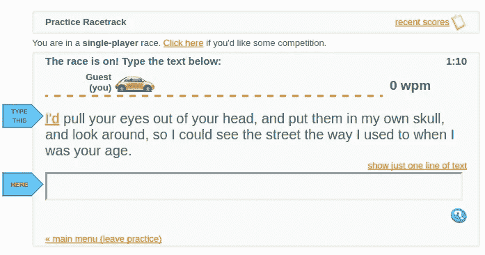
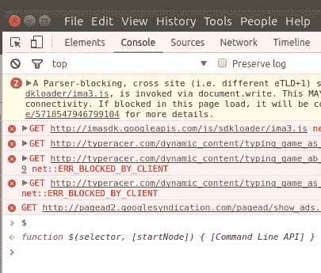
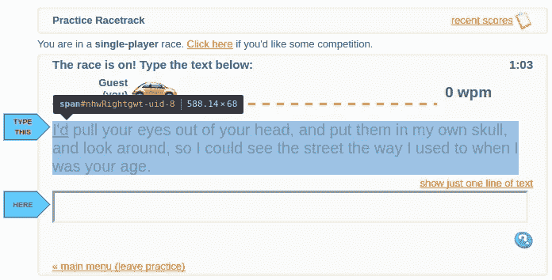
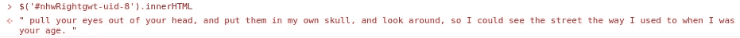
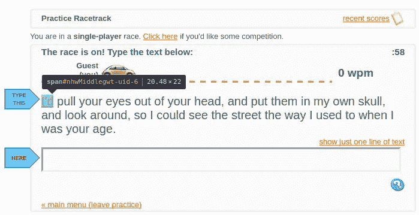
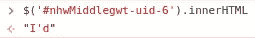
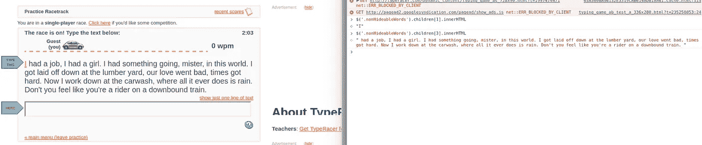
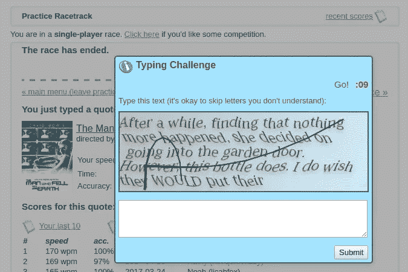

# 如何使用 TypeRacer

> 原文：<https://medium.com/hackernoon/how-to-mess-with-typeracer-34c650b863f6>

当我在洗衣服的时候，我和我的朋友们决定玩玩 [TypeRacer](http://play.typeracer.com/) ，这是一款流行的网络游戏，你可以在打字测试中与他人比赛，看谁能最快地打出一个短语或句子。正常情况下，我的平均打字速度为 120~130 wpm(每分钟字数)，但只是为了好玩，我想和朋友们一起玩。在这次技术演讲中，我将解释我是如何做到的。

让我们进行一场练习赛，四处打探一下，看看我们能找到什么。

TypeRacer practice game

这是一个练习游戏的界面。让我们打开我们的好朋友，Chrome Inspector 工具。

Chrome Web Inspector

我检查了 jQuery 是否对我可用，它确实可用。这对于操作和访问站点上的数据非常方便。

Inspecting the text element

看起来文本只是显示在一个带有 ID 的 span 中。其他一些代码阻止我突出显示它，但是我可以很容易地从 JavaScript 控制台获取它。

Fetching the text using the JavaScript console.

嗯，这个包含了除了第一个以外的所有单词。第一个词有什么特别之处？

Inspecting the text element for the first word

看起来您当前所在的单词包含在另一个具有另一个唯一 ID 的不同的标签中。没问题，因为我可以选择它并获取它的文本。

Fetching the first word using the JavaScript console

我做了更多的测试，并刷新了页面几次。span 的 uid 似乎会改变，但通常是一个小于 100 的数字。我们可以试试每一个数字。我快速编写了一个脚本来输出比赛文本。

仅仅猜测 uid 的计算时间是微不足道的，所以这个脚本工作得很好。

Running the script in practice mode. These are the lyrics to the song “Say You Won’t Let Go” by James Arthur!!

经过进一步的检查，我意识到我可以选择文本的容器元素，而不是猜测 uid，它没有 uid，保持不变。

Selecting the container element instead.

效果更好。现在，我可以在 JavaScript 控制台中作为一行程序运行它来获取所有文本。

太好了！现在我有了文本，我该如何输入它呢？将它粘贴到字段中并使用 JavaScript 设置它不起作用，因为页面使用按键事件处理程序来检测您何时键入单词。它会等到您按下空格键，然后将您在文本栏中的内容与您当前所在的单词进行比较。

经过快速研究，我发现 JavaScript 出于安全原因阻止您触发或模拟按键。这很好，我们可以使用一个快速的 Python 脚本来完成这项工作。我使用 [pyautogui 包](https://github.com/asweigart/pyautogui)来编程控制我的键盘并为我打字。

Python script to type the required text

现在我所要做的就是运行这个脚本，将文本粘贴到其中，然后将我的鼠标光标放在输入框上，脚本会处理剩下的事情。开始输入前的两秒钟窗口允许我切换回 TypeRacer 并选择输入框。我使用 0.05 秒的时间间隔来输入每个字符，这样输入看起来有点像人类。

看起来是这样的:

Demonstrating the Python script

当然，你可以在这个视频的结尾看到，它触发了一个打字挑战测试。这个更难，因为它有一个 captcha 风格的打字挑战，你需要用类似的 wpm 击败它，以便你的分数被认为是有效的。

Captcha style typing challenge

我试着调整输入间隔，看看网站还会做些什么。只要我把机器人的每分钟转数保持在 100 以下，我就从来不用做验证码测试。如果我把打字间隔设置为零，我可以达到超过 300 的 wpm，但网站会自动标记并取消它的资格。

一件有趣的事情是，TypeRacer 计算你的 wpm 是输入的单词除以总时间，这意味着让我的机器人在 10 秒钟内慢慢输入单词与让它在等待 10 秒钟后立即输入所有单词是一样的。

这是一个非常有趣的方式来打发时间，而我在等待我的烘干机周期结束。如果我将来再次讨论这个问题，我可能会写第 2 部分，其中我也使用 OCR 或 opencv 来击败 captcha 测试。我得去叠衣服了，所以现在就这些了。感谢阅读！

在推特上关注我: [@omgimanerd](http://twitter.com/omgimanerd)

> [黑客中午](http://bit.ly/Hackernoon)是黑客如何开始他们的下午。我们是 [@AMI](http://bit.ly/atAMIatAMI) 家庭的一员。我们现在[接受投稿](http://bit.ly/hackernoonsubmission)并乐意[讨论广告&赞助](mailto:partners@amipublications.com)机会。
> 
> 如果你喜欢这个故事，我们推荐你阅读我们的[最新科技故事](http://bit.ly/hackernoonlatestt)和[趋势科技故事](https://hackernoon.com/trending)。直到下一次，不要把世界的现实想当然！

