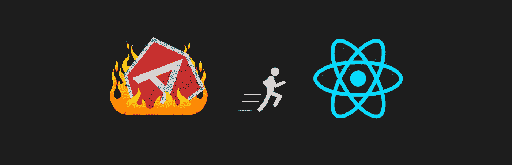

# 如何将应用从 AngularJS 迁移到 React 和 Redux

> 原文：<https://medium.com/hackernoon/how-to-migrate-an-application-from-angularjs-to-react-and-redux-de0e2d1f70aa>



从今年开始，我受雇于 [BEN Group](https://ben.productplacement.com/) ，主要目标是帮助他们将一个遗留应用从 *AngularJS* 迁移到 *React* 和 *Redux* 。从那以后，我们一直在项目内部创建解决方案，到目前为止效果很好。

在这篇文章中，我打算展示我们遵循的主要方法，并分享我们创建的一些解决方案，以允许我们逐步迁移项目，而不会失去理智。

> **免责声明**:我们这里的重点不是重构遗留代码，而是尽快移除它。我们避免为了让遗留代码“更漂亮”而花费太多时间或精力的解决方案。也就是说，我们会编写高质量的新代码。

# 将内部版本移动到 webpack。

这一步，我认为是整个过程中最重要的，一旦有了 *Webpack* ，你就可以开始使用指令 **import** 来获取你的依赖项和模块，你就可以开始摆脱 Angular 的依赖注入(DI)了。这也是在应用程序中开始编写 *React* 代码所必需的。

> 如果你使用 Angular 的模板缓存，Pug(Jade)或者其他任何影响构建的东西，不用担心，Webpack 会为它们每一个都准备一个加载器。不要忘记让您的网络包配置为 transpile ES2015 和 JSX。

这一步的重点不是将所有的 DI 转移到导入，而是让您的构建与 *Webpack* 一起工作。记住这一点很重要，以避免在这个任务中停留数周，并在几十个文件中引起冲突。

在 *AngularJS* 中，通常情况下，构建过程会从`node_modules`中获取你需要的所有依赖项，并将它们插入到包中。我们也需要在新版本中保持这种行为。

> 您需要将遗留代码视为需要击败的敌人。我们需要谨慎行事，需要有战略眼光。这也意味着，在某些时候，我们需要做一些不愉快的事情。

为了解决这个问题，我们创建了一个文件`vendor.js`，并在其中导入了所有的依赖项:

大多数依赖关系在导入时会在*窗口*对象中进行全局注册。所以，我们只需要像上面的例子那样导入它们。虽然，他们中的一些不这样做，我们需要手动操作。下面我们举一个例子来说明我们与 ***时刻*** 和 ***jQuery*** :

这种做法可能很奇怪，但是，你需要考虑到大多数依赖依赖于`window.$`，其他依赖于`window.jQuery`，甚至其他依赖于`window.jquery.`

创建 vendors 文件后，将其导入应用程序的入口点，这样，您的所有依赖项都将包含在包中:

```
require('./vendors');
```

另一个步骤是确保所有应用程序的文件都在包中。理想的情况是让每个模块都有一个索引文件，导入控制器、工厂、视图等..这样，您只需要在应用程序的入口点导入这些索引，就像您对供应商所做的一样，如下例所示:

如果您没有索引，您可以尝试遵循一个稍微大胆的解决方案，虽然不太建议。那就是找到一个正则表达式来匹配所有的文件，并使用 **require.context** 导入它们，如下例所示:

上面的代码，将强制 *Webpack* 在捆绑包中包含`/app`文件夹及其子文件夹中的所有`.js`和`.jsx`文件。如果你决定这样做，不要忘记你可能有`.test.js`、`.spec.js`甚至`.stories.js`文件，你将不得不在正则表达式中排除它们。

此外，请记住，在某些情况下， *Angular* 依赖于文件加载的顺序，因此，这个解决方案可能最终完全不起作用。

当您最终让您的构建工作起来时，赶快创建一个针对您的主分支的拉请求。除了 *React* 之外，将构建转移到 *Webpack* 已经是您的应用程序的一个优势。Angular 的 DI 使得应用程序具有强耦合性，而 *Webpack* 是我们的盟友

# 渲染 AngularJS 内部的 React 组件

第二个最重要的步骤，因为没有它就不可能逐渐迁移。这里的想法是，你可以在 *Angular* 中使用 *React* 组件，就像它们是指令一样。为了实现这一点，我们目前在我们的项目中使用了[*n react*](https://github.com/ngReact/ngReact)*。*

> *n 反应报告建议使用库 [*反应 2 角*](https://github.com/coatue-oss/react2angular) 。然而，我们在我们的应用程序中使用 Angular 1.5.8，我们最终在尝试使用另一个库时遇到了一些问题。我已经在另一个项目中使用了 react2Angular，他们使用的是更新的 Angular 版本，我没有遇到任何问题。也就是说，ngReact 即使不再更新，也具有将组件转换成指令所需的所有特性。我的建议是:选择适合你的库，然后继续，两者非常相似*

*要将*n react*集成到项目中，您可以从 npm 安装它:*

```
*$ npm i --save ngreact*
```

*然后将其导入您的供应商:*

```
*require('**ngreact**');*
```

*您还需要在您的项目中安装 *react* 和 *react-dom* :*

```
*npm i --save **react** **react-dom***
```

*然后，将**反应**模块注册为*角度*:*

```
*angular.module('app', ['**react**']);*
```

*完成后，我们可以创建一个**按钮**组件，就像我们在常规 *React* 应用程序中创建的一样:*

*然后，我们定义了一个指令，作为**按钮**的包装器:*

*在指令文件中，我们必须定义**按钮**使用的所有道具的名称，以便*n react*理解它应该传递给组件什么。*

*指令定义后，我们需要在*角度*中注册它:*

> *Angular 的模块，你要用来注册它并不重要，只要确保它在应用程序中注册。*

*一旦注册，我们现在可以在任何 angular 的视图中使用该指令，如下例所示:*

```
*<div>
  <**react-button** class-name="btn"></**react-button**>
</div>*
```

*请注意，在这里，我们使用破折号来拆分单词，而不是驼峰式大小写。在这种情况下，reactButton 变成 react-button，而`className`变成`class-name`。记住这一点很重要，因为这是一个常见的错误，可能需要几个小时来调试。*

*使用*n react*来渲染 *AngularJS* 应用程序中的小组件很常见，但是效率不高。*

**Angular* *UI 路由器，*允许我们在路由配置中传递一个参数模板。为了探索这一点，可以为每个应用程序的屏幕创建一个包装器组件，然后使用这些包装器，如下例所示:*

*在上面的例子中，我们定义了一个登录路由，并将其传递给一个组件，这个组件就是整个登录屏幕。这样，我们可以一次迁移整个屏幕，而不是一个组件一个组件地迁移。*

*我这里的黄金奉劝，就是在项目中安装 [*故事书*](https://storybook.js.org/) ，创建并测试小组件。这种方式更容易构建可靠的组件，然后将它们一起放入屏幕中。*

> *屏幕:也称为页面，它们是每个路由的根组件。*

# *共享依赖关系*

*定义一整个屏幕是惊人的。然而，当我们走到这一步时，我们还需要与 *React* 共享一些 *Angular* 依赖关系。*

*在 BEN 的例子中，我们需要的依赖项，只有在 Angular 初始化之后，在它执行了 providers、config 等之后才准备好...鉴于此，不可能使用 **export** 关键字导出它们。为了解决这个问题，我们创建了一个对象和一个助手函数来注入依赖关系。为了实现这个解决方案，我们只需要用下面的代码创建一个名为`ngDeps.js`的文件:*

*我们在 Angular 的 [**run**](https://docs.angularjs.org/api/ng/type/angular.Module#run) 流程中调用**injectingdeps**，如下例:*

*我们这样做是因为我们想尽快访问依赖项，而 **run** 是初始化中首先执行的进程之一。 **injectNgDeps** 接受一个对象作为参数，并将其与 **ngDeps** 对象合并。*

*当您需要一个 *React* 组件内的任何依赖时，您只需要做如下操作:*

*请注意，我们做的第一件事是导入 **ngDeps** 。如果您试图在**导入**之后立即访问`ngDeps.$state`，结果将是`undefined`，因为**运行**进程还没有运行。出于这个原因，我们访问组件的**构造器**方法中的值，因为组件只有在*角度*初始化后才会被实例化。*

*我们从 **ngDeps** 中提取依赖项，并将它们分配给对象 **this** ，因为这样我们可以在任何类的方法中访问`this.$state`*

*这样就有可能与*反应*组件共享任何角度的依赖性。然而，尽量少用 **ngDeps** 。请记住:我可以使用**导出**来导出这个依赖关系吗？如果答案是肯定的，你总是选择使用导出，否则你使用 **ngDeps** 。*

*另一个需要强调的是，保持对 **ngDeps** 的访问仅限于树中的顶层组件是很重要的。这意味着屏幕，可能还有一些容器。然后，通过道具传给孩子。这样，到时候就更容易移除 **ngDeps** 了。*

# *在应用程序中集成 Redux*

*在解决了双方共享依赖关系的问题后，我们可以继续将 *Redux* 集成到应用程序中。做到这一点并不难，但也有一些特殊性。*

*首先，按照[文档的说明](http://redux.js.org/)配置商店，就像在任何应用程序中一样。然而，一旦你创建了对象**商店**，你必须按如下方式导出它:*

```
***export** const **store** = createStore(rootReducer);*
```

*这将允许我们访问应用程序中其他文件中的**存储**对象*

*在一个常规应用程序中，我们使用来自 [react-redux](https://github.com/reactjs/react-redux) 的 **connect** 方法，将我们的容器集成到**存储**中。尽管如此，这只是因为我们在应用程序中插入了带有**存储**的**提供者**作为根组件，正如我们在 lib 的文档中看到的:*

```
*ReactDOM.render(
  <**Provider** store={**store**}>
    <MyAppRootComponent />
  </**Provider**>,
  rootEl
)*
```

*问题是我们的应用程序中不能只有一个根组件，我们有很多。我们一直手动控制哪些组件应该包含提供者，哪些不包含，这是不切实际的。为了解决这个问题，我们创建了一个高阶组件，它抽象了逻辑，并在必要时将提供者作为包装器插入。为了方便使用，我在 [Github](https://github.com/viniciusdacal/redux-connect-standalone) 和 [NPM](https://www.npmjs.com/package/redux-connect-standalone) 上以[redux-connect-standalone](https://github.com/viniciusdacal/redux-connect-standalone)发布了它。*

*由 NPM 安装:*

```
*npm i --save redux-connect-standalone*
```

*然后，我们可以创建我们的连接文件并使用以下代码:*

*在您的组件内部，不是从 *react-redux* 导入 **connect** 方法，而是从您刚刚创建的文件中导入它。并像使用原始方法一样使用它:*

*由于我们尊重来自原始方法的相同签名，当您将 **Provider** 作为应用程序的根组件时，您将只需要在导入方法中执行搜索替换，将其替换为:*

```
*import { connect } from 'react-redux';*
```

> *如果您在应用程序中使用或打算使用 redux-form，我还创建并发布了一个针对 reduxForm 的方法，即[redux-form-connect-standalone](https://goo.gl/4XgxwZ)。他的用法和我们上面看到的 HOC 很像。*

# *最后的话*

*有了这些方法，就有可能逐步迁移您的应用程序。然而，在迁移应用程序的基础技术时，总会出现其他复杂的问题。重要的是要记住，上述所有解决方案都是角度和反应之间的中间地带。最终目标是摆脱所有这些，并使用 *React* 和 *Redux 的*惯例和良好实践。**所以，每当你想出一个解决方案时，想想以后要把它去掉会有多难**。*

*如果您发现任何有趣的解决方案或问题，请与我们分享。*

*如果你喜欢这篇文章，请帮助我们让更多的人继续发展和改进他们的应用程序。*