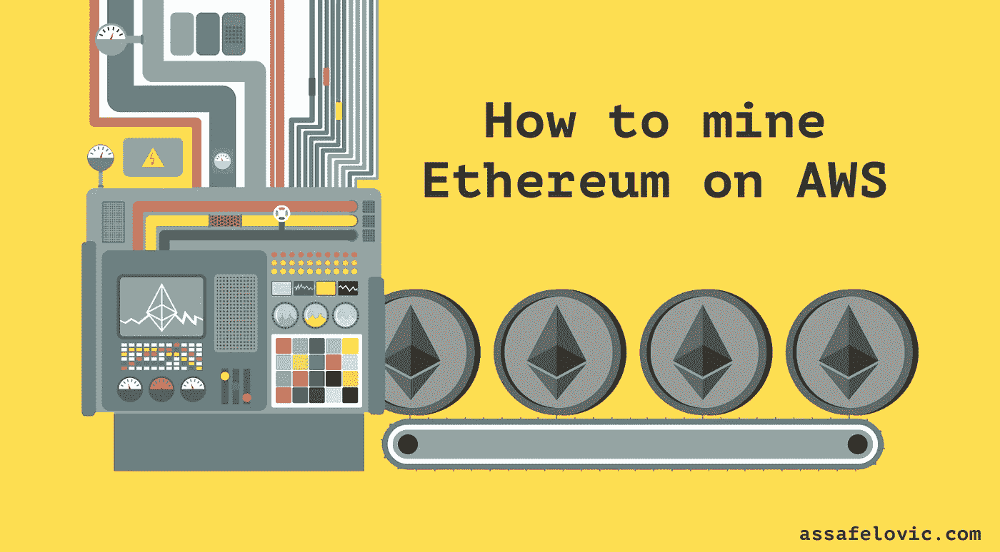
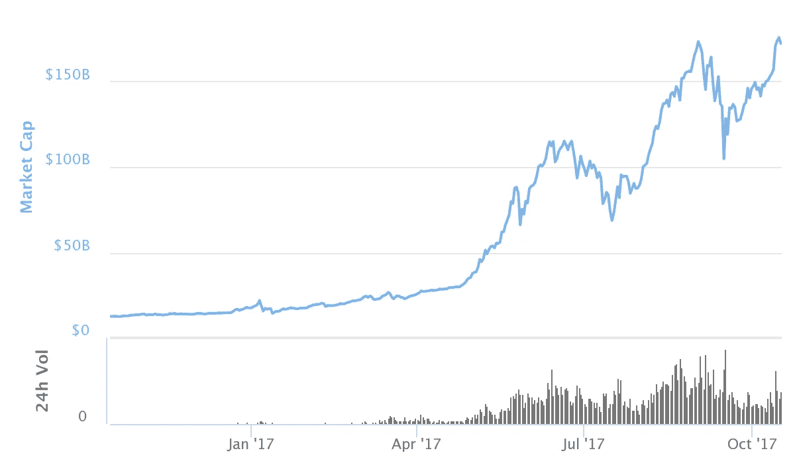
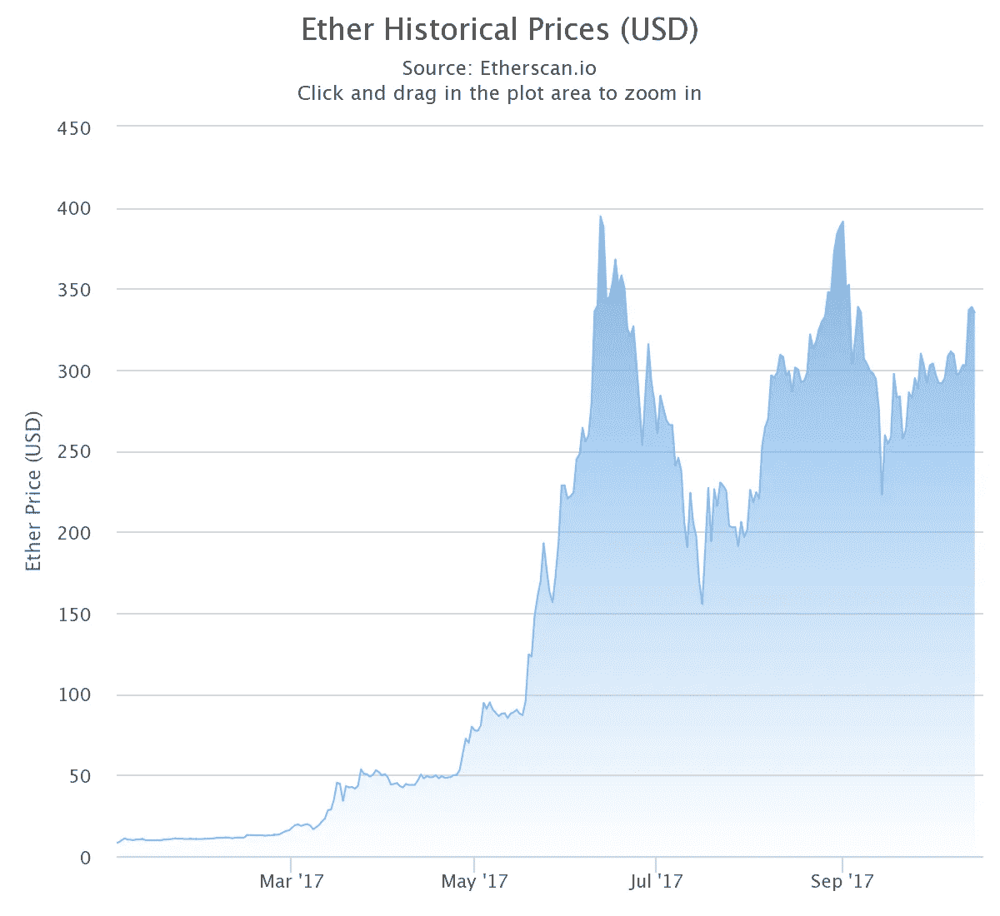
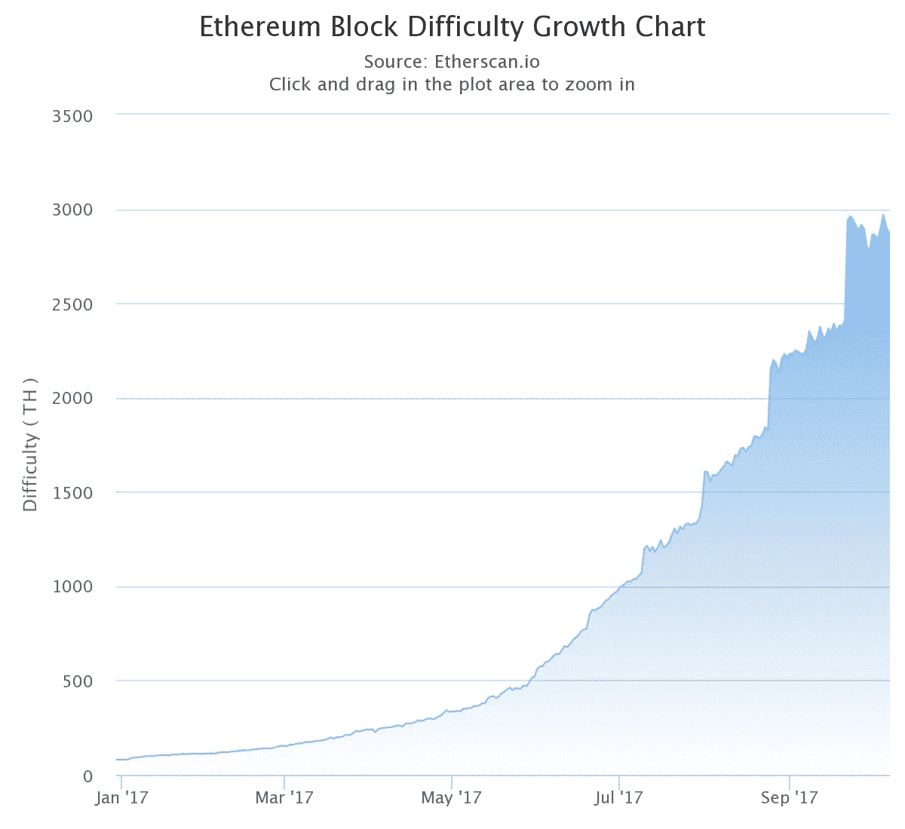

# 如何在 5 分钟内挖掘以太坊

> 原文：<https://medium.com/hackernoon/how-to-mine-ethereum-in-5-min-3f3bc80d0c4b>



## 令人惊讶的是，您只需要一个 AWS EC2 实例就可以开始挖掘以太坊。

我相信你在阅读这篇文章之前已经听说过加密货币热潮。加密货币正在缓慢而悄然地彻底改变金融系统和交易的工作方式(在我看来应该是这样)。

随着比特币不久前触及 18000 美元大关，目前总市值为 3160 亿美元，自 8 月份以来进行了数百次 ico(首次硬币发行)，人们肯定会说加密货币领域存在泡沫。更重要的是，这个泡沫似乎不会很快消失。

正如您在下图中看到的，加密货币的总市值在不到一年的时间里从不到 500 亿美元增长到超过 150 亿美元！



那么，进入这个领域并享受增长的最佳方式是什么呢？我不是加密货币专家，但是，根据我的研究，我发现答案在所有观点中都很明显:

> 如果你想快速赚钱，就投资硬币吧。

我强烈推荐用兑换 [**【币安】**](https://www.binance.com/?ref=18095638) 或者**[](https://www.coinbase.com/join/5a3a145a2fdace0266dbe015)****(如果你只是想要以太坊的话)购买币。到目前为止，币安有最多种类的代币可供投资，比特币基地有令人惊叹的用户体验，这两个国家都被认为非常安全。用比特币基地 [**购买硬币点击这里**](https://www.coinbase.com/join/5a3a145a2fdace0266dbe015) ，或者用币安 [**购买硬币点击这里**](https://www.binance.com/?ref=18095638) 。******

****要了解如何投资其他硬币，请阅读我最新的帖子 [**这里**](https://hackernoon.com/cryptocurrencies-be4b3e326387) 。****

****我个人对[以太坊](https://ethereum.org)很感兴趣，已经找到了一个毫不费力的方法在 AWS 上快速开始挖掘！这篇文章将带你经历这个过程。****

****但是在我们开始之前，让我们复习一些基础知识。如果你已经很熟悉了，就向下滚动。****

# ****以太坊是什么？****

****以太坊是一个基于区块链技术的开放软件平台，使开发人员能够构建和部署分散的应用程序。以太坊相对于比特币的优势在于，它可以支持许多不同类型的去中心化应用。****

****以太坊拥有仅次于比特币的第二大市值，并在去年获得了超过 230%的大幅增长，如下所示:****

********

****然而，价格的不断增长导致以太坊采矿的需求不断增加，因此采矿难度也随之增加:****

********

****如果你在 5 月份开始开采以太坊，你会看到比现在开始明显更高的收益。****

# ****什么是加密挖掘？****

****采矿源于加密货币领域的黄金类比。简单来说，加密货币挖掘是一个解决复杂数学问题的过程。“矿工”是花时间和精力解决这些数学问题的人。他们向发行者提供解决方案，发行者验证解决方案，并奖励矿工一块乙醚。直觉上，挖掘难度的增加意味着解决复杂问题变得更加困难，因此回报也更少。我们目前正处于以太坊难度的高峰期，因为它的需求和受欢迎程度非常高。****

# ****开采以太坊还值得吗？****

****随着越来越多的矿工加入以太坊网络，解决问题变得越来越困难，导致挖掘难度增加。这就是为什么目前开采以太坊的成本很高。回报很低，设备仍然相当昂贵。然而，随着以太坊价格的持续上涨，它在未来可能会变得值得。****

****尽管如此，据报道，以太坊将在今年晚些时候[转向股权证明框架](https://www.coindesk.com/ethereums-big-switch-the-new-roadmap-to-proof-of-stake/)，这意味着以太开采可能不再相关。请记住，这也可能导致以太坊价格的大幅上涨。****

****所以你也可以考虑购买一些硬币。正如我上面所说的，[](https://www.binance.com/?ref=18095638)**或者[](https://www.coinbase.com/join/5a3a145a2fdace0266dbe015)****在我看来会是你最好的选择。**********

******如果你已经走到这一步，仍然渴望挖掘以太坊，让我们开始吧！******

## ******更新【2018 年 5 月 5 日】！******

******亚马逊网络服务器【AWS】已经[为以太坊和 Hyperledger fabric 引入了他们的区块链模板](https://ambcrypto.com/amazon-releases-its-blockchain-template-that-allows-ethereum-eth-mining/)。这些模板允许用户使用开源框架以快速简单的方式创建和启动安全的区块链网络。此外，该模板有一组实现和响应 RPC 协议的节点。它还支持 EthExplorer 和 EthStats 状态页面以及**以太坊挖掘**。有关官方文件[请点击此处](https://docs.aws.amazon.com/blockchain-templates/latest/developerguide/blockchain-templates-ethereum.html)。******

****向下滚动继续我最初的挖掘以太坊的方法…****

# ****如何启动 AWS 挖掘实例****

****步骤非常简单:****

1.  ****进入 AWS 中的 EC2 控制台，将区域更改为美国东部(N.Virginia)。对于我们将要使用的实例类型来说，这个区域恰好是最便宜的，并且还包含一个社区 AMI，它已经安装了所有需要的挖掘库以供即时使用。****
2.  ****在“实例”下，选择专色实例，然后单击“请求专色实例”。****
3.  ****搜索名为 **ami-cb384fdd** 的社区 AMI 并选择它。****
4.  ****在实例类型下选择 **g2.8xlarge** 。****
5.  ****审核并启动！****

# ****如何开始采矿****

****要开始采矿，你需要一个以太坊钱包并加入采矿池。****

****要生成钱包，只需转到[https://www.myetherwallet.com](https://www.myetherwallet.com)并按照步骤操作。在这个过程结束时，你会收到一个钱包地址。****

****我们将使用[矮人矿池](https://dwarfpool.com/eth)进行采矿，它被评为[最佳采矿池](https://www.buybitcoinworldwide.com/ethereum/mining-pools/)。喜欢的话随便用别人。****

****只需 SSH 到您的实例并键入:****

```
**> tmux> ethminer -G -F [http://eth-eu.dwarfpool.com/{WALLET ADDRESS}/{](http://eth-eu.dwarfpool.com/0x3f112e2E1cc26132f02dF4CD558a1C342E65A19e/2/assaf.elovic@gmail.com)YOUR_EMAIL ADDRESS} --cl-local-work 256 --cl-global-work 16384**
```

****Tmux 允许您在关闭 SSH 连接后保持进程运行。****

****Ethminer 是以太坊 GPU 采矿工人。输入您的电子邮件地址，您就可以收到支付通知。其他参数用于挖掘优化。****

****就是这样！****

****您应该很快就会看到一个生成的 DAG 文件，随后，您的挖掘应该会开始。要查看您的统计数据，只需前往[https://dwarfpool.com/eth](https://dwarfpool.com/eth)，在“工人统计”中输入您的钱包地址。****

****我个人的结论是，由于以太坊的开采难度非常高，在短期和中期内实际上不值得。运行一个 g2.8xlarge 实例一小时的成本大约是每小时 2.6 美元。目前开采以太坊的收益在每天 2.6 美元左右！****

****没有人能确切知道加密货币的未来会如何，以及这是否只是一个很快就会破灭的泡沫。甚至有人说加密货币交易相当于买彩票。****

****然而，作为一个技术爱好者和颠覆的信徒，我真的相信加密货币有一个光明的未来。如果我是对的，比特币和以太坊目前的上涨只是一个开始。一枚硬币可能价值 100 倍于今天的价格，这可能是今天开采它的正当理由。****

****要了解如何投资加密货币以及投资什么硬币，请在这里阅读我最新的帖子[](https://hackernoon.com/cryptocurrencies-be4b3e326387)**。******

******如果你喜欢这首曲子，那就鼓掌吧👏🏻(可以不止一次鼓掌)！你也可以在网上的某个地方分享，这样其他人也可以阅读。******

******要阅读更多软件工程相关的帖子，请随时访问 assafelovic.com。******