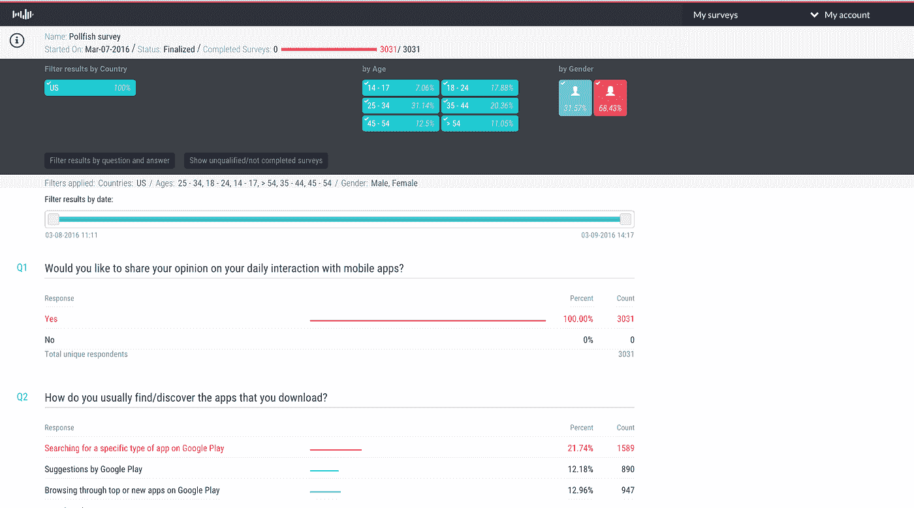
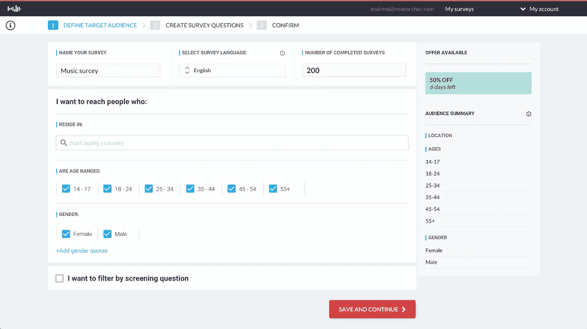
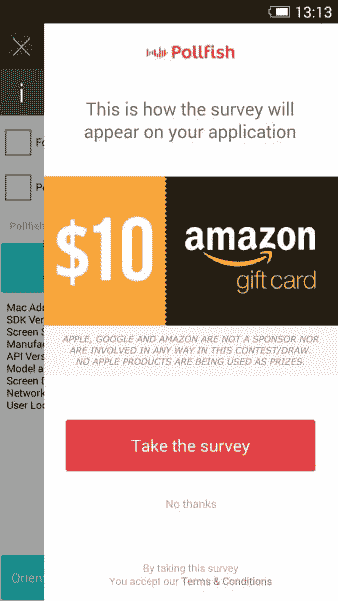
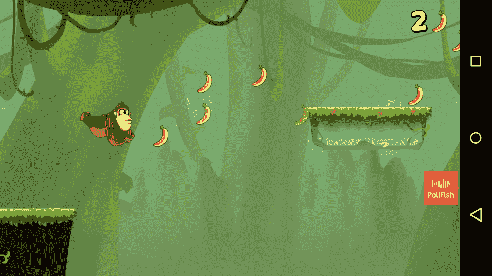
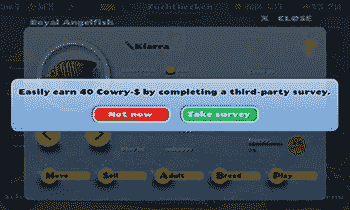
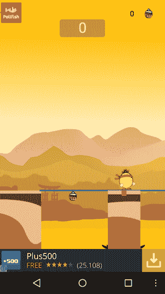
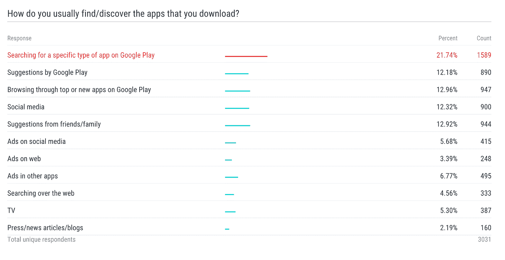
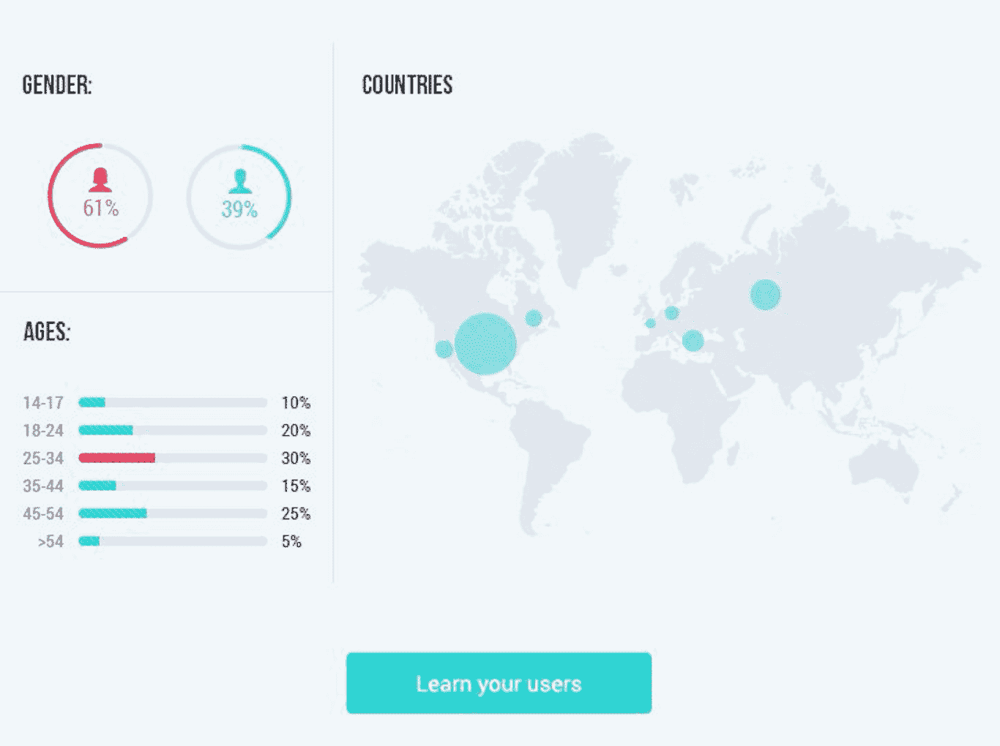

# 如何利用应用内调查将你的移动应用货币化

> 原文：<https://medium.com/hackernoon/how-to-monetize-your-mobile-app-using-in-app-surveys-835f7788026a>

[移动](https://hackernoon.com/tagged/mobile)货币化是应用开发者在当今移动世界面临的关键问题之一。随着应用程序的可见性变得越来越难，开发者正在寻找新的有效方法，通过不同的货币化策略来货币化他们的应用程序。

最广泛使用的策略之一是通过广告赚钱，正如史蒂夫·乔布斯曾经说过的，“移动广告糟透了”。不幸的是，这是[被大品牌普遍接受的](http://www.mediapost.com/publications/article/245690/yep-mobile-ads-suck-coke-kraft-papa-johns-kn.html)事实。不同的广告平台提出了几个单元，如横幅广告、插播广告、视频广告、要约墙等。开发者通常对使用什么广告单元或来自哪个广告平台感到困惑，但他们真正关心的是在一天结束时从他们的应用程序中赚钱，而不通过牺牲用户体验来失去他们的用户。
正如 [Pollfish](http://www.pollfish.com/) 对 5000 名移动用户进行的[调查](https://www.pollfish.com/infographic/developer)所见，人们普遍对当前淹没应用程序用户界面的不同广告形式感到恼火，有时这种形式会迫使用户点击它们。目前大多数广告公司通过广告吸引用户，让他远离应用，而不是让他关注应用的内容。

一种新的互动盈利模式将很好地服务于市场，这种模式可以彻底改变移动开发者目前从应用中赚钱的方式，并引入对开发者和应用用户都更有吸引力的东西。

**通过调查引入货币化**

调查货币化是移动应用货币化领域的新创新之一。

## 它是如何工作的？

在 Pollfish，我们在网站上提供了一个 [DIY 调查工具](https://www.pollfish.com/),任何人都可以快速注册，选择受众，创建调查问题，支付费用，然后开始从网络上实时接收结果。该平台将这些调查分发到数以千计的移动应用程序中，这些应用程序将调查作为一种货币化解决方案。应用程序发布者在其应用程序中完成的每个调查都会获得报酬。

## 看起来怎么样？

当有调查可用时，应用内的指示器会提示用户是否愿意参与调查，并通过参与抽奖获得奖励。礼品由平台提供，一般是礼品卡。用户可以选择不参与，或者随时关闭调查。在这两种情况下，所有东西都会从他们的屏幕上消失，他们会回到他们的应用内体验。

如果用户决定参加调查，他们首先要回答一系列问题，这些问题以移动优化的方式呈现。有几种类型的问题，包括单个答案、多个答案、评级问题、开放式问题和排名型问题。您甚至可以插入图片供参与者回应。一旦调查完成，用户可以选择输入他们的电子邮件地址，以便在他们获胜时得到通知。中奖用户会在抽奖当天收到结果通知。

## 关键价值主张

利用调查将移动应用货币化有几个价值主张:

**对于用户:**

*   **这是一种新的互动形式，不同于广告。**

用户高度参与应用程序，因为他们可以分享自己的观点并参与有趣的调查。它不像为大众制作的无聊广告，点击会把你带到另一个网站或下载另一个应用程序。一些调查更有趣、更吸引人，尤其是当用户可以看到他们的回答与其他人相比时——这增加了完成率，同样也增加了应用程序发行商的收入。

*   **用户参与抽奖可赢礼品**

参与调查的用户有机会赢得绘画礼品——只需分享他们的意见。

**对于出版商:**

*   **用户留在应用内**

用户从不离开应用程序。一旦调查完成，用户继续使用应用程序界面的当前流程。这也许是与传统广告的最大区别，在传统广告中，点击广告的用户会被带到一个网站，或者被重定向到下载另一个应用程序，但不保证他们会回来。这样出版商就失去了顾客。

*   **调查比传统广告网络多支付 20 倍的费用**

出版商根据完成的调查获得报酬。这是一个 CPA 模型，其中的操作是完成调查。调查费用相当高，例如在 Pollfish，调查费用比传统的广告网络高出 20 倍。

有两种类型的调查

- **基础调查**每完成一次调查，最低支付 0.30 美元，每完成一次调查，最高支付 2 美元(这是一种共享收入模式)

- **有趣的调查**通常是小型的图像问题调查，根据调查长度支付浮动价格。这些调查的平均支出为每完成一次 0.08 美元。

*   **出版商不必改变他们应用程序的用户界面**

有了调查，一切都呈现为覆盖图，因此发布者不必在应用程序的 UI 中做任何更改。对于大多数广告解决方案，应用程序 UI 中的空间需要由发布者分配，以便呈现广告单元(例如横幅广告)。但是对于调查，由于所有内容都显示为覆盖图，因此不需要进行任何更改。因此，集成变得简单，只需不到 2 分钟，因为它只需要一行代码来激活调查。

*   **当一项调查完成后，用户界面不显示广告/调查**

为了确保结果的质量和用户体验，用户有资格每天参加一次调查。因此，一旦调查完成，一切都从应用程序的用户界面消失，用户可以继续使用应用程序，没有任何广告或调查。此外，当没有调查可用时，应用程序中不会显示任何内容，因为调查以前从未集成到应用程序中。

*   **出版商被允许用应用内的好东西来激励用户完成调查**

调查可能是奖励视频的一个很好的替代方式，因为出版商可以通过暂时移除应用内商品的广告来激励用户。这是一个非常受欢迎的选择，因为调查报酬很高，用户[更喜欢](https://www.pollfish.com/dashboard/results/8002/36472338)与他们互动，从而给开发者带来更高的收入。

*   **调查可以是多重货币化战略的一部分**

由于调查针对的是市场研究领域——与广告不同的市场——它可以与出版商可能已经在使用的任何其他广告解决方案一起使用，甚至在同一个屏幕上使用，以增加收入。这也是很容易实现的，因为调查是最不引人注目的。

*   **出版商可以免费创建内部调查，并从用户那里收集反馈**

由于调查已经作为一种货币化解决方案集成到应用程序中，出版商可以免费使用 DIY 调查工具[以获得用户的反馈。例如，发布者可以创建调查来询问新特性，比如“你希望在未来的版本中看到什么”或“在我们最近的更新中你不喜欢什么？”通过这种方式，他们可以在进入新的开发周期之前开始与他们的用户进行交互式对话，从而节省金钱和时间。](https://hackernoon.com/tagged/tool)

此外，出版商可以使用 DIY 调查工具对未来的概念进行 A/B 测试。

*   **发行商可以了解他们的应用**

由于出版商正在使用一个调查平台，他们也可以从该平台基于完成调查的受访者建立的档案中受益。尽管如此，发行商可以直接访问实时分析/洞察仪表板，在那里他们可以了解更多关于其应用程序用户的信息，并据此做出更好的决策。

总之，调查是新的、无摩擦的移动应用货币化方式，并为出版商当前的货币化解决方案增加了新的收入来源。调查可以在应用的货币化、分析、反馈和 a/b 测试方面增加价值，使出版商能够在没有广告的情况下从他们的应用中获得收入，同时也可以通过听取用户的意见来改进和创造更好的应用。毕竟，出版商希望采用能够很好地融入用户体验的货币化方法，而不是赶走用户的广告。

> [黑客中午](http://bit.ly/Hackernoon)是黑客如何开始他们的下午。我们是 [@AMI](http://bit.ly/atAMIatAMI) 家庭的一员。我们现在[接受投稿](http://bit.ly/hackernoonsubmission)并乐意[讨论广告&赞助](mailto:partners@amipublications.com)机会。
> 
> 如果你喜欢这个故事，我们推荐你阅读我们的[最新科技故事](http://bit.ly/hackernoonlatestt)和[趋势科技故事](https://hackernoon.com/trending)。直到下一次，不要把世界的现实想当然！

