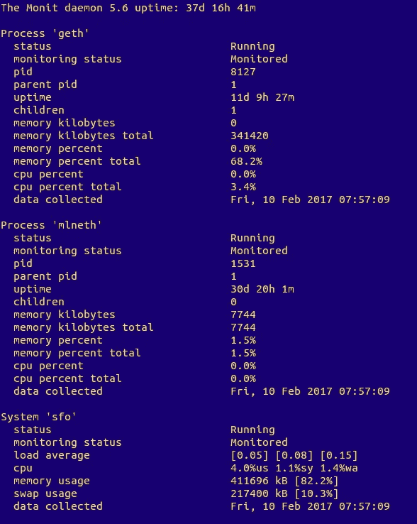

# 如何监控 geth 并在 monit 崩溃时自动重启它

> 原文：<https://medium.com/hackernoon/how-to-monitor-geth-and-autorestart-it-on-crashes-with-monit-a6668de9b961>


Monit monitors Geth, autorestarts it on crashes and sends email alerts. Good, good Monit!

我在一个低成本的数字海洋(DO) Ubuntu droplet 上运行 geth 和[TheMillionEtherHomepage.com](http://themillionetherhomepage.com/0xF51f08910eC370DB5977Cff3D01dF4DfB06BfBe1)后端。我使用 **monit** 来自动重启 geth，并在进程出错时发送电子邮件提醒。

在这里，我将介绍一个可行的解决方案和一个不可行的漂亮的解决方案(希望有人能最终修复它)。

## 安装和设置监视器

```
$ sudo apt-get update 
$ sudo apt-get install monit
```

备份配置文件，并开始用 nano 编辑它:

```
$ sudo cp /etc/monit/monitrc /etc/monit/monitrc-orig # backup 
$ sudo nano /etc/monit/monitrc
```

允许访问监控状态。取消这些行的注释:

```
set daemon 120 # number of seconds between checkups 
set httpd port 2812 and 
    use address localhost # only accept connection from localhost
    allow localhost # allow localhost to connect to the server
```

让 monit 包含*。cfg 文件从它的 conf.d 目录。取消注释(或在最后添加):

```
include /etc/monit/conf.d/*.cfg
```

设置邮件服务器发送提醒。如果您使用的是 gmail，请添加以下几行:

```
# GMAIL 
set mailserver smtp.gmail.com port 587 
    username "username@gmail.com" password "12345678" 
    using tlsv1 
    with timeout 30 seconds set alert username@gmail.com # monit will send alerts to this address
```

退出 nano 编辑器:Ctrl+X 要保存，键入 Y，按 enter，当它要求文件名时再次输入(保留相同的文件名)。

设置权限为 monitrc 现在有非常敏感的数据。

```
$ sudo chmod 600 /etc/monit/monitrc
```

为了更好地理解 monit:

*   [视频—用 Monit 监控 Linux 系统和服务](https://www.youtube.com/watch?v=wiRt3mY7Rrw)
*   [数字海洋:如何安装和配置 Monit](https://www.digitalocean.com/community/tutorials/how-to-install-and-configure-monit)

## 设置 geth 监控—工作解决方案

使用 nano 创建并开始编辑 geth.cfg 文件:

```
$ sudo nano /etc/monit/monitrc/geth.cfg
```

粘贴此代码:

```
# GETH 
CHECK PROCESS geth MATCHING "[g]eth.*fast" 
    start program = "/bin/bash -c 'geth --fast --rpc --rpcport 8545 --rpccorsdomain localhost --cache=16 >/dev/null 2> /home/my-logs-folder/geth.log'" as uid username as gid username 
    stop program = "/bin/bash -c 'kill -HUP $(ps aux | grep '[g]eth' | awk '{print $2}')'" as uid username as gid username 
    if not exist then alert 
    if not exist then restart
```

Ctrl+X 要保存，请键入 Y，按 enter 键，当它要求输入文件名时，再次按 enter 键。

*   我们在这里使用>/dev/null，因为 geth 将所有内容输出到 stderr(标准错误输出)。我们将所有 stderr 输出(即所有日志)保存到/home/my-logs-folder/geth.log 文件中。
*   我们使用-HUP 信号，因为-SIGINT(通常用 Ctrl+C 发送)不会到达 geth。

重新启动 monit:

```
$ sudo monit reload
```

**当 geth 崩溃时，这个配置将完美地发送一封电子邮件给你，并将完美地自动重启 geth**

酪这里的缺点是它不能通过 monit 向 geth 发送“graceful”-SIGINT 信号。而不得不改为 send -HUP，这想必是不安全的([用 SIGTERM 杀 geth 安全吗？](http://ethereum.stackexchange.com/questions/10566/is-it-safe-to-kill-geth-with-sigterm))。我试了一下，效果不错，但是我更喜欢手动发送-SIGINT:

```
$ sudo monit unmonitor geth # so that monit won't restart geth again 
$ PID_OF_GETH=`pidof geth` # get geth's process ID 
$ kill -2 $PID_OF_GETH # KILL IT NOW!... but do it gracefully.
```

这是笨拙的。我试图让它更优雅，但失败了。在 stackexchange 贴了这个问题— [如何用 monit 监控并自动重启 geth？](http://ethereum.stackexchange.com/questions/11860/how-to-monitor-and-auto-restart-geth-with-monit)

## 设置监控—正确的方式

我知道配置看起来应该与此非常相似。

geth.cfg

```
# GETH 
CHECK PROCESS geth with pidfile "/home/username/monit/geth.pid" 
    start program = "/bin/bash -c '/home/username/monit/geth.sh start'" as uid username as gid username 
    stop program = "/bin/bash -c '/home/username/monit/geth.sh stop'" as uid username as gid username 
    if not exist then alert 
    if not exist then restart
```

geth.sh

```
#!/bin/bash 
PID='/home/username/monit/geth.pid' 
LOGS='/home/username/monit/geth.log' 
KEYS='\--fast --rpc --rpcport 8545 --rpccorsdomain localhost --ipcpath /home/username/.ethereum/geth.ipc --cache=16' 
case $1 in 
    start) 
        setsid geth "$KEYS" &> "$LOGS" & 
        echo $! > "$PID" 
    ;; 
    stop) 
        kill -SIGINT `cat "$PID"` 
        rm "$PID" 
    ;; 
    *) 
    echo "usage: geth.sh {start|stop}" 
    ;; 
esac 
exit 0
```

很漂亮不是吗？如果你知道如何让它工作，请在这里提交你的答案— [如何用 monit 监控和自动重启 geth？](http://ethereum.stackexchange.com/questions/11860/how-to-monitor-and-auto-restart-geth-with-monit)

## 获取监控状态

重新启动 monit 后，可以使用以下命令启动 geth:

```
$ sudo monit start geth
```

这将运行 geth，在崩溃时自动重启它，并在出错时通过电子邮件通知您。

您还可以通过以下命令检查 monit 状态:

```
$ sudo monit status
```

并且有一个这样的屏幕(mlneth 这里是我的[项目](http://themillionetherhomepage.com/0xF51f08910eC370DB5977Cff3D01dF4DfB06BfBe1)的 python 后端):



Monitoring geth

**祝你们监控愉快，没有任何警告！**

[](http://bit.ly/HackernoonFB)[](https://goo.gl/k7XYbx)[](https://goo.gl/4ofytp)

> [黑客中午](http://bit.ly/Hackernoon)是黑客如何开始他们的下午。我们是 [@AMI](http://bit.ly/atAMIatAMI) 家庭的一员。我们现在[接受投稿](http://bit.ly/hackernoonsubmission)并乐意[讨论广告&赞助](mailto:partners@amipublications.com)机会。
> 
> 如果你喜欢这个故事，我们推荐你阅读我们的[最新科技故事](http://bit.ly/hackernoonlatestt)和[趋势科技故事](https://hackernoon.com/trending)。直到下一次，不要把世界的现实想当然！

