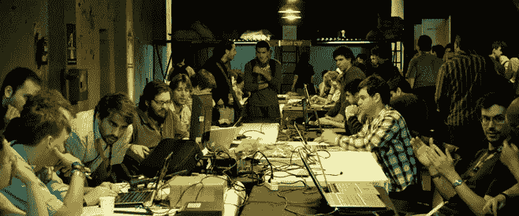

# 作为自学成才的开发人员，如何进行实时实验

> 原文：<https://medium.com/hackernoon/how-to-networking-as-a-self-taught-developer-a-real-time-experiment-638890f4d6b2>

# 序幕

TL 来了；(相信我，是 TL 博士；我的故事的版本。。。我一直热爱科学。当我大约 12 岁的时候，我的父母有了一台可以上网的电脑。我学会了最难的编程方法(如果你想知道，我听说过黑客，我得到的论文是关于逆向工程的，所以我的第一门语言是通过调试器的 x86 ASM。IMHO 最懂电脑的，我不后悔)。在一无所知之后，我获得了权力的感觉，并沉迷于编程。随着时间的推移，我了解了 web 技术(HTML、CSS、JS)、后端(PHP & SQL)、系统管理员(Linux、bash、终端内部的生活)和必读的知识(C、Java)。我学到了更多的东西，但这是历史的简短版本。

所有这些都是在 2010 年之前。那时候事情很简单。那年我进了大学，记得吗，我热爱科学。因为我学的是物理，不是计算机科学。我发现我不太喜欢物理，但我真正喜欢的是数学。Almos 一年前，我有了一个想法，并试图经营一家初创公司。虽然失败了，但我还是重新开始编程。五年来，事情发生了很大的变化。之后，我在一家网络代理公司找到了一份工作，但那是一次可怕的经历。我们和 WordPress 一起工作，对我来说这并不令人兴奋。我没有辞职，我的老板搬到了别的地方，突然间我们所有人都失业了。有那么糟糕。当我在那里时，我遇到了一些非常有趣的人，我们本月成立了自己的公司，但我遇到的一些人为初创公司远程工作(我住在拉丁美洲)，他们告诉我像他们一样寻找工作。这是我生命中最后一年发生的事情。

# 实验

我决定我想成为一名程序员。身边的人都说我擅长。问题是，在这个行业，除了我的朋友之外，我不认识任何人，除了我糟糕的工作和我自己的实验，我没有任何经验，我不在美国或欧盟，我没有 CS 学位(或任何学位，因为我没有完成大学，但那是另一回事)，我害怕把我不存在的简历发送到求职板。老实说，我不确定作为一名程序员我想做什么。自由职业？远程工作？经营另一家创业公司？和我的朋友呆在一起经营一家开发机构？我非常确定的是，我需要认识一些人来让这些想法发挥作用。想要一份工作？寻找承包商。想经营一家代理公司/自由职业者？寻找客户。见了人之后，我需要展示我的技能。

我要做一个实验。我将做一些网络工作来结识朋友，并努力展示我的技能。这是我的计划:

*   在推特上联系人们。关注他们，了解最新消息。
*   记录我的经历。我正考虑在媒体上写这个实验的步骤和结果，并在我自己的博客上写一些技术方面的东西。
*   关于 TDD 和 Python 的博客。我喜欢 Python，我还没有看到任何我喜欢的与测试相关的东西，也许这可以成为我对社区的贡献。
*   关于 JS 栈的博客。如果可以的话，我会用 Python 做任何事情，但是 JS 是新的领导者，你需要了解它才能被雇佣。
*   成为 Reddit 社区的一员。我不知道如何使用 Reddit 或它是如何工作的，但对我来说，这一点意味着寻找有趣的帖子并对它们进行评论。我想和没有得到评论的人一起讨论，因为我知道当你发布一些东西时孤独的感觉。我在 Medium 看到的一些故事说 Reddit 充满了仇恨者和火焰战争。我想参与人们不觉得具有挑衅性但值得讨论的话题。
*   成为 StackOverflow 和 Quora 的活跃成员。每天至少回答 5 个问题。这是展示你的技能并同时帮助别人的最好方式。我甚至可以在这些网站上学到很多东西，因为我在这些网站上学到了很多东西。
*   做一个作品集。我希望每周至少一个前端项目，每月两个后端项目。也许每个主要框架都有一个项目，对我来说意味着:Angular 2，Ember，React，VueJS，无论人们告诉我什么，都是为了 FE；Django、Flask、Rails 和一些 nodej(我不知道 Node 的框架，看起来你把几个部分粘在一起了，但是 Express 和 Sails 对我来说是很好的参考点)用于 BE。
*   写一些关于项目管理的东西。我喜欢敏捷的做事方式。也许一些项目组合项目将被用作项目管理中最佳实践的研究案例。

这是我未来三个月想做的事情。我希望我可以为自己建立一个名字，遇到有趣的人，学习很多关于编程的知识，并且我对结果可能发生的任何事情都持开放态度。也许有人给我提供了一份工作，也许我得到了一个客户并经营自己的公司，也许我在一家新成立的公司里找到了一个创始人的位置。谁知道呢？我可以肯定的是，这可能是一个有趣的实验。

# 我的第一个任务

我不知道谁是不同领域的谁，所以我的第一个任务是在 twitter 上为我感兴趣的每个主题创建列表，添加人，并请他们向我推荐更多的人来关注。这看起来是开始一个[网络](https://hackernoon.com/tagged/network)的好方法。几天后我会在博客上公布结果。关于我还应该做什么的任何建议都是受欢迎的。

> [黑客中午](http://bit.ly/Hackernoon)是黑客如何开始他们的下午。我们是 [@AMI](http://bit.ly/atAMIatAMI) 家庭的一员。我们现在[接受投稿](http://bit.ly/hackernoonsubmission)，并乐意[讨论广告&赞助](mailto:partners@amipublications.com)机会。
> 
> 如果你喜欢这个故事，我们推荐你阅读我们的[最新科技故事](http://bit.ly/hackernoonlatestt)和[趋势科技故事](https://hackernoon.com/trending)。直到下一次，不要把世界的现实想当然！

