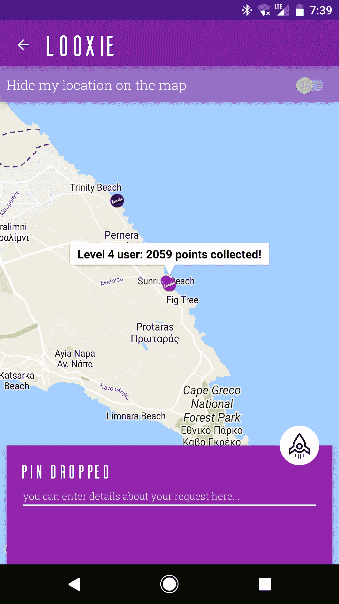
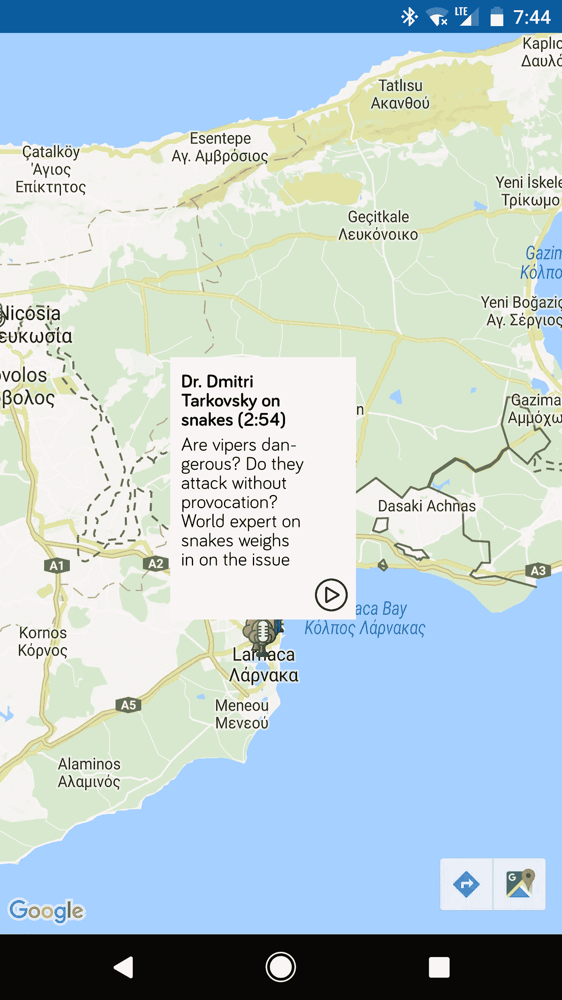

# 如何将复杂数据传递给 GoogleMap 上的自定义信息窗口

> 原文：<https://medium.com/hackernoon/how-to-pass-complex-data-to-custom-infowindows-on-a-googlemap-3a50d0df1be0>


Orb thingy and sky with clouds. Fuck yeah

## 最差。博客。贴吧。标题。永远不会。

妈的。你刚刚点击了一篇题为“如何将复杂数据传递到 GoogleMap 上的自定义信息窗口”的文章吗？我对你的求知欲印象深刻。

在 Android 上，当你点击 GoogleMap 对象上的一个标记时，就会弹出一个信息窗口。InfoWindow 包含(不出所料)信息，这些信息通常与放置标记的位置相关。这是默认信息窗口的样子(截图来自我的应用， [Looxie](https://play.google.com/store/apps/details?id=com.saladdressing.looksie)



看到那个“四级用户:收集 2059 积分”的东西了吗？这就是默认信息窗口的外观。

有时候，那是行不通的。例如，您可能希望在信息窗口上放置一个图像。或者在上面设置一个自定义的字体，这样它就可以和你的应用程序的其他部分保持一致。例如，这是我在[我最新的实验应用](https://play.google.com/store/apps/details?id=com.codehousefive.disembody)中想要的信息窗口的样子



看到工作中的[甜甜圈字体](http://atipofoundry.com/fonts/bariol)了吗？可爱的“播放”按钮呢？这需要使用定制的信息窗口。自定义信息窗口并不是本文的重点(而是传递给信息窗口的信息),但是这里有一些步骤，供外行参考

*   首先，在本教程之后的[之前添加 Google Play 服务和 Google Maps SDK。您还必须获得一个 API 密钥。](https://developers.google.com/maps/documentation/android-api/start)
*   完成后，你需要在布局中添加一个<fragment>，并添加你想要的属性和粗体线条</fragment>

```
<fragment android:id=”@+id/map”    
 **android:name=”com.google.android.gms.maps.SupportMapFragment”**    android:layout_width=”match_parent” 
    android:layout_height=”match_parent” />
```

*   这将允许您在 Java 代码中将<fragment>转换为 **SupportMapFragment** ，如下所示</fragment>

```
SupportMapFragment mapFragment = (SupportMapFragment) getSupportFragmentManager() .findFragmentById(R.id.map);
```

*   最后，通过调用片段上的 getMapAsync()并传入当前活动上下文，在片段中显示地图

```
mapFragment.getMapAsync(this);
```

如果您的设置正常，您现在应该会在片段中看到一个 Google 地图。

要开始在 Google 地图上放置和操作标记，让托管地图的活动实现 **OnMapReadyCallback** 接口总是一个好主意。这将允许您(实际上是强迫您)在活动中实现一个名为 **onMapReady()** 的回调方法，该方法将在地图加载并准备就绪后立即执行。

```
public void onMapReady(GoogleMap map) {}
```

该方法向您传递一个 GoogleMap 实例，然后您可以使用它在地图上执行各种操作。

您现在可以通过执行以下操作在地图上放置一个标记(在 **onMapReady()** 中)

```
Marker marker = map.addMarker(new MarkerOptions().position(**latLng**) .icon(BitmapDescriptorFactory.fromResource(**iconResource**)) .title(**title**).snippet(**snippet**));
```

粗体变量分别是，

*   一个包含你的纬度和经度的对象
*   图标资源，如 R.drawable.my_icon
*   包含*标记标题*的字符串变量
*   另一个保存标记额外信息的字符串变量叫做*片段。* **记住这一条，很重要。**

这将在地图上放置一个带有默认信息窗口的标记。然而，众所周知

> 默认的信息窗口很难看。默认信息窗口正在运行。当默认的信息窗口出现在信息窗口学校时，它们会受到更酷、更个性化的信息窗口的欺负。你想让你的信息窗口被欺负吗，野蛮人？

这是从《当你在谷歌地图上放置标记时会发生什么》一书中直接引用的，所以闭嘴，跟着我做。

要创建自己的定制 InfoWindow，您需要创建自己的实现 **GoogleMap 的类。InfoWindowAdapter** 然后覆盖两个方法: **getInfoContents()** 和 **getInfoWindow()**

这两种方法的区别在于， **getInfoContents()** 提供了一个默认的“气泡”、阴影和指向标记的脱字符号(见上面我的第一个截图)，而 **getInfoWindow()** 没有提供*任何东西*，就像 1998 年家庭度假时你的那个吝啬叔叔，当你在游泳池边想要一个奇怪的冰淇淋，但他太便宜了，没有给你买。

[深呼吸]

当您覆盖 getInfoWindow()时，您通过膨胀一个 XML 布局来提供整个布局、背景和所有内容。下面是 InfoWindowAdapter 的一个实现

```
public class InfoWindowCustom implements GoogleMap.InfoWindowAdapter { Context context; 
    LayoutInflater inflater; public InfoWindowCustom(Context context) {
           this.context = context;
    } @Override    
    public View **getInfoContents(Marker marker)** {        
        return null;    
    } @Override
    public View **getInfoWindow(Marker marker)** { inflater = (LayoutInflater)
context.getSystemService(Context.LAYOUT_INFLATER_SERVICE);   // **R.layout.echo_info_window** is a layout in my 
   // **res/layout folder**. You can provide your own View v = inflater.inflate(*R.layout.echo_info_window*, null);   

    TextView title = (TextView) v.findViewById(R.id.info_window_title);     
  TextView subtitle = (TextView) v.findViewById(R.id.info_window_subtitle); title.setText(marker.getTitle());
    subtitle.setText(marker.getSnippet()); return v; }}
```

同时，回到显示地图的活动中的 **onMapReady()** 的神奇土地，您必须在地图上设置 InfoWindowAdapter 实现，就像这样

```
map.setInfoWindowAdapter(new InfoWindowCustom(this));
```

从现在开始，无论何时点击一个标记，所有的标记信息都将被漂亮地显示出来，被你的自定义信息窗口框住。

## 俄罗斯山上实现的承诺

但是等等！这不是我承诺的！我承诺的是将复杂数据传递给 InfoWindow 适配器的能力，现在这似乎有点困难，因为标记只能携带两部分数据:一个**标题**和一个**片段**。

当我第一次遇到这个问题时，我的解决方案是将我想要显示的所有内容连接到代码片段中，用换行符(" \n ")分隔代表不同数据的不同行。

然而，这意味着，如果我想对不同的数据片段采用不同的样式，我将不得不修改 Spannables 和 String 的长度。您曾经使用 Spannables 处理过串联的字符串数据吗？我有，而且我很确定撒旦的肛门侵犯是一个更令人兴奋的前景。

没有。我需要更简单的东西。然后突然我的眼睛亮了起来，我觉得自己就像是维尔纳·爱因斯坦发现了马克思主义。

为什么我不能简单地将对象的 JSON 表示传递给代码片段，然后在 InfoWindowAdapter 中检索该代码片段，并将其转换回对象呢？

事实证明我可以。我做到了。

假设您有一个名为 MarkerInfo 的类

```
public class MarkerInfo { private String title;
    private String subtitle;
    private String soundUrl;
    private int numberOfPlays; public MarkerInfo() { } // getters and setters omitted because I'm not writing this in
   // an IDE. But assume that they are there}
```

将该类的对象转换成 JSON 表示并转换回对象的一个超级简单的方法是使用像 [Gson](https://github.com/google/gson) 这样的库。

在将 MarkerInfo 对象导入到您的项目中之后，您只需这样做就可以将它转换成字符串(JSON)表示

```
MarkerInfo markerInfo = new MarkerInfo();
markerInfo.setTitle("Shit went down");
markerInfo.setSubtitle("In Hell's Kitchen");
markerInfo.setSoundUrl("https://www.luke.com/matthew/jessica/dumbass.mp3");
markerInfo.setNumberOfPlays(66);Gson gson = new Gson();
**String markerInfoString = gson.toJson(markerInfo);**
```

因此，当您在标记上设置 snippet 属性时，您可以将结果字符串传递给它，然后在您的自定义 InfoWindowAdapter 类中，您可以检索对象的字符串表示形式，并将其转换回对象。

```
Gson gson = new Gson();**MarkerInfo aMarkerInfo = gson.fromJson(marker.getSnippet(), MarkerInfo.class);**
```

现在，您可以单独访问任何对象字段，并在您认为合适的时候在视图上设置它。

很酷吧。当然，在使用正确的关键词在互联网上进行一些研究后，我发现在我“发现”之前，其他人已经使用过这个技巧，但是去他妈的那些家伙，因为他们不是我。