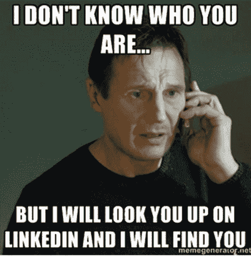
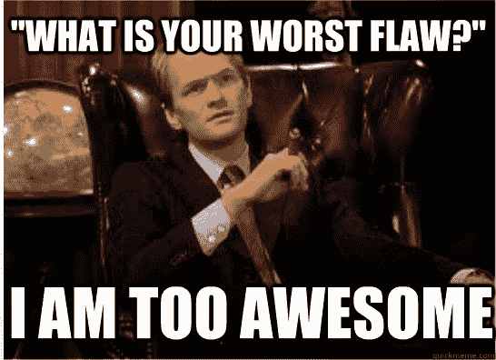

# 如何准备产品经理面试

> 原文：<https://medium.com/hackernoon/how-to-prepare-for-a-product-manager-interview-6204b1ba5d6d>

如果你正在读这篇文章，你可能想为下午的面试做准备。希望这篇文章能在这个过程中帮助你，或者至少给你指出正确的方向。

有很多关于什么是产品经理或者如何[成为一名优秀的产品经理(PM)](http://a16z.com/2012/06/15/good-product-managerbad-product-manager/) 或者作为 PM 阅读的[书籍的信息，有时还有](/@noah_weiss/50-articles-and-books-that-will-make-you-a-great-product-manager-aad5babee2f7#.qyoonx6zb)[如何面试一名 PM](https://www.kennorton.com/essays/productmanager.html) 。所有这些都很棒，也很必要，但是我们很少找到任何关于如何准备产品经理面试的材料，我觉得这也同样重要。

在指导一位极其聪明的企业家参加一家科技巨头的面试时，项目经理面试材料的缺乏变得很明显。

每个人对待面试都有不同的方式，但是这里我想分享一些关于我如何准备 PM 面试的信息。希望这将有助于所有未来的 PM 有志者。我也在寻找一些建设性的反馈来改进这个过程。

作为这个过程的一部分，我观察了以下步骤(没有特定的顺序)

Networking

## 建立工作关系网

在面试之前，看看你是否能直接与在你面试的公司做过产品经理的人交谈，或者至少在任何公司做过项目经理。

书是伟大的，但没有什么比从马嘴中获得信息更重要。他们可能不会在实际的面试问题上透露太多，但他们可以为项目经理角色提供真实世界的背景，这是你从书本上得不到的。

如果你没有直接认识的人，在 LinkedIn 上找找可能的关系，他们可以帮你联系上现任或前任项目经理。你曾就读的学校的校友名录可能是另一个资源。参加你所在城市的 PM [聚会](http://www.meetup.com/)。

在与一家公司的项目经理交谈后，你会对这个角色有更好的准备，并在面试结束时提出更好的问题。

Prep Tips

## 准备技巧

无论雇主是谁，所有项目经理角色都有相同的技能。他们需要考虑长远，同时牢记短期优先事项(战略)，需要做出数据驱动的决策(分析)，最后需要从客户角度出发(设计)，并对开发产品的技术有所了解(技术)。以下是我对准备这些技能的建议:

**1。产品设计:**项目经理热衷于创造最佳的客户体验。它始于顾客的同理心，或者说[从顾客的角度反过来](https://www.quora.com/Amazon-company/What-is-Amazons-approach-to-product-development-and-product-management)。项目经理需要对产品充满热情，关注最小的细节。为了验证这些技能，你可能会被问到这样的问题:

*   你最喜欢的产品是什么，你喜欢/不喜欢它的什么？
*   为盲人设计闹钟？
*   你会如何改善 [linkedin](https://www.linkedin.com/) 的登录流程？

准备以上问题有点辛苦和棘手。但是这个世界充斥着劣质产品。作为项目经理，我们需要对日常生活中遇到的每件产品都有敏锐的产品设计眼光。然后集体讨论解决方案和想法来改进它们。思考创造性的解决方案以及如何扩展它们。面试官在评估你的创造力，他们非常重视创新的想法。用独特的、令人信服的想法来激发他们。在白板上画线框将有助于说明你的想法。为了练习，下载一个线框[工具](https://hackernoon.com/tagged/tool)，比如 [Balsamiq](https://balsamiq.com/) 。也可以研究流行的 web 和[移动设计模式](http://pttrns.com/)来获得灵感。

**2。战略/商业敏锐度:**项目经理也是商业领袖。他们需要熟悉业务问题，因为他们需要了解如何将他们的产品或客户获取概念货币化。项目经理不一定要有商业经验或正规的商业培训。然而，他们确实希望你能迅速掌握商业直觉或判断，以及定价曲线等基本概念。他们还需要你“胸怀大志”。面试问题示例包括:

*   如果你负责微软手机，你会怎么做？
*   脸书购买了 Oculus rift $2B+,尽管该产品已经推出？你认为他们为什么这么做？

使用一个框架来组织你的战略讨论。如果你不熟悉战略或框架，[波特的五种力量](https://en.wikipedia.org/wiki/Porter_five_forces_analysis)以及[的 4Ps](https://www.mindtools.com/pages/article/newSTR_94.htm) 和[的 SWOT 分析](https://en.wikipedia.org/wiki/SWOT_analysis)是一个很好的开始。

**3。技术技能:**项目经理与产品开发团队紧密合作，因此应该与他们建立信任。为了有效地与团队合作，项目经理必须有能力影响工程师并建立他们的信任。示例问题包括:

*   你将如何设计和开发一个拼写校正器？
*   当你在浏览器中输入 google.com 时会发生什么？
*   写个算法检测会议冲突？

不太可能要求你用完美的编程语法写一个程序，或者优化一个 O(n)复杂度的问题，或者解决一个 NP 完全问题。你需要对技术概念有足够的掌握，这样你才能参与技术讨论并帮助进行技术权衡。我建议复习一下计算机科学基础知识，练习几个编码问题。我最喜欢的一个资源是 [*软件工程面试如何 Ace*](http://interviewsteps.com/products/how-to-ace-the-software-engineering-interview)。还要准备好描述关键技术，包括搜索引擎、机器学习或大规模设计系统。

**4。分析:**所有好的项目管理都需要数据驱动。他们需要定义产品的成功标准。一旦产品发布，需要解释结果(也称为 A/B 测试号)并对产品进行进一步的迭代。现在要评估这些技能，面试官可以问以下问题:

*   你将如何为 Amazon.com 推出一个商店/品类？
*   你会如何推出谷歌无人驾驶汽车？
*   脸书每年在广告上赚多少钱？

精通产品发布[指标](http://a16z.com/2015/09/23/16-more-metrics/)和 [A/B 测试](https://www.optimizely.com/ab-testing/)，包括结果的解释。还要准备[估算基础题](http://www.caseinterview.com/estimation-question-tips)。

刘易斯·林(impact interview 的创始人，该领域的权威人士)为准备下午的面试制定了一份精彩的两周计划，涵盖了上述所有话题。请提前预定:【http://bit.ly/PMPrepPlan 

Practice

## 实践

准备任何面试就像准备任何比赛(或考试)。就像运动员谈论进入状态一样，你也需要进入状态。你可以通过做一些模拟面试来实现。如果你刚开始工作，对项目经理这个职位没有太多的背景知识，这可能会很难。然而，如上所述，与其他项目经理谈论他们如何面试候选人以及他们对理想的项目经理候选人的期待肯定会有所帮助。除了谷歌，Glassdoor 和 Quora 是获取 PM 面试问题样本的很好来源。

然后准备一些你认为你可能会得到的问题的卡片，让别人采访你。如果可能的话，我建议至少在模拟现场面试的情况下做一些准备——在白板上，在时间压力下，最好有一个知己来问问题。

以上所有内容将帮助你明确你的答案，并帮助你创造一个强有力的故事/品牌。

## 更多阅读/参考材料

**书籍**

*   [破解 PM 面试](http://www.amazon.com/Cracking-PM-Interview-Product-Technology/dp/0984782818)
*   [解码并征服](http://www.amazon.com/Decode-Conquer-Answers-Management-Interviews/dp/0615930417)
*   [超越噪音](http://www.amazon.com/Rise-Above-Noise-Marketing-Interview/dp/0615978428)
*   [面试数学](http://www.amazon.com/Interview-Math-Problems-Solutions-Questions/dp/0692361472)
*   [Thinkertoys](http://www.amazon.com/Thinkertoys-Handbook-Creative-Thinking-Techniques-Edition/dp/1580087736)
*   [Web UI 设计模式](http://bit.ly/1F4NvLt)
*   [移动 UI 设计模式](http://bit.ly/1F4NsPU)

**在线资源**

*   [刘易斯·林的课程](http://www.lewis-lin.com/courses/)
*   [破解 PM 访谈](https://www.youtube.com/watch?v=CshJxTcsgvo)(视频)
*   [如何在软件工程面试中胜出](http://j.mp/SWEngClass)(视频)
*   [Quora](https://www.quora.com/What-should-I-expect-in-a-product-manager-interview-at-Google-and-how-should-I-prepare)
*   [玻璃门](https://www.glassdoor.com/Interview/product-manager-interview-questions-SRCH_KO0,15.htm)

在推特上关注我

> [黑客中午](http://bit.ly/Hackernoon)是黑客如何开始他们的下午。我们是 [@AMI](http://bit.ly/atAMIatAMI) 家庭的一员。我们现在[接受投稿](http://bit.ly/hackernoonsubmission)并乐意[讨论广告&赞助](mailto:partners@amipublications.com)机会。
> 
> 如果你喜欢这个故事，我们推荐你阅读我们的[最新科技故事](http://bit.ly/hackernoonlatestt)和[趋势科技故事](https://hackernoon.com/trending)。直到下一次，不要把世界的现实想当然！

