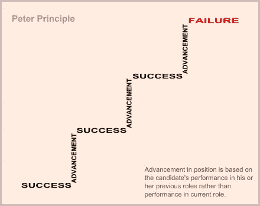

# 如何避免落入“下一个大项目”的陷阱

> 原文：<https://medium.com/hackernoon/how-to-prevent-falling-in-the-trap-of-the-next-big-project-618fe7cc4ce9>

## 临时原型何时成为永久解决方案的 3 个选项

A rule and a pencil on top of some papers representing an architectural design

团队被一夜之间到来的意想不到的[项目](https://hackernoon.com/tagged/project)轰炸。高管们决定为这个“大的新项目”雇佣更多的开发人员，期望不会有任何增长。上下文不允许支付技术债务。管理者以隐性(或显性)压力的形式将需求转化为对低质量软件的需求。各种各样的问题开始出现，你想知道发生了什么。

这个行业正在发生根本性的错误。

人们说维护和改进一个重要的软件是一种不同的技能组合，而不是一开始就构建它。并不是说那些能够维护和改进软件的人不能构建软件，他们可以。实际情况是，构建低质量的软件比构建正确的软件要容易得多(因此也更便宜)，而低质量软件的影响直到为时已晚才被察觉。出于这个原因，我们有一些公司(主要是初创公司)决定降低低质量软件的市场准入门槛，以便筹集以后“修复它”所需的资本。这是他们唯一可行的选择，因为他们中的大多数都缺钱，而且[的统计数据显示](https://s3.amazonaws.com/startupcompass-public/StartupGenomeReport2_Why_Startups_Fail_v2.pdf)他们很有可能永远见不到天日。

> 人们说维护和改进一个重要的软件可以被认为是一种不同的技能组合，而不是一开始就构建它

因此，该公司提出了下一个“新的大项目”，这只是他们想在野外测试的一个假设。他们决定去寻找一个“原型”。“原型”不是一个[“MVP”(最小可行产品)](https://en.wikipedia.org/wiki/Minimum_viable_product)或[“MLP”(最小可爱产品)](/the-happy-startup-school/beyond-mvp-10-steps-to-make-your-product-minimum-loveable-51800164ae0c)，它只是一个带有垃圾实现的门面，一旦业务可行性被证明，它将被丢弃并被正确地重建。

当它上线时，它获得了一些牵引力，但后来有人意识到，如果添加“这个小东西”可能会更好，所以他们将它添加到原型之上进行测试。然后，他们发现如果他们添加“这另一个小东西”,它可能会有更大的吸引力，所以他们在原型的顶部实现它以再次测试它。

一天结束时，有数百个“小东西”堆积在原型的顶部，现在它已经成为一个庞然大物，太昂贵了，不能扔掉和重建。剩下的唯一选择是做增量改进。问题是，在这个阶段，即使公司雇佣了更有经验的开发人员，也很难进行增量改进。最初的开发人员从来没有想到这种混乱的“原型”必须得到维护，每个人都为了“原型”的承诺而做了与维护它完全相反的事情，即使他们试图做对，他们仍然会努力，因为他们被雇佣来使它工作而不是使它正确。

> 一个成功的原型往往会成为最终产品，而不是在达到其目的后重新构建

这种心态似乎大多发生在[软件开发](https://hackernoon.com/tagged/software-development)身上。

你能想象如果福特决定生产 1000 辆未完成的原型车，然后经过几次调整后，他们允许相同的产品销售给客户而不制造新的，会发生什么？一堆贴满创可贴的汽车，拿街上每个人的安全冒险，包括他们的乘客？也许一个软件原型没有可能直接杀死任何人([和](https://8thlight.com/blog/uncle-bob/2012/04/18/After-The-Disaster.html))，但是如果我们称之为原型，那么我们至少应该这样对待它！

所以公司有了这个“原型”,它成为了最终的东西，任何人都无能为力。这是一个变得很难维护的怪物，唯一知道它如何工作的人是建造它的人。然而，公司倾向于根据他们在成功产品构建中的表现，而不是根据他们在新角色中的表现，提升他们到他们不擅长的角色，而不是让构建它的最好的开发人员来帮助增量修复。

> 一家公司倾向于根据开发人员在其他事情上的表现，鼓励他们去做他们不擅长的事情

通常对于一个有经验的软件开发人员[来说，晋升的唯一途径是管理层](https://www.ctl.io/developers/blog/post/career-path-of-a-programmer/)。这是一个开发人员在一个成功的项目后往往会被提升的地方，他们往往会一直被提升，直到他们到达一个他们严重缺乏技能或根本不感兴趣的角色。我们知道，自 1969 年以来，组织倾向于提升不称职的个人，但我们却一次又一次地犯同样的错误。

An image entitled "Peter Principle". It shows "success" and "advancement" forming a ladder with "success" at the bottom of each step and "advancement" vertically in between. At the top, the bottom of the last step reads "failure" in a highlighted form. The text on the bottom right corner says: "Advancement in position is based on the candidate's performance in his or her previous roles rather than performance in current role".

最后，那些参与构建“成功项目”的人将离开去担任新的角色，而新员工将被赋予修复项目中已经超出比例的遗留错误的任务。

直到有一天公司想出了这个下一个“新的大项目”。

这是痛苦的恶性循环。公司雇佣员工来建造东西，然后雇佣员工来修理。一些公司意识到了这一点，并有意识地这样做，他们雇佣廉价的开发人员来启动一个项目，然后雇佣更有经验的开发人员来纠正他们的错误。你认为这是合法的策略吗？

> 有些项目是在“先租后建”和“先租后修”的假设下构建的

这导致了一种趋势，有经验的开发人员离开这个行业，因为他们厌倦了修复别人的错误。别人处理不了[生气](https://hackernoon.com/the-angry-programmer-52a93bfcbc3c)。那些留下来的人最终接受了改正错误永远是他们工作的一部分，希望有一天事情会改变。

这是业内非常众所周知的问题。有许多[技术](/@fagnerbrack/the-trick-to-write-better-software-lies-on-the-technique-944015f84ce4)，无论是为开发还是为团队，都旨在解决那些问题。然而，并不是每个人都知道这一点，也不是所有的团队都可以有效地应用它。那些知道的人很贵，属于“雇来修理”一类，因为有些公司只买得起“雇来建造”的。

现在最重要的问题是:**我们能做些什么？**

在没有足够资源的情况下创建原型时，我可以想到 3 个潜在的选择。

第一种是将 [**创建成易于删除**](http://programmingisterrible.com/post/139222674273/write-code-that-is-easy-to-delete-not-easy-to) 的代码。你不需要知道所有的事情，只需要确保系统是由可以很容易删除的小部分组成的。原型可能会也可能不会成为最终产品，但如果我们以一种可以轻松删除和重写的方式构建系统的各个部分，而不是重写整个系统，那么我们将能够以一种简单的方式逐步修复它，而不是受限于当它还只是一个“原型”时已经做出的决策。

第二是不要在投机的基础上建造任何东西。这与[接受并理解过度设计的陷阱](https://hackernoon.com/how-to-accept-over-engineering-for-what-it-really-is-6fca9a919263)密切相关。作为开发人员，我们有一种强烈的欲望，那就是尽我们所能构建最好的东西，并尝试考虑每一个可能的条件，但是大多数时候，这只会增加特性的复杂性，而这些特性在“原型”的上下文中没有真正的价值。如果有可能其他开发人员不得不在汽车运行时更换车轮，让我们有一些同理心，不要强迫他们担心那些并不重要的功能或代码。

第三个是**不断学习，不要害怕寻求帮助。**这与持续改进密切相关。结对编程是一个很好的帮助，但是很多人鄙视它，因为[他们做错了](https://hackernoon.com/how-to-do-pair-programming-wrong-dab72fd15bef)。寻求帮助将使我们有可能在一个项目中做到最好(因为[完美的解决方案并不存在](https://hackernoon.com/how-to-destroy-the-myth-of-the-proper-solution-94ca958def1f))。在个人层面上，持续的学习将允许我们成长，最终我们能够减少“被雇佣来修复”的开发人员的数量，这样我们都可以在我们之前的巨人的伟大工作之上“被雇佣来构建”。

> 如果我们没有很多资源，并且知道一个原型有可能成为最终产品，那么创建易于删除的代码，而不是为了猜测而构建，以及保持学习是可以记住的三件事

构建原型并将其转化为最终解决方案的趋势似乎不会很快消失。公司将利用这一点，雇佣开发人员来构建产品，然后雇佣开发人员来修复它。之后由于彼得原理的影响，原来的开发者会倾向于被提拔到管理层，不再做自己真正擅长的事情。

这个行业肯定在发生一些事情，希望我们能为此做些什么。

感谢阅读。如果您有任何反馈，请通过 [Twitter](https://twitter.com/FagnerBrack) 、[脸书](https://www.facebook.com/fagner.brack)或 [Github](http://github.com/FagnerMartinsBrack) 联系我。