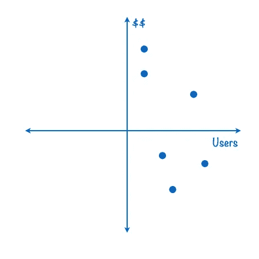
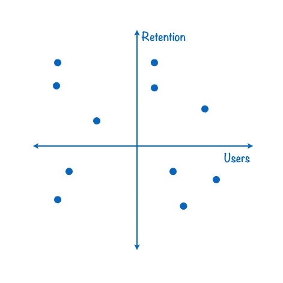
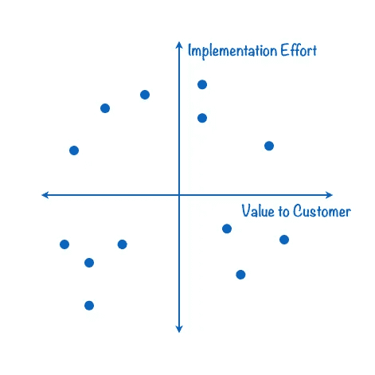

# 对复杂产品积压进行优先排序的策略

> 原文：<https://medium.com/hackernoon/how-to-prioritize-product-requirements-77d139b4a343>

[产品](https://hackernoon.com/tagged/product)经理们已经想出了无数种方法来对项目进行优先排序并做出产品开发决策——所有这些方法的目标都是创建一个规划良好的产品[路线图](https://hackernoon.com/10-terms-every-engineer-must-know-cd71e828f4ad)。团队给功能分配权重，把便签贴在墙上并四处移动，按商业主题划分列表。

相当多的现代团队花大量时间倾听他们的客户和市场，但不足为奇的是，相当多的团队只是假设功能 A 一定比功能 b 更重要。显而易见，您可以收集的数据越多，就越容易确定团队应该关注什么，以及何时关注。

在经历了一些业余战术后，我终于学会了一些非常有效的策略。他们:
1。都是直观简单的
2。让人们参与并讨论
3。让拒绝某些要求变得容易

# 开始

走到白板前，画一个 x 轴和一个 y 轴。在这个最简单的图表上，绘制出[待办事项](https://hackernoon.com/tagged/backlog)中的项目，如下所述。

# 1.什么是重要的，什么是紧急的

需求来自许多来源:市场、客户、业务、工程等等。你想在第一个的*上工作的东西，是顶部和右边。*

# 2.与业务目标保持一致

如果你的组织有明确的优先级，使用它们。此时，公司的目标是以当前的增长速度赚更多的钱，还是牺牲收入和增加市场份额？

# 3.产品工作正常吗？

如果产品保持得很好，就专注于增长。如果没有，立即瞄准保留功能，并且*避免*为增长而发展。

# 4.寻找容易的胜利

基础设施的改进和重构是任何工程工作的必要部分。然而，如果没有明显的改进，就不要走得太远。Cherry 不时地从右下角挑选项目进行工作，并把东西放在用户面前让他们高兴。它可能小到在一个无聊的按钮上放入一些漂亮的 CSS 动画。

这只是一个开始——您可以将类似的策略应用到许多需要优先排序的任务中，尤其是当您时间紧迫或资源有限时。实际上，我创建了一个图表来决定在我的第一次筹资期间与谁一起度过，并使用另一个图表来决定几个不同的项目。

感谢 [Des Traynor](https://twitter.com/destraynor) 👊。

> [黑客中午](http://bit.ly/Hackernoon)是黑客如何开始他们的下午。我们是 [@AMI](http://bit.ly/atAMIatAMI) 家庭的一员。我们现在[接受投稿](http://bit.ly/hackernoonsubmission)，并乐意[讨论广告&赞助](mailto:partners@amipublications.com)机会。
> 
> 如果你喜欢这个故事，我们推荐你阅读我们的[最新科技故事](http://bit.ly/hackernoonlatestt)和[趋势科技故事](https://hackernoon.com/trending)。直到下一次，不要把世界的现实想当然！

