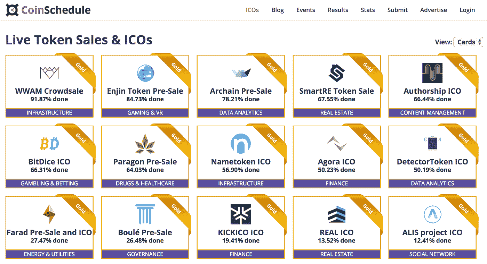
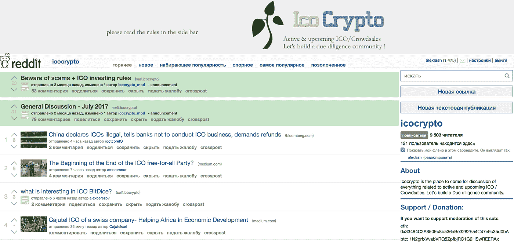

# 如何推广你的 ICO: 3 个有用的技巧

> 原文：<https://medium.com/hackernoon/how-to-promote-your-ico-3-useful-tips-f1364419fddd>

首次公开募股(简称 ICO)是一种吸引投资的工具，越来越受企业欢迎。ICO 市场正在积极发展；根据 Coindesk 的[6 月报告，截至 2017 年夏初，区块链项目在 ICO 的帮助下吸引了 3.27 亿美元，超过了风险投资者的投资额(同期为 2.95 亿美元)。](https://www.coindesk.com/ico-investments-pass-vc-funding-in-blockchain-market-first/)

然而，许多国家的当局还没有确定他们对这个元素的态度，一些主要的州已经开始[禁止 ICO](https://www.coindesk.com/chinas-ico-ban-understandable-reasonable-probably-temporary/) 。所有这些都意味着那些正在考虑实现 ICO 的人最好不要推迟令牌的发布。我们将告诉你如何通过内容营销的方式吸引人们对这一过程的注意。

# **第一步:在流行的 ICO 日历上发布公告**

所有 ICO 组织者要做的第一步是在特殊的日历网站上发布关于即将发布的令牌的信息。您可以在许多资源中发布 ICO 计划表，并进行搜索。此外，如果你使用一种流行的区块链技术(比如以太坊)来进行 ICO，你应该谷歌一下那些标记了在其上运行的项目的日历。

以下是这些 ICO 日历的简短列表:

*   [Coinschedule.com](https://www.coinschedule.com/)
*   [CoinGecko.com](https://www.coingecko.com/ico?locale=en)
*   [赛博基金](https://cyber.fund/radar)
*   [ICOCrowd.com](http://icocrowd.com/calendar/)
*   [ICOCountdown.com](https://www.icocountdown.com/)
*   [ICO-List.com](https://www.ico-list.com/)
*   [Tokenmarket.net](https://tokenmarket.net/ico-calendar)
*   [TokenSaleCalendar.com](http://www.tokensalecalendar.com/)

例如，这是一个流行的 Coinschedule 网站上当前 ICO 计划的外观:

如果你看一下其他流行的日历，你会发现许多项目都尽可能地把关于他们自己的信息放在任何地方。这是一个正确的方法，因为记者和科技博客经常根据日历数据创建他们自己的“投资者即将到来的 ICO 前 N 名”列表(这里是此类文章的一个例子[)。](http://itsblockchain.com/2017/08/24/top-5-upcoming-icos-to-invest-in/)

# **兴趣查询:专业社区出版物**

ICO 日历很棒，但是关于这些资源的出版物不能向观众提供即时反馈，也不能帮助解释这个项目对人们来说有多有趣。因此，ICO 推广合乎逻辑的第二步应该是在社交网络和社区发布公告和链接。

*Reddit 上关于 ICO 的帖子示例*

没有必要参与无意识的垃圾邮件，更有效的方法是在主题社区中发布。

以下是几个例子:

*   **专业论坛。最著名的是 Bitcointalk，几乎所有的 ICO 项目都在这里运行。**
*   **主题子主题:**[/r/eth trader/](https://www.reddit.com/r/ethtrader/)(~ 84 000 个订阅者)、 [/r/icocrypto](https://www.reddit.com/r/icocrypto/) (~ 9 500 个订阅者)、 [/r/bancor/](https://www.reddit.com/r/Bancor/) (~ 2 600 个读者)等。
*   **Quora 讨论:**这里有很多关于[不同 ico](https://www.quora.com/topic/Initial-Coin-Offerings-ICO)，特定[加密货币](https://www.quora.com/topic/Cryptocurrencies)和[区块链](https://www.quora.com/topic/Ethereum-blockchain-app-platform)的讨论，你可以积极参与其中。
*   **LinkedIn 职业组**:有很多组，适合任何口味，有上千个玩家，这里就列举几个:[一个](https://www.linkedin.com/groups/6580131/profile)、[两个](https://www.linkedin.com/groups/4458579/profile)、[三个](https://www.linkedin.com/groups/3763996/profile)、[四个](https://www.linkedin.com/groups/5190684/profile)、[五个](https://www.linkedin.com/groups/3748522/profile)。
*   **脸书集团**:ICO、加密货币和区块链的问题也在脸书讨论，(例如 [ICO、资金、天使、种子、投资者、初创公司](https://www.facebook.com/groups/FASIS.GROUP/?fref=ts))。

在许多列出的团体和社区中，都有应该遵守的规则。但是这些资源覆盖了几十万人，这就打开了行动的大门(包括游击营销)。

# **终点线:原生广告、一般话题媒体和博客**

在公告发布在日历网站、主题论坛和社交网络上之后，是时候与网络媒体合作了。有几种不同的选择。首先，你需要一个博客来发布新闻、新闻稿和你业务的细节。通常，选择中型平台用于此目的。

一方面，向媒体发送新闻稿并不是一个坏主意。另一方面，新区块链创业公司和 ICO 的数量正以如此快的速度增长，以至于根据我们的经验，你不应该指望有关于这些资源的免费出版物(或者它会发生得如此之晚，以至于 ICO 有可能在那时已经完成)。

因此，如果您正在与媒体就加密货币话题进行合作，您也应该制定一份内容推广预算。在受欢迎的外国媒体上，价格可以高达数万美元。例如，我们客户的一个项目的编辑委员会需要 15 000 美元来写一篇关于 ICO 的文章。这是原生广告的主要缺点之一。

鉴于这一事实，以及区块链不仅使用加密初创公司，还使用更熟悉的商业领域的项目(例如[数字广告](https://ico.snov.io/)和[食品零售](https://ambrosus.com/))的事实，在许多情况下，加密货币领域的在线媒体推广成本被证明是毫无意义的。相反，可以在相关的在线媒体上写专栏，包括那些关于在线业务的——尤其是后者对这个话题非常感兴趣，可能不仅接受文章，也接受专家的评论。

# **结论:你需要尝试一切**

对你推广 ICO 的方式的分析——从在日历和社交网络上发布公告到媒体和博客——表明受欢迎的 ICO 团队使用所有的方式。这需要很大的努力，所以你应该提前计划促销活动:至少需要 2-3 个月的时间来准备公告、社交网络的图片、媒体和博客的专栏和评论。

如果你不把它放在等待名单上，并且按时开始准备，内容营销可以成为推广 ICO 的一个好工具。