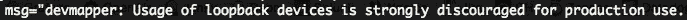
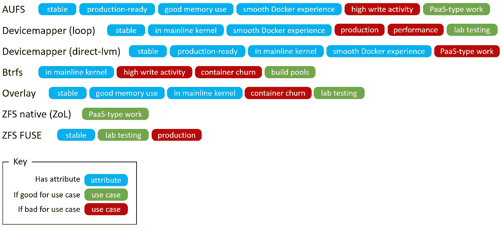

# 如何正确运行 RHEL 和朋友的 Docker

> 原文：<https://medium.com/hackernoon/how-to-properly-run-docker-on-rhel-and-friends-d055754414e5>

**TL；dr 使用 lvm-direct 存储驱动程序。lvm-loopback 用于原型制作，不可扩展**

在阅读了[the ftguy 的](https://thehftguy.com/)关于他有多爱 docker 的搞笑帖子后，我有了写这篇文章的灵感。

在$day_job，我们在一些 jenkins slaves 上使用 docker 来构建 rpm，并支持利用 docker 的应用程序的测试执行。很自然，这是一个开发环境，所以我们不讨论在生产中运行 docker 或任何疯狂的事情。但是当詹金斯·乔布斯挂着，挂着，挂着的时候，我们正在谈论拿着干草叉的开发者

大多数情况下，一切都很顺利。每隔几天，一个 docker 节点就会锁定，cpu 和负载平均值飙升，重新启动它，一切都会恢复正常。我们接受了一段时间。

当你在原木中潜水时，你会发现有趣的事情。

impending doom found in the docker daemon’s logs

等等，什么？你是说没有百胜安装 docker 那么容易？但我记得你说过通往牛奶和蜂蜜之地的路是用码头工人铺成的？嗯嗯:\

原来 docker 的储物有点搞笑。自己找找，这是储物手册…

[https://docs.docker.com/engine/userguide/storagedriver/selectadriver/](https://docs.docker.com/engine/userguide/storagedriver/selectadriver/)

它始于 AUFS，RedHat 的一些英雄写了设备映射器插件(谢谢！)，现在有了 overlay，overlay2，btrfs，zfs，各种各样的 FSS

[这里是](https://developers.redhat.com/blog/2014/09/30/overview-storage-scalability-docker/)一篇精彩的文章，解释了设备映射器驱动程序的历史和发展。

简而言之，rhel/centos 系统上的现成 docker 使用 lvm-loopback 存储驱动程序。它快速、简单，并且在小范围内有效。

如果您想在 docker(rhel/centos)上运行真实的工作负载，您必须使用 lvm-direct 驱动程序。lvm-direct 使用[自动精简配置](https://www.kernel.org/doc/Documentation/device-mapper/thin-provisioning.txt)，因此它不是普通的 lvm 设置任务。

下面是在新节点上设置 lvm-direct 驱动程序的简单快捷的方法:

1.  向节点添加一个额外的、未分区的、非文件系统的块设备，或者在配置节点时，保留一定百分比的 lvm 卷组空闲空间(请参见有用链接)。
2.  自从 RedHat 发布 docker 1.12 之后，运行 [docker-storage-setup](https://github.com/projectatomic/container-storage-setup) 服务。这将检测您的额外数据块设备/空闲 vg 空间，并自动配置精简池。
3.  就是这样。启动 docker 守护进程并进行验证。` docker info 2> /dev/null | grep loop `应该不返回任何内容。运行一个容器，看看会发生什么

自从切换到 lvm-direct 以来已经 27 天了，没有任何愤怒的“为什么我的码头工人工作悬着”暴民的迹象。

我想这里真正的信息是，你不能只是安装$new_hotness 并期望它工作。也许如果有人有 RTFM，我们就可以跳过这整个痛苦的一课。呸…

一些有用的链接:

*   [朋友不让朋友在生产回环上运行 Docker](http://www.projectatomic.io/blog/2015/06/notes-on-fedora-centos-and-docker-storage-drivers/)
*   [Docker 中存储可扩展性的全面概述](https://developers.redhat.com/blog/2014/09/30/overview-storage-scalability-docker/)
*   [配置 Docker 存储器](https://docs.openshift.org/latest/install_config/install/host_preparation.html#configuring-docker-storage)
*   [如何在卷组中留出空间](https://access.redhat.com/documentation/en-us/red_hat_enterprise_linux_atomic_host/7/html/managing_containers/managing_storage_with_docker_formatted_containers#how_to_leave_space_in_the_volume_group_backing_root_during_installation)
*   [Docker 和设备映射器存储驱动](https://docs.docker.com/engine/userguide/storagedriver/device-mapper-driver/)

> [黑客中午](http://bit.ly/Hackernoon)是黑客如何开始他们的下午。我们是阿妹家庭的一员。我们现在[接受投稿](http://bit.ly/hackernoonsubmission)并乐意[讨论广告&赞助](mailto:partners@amipublications.com)机会。
> 
> 如果你喜欢这个故事，我们推荐你阅读我们的[最新科技故事](http://bit.ly/hackernoonlatestt)和[趋势科技故事](https://hackernoon.com/trending)。直到下一次，不要把世界的现实想当然！

