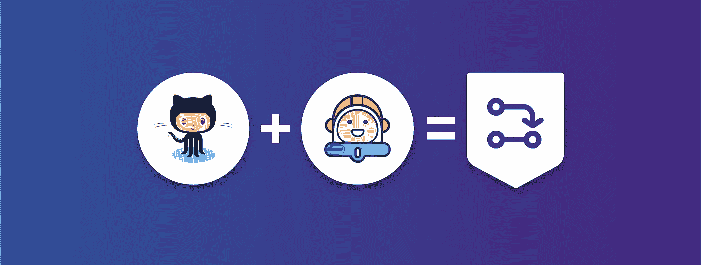

# 如何通过 Buddy 和 GitHub 状态检查来保护代码

> 原文：<https://medium.com/hackernoon/how-to-protect-code-with-buddy-and-github-status-checks-e4f918e3eee>

本文将解释如何在 Buddy 上运行 BuddyWorks 测试时，避免合并 [GitHub](https://hackernoon.com/tagged/github) 项目中的错误。

# 介绍

Git 及其分支似乎是历史上最好的发明(至少对开发人员来说)。向开发工作流中添加分支、gitflow 和 pull 请求是让您的[代码](https://hackernoon.com/tagged/code)质量更好的完美方式。

## **Gitflow 在实践中通常是这样的:**

1.  初级开发人员得到一个任务“扩展新功能”
2.  他/她添加一个新的分支并对特征进行编码
3.  一旦特性准备好了，开发人员就添加一个拉请求
4.  高级开发人员检查代码并分配回注释
5.  最终，特性分支被合并到主分支中，这个全新的特性就可以部署了

请记住，无论高级开发人员多么熟练，这种方法都不能保证代码没有错误。

**持续集成的主要原则是，在将代码合并到主分支之前，需要测试代码中的所有变更。**

# [这里](https://buddy.works/guides/how-protect-code-on-github-with-buddy?utm_source=medium&utm_medium=post&utm_campaign=how-to-protect-code-with-buddy-and-github-status-checks&utm_content=link) **看全篇**。****

> [黑客中午](http://bit.ly/Hackernoon)是黑客如何开始他们的下午。我们是阿妹家庭的一员。我们现在[接受投稿](http://bit.ly/hackernoonsubmission)并乐意[讨论广告&赞助](mailto:partners@amipublications.com)的机会。
> 
> 如果你喜欢这个故事，我们推荐你阅读我们的[最新科技故事](http://bit.ly/hackernoonlatestt)和[趋势科技故事](https://hackernoon.com/trending)。直到下一次，不要把世界的现实想当然！

