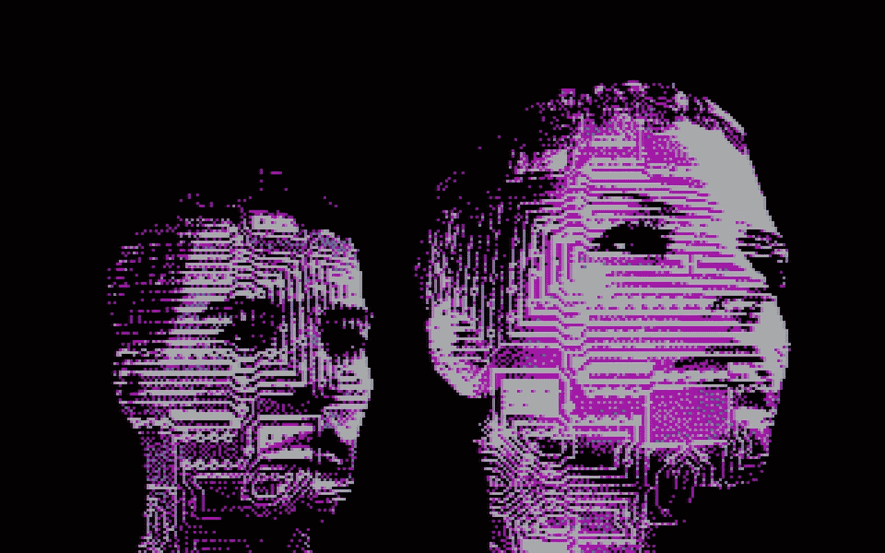
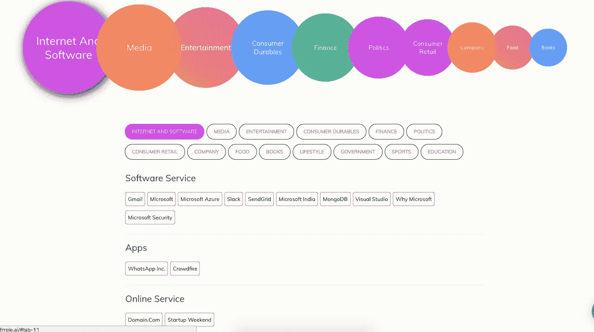

# 如何保护你的密码不被人工智能破解

> 原文：<https://medium.com/hackernoon/how-to-protect-your-password-from-artificial-intelligence-e66268bca4e0>

在我之前的故事[人工智能如何用于密码猜测](https://hackernoon.com/how-artificial-intelligence-can-be-used-for-password-guessing-cf4fd4184a46)中，我已经解释了 [AI](http://amzn.to/2xk1tLb) 如何胜过密码猜测工具。在这个故事中，我将讨论如何制作一个强密码，即人工智能证明。

***只是为了重申这个故事***

由于人类是可预测的，我们可以在泄露的密码中看到模式。黑客可以使用这些模式编写密码生成规则。稍后，执行字典攻击将有助于破解密码。[一组研究人员最近使用神经网络](https://arxiv.org/abs/1709.00440)找到这些模式并生成密码。因此使该过程完全自动化。它们胜过传统的密码猜测工具。

*那么我们如何做一个 AI 猜不到的密码呢？*

## **不要使用名、姓、兴趣等**

无论何时你使用社交媒体，你都会留下数字足迹。人工智能可以分析你的公开帖子，找到你的兴趣所在。如果你用了喜欢的名人或者你喜欢的汽车、自行车等的名字。很有可能你是脆弱的。

## **不要用常用短语做密码**

有些人使用圣经经文或常用短语作为他们的密码。这将是字典的一部分，很容易被破解。

## 避免讲密码

人们试图用数字或符号代替单词中的字母，以避免字典攻击(像 ***I10v3f0rd)*** )。但是神经网络可以通过研究泄露的字典生成这样的密码。

## 使用密码生成器/管理器

我建议使用 LastPass 这样的解决方案，它可以生成并存储你的密码。确保您使用双因素身份认证来访问此类解决方案。

## 编写一个秘密短语

我仍然建议使用密码生成器。但是，如果你想做一个可以记住的密码，那么就用这个技巧。用两句话写一件你一生中难忘的事(确保没人知道这件事)。

“2013 年很艰难。幸运的是，我得到了好朋友阿南德和纳雷什的支持。”

现在取每个单词的第一个字母，保持数字或符号不变。把它们结合起来。下面是密码 ***Ty2013whL，IwsbmgfAaN。***

## **检查您的密码强度**

使用密码强度检查器来确定您的密码有多强。确保你使用支持离线模式的工具，比如[我的密码](https://howsecureismypassword.net/)有多安全。

## **不同账户使用不同密码**

在多个账户上使用相同密码的问题是。如果一项服务遭到黑客攻击，密码被泄露。这也包括你的另一个账户。

## **使用双因素认证**

尽可能尝试使用双因素身份验证。所以即使你的密码被泄露，黑客也无法登录。虽然有人认为双因素是不安全的，但这仍然是我们的最佳选择。

[*关注骇客正午*](http://hackernoon.com) *和我(*[*Febin John James*](https://medium.com/u/75a616711f4e?source=post_page-----e66268bca4e0--------------------------------)*)了解更多故事。*