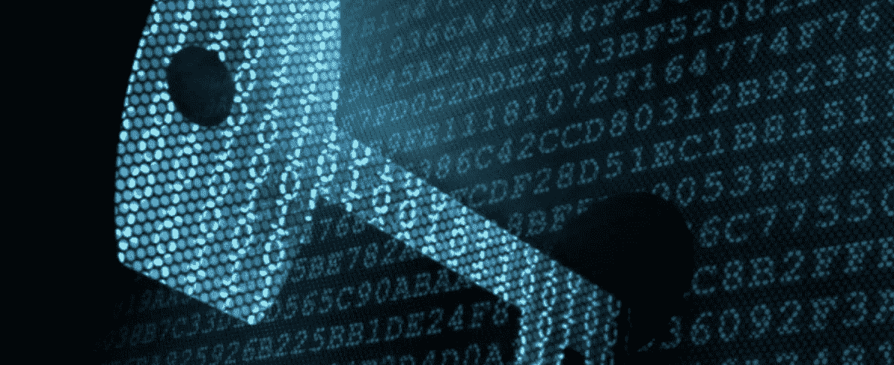
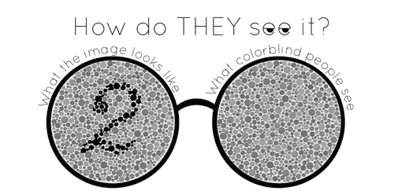
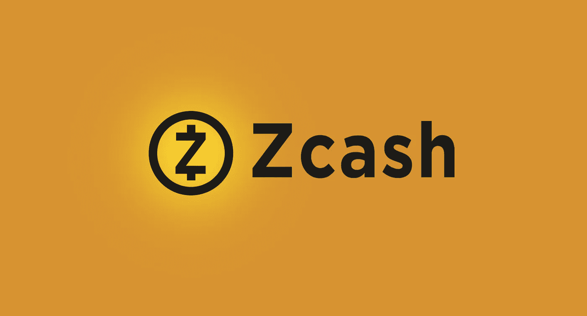
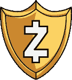
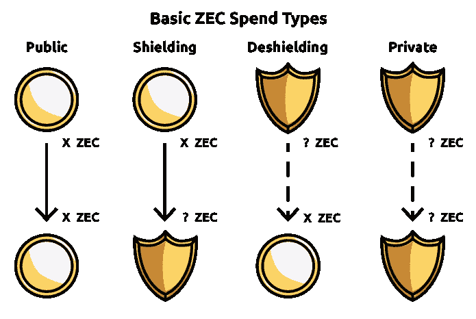

# 如何证明自己知道某件事，而不暴露出来？零知识证明，ZCash，以太坊。

> 原文：<https://medium.com/hackernoon/how-to-prove-that-you-know-something-without-revealing-it-zero-knowledge-proofs-zcash-ethereum-43ce35d4d1c5>

最近，一个新术语开始在 [Crypto](https://hackernoon.com/tagged/crypto) 社区中流传——零知识证明或 ZK-斯纳克。

Z 人工知识证明是一种方法或过程，其中一个人(证明者)可以向另一个人(验证者)证明某个给定的陈述是真实的，除了它实际上是真实的这一事实之外，不透露关于该陈述的任何附加信息。

## 我们举个例子。

我设法找到一个简单的例子来更好地理解一切。想象一个实验，我们有一个色盲的人不能分辨颜色。

我们有两个不同颜色的球。

你知道那些球是不同的颜色，然而，对于色盲的人来说，它们看起来是一样的。问题是，你如何向他证明，这些球实际上是不同的，而不透露任何信息哪个是哪个，甚至不透露它们的实际颜色？

## 这就是零知识证明发挥作用的地方。

你做了一个实验:

色盲者把两个球都拿走，藏在背后。然后他给你看一个球，把它还回来，再给你看一次同一个球或第二个球。

每次你都要说他是否交换了球。从现在开始，他每次秀球，都有 50%的概率把球掉包。

通过观察它们的颜色，你可以肯定地说他是否调换了它们。另一方面，如果它们是相同的颜色，因此无法区分，你不可能以高于 50%的概率猜对。

如果你多次重复这个证明，色盲的人应该相信球实际上是不同的颜色，否则，你就不能猜对那么多次。

**这是一个零知识证明的完美例子。**你从不透露哪个球是什么颜色，哪个球是哪个，但是色盲的人却深信这些球实际上是不同的颜色。

一个更技术性的例子是，给定一个随机数的散列，证明者不仅可以让验证者相信这个数存在，而且他们实际上知道这个散列的这个数——同样，不需要透露关于这个数的任何信息。

那么为什么每个人都在谈论这件事呢？它实际上可以应用于加密领域。

## ZCash

市值超过 8.4 亿美元的加密货币完全由零知识证明驱动。Zcash 是第一种开放的、无许可的加密货币，可以使用零知识加密技术充分保护交易隐私。

Zcash 由名为 **zk-SNARK 的零知识证明结构驱动。**

Zcash 使用 zk-SNARKs 来证明一个有效交易的条件已经得到满足，而没有透露任何有关所涉及的地址或值的关键信息。屏蔽交易的发送方构建一个证据，以高概率表明:

*   每个屏蔽传输的输入值与输出值相加。
*   发送者证明他们有输入票据的私人消费密钥，给予他们消费的权限。
*   输入票据的私人消费密钥在整个交易中被加密链接到签名，以这种方式，交易不能被不知道这些私人密钥的一方修改。

ZEC — is the currency and the possibilities of transfer is displayed on the image above

老实说，我以前没有深入分析过 Zcash，但现在从技术的角度来看，它似乎很迷人，同时从洗钱的角度来看，它也很可怕。与比特币相比，你可以追踪硬币的路线，一旦它到达某个交易所——尤里卡，大多数时候你会知道一些坏事背后的真实人物。有了 ZCash 你就再也没有那个能力了。

## 以太坊

T 最近的以太坊大都会(拜占庭)升级增加了 ZK-SNARKs——一个由 ZCash 团队开发的加密工具。验证算法的构建块以预编译智能合约的形式添加到以太坊中。

使用以太坊上的 zk-SNARKS，你可以实现从一个地址到另一个地址的令牌转移，而不会泄露交易的金额。康塞斯解释了它是如何工作的[在这里](https://media.consensys.net/introduction-to-zksnarks-with-examples-3283b554fc3b)。

在 DevCon3 中出现了 Open Vote Network，这是一个在以太坊平台上使用零知识证明进行匿名投票的系统。

## 还早

现在还为时尚早，以太坊上还没有太多使用零知识证明开发的应用程序，但它显示了以太坊区块链上隐私的巨大潜力。

## 边注

我有机会学习了半年密码学。尽管课程很有趣，但并不令人满意，因为那时我找不到真实世界的用例。而就在一年多前，我开始了解密码学在整个加密货币经济中的实际价值，因为一切都纯粹基于 it 和数学。

这些知识让我理解了 Zcash 等加密货币背后的真正价值。我强烈建议你深入钻研密码学及其机制，因为无论你的目标是什么，这些知识都会给你带来巨大的优势。

**最安全的**加密货币硬件**钱包**是[账本纳米](https://www.ledger.com/collections/all-products?r=397c335e147c)。它只为€59 的每个用户提供硬件安全。在这里了解更多****。****

****喜欢这篇文章吗？**请点击下面的**拍手**推荐给别人让我知道。**

**如果您想获得**更多关于区块链和智能合约的见解**，请点击关注！**