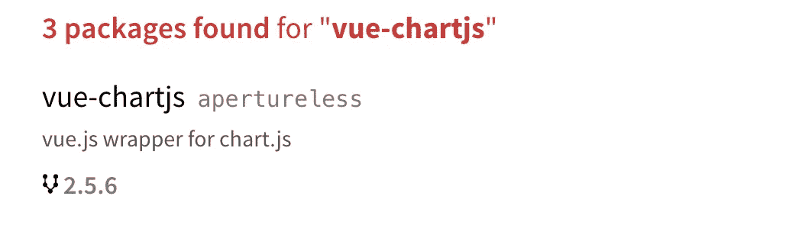
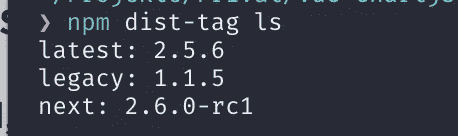

# 📦如何在 npm 上发布您的包

> 原文：<https://medium.com/hackernoon/how-to-publish-your-package-on-npm-7fc1f5aae600>


## 关于如何在 [npm](https://www.npmjs.com/) 上轻松发布模块的深入指导。

所以，你已经完成了一个 lib，cli 工具，组件或其他一些脚本，希望与世界分享。🌍所以是时候在 [npm](https://www.npmjs.com/) 上发布了。

## 🥇你的第一个包裹

让我们假设，您已经使用了 [npm](https://www.npmjs.com/) 作为您的依赖项。你用`npm install XYZ`安装了它们，或者你很酷😎用[纱](https://yarnpkg.com/lang/en/)

如果您现在想在 npm 上发布您的包，有一个简单的命令:

```
npm publish
```

🔥但是在我们这样做之前，我们仍然有一些要点📋清单。

## 📦Package.json

您知道所有的依赖项都保存在您的`package.json`中。此外，您还将关于您的包的相关信息保存在该文件中。你可以在这里找到它们

然而最重要的是

*   `name`
*   `version`
*   `description`
*   `author`
*   `license`
*   `repository`
*   `main`

字段定义了你的包在注册表中的名字，人们会用你定义的名字来安装你的包。`yarn add XYZ`。

标签定义了你的包的版本。你真的应该考虑使用 semver。因为可能很多人会用你的包。没有比破坏人们的生产代码更糟糕的感觉了，因为你引入了破坏性的改变，但是仅仅改变了你的包的补丁版本。🙈

在`description`字段中，您应该添加一个关于您的包裹的快速且准确的描述。如果人们在 npmjs.org 上搜索你的包裹，就会看到它



npm search shows title, username, version and description defined in your package.json

在`author`字段中添加您的姓名和电子邮件，这样人们就知道是谁发布了这个包。常见的是以`Name <e-mail>`的形式添加。

我猜`license`场是最被遗忘的场之一。人们经常认为这并不重要。然而，如果你想让人们使用你的软件包，也许甚至在更大的项目中，你肯定应该添加一个许可证。所以他们知道是否可以在商业项目中使用，有什么限制等等。

您还应该添加带有 github repo 链接的`repository`字段，您还可以添加带有 github 问题页面链接的`bugs`字段。因此人们可以报告错误并知道在哪里请求特性。

你也可以添加`keywords`，如果人们在 npmjs.org 上搜索什么，它可以帮助他们找到你的包裹

## 🗄属地

所以我们都知道你可以在你的项目中添加依赖项。或者用`yarn add`或`yarn add -D`保存为`devDependencies`

现在，如果你在一个项目上工作，比如一个应用程序或网站，如果你把你的依赖项添加为一个依赖项或 devDependency，这并不会有很大的不同。因为它们大部分时间都被捆绑在浏览器中。

然而，如果你想发布一个包，一个库，一个组件等等。让你的依赖关系正确是很重要的。

依赖关系是你的库工作所必需的。因此，如果你正在编写一个 API 或服务，并且你正在使用例如[请求](https://github.com/request/request)，这就是一个依赖。因为这是代码正常运行所必需的。

**DevDependencies** 是开发所需要的。比如林挺的`eslint`或`xo`或者测试的`karma`或`ava`。这很重要，因为如果有人在`yarn add my-awesome-lib`上安装你的包，那么`devDependencies`就不会被安装！因此，如果你添加`request`作为`devDependency`，而你的代码中有一个`import request from 'request'`，这将不起作用。因为缺少依赖性。

如果你为某个东西写一个插件，通常会用到**peer dependency**。因为它要求用户已经安装了依赖项。例如，你想为`webpack`写一个插件，你使用了`webpack`的一些功能并扩展了它们。如果你将`webpack`添加为一个依赖项，用户将会安装两个版本的`webpack`，一个是他在构建过程中已经安装的，另一个是你的插件附带的。

这是无稽之谈。你必须在每次发布新的`webpack`补丁时更新你的`package.json`，并更新依赖版本。你说，*嘿，你需要 webpack 来运行我的插件，所以请安装它。如果有人愿意安装`webpack 2.2.x`的话，你的插件也能正常工作。会有一个`peerDependency version mismatch`，但只要没有重大变化，它就会起作用。通过这种方式，用户可以自由选择版本和升级依赖项。*

## 🚪入口点

现在有趣的部分来了。你的库/包的入口点。这个**很大程度上**取决于你的包或者库的类型。是节点模块吗？是浏览器插件吗？

基本入口点将在`main`字段上定义。在那里你可以添加你的例如`index.js`。如果你传输或者捆绑你的源码，你可以在那里定义 dist 文件。

```
"main": "dist/my-awesome-lib.js",
```

如果你发布节点模块，你会很满意这个。

但是如果你要为浏览器发布一些东西，有更多的领域需要了解。

例如`unpkg`字段。如果你在 npm 上发布你的 lib，它将在 [unpkg](https://unpkg.com/#/) 上可用。这是一个 CDN，所以人们可以把你的脚本放到他们的脚本中，而不用通过 npm 安装。

```
[https://unpkg.com/package@version/file](https://unpkg.com/package@version/file)
```

在`unpkg`字段中，您可以定义默认文件，如果某人包含`[https://unpkg.com/package](https://unpkg.com/package.)` [，则提供该文件。](https://unpkg.com/package.)

大多数时候，在那里定义你的库的缩小版本是一个好的实践。

```
"unpkg": "dist/my-awesome-lib.min.js",
```

最后但同样重要的是，还有两个字段。

`module`和`jsnext:main`字段。它被像 Webpack 2 这样的现代构建系统用来获取 ES6 模块。

所以你已经建立了你的库。大多用现代 ES6。人们希望直接在浏览器中使用它。所以你需要把它转走。但是因为你也有依赖关系，你需要把依赖关系捆绑到它里面。所以你生成了一个`UMD`模块。

但是有些人可能想把你的包和 browserify 和 gulp 一起用。或者使用 webpack 1。所以你需要一个 transpiled 和捆绑的`CommonJs`版本。然而，我们现在已经 2017 年了，像摇树这样的事情现在很流行。为此，你需要一个额外的构建。ES 模块构建。其中除了导入和导出语句，大多数函数和语句都被传输到 ES2015 中。

我想现在，只有 [Rollup](https://rollupjs.org/) 支持 ES 模块作为目标输出。(但是你也可以用 babel 来传输)所以如果你有一个 ES 模块，你可以在`module`和/或`jsnext:main`字段中设置条目。

这样，您可以为不同的人和环境提供不同的构建。

## ⛓兼容性

对于节点模块最重要的是，您可以定义应该安装哪个最低版本的 nodejs 来运行您的模块。举例来说，如果你在使用`async / await`的时候没有把它转换下来，这是很重要的。

```
"engines": {
    "node": ">=7.8.0"
  },
```

## 🚫忽略和✅文件

好了，现在我们已经定义了不同的包和构建，我们几乎准备好发布我们的包了。然而，您的 git 存储库中可能有一个日志。来源，可能是资产、捆绑文件等。将所有这些都包含在你的 npm 包中是不明智的。保持较小的大小是一个好习惯。

首先，您不希望您生成的文件出现在您的 git repo 中。所以你在你的`.gitignore`中忽略它们

还可以加一个[。npmignore](https://docs.npmjs.com/misc/developers#keeping-files-out-of-your-package) 。

如果你没有创建一个`.npmignore`但是你有一个`.gitignore` npm 将会排除所有在`.gitignore`中定义的文件

因此，我们忽略了`.gitignore`中的`dist`文件夹，因为我们不希望它出现在我们的回购中。现在我们需要告诉 npm，我们希望包含这些文件。

所以我们在我们的`package.json`中添加了一个`files`数组。

```
"files": [
    "dist"
  ],
```

您也可以更明确地只添加文件

```
"files": [
    "dist/my-awesome-lib.js",
    "dist/my-awesome-lib.min.js",
    "dist/my-awesome-lib.esm.js"
  ],
```

## 💯出版

现在我们准备发布我们的包。但是因为我们是开发人员，而开发人员很懒，所以我们应该在脚本中添加一个额外的命令。`prepublish`命令脚本。

这个运行，在每个`npm publish`之前。因此，好的做法是清理 node_modules 并重新安装依赖项，lint 并测试代码，然后在发布之前构建代码。但这取决于你！👇🏻

```
"scripts": {
    "prepublish": "yarn run lint && yarn run test && yarn run build"
  },
```

最后我们跑`npm publish`。请记住，您需要一个 npmjs.org 账户；)

## 🏷距离标签

最后一个主题非常方便！距离标签。如果您发布您的包，它将自动获得您发布的版本的 **@latest** 标签。

人们可以给你的包安装一个严格版或者最新的标签:`yarn add my-awesome-package@0.0.1`或者`yarn add my-awesome-package`，相当于`my-awesome-package@latest`

现在有一些情况下，你将需要距离标签。一个是如果你支持你的包的多个版本。webpack、vue 等等就是很好的例子。从第一版开始，然后是第二版。

假设您的软件包是 1.10.0 版，但是您正在开发 2.0.0 版，并且希望人们测试它并报告问题等等。

问题是，如果你简单地`npm publish`它，它会得到最新的标签。所以每个通过`npm install my-lib`安装它的人都会得到不稳定的 v2.0.0，这不是我们想要的。为此，我们有标签。您可以使用`npm dist-tag ls`列出您的标签，您将获得分配给它们的标签和软件包版本列表。



所以现在您可以向发布命令添加标签了。

```
npm publish --tag beta
```

这样，当前版本 2.0.0 将被标记为测试版。并且`@latest`标签保留在 1.10.0 版上

现在你可以把它安装在`npm install my-awesome-lib@beta -D`上了

🔥**知道一个标签只能分配一个版本是很重要的。您不能覆盖对版本的更改。**

这对于测试来说非常重要。我艰难地认识到，仅仅因为你的代码在本地工作并且通过了单元测试，并不意味着发布在 npm 上的捆绑文件会像你想的那样工作。

这就是为什么在使用`@latest`标签发布之前测试你的包是好的。为此，您可以使用优秀的旧版本候选。因为如果你把你的包的版本从 2.0.0 换成 2.0.1，用`beta`标签发布，然后你看到里面还是有 bug，你需要用 2.0.2 发布下一个。您不能对 2.0.1 版本进行更改，并发布带有最新标签的相同版本。

这就是为什么*发布候选版本*或 *beta* 后缀会派上用场。

您只需将您的`package.json`中的版本设置为 2.0.0-rc1，并使用 beta 标签发布它。然后，您可以测试它，只将 rc1 提升到 rc2 等。如果你认为你准备好了，你可以把它发布为 2.0.0 ⭐

[](http://bit.ly/HackernoonFB)[](https://goo.gl/k7XYbx)[](https://goo.gl/4ofytp)

> [黑客中午](http://bit.ly/Hackernoon)是黑客如何开始他们的下午。我们是 [@AMI](http://bit.ly/atAMIatAMI) 家庭的一员。我们现在[接受投稿](http://bit.ly/hackernoonsubmission)并乐意[讨论广告&赞助](mailto:partners@amipublications.com)机会。
> 
> 如果你喜欢这个故事，我们推荐你阅读我们的[最新科技故事](http://bit.ly/hackernoonlatestt)和[趋势科技故事](https://hackernoon.com/trending)。直到下一次，不要把世界的现实想当然！

