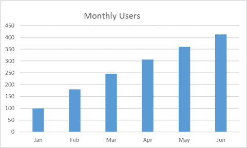
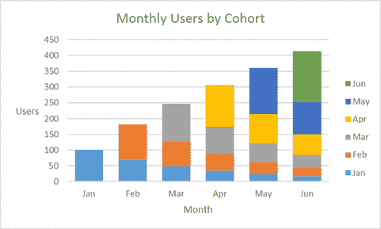
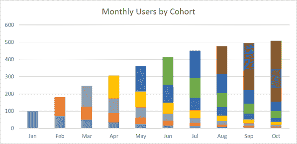
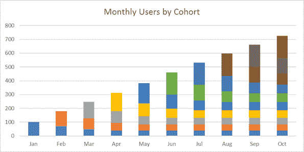

# 如何量化产品的市场契合度

> 原文：<https://medium.com/hackernoon/how-to-quantify-product-market-fit-1c8ebe730838>

几年来，产品的市场适应性已经在科技词汇中根深蒂固。马克·安德里森在 2007 年将这个词引入主流词典(点击这里阅读他最初的帖子)。

> “身处一个**良好的市场**，拥有一款**能够满足该市场需求的产品**”
> —马克·安德里森

让我们暂时把定义中的“好市场”部分放在一边。拥有大量潜在客户与风险投资对企业的可投资性关系更大，而不是这个术语的当前用法——产品满足市场的程度。

实现产品市场适应性的全部意义在于，它允许企业进入其增长阶段。如果你知道顾客会喜欢你卖的东西，你就可以在尽可能多的顾客面前推销。

通过产品市场适应阶段可以通过一个单一的指标来衡量，即*重复使用。*

# 重复使用

重复使用可以很容易地定义为客户在给定时间内使用你的产品的次数。为了进行测量，在给定的一个月中，取所有第一次使用你的产品的用户，并跟踪在随后的几个月中有多少用户回来。你想知道有多少人回来了，花了多长时间。

对于订阅业务，它被定义为保留或流失，你将跟踪至少 6 个月的队列，看看有多少%仍在使用你的产品。销售消耗品的企业将其定义为回头客，并可能简单地测量在 6 个月内重复购买的百分比。

*在衡量重复使用率时，企业会犯两个常见错误。*

首先，他们通过收入来衡量每个群体——这通常会让你的数据被超级用户扭曲。衡量不同的客户。

第二，企业衡量来自回头客的月收入百分比——这一指标受到你的客户获取率的严重影响，并且随着时间的推移，不同群体会混在一起。分别测量每个群组。

# 为什么成长期依赖于重复使用？

让我们以每月订阅业务为例(该示例也可以很容易地应用于媒体网站等高流量、回头客的业务)。

早期企业经常看到这样的收入:

增长是一致的，从这张图看，一切都很好。引擎盖下实际发生的是两件事:

*   客户获得量每月增长 10%，这得益于营销、SEO 改进、销售人员增加等。
*   每批新用户的 70%在随后的每个月都被保留了下来——通常情况下，企业在最初几个月会有大量客户流失，因为客户会尝试，然后放弃产品；这随着时间的推移逐渐减少。

这是同一个按群组划分的图表:

越来越明显的是，增长是由每月新增用户推动的。

现在，如果我们推断这一趋势，但新的月度用户在 6 月份后没有增加，我们会得到一个明确的月度用户平台期:

然而，如果相同的业务具有更健康的流失率水平(例如，前几个月的积极流失率水平相同，但至少保持 40%的群体),我们会得到下图:

40%的长期保留率使我们在 10 个月内增加了 50%的用户，而没有最低保留率。该企业只需要在 10 月份增加大约 50 名新用户，就能满足 9 月份的月用户量。

进入成长阶段，企业需要知道它所获得的客户将会是回头客。它放大了增长阶段，给企业带来“曲棍球棒式增长”。

当一个企业经过成长期并达到成熟期时，获得新用户的速度就会减慢。如果没有一个可重复的基础，月活跃用户将稳步下降，抵消增长阶段的所有成功。

# 回到产品交付

简而言之，重复使用证明产品在第一次交付时足够好，客户愿意再次购买。不言而喻，你已经提供、销售和交付了你的产品；匹配的客户群；以及产品的所有支持部分(客户入职、客户支持、购后沟通等。)的表现足以留住客户。

我的一位同事将这种情况描述为:

> 如果概念证明是最小可行产品，那么产品市场适合度是**最小可爱产品。**

因此，在你将公司的大部分资源转移到获取客户上之前，问问你自己，我获得的每个客户留下来的机会有多大？

PS:我推荐阅读 [First Round Capital 对 Brian Rothenberg](http://firstround.com/review/answers-to-your-tough-questions-about-growth-learned-while-scaling-eventbrites-5b-growth-engine/)(Eventbrite 增长和收购营销副总裁)的采访——他对“超越产品市场适合度”的评论让我注意到了这一现象，并帮助我形成了自己的观点。

> [黑客中午](http://bit.ly/Hackernoon)是黑客如何开始他们的下午。我们是 [@AMI](http://bit.ly/atAMIatAMI) 家庭的一员。我们现在[接受投稿](http://bit.ly/hackernoonsubmission)，并乐意[讨论广告&赞助](mailto:partners@amipublications.com)机会。
> 
> 如果你喜欢这个故事，我们推荐你阅读我们的[最新科技故事](http://bit.ly/hackernoonlatestt)和[趋势科技故事](https://hackernoon.com/trending)。直到下一次，不要把世界的现实想当然！

