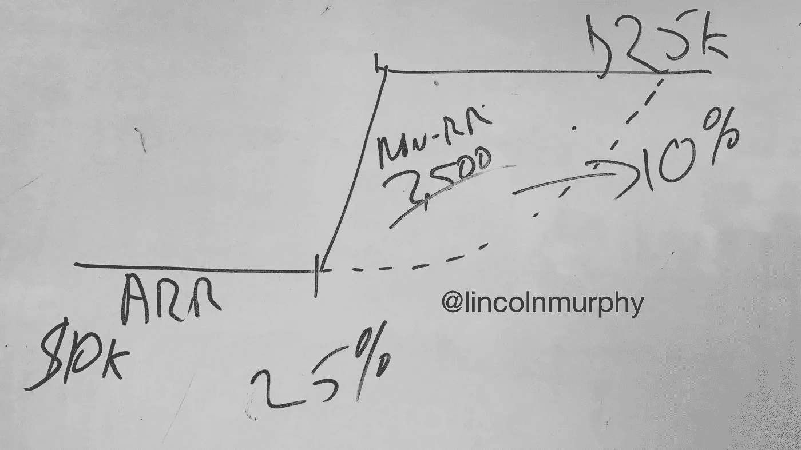

# 如何快速将经常性收入提高 2.5 倍

> 原文：<https://medium.com/hackernoon/how-to-quickly-2-5x-your-recurring-revenue-29b2156ed768>

这里有一个关于如何使用非经常性收入服务(培训、咨询等)的快速提示。)到您从客户那里获得的经常性收入的 2.5 倍(或更多)。

*这个提示要求你对* [*客户成功*](http://sixteenventures.com/customer-success-definition) *有一个基线了解。*

假设您有一个客户，价格为 1 万美元/年，他们进展顺利。如果让他们自行发展，他们可能需要 18 个月才能适应下一个价格层或附加产品，这将使他们达到 25000 美元/年。

通过了解客户的旅程，您可以明智地提供服务，缩短他们通往下一个成功里程碑的道路，这一里程碑具有逻辑扩展机会，与让他们自然增长相比，您可以更快地实现客户扩展。

假设他们在 6 个月后达到了一个[成功里程碑](http://sixteenventures.com/success-milestones)(请记住，每个客户都可能按照自己的节奏达到这个里程碑)，你知道培训计划不仅可以帮助他们当前的活跃用户从你的产品中获得更多价值，还可以增加他们公司的用户数量，所以你提供这个服务是要收费的，但可能只是为了保本。

该培训计划将使他们在 3 个月内达到这一点，这意味着他们比有机销售提前 9 个月准备好升级到下一个定价层。

**撑住！**在有专业投资者和董事会的 [SaaS](https://hackernoon.com/tagged/saas) 企业中，很大一部分非经常性收入通常不被看好，因为它不可预测，并且被上述投资者或潜在收购者低估。

因此，一般来说，在这些类型的公司中，你希望非 RR 对 RR 的“依附率”较低(不管这对你的投资者、董事会等意味着什么。).如果那是你，不要马上否定我在这里说的话…事实上，继续读下去。

顺便说一句，在自举或其他业务中，收入就是收入，所以不要担心连接率(直到你去销售，我想)。

比方说，你有一个培训项目，你可以向客户提供，以缩短他们的成功，但你必须收取 25000 美元，才能实现收支平衡。如果客户支付 1 万美元，那就是 25%的依恋率，这可能比大多数投资者/董事会希望看到的要高。

但是……培训结束后，客户最合理的下一步是购买额外的座位、附件等。他们移动到$25k/ARR，现在连接率只有 10%…现在你在用邪恶的气体烹饪。

这个故事的寓意是……了解你的客户在通往他们想要的结果的旅程中处于什么位置，主动为他们提供帮助他们成长的东西，当他们接受并成长时，为他们提供他们已经成长的东西。

哦，既然他们比有机增长早了 9 个月，那么在接下来的 9 个月里他们会在哪里呢？在头 18 个月里，你也许能让账户价值翻 5 倍以上。嗯…

…..

林肯·墨菲是世界知名的建筑师、顾问、作家和主题演讲人。作为[16 Ventures](http://sixteenventures.com/)的创始人，以及 Gainsight 公司客户成功宣传的前任领导，他在过去十年中利用客户成功推动了 400 多家 SaaS 和企业软件公司在整个客户生命周期中的增长。

在推特上关注[林肯](http://twitter.com/lincolnmurphy)

> [黑客中午](http://bit.ly/Hackernoon)是黑客如何开始他们的下午。我们是 [@AMI](http://bit.ly/atAMIatAMI) 家庭的一员。我们现在[接受投稿](http://bit.ly/hackernoonsubmission)并乐意[讨论广告&赞助](mailto:partners@amipublications.com)机会。
> 
> 如果你喜欢这个故事，我们推荐你阅读我们的[最新科技故事](http://bit.ly/hackernoonlatestt)和[趋势科技故事](https://hackernoon.com/trending)。直到下一次，不要把世界的现实想当然！

