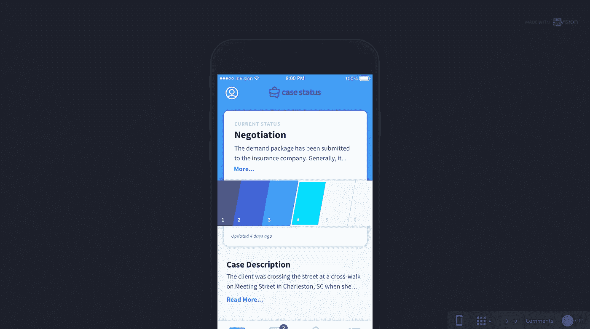

# 如何召集朋友和家人

> 原文：<https://medium.com/hackernoon/how-to-raise-a-friends-and-family-round-867ad54695aa>

## 《案例现状》首席执行官劳伦·斯特迪万特访谈

如果你在南方创业，如果没有可观的收入，你将无法从天使投资人那里筹集资金。总会有例外，但大多数投资者不会投资一个想法。他们希望看到一个经过验证的概念，有一些真正的吸引力和扩大业务规模的计划。

投资者希望尽可能降低投资风险。南部的整体资本环境比西部更保守。

这让创始人有 3 个选择来资助他们的 [MVP](https://hackernoon.com/tagged/mvp) :

## 1.自筹资金

如果你有钱并且愿意承担所有的风险，你总是可以自己投资你的生意。

***优点:*** **你可以保留你公司 100%的股份。**

***缺点:*** 不是每个人都有几万美元去投资一个新的商业项目。

## 2.朋友和家人来了

找一个你已经有关系的人，一个信任你并且知道你有能力筹集资金的人。如果你有朋友或家人可以处理财务风险，这可能是让你的生意起步的好方法。

***优点:*** 你将公司的一小部分让给你信任的人，或者以很少甚至没有兴趣的方式承担债务。

***缺点:*** 你的投资者很可能没有丰富的技术经验。

## 3.收入

第三种选择是手动建立你的公司。从小处着手，立即开始创造收入，然后将这些收入重新投入到业务中。

你可以从咨询开始，然后构建软件来增加你的咨询。或者你可以将现有的解决方案拼凑起来，创造出一种全新的产品。

***优点:*** **这有一个额外的好处，就是在任何人投入资金之前验证你的想法。**

***缺点:*** 走手工路线是一种慢得多的创业方式。

劳伦·斯特迪凡特选择了第二个选项。在将她一生的积蓄投入到她的生意中后，她筹集了一些朋友和家人的钱，以使她的 MVP 起步。在推出她的产品 Case Status 的一周内，她有了第一个付费客户。

# 嘿劳伦！你的背景和工作是什么？

嗨！我叫劳伦·斯特迪凡特。我是 Case Status 的创始人兼首席执行官，这是一款面向律师及其客户的应用程序。我是一名律师，我已经执业七年了。

Lauren Sturdivant, Founder & CEO of Case Status

## 是什么促使您开始了解案例状态？

在我多年的实践中，有几个痛点是一致的，与实践领域无关。

**1。处理客户来电**

总的来说，客户正在经历他们一生中难以置信的艰难时期，他们希望他们的案件有持续的更新。**当他们没有律师的消息时，他们认为他们的律师不在处理他们的案子。**

另一方面，如果律师把一天的大部分时间都花在给客户打电话上，他们就无法完成工作/专注于建立自己的公司。对于人身伤害律师来说尤其如此。**在人身伤害法中，你只有在案件结束时才能得到赔偿。**所以你不能按打电话的时间计费。

缺乏沟通是客户对其律师的最大抱怨。这种脱节造成了客户对这个人的不信任，而这个人是他们生活中最应该信任的人。

**2。获得新客户**

关于律师如何推销自己，有非常具体的规定。这使得获得新客户成为每个成长型公司面临的最大挑战之一。推荐是律师获得新客户的首要方式。

案例状态实时向客户更新其案例的状态。案件状态还让客户只需点击一下鼠标就可以转介给他们的律师。

**案件状态可以节省律师的时间，让客户为律师做市场营销，并与客户建立更紧密的联系。**

## 你是如何资助案件状态的 MVP 的？

幸运的是，我有存款来开始创建 MVP 的初始过程。随着项目的深入，我从家里筹集了资金。

## 为了从朋友和家人那里筹钱，你需要什么？

从一开始，我就对我的家人公开了我想要完成的目标。在我向他们要钱之前，我整理了一份商业计划，并成立了一个开发团队。只有一次，我对构建应用程序的成本以及如何将其推向市场有了一个明确的想法，于是我请求家人投资。

他们相信我，而且他们有可用的资金，所以他们愿意投资于 Case Status。

## 有一个评估和原型如何帮助你从朋友和家人那里筹集资金？

当我向朋友和家人展示案例状态原型时，他们的眼睛亮了起来。我解释了问题，他们看到并理解了案例状态如何解决这些问题。有一个工作原型可以让你所做的事情具有合法性。如果你必须筹集资金，我会建议开发一个原型给投资者看，并接受反馈。

The prototype Lauren used to raise her friends and family round.

## 你是如何决定向谁寻求初始资金的？

去找你最信任的人很重要。你还需要接近那些有可用资金进行投资的人**，他们可以在不期望马上有回报的情况下投资**。你不想让任何人陷入财务困境。

## 你能不能也谈一点为什么你应该小心你去了多少人？

如果你向哪怕是一个人发行和出售证券，你必须要么在美国证券交易委员会注册，要么属于《证券法》规定的众多豁免之一。当你开始拿钱的时候，你需要知道 [**那些师哥**](http://bit.ly/2xkKyIk) 。

豁免条款讨论了允许的投资者数量，以及无需在美国证券交易委员会注册就能筹集的资金数额。在美国证券交易委员会注册发行将使你的公司成为上市公司，上市对任何公司来说都是非常重要的一步。

## 你是如何决定自己愿意投资多少钱的？

我愿意投资我所有的积蓄。我相信我们正在做的事情，我相信我自己，我愿意全力以赴实现我的目标。

## 你决定辞掉工作，从一开始就全职处理案件。你能谈谈如何平衡 MVP 的资金和剩余资金吗？

我是一个要么全有要么全无的人，我知道如果我致力于另一份工作，我永远也不可能创建一家公司。在做了一些财务计算，减少开支，和其他支持我的人交谈之后，我知道我能做到。

诚然，这是非常艰难的。每个月都是金融柔术，但是我相信我正在做的事情，我知道我做了正确的决定。

## 再谈一谈筹集资金的具体细节。你有合同吗？你是如何管理收回资金的期望的？

考虑到我是在和近亲打交道，我们没有起草合同。我最终需要偿还这笔钱，但每个人都在同一页上，我们不知道什么时候会发生。明确预期很重要，因此，**如果你的投资者不是近亲(即使他们是)，最好将协议写成书面形式**。

## 回顾过去，当你获得 MVP 的时候，有没有什么事情你会做得不一样？

不，我什么都不会改变。如果你不冒险，你就不会有收获。此外，如果你不这样做，你不能指望另一个人投资你的生意。你的投资水平清楚地向别人表明了你有多认真。

[The Case Status MVP](https://www.thecasestatus.com/)

## 到目前为止，建立 Case 状态最令人惊讶的是什么？

建立案例地位最令人惊讶的部分是在[初创企业](https://hackernoon.com/tagged/startup)社区中遇到其他人，并意识到每个人都是多么支持你。企业家伙伴们愿意不怕麻烦地分享智慧、战争故事，并做介绍。这个社区里有很多优秀的人才，知道你并不孤单是一个巨大的帮助。

## 你对刚入门的新创始人有什么建议？

如果你有梦想/目标，你就能实现它。然而，同样的，你必须愿意牺牲一切来实现这个目标。**什么都不会交给你**，你必须竭尽全力将你的创业公司发展成一家大公司。**你必须从一开始就对自己诚实，明白要实现你的愿景需要做些什么。**

> [**什么都不会交给你**，你必须竭尽全力将你的创业公司发展成一家大公司。](https://ctt.ec/eS0xN)

当你开始创业时，我建议你加入创业社区。**参加活动，尽量见人**。尝试**找到一位导师或你可以通过随机问题联系的人**经历过这个过程。人们很忙，所以为了学习，向潜在的导师提供价值。最后，把你的目标分解成六个月内可以实现的步骤，并让自己对这些目标负责。

## 你现在最大的挑战是什么？

我最大的挑战是尽可能顺利地接纳新客户。我知道我在这方面需要帮助，所以我找到了一些顾问来帮助我顺利完成这个过程。

## 人们可以去哪里了解更多关于你和案件的情况？

如需了解更多信息，请访问 www.thecasestatus.com**，我们很乐意为您提供一个快速演示。此外，如果您有任何问题，请随时通过[**Lauren@thecasestatus.com**](mailto:Lauren@thecasestatus.com)联系我本人。*祝你好运，你要杀了它！***

***这篇文章最初出现在南方的*[*Start*](https://builtbykrit.com/index.php?p=blog/how-to-raise-a-friends-and-family-round-with-lauren-sturdivant-ceo-of-case-status&token=IpvnYVbpn2k1vimKw0YM~WGMU9cW1v1k)*上，这是一个关于在通常的枢纽之外建立盈利公司的博客。***

**安德鲁是早期创业公司产品开发工作室 [*Krit*](https://builtbykrit.com) *的创始合伙人，也是* [*信天翁*](http://getalbatross.com/?ref=medium) *的联合创始人。他认为每个人都是某方面的书呆子。***