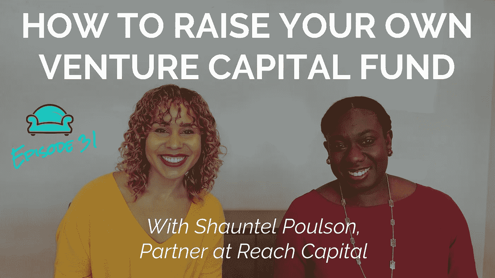

# 如何筹集自己的风险投资基金

> 原文：<https://medium.com/hackernoon/how-to-raise-your-own-venture-capital-fund-a7b0ec56909d>

2015 年， [Shauntel Poulson](https://twitter.com/SLP_EDU) 筹集了*5300 万美元，共同创立了她自己的风险投资公司！这是一步一步的剧本，解释了她是怎么做的。*

# *观看下面的视频*

# *感谢阅读！如果你喜欢这篇文章…*

*[**订阅我的时事通讯**](http://www.bit.ly/MoreMandelaSH) 了解我的下一次[采访](https://hackernoon.com/tagged/interview)与 Shauntel 何时开始。讨论的话题是成为硅谷为数不多的黑人女性风险投资家之一是什么感觉，以及她对希望扩大业务规模的新创业者的最佳建议！*

**

## *在 [Instagram 上打招呼](http://instagram.com/mandelash) | [脸书](http://facebook.com/mandelash) | [推特](http://twitter.com/mandelash) | [YouTube](https://www.youtube.com/channel/UC1XemKTBoMTxK3rgUSDFIVg)*