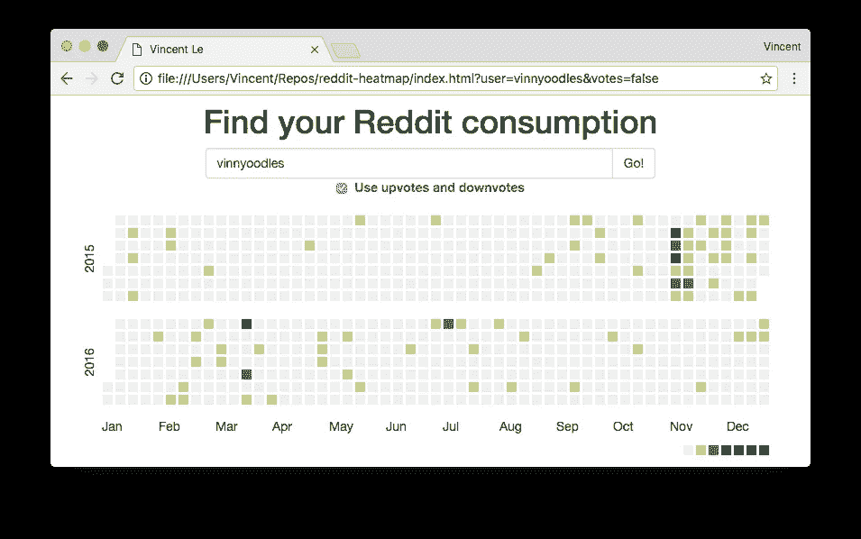

# 如何再造 GitHub 的贡献图

> 原文：<https://medium.com/hackernoon/how-to-recreate-githubs-contribution-graph-a0a8d4d91011>

我相信大多数读到这篇文章的人都知道 GitHub 和 Reddit。作为两者的狂热用户，我想使用 Reddit 的数据重新创建 GitHub 的热图/贡献图，以了解它的实现，并以简洁的可视化方式查看我的 Reddit 活动。



我使用了 [d3.js](https://d3js.org/) ，用于构建图形的 javascript 库， [jQuery](https://jquery.com/) ，超级方便的 DOM 操作，以及 B [ootstrap](http://getbootstrap.com/) ，对于设计技能较差的开发人员来说非常棒。

首先，我将讨论 UI 组件以及 d3 在其中是如何使用的。这个[例子](http://bl.ocks.org/mbostock/4063318)给了我很多关于 UI 的帮助。对于 GitHub 的用例以及这个用例，图表总是一年的长度，这使得它更简单，因为图表将总是相同的长度。

整个图是一个 SVG 元素，它包含子元素，这些子元素也是 SVG。每个代表一天的方块将包含一个格式为`%Y-%m-%d`的 *id* 标签，类似于`2017-01-06`。正方形首先被渲染成相同的颜色，`#eee`。

正方形的位置由它的星期和日子决定。 *x* 位置由星期号`%U`决定。

> YYYY 的第 1 周以星期日开始(根据%U)。一年中第一周之前的日子在第 0 周。

y 位置由一周中的某一天决定。周日是第一个，周六是最后一个，无论是 0 索引还是 1 索引都没有区别。这看起来会像

```
d3.select('.js-heatmap')
  .enter()
  .append('svg')
  .enter()
  .append('rect')
  .attr('width', CELL_SIZE)
  .attr('height', CELL_SIZE)
  .attr('x', (d) => d3.timeFormat('%U')(d) * CELL_SIZE)
  .attr('y', (d) => d.getDay() * CELL_SIZE)
```

对于正方形/网格着色，每个网格需要一个等级或分数来确定它的颜色。在这一点上，让我们假设每个网格已经有一个分数。(我会在这下面讨论我是怎么用 Reddit 的 API 计算分数的)。

确定一个网格的颜色取决于几个因素:颜色的数量，网格等级和等级极值(最小值和最大值)。基本上，分数将被投射到基于颜色数量的标尺上。在这种情况下，我使用 7 种颜色，因此排名最高的分数将获得颜色#7，分数接近平均值的分数将获得颜色#3，依此类推。使用 d3 的 API，如下所示。

```
d3.scaleQuantize()
  .domain([MIN, MAX])
  .range(d3.range(NUMBER_OF_COLORS)
  .map((d) => `color${d}`)); // Assign the grid the css class.
```

我将颜色分类到一个 css 类中，如下所示。

```
.color0 { fill: #d6e685 }
.color1 { fill: #44a340 }
.color2 { fill: #28752d }
.color3 { fill: #1e6823 }
.color4 { fill: #365e2f }
.color5 { fill: #144e12 }
```

我如何使用 Reddit 的 API 获取特定用户的数据。我用 Reddit 不同类型的贡献来计算一天的活动总量。例如，一天中提交的帖子、评论、向上投票和向下投票的数量转化为总分。幸运的是，这些对象的端点是公共的，所以当用户输入用户名时。因此，我可以轻松地发出一个 GET 请求或多个请求来提取数据。一旦获取了所有数据，就可以使用这些数据来呈现热图。

这个工具的源代码在 https://github.com/vinnyoodles/reddit-heatmap 的，工具在 https://vinnyoodles.github.io/reddit-heatmap/的发布。

我是弗吉尼亚理工大学计算机科学专业的学生，喜欢写代码和举重💪。 [LinkedIn](https://www.linkedin.com/in/vinnyoodles) [Github](https://github.com/vinnyoodles)

[](http://bit.ly/HackernoonFB)[](https://goo.gl/k7XYbx)[](https://goo.gl/4ofytp)

> [黑客中午](http://bit.ly/Hackernoon)是黑客如何开始他们的下午。我们是阿妹家庭的一员。我们现在[接受投稿](http://bit.ly/hackernoonsubmission)并乐意[讨论广告&赞助](mailto:partners@amipublications.com)机会。
> 
> 如果你喜欢这个故事，我们推荐你阅读我们的[最新科技故事](http://bit.ly/hackernoonlatestt)和[趋势科技故事](https://hackernoon.com/trending)。直到下一次，不要把世界的现实想当然！

