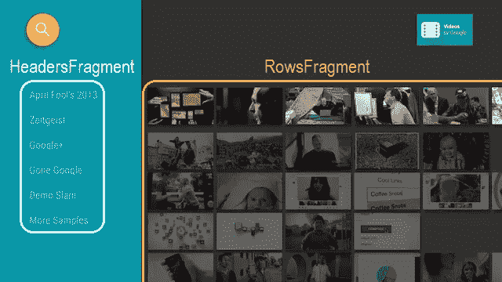

# 如何刷新安卓电视的 BrowseFragment？

> 原文：<https://medium.com/hackernoon/how-to-refresh-the-android-tv-browsefragment-6e4d2d3c6690>

我在工作中遇到了一个严重的问题: [**的 BrowseFragment**](https://developer.android.com/reference/android/support/v17/leanback/app/BrowseFragment.html) **的行**刷新项目时的**闪烁效果。**


source: [https://developer.android.com/training/tv/playback/browse.html](https://developer.android.com/training/tv/playback/browse.html)

## 介绍

在说问题的解决方法之前，先介绍一下 [BrowseFragment](https://developer.android.com/reference/android/support/v17/leanback/app/BrowseFragment.html) 。 [BrowseFragment](https://developer.android.com/reference/android/support/v17/leanback/app/BrowseFragment.html) 是用于创建媒体目录的[片段](https://hackernoon.com/tagged/fragment)。在媒体目录中，我们可以从左侧浏览类别，并在右侧选择所选类别的内容。媒体目录由一个 [RowsFragment](https://www.google.it/url?sa=t&rct=j&q=&esrc=s&source=web&cd=1&cad=rja&uact=8&ved=0ahUKEwim7NDS_I_OAhXK7hoKHdKTD-QQFggeMAA&url=https%3A%2F%2Fdeveloper.android.com%2Freference%2Fandroid%2Fsupport%2Fv17%2Fleanback%2Fapp%2FRowsFragment.html&usg=AFQjCNH3LwDzkprl2n8C962-df692UqAbw&sig2=w0aZIg3OOiqP9Rwq7y8B0w) 和一个[header fragment](https://www.google.it/url?sa=t&rct=j&q=&esrc=s&source=web&cd=1&cad=rja&uact=8&ved=0ahUKEwjPzunU_I_OAhVHDxoKHdnfC3cQFggeMAA&url=https%3A%2F%2Fdeveloper.android.com%2Freference%2Fandroid%2Fsupport%2Fv17%2Fleanback%2Fapp%2FHeadersFragment.html&usg=AFQjCNEkzUIM6J9eUBbE6bZW5KRWAXPpew&sig2=xppB_b8XZQ56mI5GEqjTcw)组成。一个 [BrowseFragment](https://developer.android.com/reference/android/support/v17/leanback/app/BrowseFragment.html) 将它的 [ObjectAdapter](https://www.google.it/url?sa=t&rct=j&q=&esrc=s&source=web&cd=1&cad=rja&uact=8&ved=0ahUKEwiU6-Te_I_OAhWMExoKHbi9CHsQFggeMAA&url=https%3A%2F%2Fdeveloper.android.com%2Freference%2Fandroid%2Fsupport%2Fv17%2Fleanback%2Fwidget%2FObjectAdapter.html&usg=AFQjCNEQlBvXY0HAKCHWZxCyBTu11gcMUA&sig2=b1J7LwVD4KUpRvOyZaEdNw) 的元素呈现为一个垂直列表中的一组行。



media catalog

现在，让我们假设我们希望通过后台任务每 5 秒钟刷新一次[行片段](https://developer.android.com/reference/android/support/v17/leanback/app/RowsFragment.html)的数据。
我们怎样才能做到呢？

## 第一种解决方案:只需更新适配器

[BrowseFragment](https://developer.android.com/reference/android/support/v17/leanback/app/BrowseFragment.html) 使用 [ArrayObjectAdapter](https://developer.android.com/reference/android/support/v17/leanback/widget/ArrayObjectAdapter.html) 来显示数据。我们只需要:
1。清除适配器的项目(*清除* )
2。向适配器添加新项目( *addAll* )

**问题:闪光效果**


每次有刷新，片段就闪烁。闪烁效果是由适配器通知 UI 对项目的每个操作引起的。我们可以看到 clear()和 addAll()方法有一个通知方法 [ArrayObjectAdapter](https://developer.android.com/reference/android/support/v17/leanback/widget/ArrayObjectAdapter.html) 有一个通知方法:

```
public void clear() {
    int itemCount = mItems.size();
    if (itemCount == 0) {
        return;
    }
    mItems.clear();  
    **notifyItemRangeRemoved(0, itemCount);** //notifies UI
}public void addAll(int index, Collection items) {
    int itemsCount = items.size();
    if (itemsCount == 0) {
        return;
    }
    mItems.addAll(index, items);
    **notifyItemRangeInserted(index, itemsCount);**//notifies UI
}
```

## 第二个解决方案:您自己的适配器:

我们可以创建自己的适配器，并选择何时以及如何通知项目的更改。

我用一个新的 replaceAll()方法创建了一个定制的 ObjectAdapter 。

```
public void replaceAll(Collection items){
    int itemsCount = items.size();
    if (itemsCount == 0){
        return;
    }
   ** mItems.clear();
    mItems.addAll(index, items);
    notifyItemRangeChanged(0, itemsCount);**
}
```

## 给我看看代码

全班都在这里:

## 参考资料:

[](https://developer.android.com/training/tv/playback/browse.html) [## 创建目录浏览器| Android 开发人员

### 在电视上运行的媒体应用程序需要允许用户浏览其内容，做出选择，并开始播放…

developer.android.com](https://developer.android.com/training/tv/playback/browse.html) 

n E X T→[记录我的安卓冒险 ](/@be.betr.codr/documenting-my-android-adventure-9352747910e6)

在你离开之前… 如果你喜欢这篇文章，你会喜欢订阅我的时事通讯。获取我的小抄:“[*Android*](https://hackernoon.com/tagged/android)*Studio 键盘快捷键小抄”。*