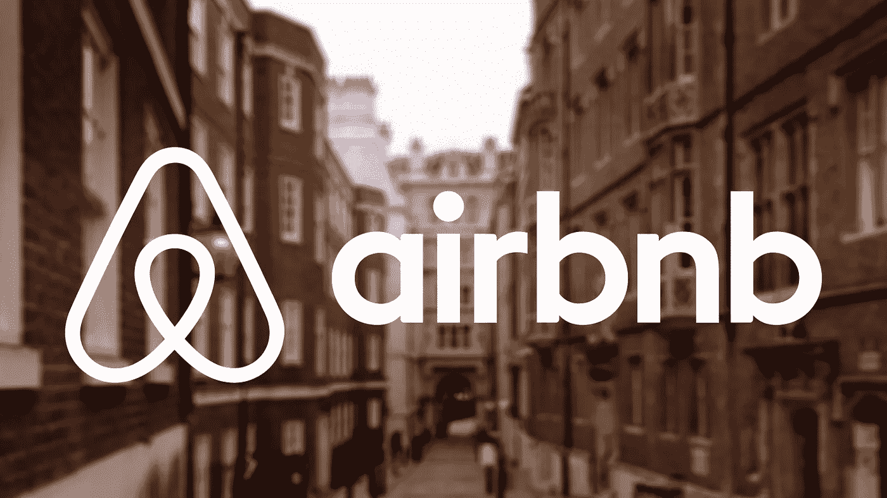
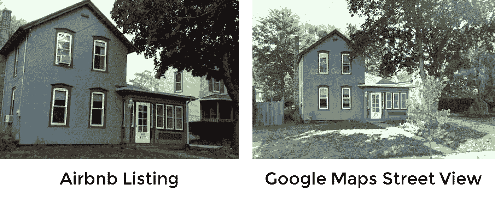
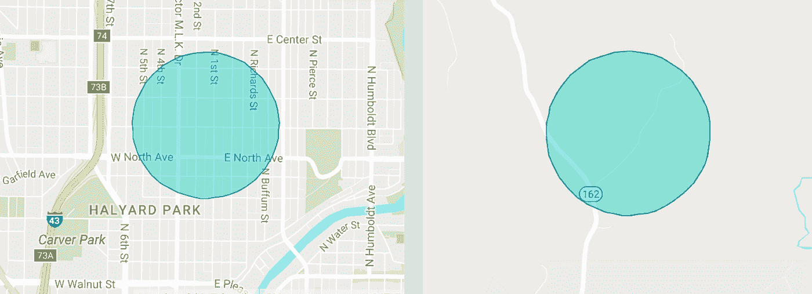

# 如何抢劫 Airbnb

> 原文：<https://medium.com/hackernoon/how-to-rob-an-airbnb-252e7e7eda44>

## Airbnb 隐私技术中的一个缺陷如何会让 120 万个家庭面临风险

*快速提示:此帖子由* [*尼尔·梅塔*](https://medium.com/u/96dcff164387?source=post_page-----252e7e7eda44--------------------------------) *和* [*艾米丽·霍利汉*](http://twitter.com/houliganation) *合著，但 media 不让我们添加合著者。它们太棒了，快看！*

[Airbnb](https://hackernoon.com/tagged/airbnb) 声称其宿主是匿名的。但是 [Neel Mehta](https://medium.com/u/96dcff164387?source=post_page-----252e7e7eda44--------------------------------) 、 [Emily 霍利汉](http://twitter.com/houliganation)，我找到了一个方法来算出其中 120 万人的真实姓名和地址。

想抢劫房子吗？

我们发现，只要有公开的数据，你就可以算出 Airbnb 上 40%的房子的真实名字和地址。我们将向您展示任何人如何使用这种方法来抢夺 T21 120 万套房子的选择权——以及其他可能损害 Airbnb 底线的方式。

# Airbnb 的“隐私保证”

Airbnb 上有超过 300 万套房子，这是一个很受欢迎的房屋共享平台，许多旅行者把它作为酒店的替代品。因为主人会把自己的房子提供给陌生人，Airbnb 向主人保证他们的隐私受到完全的保护。

在 Airbnb 上预定房间之前，您只能看到主人的名字和他们房子的大致位置:

*To “protect hosts’ privacy”, Airbnb doesn’t show you exactly where a house is until you book it. Until then, you just get an approximate latitude and longitude (which is shown as a fuzzy blue circle.) But is this enough to preserve the host’s privacy?*

但是我们发现了一种方法，任何人都可以不用预定房间就能算出主人的全名、地址和其他个人信息，这种方法的准确率高得惊人。所有这些都需要一些独创性和公开的数据。

# 如何识别 Airbnb 的主机

法律要求所有 50 个州公开其选民档案。这意味着任何人都可以获得一个州的任何选民的姓名、地址、出生日期和投票登记历史，全国有 2 亿多人。

哈佛教授拉坦亚·斯威尼给了我们威斯康星州的选民档案，其中包含了獾州所有 340 万登记选民的信息。以下是我们从选民档案中获得的每个人的基本信息:

*   全名
*   出生日期
*   街道地址
*   城市和邮政编码
*   电话号码

由于 Airbnb 没有公开用于请求和过滤房源的 API，我们戴上白帽子，想出了一种逆向工程 Airbnb 网络流量的方法，以获取威斯康星州的所有房源。对于每一个列表，我们都获得了关于主人的名字、他们的城镇以及他们的大概经度和纬度的信息——就这些。

下一步是编写一个算法，将每个 Airbnb 主机与投票人文件中的投票人进行匹配。例如，假设我们从选民档案中知道有十个道格拉斯家的人住在威斯康辛州的麦迪逊。假设我们在麦迪逊找到了一个 Airbnb 房源，它的主人叫道格拉斯。我们将运行一个反向地理编码器，将每个道格拉斯的地址转换为纬度和经度，然后使用一个距离公式来确定投票人文件中的每个道格拉斯离拥有该列表的道格拉斯有多远。

我们的假设是最接近列表的道格拉斯最有可能是宿主。如果我们是对的，我们会立即知道主持人的全名、地址、电话号码，以及选民档案中关于他们的所有其他信息！

为了测试我们的方法，我们在威斯康星州的 84 个 Airbnb 房源上运行了该算法。然后，我们每个人独立于其他人，手动确定我们测试的每一个 Airbnb 主机的身份，以查看我们的算法的预测是否正确。我们有一大堆用来识别人的技巧。首先，我们可以直观地比较谷歌地图街景上人们的房子和 Airbnb 房源中的图片:

*To check if an Airbnb listing is at a particular address, we looked up the address on Google Maps Street View and visually compared it to pictures in the listing.*

其他技巧包括在 LinkedIn 上查找主持人(有时他们的 Airbnb 个人资料会告诉你他们的母校)，在主持人的个人资料图片上使用谷歌的反向图像搜索，或者使用评论来三角定位他们的位置(一篇评论说房子是“过了三个邮箱，沿着这条路走，右边第二个房子。”)

事实证明，我们的算法为我们测试的 84 处房产中的 34 处找到了正确的主人——成功率为 40%。如果我们的样本具有代表性，这意味着你可以在 300 万 Airbnb 主机中找到 120 万的全名和地址。

# 如何抢劫 Airbnb

如果你想用 Airbnb 抢劫一所房子，你只需预订房子，找到地址，一旦房主离开，就可以洗劫一空。但这并不是一个好主意，因为 Airbnb 会让你在预订房间之前提供政府颁发的身份证，并连接你的社交媒体档案。因此，如果某天早上 Airbnb 的主人发现他们的瓷器不见了，他们找到你不会太难。

相反，这是一个有一些技术的坏人如何抢劫一所房子。他们可以找到他们所在地区今晚可用的 Airbnb 列表，尤其是“可立即预订”的列表，因为这一功能通常由度假的业主使用。然后他们可以用这个算法算出目标房子的地址。因为没人会在家，坏人可以在没人知道是他们的情况下抢劫房子。

需要澄清的是，我们不宽恕抢劫，但我们知道有强盗存在——所以为了数百万的房东，Airbnb 需要认真审视这个巨大的安全漏洞。

# 或者，如何一年骗走 Airbnb 3.6 亿美元

我们听到你们这些愤世嫉俗的人说:“Airbnb 不在乎人们的家是否被抢劫！所有公司关心的都是他们的利润。”你可能是对的。但即使该公司不在乎主机处于危险之中，你可以打赌 Airbnb 会在乎他们的底线是否处于危险之中。事实证明，他们的现金流一点也不安全。

每次预订，Airbnb 向主人收取 3%至 5%的佣金，向客人收取 6%至 12%的费用。但是，如果来宾和主机可以在平台之外进行连接，会怎么样呢？Airbnb 对此相当偏执，阻止客人和主人之间交换电子邮件地址或电话号码的任何尝试。然而，如果潜在的客人可以在 Airbnb 上找到一个房源，使用我们的算法计算出主人的家庭地址和电话号码，并在 Airbnb 应用程序之外安排租赁和付款，会怎么样？这样既省钱，又让 Airbnb 买单。

听起来不错吧？以下是 Airbnb 应该注意的原因:Airbnb 的大部分收入来自这些服务费。由于 Airbnb 在 2015 年赚了 9 亿美元，Airbnb 有缺陷的隐私保障可能会让他们每年损失高达 3.6 亿美元。

# 监管机构如何能把它粘到 Airbnb 上

众所周知，Airbnb 在纽约和旧金山等许多城市不受欢迎，因为它逃避了通常的酒店税，而酒店税是这些城市的主要收入来源。在其他情况下，肆无忌惮的房东利用 Airbnb 在租金控制的住房单元中经营非法酒店，这伤害了住房原本面向的低收入居民。

2016 年，纽约规定刊登不到 30 天的房屋广告是非法的，这项法律旨在打击 Airbnb。但是由于 Airbnb 的主人和他们的地址都不公开，纽约在执行这项法律时遇到了麻烦。但有了这种算法，纽约和其他地方的监管机构可以通过逆向工程违法房源的地址，找到并打击非法 Airbnb 主机。

# Airbnb 对此能做些什么？

Airbnb 有缺陷的隐私保证可能会给该公司带来巨大的痛苦，更不用说对主机的负面影响了。那么他们能做什么呢？回想一下 Airbnb 是如何为每一个房源提供大致的纬度和经度的——或者，就像它在地图上出现的那样，一个模糊的蓝色圆圈。重要的是，我们发现无论你想在哪里租房，这个圆的半径大约是 0.7 英里。

Airbnb 可以增加蓝色圆圈的半径，使我们的重新识别算法不太准确。权衡之下，这将降低 Airbnb 对潜在租房者的用处，因为位置对旅行者来说非常重要。这在大城市尤其糟糕:在威斯康星州农村租房的人可能不介意一英里的误差，但一英里的半径可能会掩盖在曼哈顿市区和新泽西租公寓的差异(纽约本地人 Aron 不寒而栗)！

*In the densely-populated area on the left, reidentifying someone would be hard because there are so many people in the fuzzed area. But it would be easy in the sparsely-populated area on the right, where few houses fall in the circle.*

我们的建议？Airbnb 可能需要根据当地的人口密度来调整他们的模糊半径。更密集的区域半径更小也没问题，因为即使在一个小圈子里也有很多人，但人口稀少的农村地区需要更多的模糊来保护隐私。

如果你同意 Airbnb 有缺陷的隐私保障会让房东——以及 Airbnb——面临风险，写信给 Airbnb，告诉他们需要对此采取行动。

你觉得我们的算法遗漏了什么吗？想聊聊我们的代码吗？知道什么好笑话吗？请在评论或推特上给我们留言。我们用 [@aronszanto](http://twitter.com/aronszanto) 、 [@hathix](http://twitter.com/hathix) 和[@ houligangation](http://twitter.com/houliganation)来称呼。

# 嘿！喜欢这篇文章吗？扔给我们一个❤，这样其他人也可以享受它。谢谢！

*最后一点:出于对我们在工作过程中重新确认的那些人的隐私的尊重，我们不会公开发布概念证明。如果你想看我们的工作，就喊我们一声。*

*感谢拉坦亚·斯威尼教授、刘吉苏和金燕·臧的指导。*

> [黑客中午](http://bit.ly/Hackernoon)是黑客如何开始他们的下午。我们是阿妹家庭的一员。我们现在[接受投稿](http://bit.ly/hackernoonsubmission)并乐意[讨论广告&赞助](mailto:partners@amipublications.com)机会。
> 
> 如果你喜欢这个故事，我们推荐你阅读我们的[最新科技故事](http://bit.ly/hackernoonlatestt)和[趋势科技故事](https://hackernoon.com/trending)。直到下一次，不要把世界的现实想当然！

