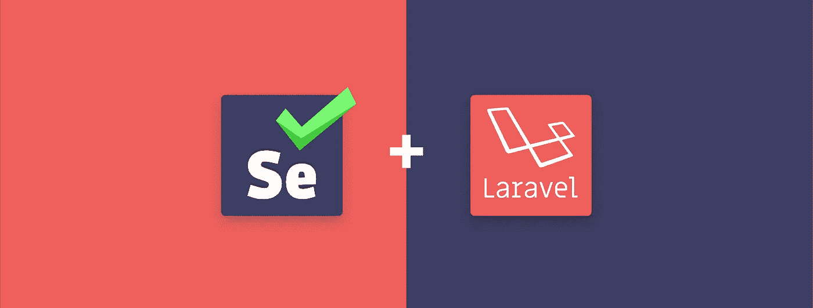

# 如何使用 Laravel Dusk 运行和自动化 E2E 测试

> 原文：<https://medium.com/hackernoon/how-to-run-and-automate-e2e-tests-using-laravel-dusk-b4792493f126>



# 介绍

[的前一篇文章](https://buddy.works/guides/first-steps-with-laravel-and-continuous-delivery?utm_source=medium&utm_medium=post&utm_campaign=how-to-run-and-automate-e2e-tests-using-laravel-dusk&utm_content=link)解释了创建单元和特性测试的过程，并向您展示了如何用 Buddy 自动化它们。通过这篇指南，你将学习如何使用 [Laravel](https://hackernoon.com/tagged/laravel) Dusk 运行 [E2E](https://hackernoon.com/tagged/e2e) 测试。

Laravel Dusk 只是 Laravel 5.4 中引入的一种浏览器测试。默认情况下，测试使用 ChromeDriver，但您也可以将它们配置为在不同的浏览器中使用 Selenium。

# 测试项目

如果您不知道如何添加测试，我们将使用一个简单的计算器示例来指导您完成这个过程。在本指南中，你可以看到如何创建这样的计算器。

1.  在开始时，确保分叉和克隆项目[github.com/buddy-works/laravel-first-steps](https://github.com/buddy-works/laravel-first-steps)
2.  然后，您可以通过运行以下命令来立即检查应用程序:

```
$ laravel-first-steps
$ composer install
$ php artisan serve
```

注意:如果您有任何问题，请检查您是否安装了[所有需要的东西](https://buddy.works/guides/guides/first-steps-with-laravel-and-continuous-delivery?utm_source=medium&utm_medium=post&utm_campaign=how-to-run-and-automate-e2e-tests-using-laravel-dusk&utm_content=link#install-laravel)。

# 安装黄昏

如果你想安装黄昏，只需按照以下步骤:

*   安装 Laravel Dusk 并将其添加到项目的依赖项中:

```
$ composer require laravel/dusk
```

*   注册 DuskServiceProvider。打开
    `app\Providers\AppServiceProvider.php`并添加名称空间:

```
use Laravel\Dusk\DuskServiceProvider;
```

*   通过添加以下内容在`register`方法中注册提供者:

```
if ($this->app->environment('local', 'testing')) {
     $this->app->register(DuskServiceProvider::class);
    }
```

整个`AppServiceProvider`文件应该是这样的:

```
<?phpnamespace App\Providers;use Illuminate\Support\ServiceProvider;
use Laravel\Dusk\DuskServiceProvider;class AppServiceProvider extends ServiceProvider
{
    /**
     * Bootstrap any application services.
     *
     * @return void
     */
    public function boot()
    {
        //
    } /**
     * Register any application services.
     *
     * @return void
     */
    public function register()
    {
        if ($this->app->environment('local', 'testing')) {
            $this->app->register(DuskServiceProvider::class);
        }
    }
}
```

*   最后，通过执行以下命令来安装 Dusk

```
$ php artisan dusk:install
```

# 编写第一个黄昏测试

首先，应该删除示例性测试，否则它将返回错误:

```
$ rm tests/Browser/ExampleTest.php
```

一旦完成，确保通过执行`artisan`命令添加我们的第一个测试。然后…

# 想了解更多？[点击此处查看全文](https://buddy.works/guides/how-run-laravel-dusk-selenium-tests?utm_source=medium&utm_medium=post&utm_campaign=how-to-run-and-automate-e2e-tests-using-laravel-dusk&utm_content=link)。

[](http://bit.ly/HackernoonFB)[](https://goo.gl/k7XYbx)[](https://goo.gl/4ofytp)

> [黑客中午](http://bit.ly/Hackernoon)是黑客如何开始他们的下午。我们是 [@AMI](http://bit.ly/atAMIatAMI) 家庭的一员。我们现在[接受投稿](http://bit.ly/hackernoonsubmission)并乐意[讨论广告&赞助](mailto:partners@amipublications.com)机会。
> 
> 如果你喜欢这个故事，我们推荐你阅读我们的[最新科技故事](http://bit.ly/hackernoonlatestt)和[趋势科技故事](https://hackernoon.com/trending)。直到下一次，不要把世界的现实想当然！

