# 如何在 USB 固态硬盘上运行 Bootcamp 和 Windows 10

> 原文：<https://medium.com/hackernoon/how-to-run-bootcamp-windows-10-on-a-usb3-86551dc3def8>

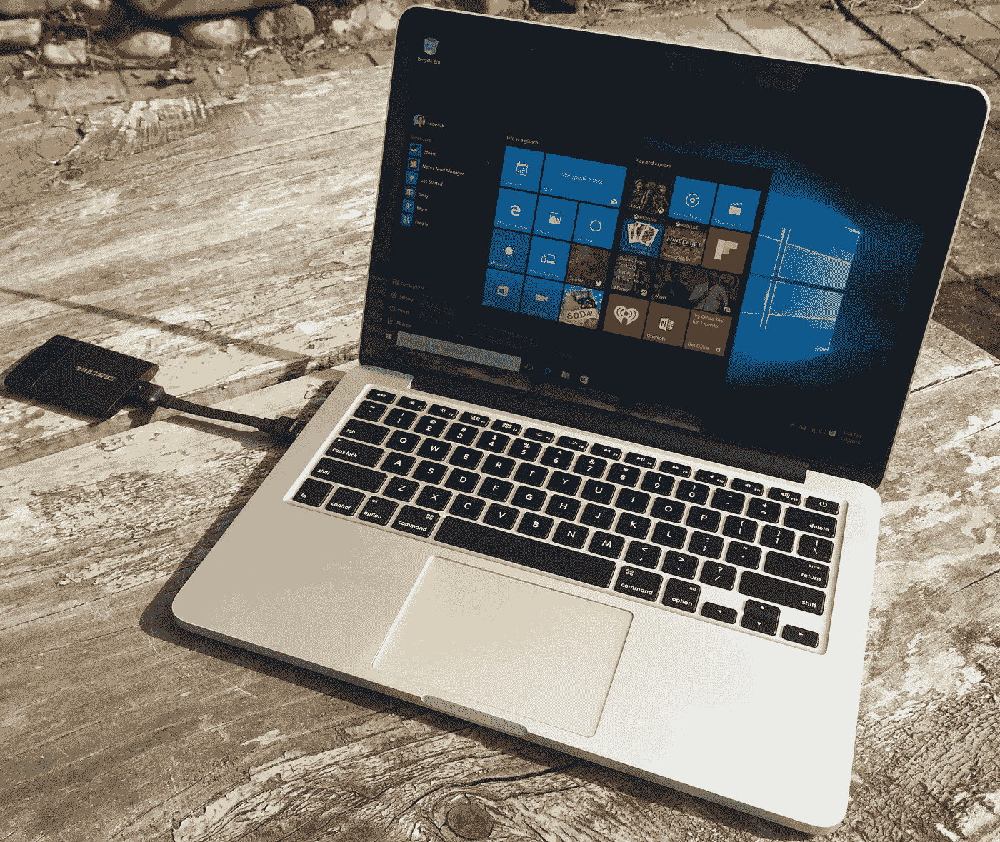

近两年来，我一直将一台 2013 年末的 Retina [Macbook](https://hackernoon.com/tagged/macbook) Pro 作为我的主要电脑。它满足了我日常工作中的所有需求，并且足够轻便，即使在飞来飞去工作时也可以随身携带。

虽然我喜欢飞行提供的切换离线和赶上一些当之无愧的游戏的时间，*移动*游戏可能有点乏味，Mac OS X 不运行我最喜欢的游戏，如 Skyrim，没有一些相当不可靠和表现不佳的黑客通过 Wine。

但是[训练营](https://hackernoon.com/tagged/bootcamp)呢？我在一个非常有限的地方，256GB 的 SSD 很快就填满了，我没有多余的空间来分区和安装 Bootcamp Apple 的方式。

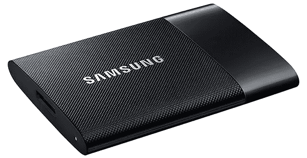

进入三星便携式固态硬盘 T1，这个快速的小驱动器足够小，可以挂在我的 Macbook 旁边，不会碍事，一两次碰撞也不会损坏它。

不幸的是，Windows 拒绝安装任何基于 USB 的存储设备，这在历史上太慢了，无法运行一个完全成熟的操作系统。

但这对于 T1 来说不成问题，据三星自己估计，T1 的速度可达 450MB/s，足以运行 Windows，就像直接在内部驱动器上运行一样。

幸运的是，借助虚拟化的力量，很容易绕过这些讨厌的限制，让 Bootcamp 完全在外部 USB 固态硬盘上运行，而无需对内部固态硬盘进行任何更改。

请继续阅读，了解如何操作！

# 你需要什么:

您需要一些东西来完成本指南:

*   支持从 USB 设备启动的 Mac([*见苹果支持:支持 Windows 10*](https://support.apple.com/en-us/HT204990) 的 Mac 电脑)
*   一个类似于[三星 T1](http://www.samsung.com/us/computer/memory-storage/MU-PS250B/AM) 的 USB 3.0 固态硬盘(*一个闪存设备将不够快*
*   至少有 2GB 存储空间的备用 USB 驱动器，用于将 Bootcamp 驱动程序复制到 Windows。
*   基本了解 VirtualBox 和安装 Windows。

# 下载 Windows 10 安装

Windows 10 可以从微软下载，并允许有一个宽限期来许可安装。Windows 10 可以从微软商店购买。

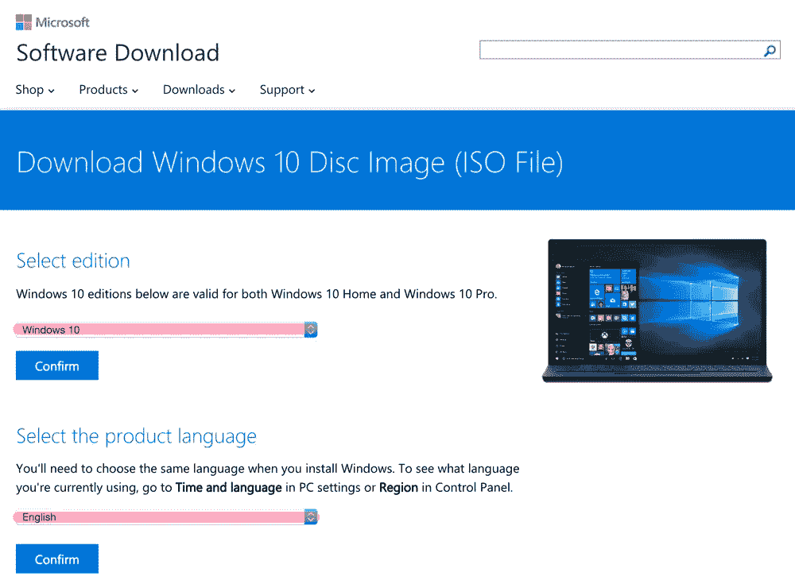

[点击此处访问 Windows 10 下载页面。](https://www.microsoft.com/en-us/software-download/windows10ISO)

按照提示下载 Windows 10 安装盘。

下载内容为 ***3.7GB*** 因此可能需要一些时间，接下来的步骤将让您的系统准备好将 Windows 10 安装到 USB 固态硬盘。

# 下载用于 Windows 10 的 Bootcamp 软件

Apple 为 Bootcamp 提供了预打包驱动程序安装。

[点击此处，通过 Apple CDN 下载用于 Windows 10 的 Bootcamp 6.0 驱动程序。(**【AppleBCUpdate.exe】T2 1.13 GB**)](http://swcdn.apple.com/content/downloads/10/60/031-30899/6u2bha6n3pckjca1j44jw9m28yq72nh6li/AppleBcUpdate.exe)

[感谢 Reddit 用户 **sadalhayat** 识别此链接](https://www.reddit.com/r/apple/comments/3h7zj1/bootcamp_6_download_link/cw9zmox)。

下载完成后，将其复制到一个与 SSD 分开的备用 USB 驱动器中，您将使用它来安装 Bootcamp。这个留着以后用。

> Mac OS X 不能开箱即用地写入 Windows 驱动器。因此，您需要使用单独的驱动器将 Bootcamp 软件复制到新的 Bootcamp 安装中。

# **安装 VirtualBox**

你想知道为什么 VirtualBox 是下一步吗？别担心，我们正在利用虚拟化技术来启动 Windows 10 的安装。

我们将使用 VirtualBox 将 USB 驱动器作为虚拟硬盘安装在虚拟机中。这绕过了微软安装程序的限制，阻止我们以苹果的方式安装 Bootcamp。

## **下载并安装 VirtualBox**

如果你还没有 [VirtualBox](https://www.virtualbox.org/wiki/Downloads) ，可以从[他们的网站](https://www.virtualbox.org/wiki/Downloads)下载。下载完软件包后，使用安装包启动并运行 VirtualBox。

## **识别您的 USB 驱动器的设备位置**

打开终端并键入:

```
diskutil list
```

该命令将列出计算机上所有连接的驱动器。浏览列表，直到找到您的存储设备。

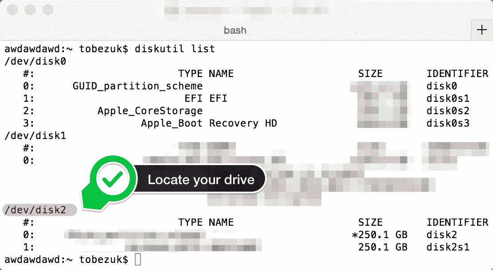

Your result will look similar to this. Read over the type names until you find one that is your USB SSD.

文本中突出显示的红色“ ***/dev/disk2*** ”就是我们需要的信息。这些信息将告诉 VirtualBox 它需要访问哪个存储设备。

> 请注意，此信息在您的机器上可能有所不同。仔细阅读列表，以匹配您的 USB 固态硬盘的地址。

## **断开 Mac OS X 与 USB 固态硬盘的连接。**

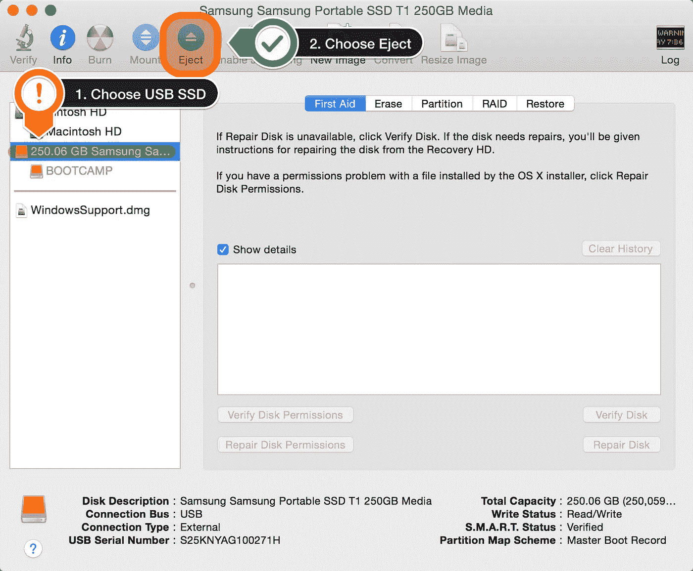

在我们将 VirtualBox 连接到我们的 USB 固态硬盘之前，您需要从 Mac OS X 完全卸载固态硬盘，以允许 VirtualBox 完全访问 USB 固态硬盘。

这可以通过在 Spotlight 中搜索磁盘工具来完成

1.  选择外部 USB 设备
2.  在顶部菜单中选择弹出

## **创建映射到 USB 驱动器的虚拟磁盘**

这是魔法开始的地方。我们将使用 VirtualBox 将 USB SSD 安装为普通硬盘，以欺骗 Windows 10 安装程序认为它使用的是普通硬盘。

首先，我们需要为 VirtualBox 创建一个虚拟磁盘文件，以便它知道我们正在访问什么存储设备。

下面是我们将修改以创建虚拟磁盘文件的命令

```
VBoxManage internalcommands createrawvmdk -filename "bootcamp.vmdk" -rawdisk ***/dev/diskX***
```

您可以复制整个命令，但最后一部分“ **/dev/diskX** ”除外，它需要更改为您在上一步中确定的驱动器号。

在我的例子中，它是“ **/dev/disk2** ”。

## 通过 VirtualBox 将 Windows 10 安装到 USB 固态硬盘

现在我们已经组织好了一切，我们可以开始通过 VirtualBox 安装 Windows 10 了。

我们需要给 VirtualBox 提升权限来访问我们方便的 bootcamp.vmdk 文件。

在您的终端中键入:

```
sudo /Applications/VirtualBox.app/Contents/MacOS/VirtualBox
```

这将强制 VirtualBox 作为根用户运行，并有权访问 USB 固态硬盘。

## 正在创建虚拟机

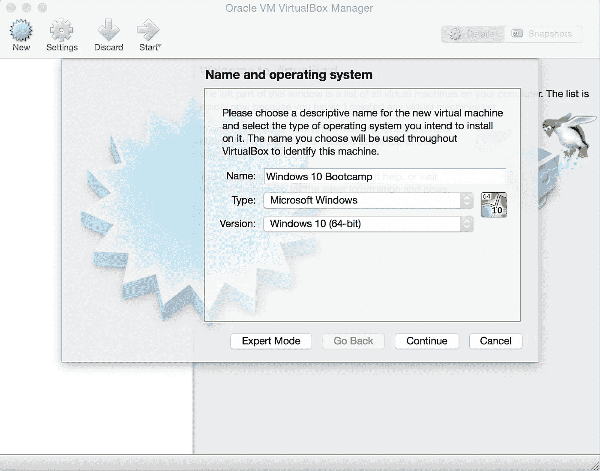

在 VirtualBox 中选择“**新建**”并键入“ **Windows 10 Bootcamp** ”，然后点击*继续*。

将内存更改为“**512**”MB，然后单击继续。

在硬盘屏幕上选择“**使用现有的虚拟硬盘文件**”，浏览到您的主目录并选择新创建的“ **bootstrap.vmdk** ”。

## 从虚拟机安装 Bootcamp

现在，我们已经搭好了虚拟机，连接了硬盘并下载了 Windows 10，是时候将 Windows 10 安装到我们闪亮的新 USB 固态硬盘上了。

回到 VirtualBox，我们需要将 Windows 10 安装 ISO 挂载到虚拟 DVD 驱动器中。

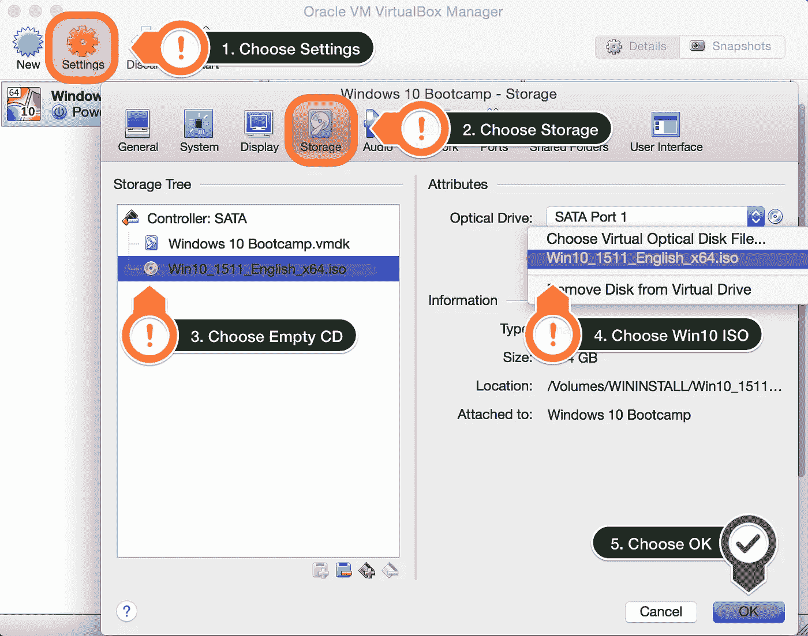

1.  打开虚拟机的设置面板。
2.  选择设置面板顶部的存储选项卡。
3.  选择空 DVD 图标。
4.  选择光驱旁边的 CD 图标，选择虚拟光盘文件，然后选择 Windows 10 ISO 文件。
5.  选择确定保存新设置。

## 运行正常的 Windows 10 安装

按照标准屏幕开始安装 Windows 10。

除了以下几点之外，您真正需要做的就是单击“下一步”并同意条款和条件:


当你遇到安装类型屏幕时，选择 ***自定义*** 。

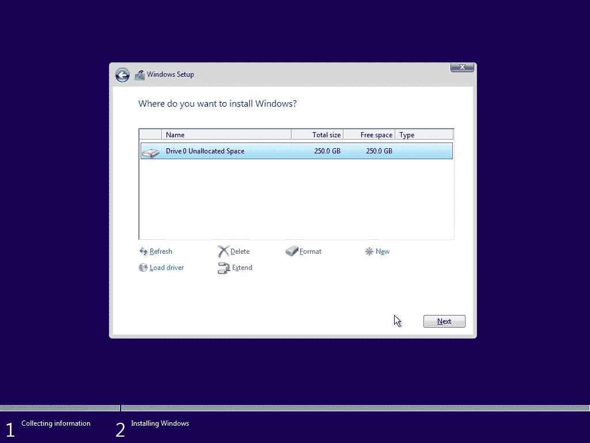

Delete exisitn

当你被询问在哪里安装 Windows 时，只需删除任何现有分区，然后选择“ ***下一个*** ”。

> 别担心，Windows 只能看到你由 VirtualBox 分配的 USB SSD 驱动器，你 Mac 的现有分区在这里无法访问。

## 重要！不要让 windows 重启！

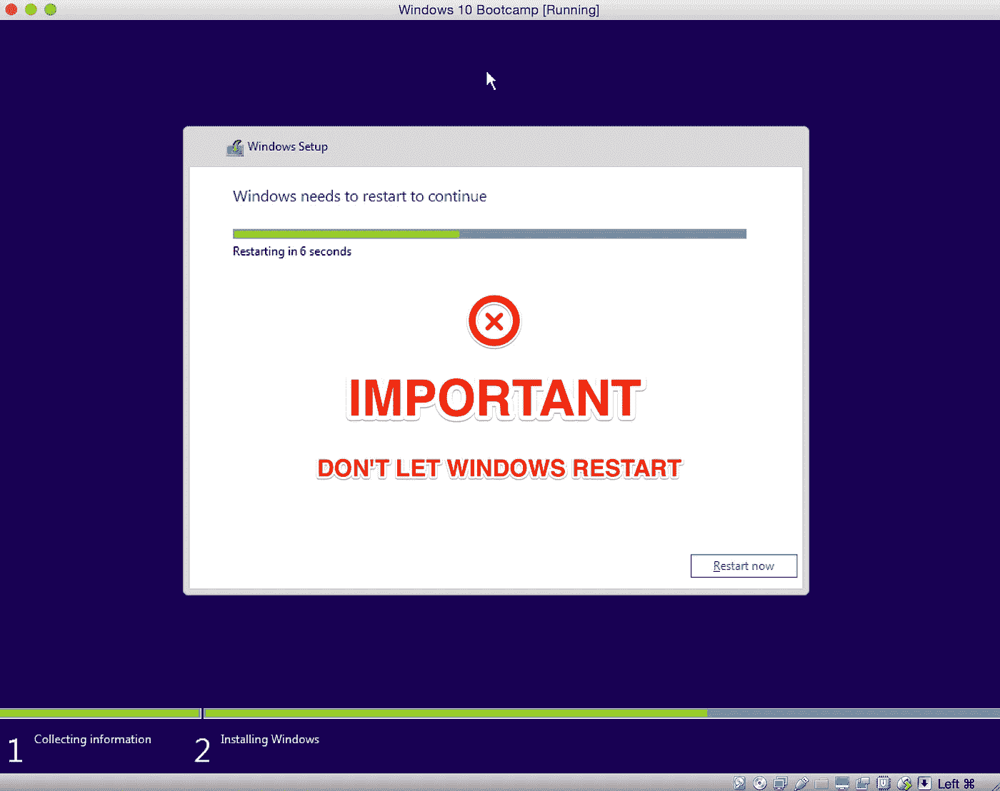

Important! Don’t let windows restart! This is the most crucial step.

这是在外部 USB 3.0 固态硬盘上成功安装 Bootcamp 的最关键的一步

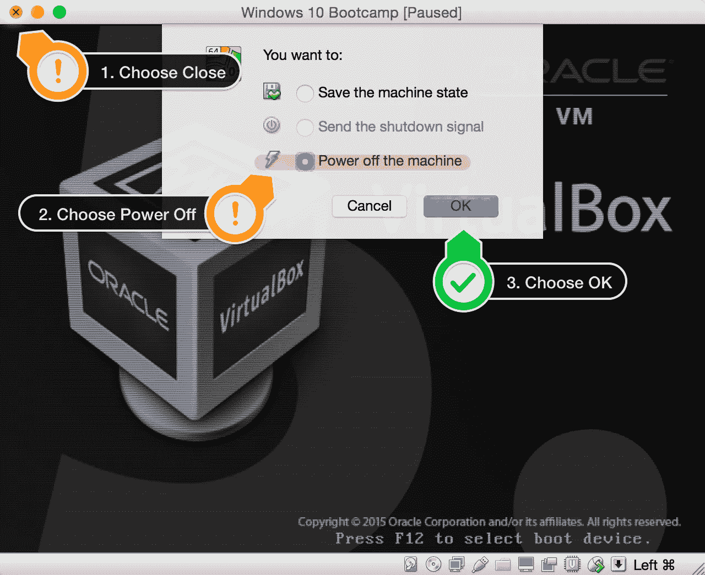

Power off the Virtual Machine

当 Windows 10 重新启动时，请确保阻止 Windows 在虚拟机内重新启动并完成安装。

1.  当您看到 VirtualBox BIOS 屏幕时，选择红色的关闭按钮
2.  选择 ***关机*** 。
3.  选择确定关闭虚拟机。

## 虚拟化已经足够了！

现在我们已经完成了 Windows 10 安装的第一阶段，我们不再需要使用 VirtualBox 了。

这就完成了安装的 Mac OS X 端所需的所有步骤。

# 将您的 Mac 重新启动到 Windows

现在是时候重启你的 Mac 并启动进入 Windows 10 了。关闭 Mac 并按住 Option 键，直到磁盘图标出现在屏幕上。

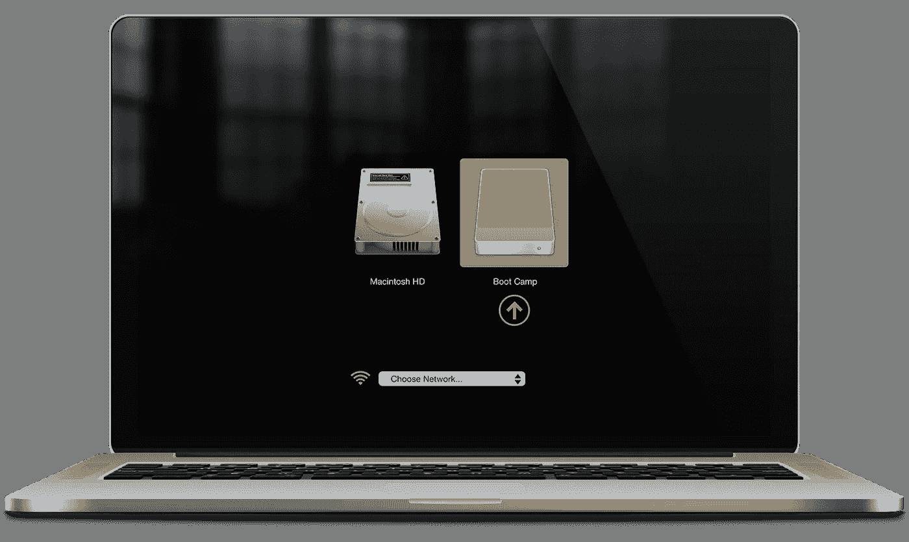

For more info see Apple Support: [Select an operating system while starting up your computer](https://support.apple.com/kb/PH11132?locale=en_US)

## 让 Windows 10 安装

如果一切顺利，Windows 10 应该开始启动并开始初始安装。


只需按照屏幕上的提示，按照要求填写您的详细信息。

> Windows 10 在安装过程中可能会重新启动。如果出现这种情况，请确定您按下 Option 键并选择 Boot Camp 驱动器来继续安装。

## 安装 Bootcamp 软件

插上我们之前拷贝 Bootcamp 软件到的备用 u 盘，运行“【AppleBCUpdate.exe】*”。*

*这将启动 Bootcamp 安装软件，为您的系统中的 Apple 键盘和鼠标、无线、图形和其他设备安装驱动程序。*

# *就是这样！*

**

*如果一切按计划进行，现在只要 USB 固态硬盘连接到计算机，您就可以直接启动到 Windows 10 了！*

*我的体验坚如磐石，我可以享受在 Mac 上运行 Bootcamp 的所有好处，以运行 Windows 应用程序和游戏，而不会牺牲内部 SSD 的宝贵存储空间。*

*你觉得这篇文章有帮助吗？请在下面的评论区告诉我！*

> *请记住，微软和苹果从来没有打算让你以这种方式运行训练营。确保您**永远不要**在 Windows 运行时断开 USB 固态硬盘与系统的连接！*

*[](http://bit.ly/HackernoonFB)**[](https://goo.gl/k7XYbx)**[](https://goo.gl/4ofytp)*

> *[黑客中午](http://bit.ly/Hackernoon)是黑客如何开始他们的下午。我们是 AMI 家庭的一员。我们现在[接受投稿](http://bit.ly/hackernoonsubmission)并乐意[讨论广告&赞助](mailto:partners@amipublications.com)机会。*
> 
> *如果你喜欢这个故事，我们推荐你阅读我们的[最新科技故事](http://bit.ly/hackernoonlatestt)和[趋势科技故事](https://hackernoon.com/trending)。直到下一次，不要把世界的现实想当然！*

*[](https://goo.gl/Ahtev1)*