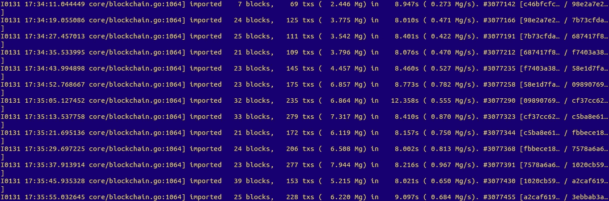
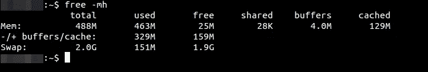
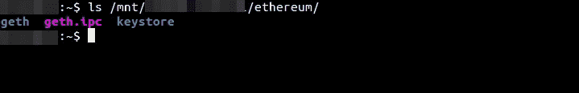

# 如何在 512Mb 内存下运行 geth 数字海洋水滴

> 原文：<https://medium.com/hackernoon/how-to-run-geth-at-512mb-ram-digital-ocean-droplet-e346986cf666>



Run geth with just 512Mb of RAM

这就是我如何在一个低成本的数字海洋(DO) Ubuntu droplet 上运行完整的 geth node 和 TheMillionEtherHomepage.com python 后端。有了这个配置，我就完全同步了(目前在块 3097083 ),完全没有崩溃。

## 创建一个液滴

买一个 512 Mb 的 RAM droplet，至少附加 20 GB 的卷(DO 的块存储)。只需点击*创建水滴*按钮，DO 会引导你完成。

## 设置交换文件

我尝试在没有交换的情况下运行 geth，但是它在启动后大约 10-30 分钟就崩溃了。在这里，我设置了 2g 的交换。一场演出是不够的。我用它在两百万街区内杀了一个人。

```
$ sudo fallocate -l 2G /swapfile # Creates a file of a preallocated size 
$ sudo chmod 600 /swapfile # adjust the permissions 
$ sudo mkswap /swapfile # set up the swap space 
$ sudo echo '/swapfile none swap sw 0 0' >> /etc/fstab # enable swap 
$ sudo echo 'vm.swappiness=30' >> /etc/sysctl.conf # optional. The default swappiness (i.e. system willingness to use swap) is 60\. You can set it to 30 if you care. As swap gradually kills SDDs. In my experience 30 is enough and it feels more eco-friendly. 
$ sudo /sbin/shutdown -r now # reboot 
$ free -mh # now you should see your swap usage.
```



数字海洋关于 swap 的说明在这里:[如何在 Ubuntu 14.04 上添加 Swap](https://www.digitalocean.com/community/tutorials/how-to-add-swap-on-ubuntu-14-04)

## 安装 geth

```
$ sudo apt-get install software-properties-common 
$ sudo add-apt-repository -y ppa:ethereum/ethereum 
$ sudo apt-get update 
$ sudo apt-get install geth
```

[Ubuntu 官方安装说明](https://github.com/ethereum/go-ethereum/wiki/Installation-Instructions-for-Ubuntu)

## 将 geth 的数据库放入块存储卷

您可以使用*datadir "/mnt/your-volume-name/ether eum/"*键( [geth 命令行选项](https://github.com/ethereum/go-ethereum/wiki/Command-Line-Options))运行 Geth，但是我发现下面的方法更简单，因为您可能有其他软件使用相同的~/。默认以太坊文件夹。所以我们要创建一个符号链接。

```
$ sudo mkdir /mnt/your-volume-name/ethereum # create an empty directory 
$ sudo chown username:username /mnt/your-volume-name/ethereum/ # set directory owner to username (you) 
$ sudo chmod 775 /mnt/your-volume-name/ethereum/ # set directory permissions 
$ ln -s /mnt/your-volume-name/ethereum/ ~/.ethereum # create symbolic link from your home directory to the volume
```

## 尽情奔跑吧！

```
$ geth --fast --cache=16 
$ ls /mnt/your-volume-name/ethereum/ # see if geth is writing to the rigth place
```



## 并添加统计数据，享受更多。

通过以下方式添加 cron 任务:

```
$ crontab -e
```

在底部添加以下任务。它会在每天凌晨 4 点将您附加的卷使用情况写入 disk.log 文件

```
0 4 * * * echo `date` `df -m | grep sda` >> /home/username/disk.log
```

几天后，检查日志，查看您的磁盘使用统计数据。如果您发现磁盘空间不足，是时候考虑购买更多空间了。

```
$ tail /home/username/disk.log 
Sun Jan 22 04:00:01 UTC 2017 /dev/sda 20031 14582 4410 77% /mnt/volume 
Mon Jan 23 04:00:01 UTC 2017 /dev/sda 20031 14809 4182 78% /mnt/volume 
Tue Jan 24 04:00:01 UTC 2017 /dev/sda 20031 15041 3950 80% /mnt/volume 
Wed Jan 25 04:00:01 UTC 2017 /dev/sda 20031 15294 3698 81% /mnt/volume 
Thu Jan 26 04:00:01 UTC 2017 /dev/sda 20031 15522 3470 82% /mnt/volume 
Fri Jan 27 04:00:02 UTC 2017 /dev/sda 20031 15739 3253 83% /mnt/volume 
Sat Jan 28 04:00:01 UTC 2017 /dev/sda 20031 15956 3036 85% /mnt/volume 
Sun Jan 29 04:00:01 UTC 2017 /dev/sda 20031 16161 2830 86% /mnt/volume 
Mon Jan 30 04:00:01 UTC 2017 /dev/sda 20031 16041 2950 85% /mnt/volume 
Tue Jan 31 04:00:01 UTC 2017 /dev/sda 20031 16271 2721 86% /mnt/volume
```

## 设置 monit 监控 Geth，即使在睡觉时也能尽情享受。

为了更安全，您可以[设置 monit 来监控 Geth 状态](https://hackernoon.com/how-to-monitor-geth-and-autorestart-it-on-crashes-with-monit-a6668de9b961)。如果发生任何事情，它会重启 geth 并通过电子邮件通知你。

## 评论、问题、改进？

可以贴在这里或者 stackexchange 线程:[如何在 512Mb RAM 下运行 geth 数字海洋水滴？](http://ethereum.stackexchange.com/questions/10609/how-to-run-geth-at-512mb-ram-digital-ocean-droplet)

UPDT: 发生了两起撞车事故:3 月 17 日和 25 日。所以我强烈推荐[用 monit](https://hackernoon.com/how-to-monitor-geth-and-autorestart-it-on-crashes-with-monit-a6668de9b961) 或者其他软件监控 geth。

[](http://bit.ly/HackernoonFB)[](https://goo.gl/k7XYbx)[](https://goo.gl/4ofytp)

> [黑客中午](http://bit.ly/Hackernoon)是黑客如何开始他们的下午。我们是 [@AMI](http://bit.ly/atAMIatAMI) 家庭的一员。我们现在[接受投稿](http://bit.ly/hackernoonsubmission)并乐意[讨论广告&赞助](mailto:partners@amipublications.com)机会。
> 
> 如果你喜欢这个故事，我们推荐你阅读我们的[最新科技故事](http://bit.ly/hackernoonlatestt)和[趋势科技故事](https://hackernoon.com/trending)。直到下一次，不要把世界的现实想当然！

