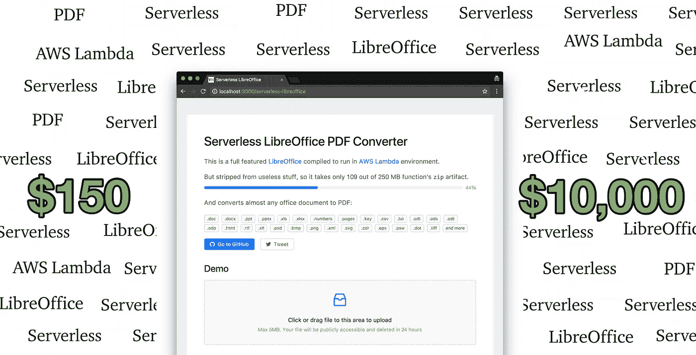
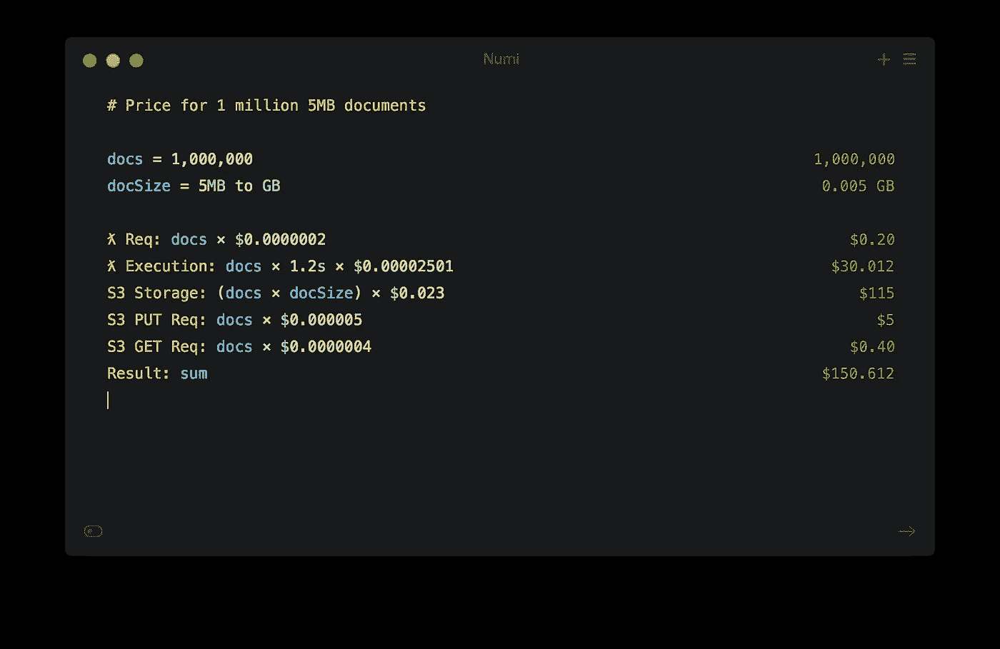
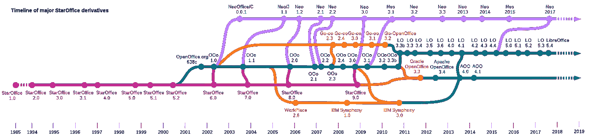

# 如何在 AWS Lambda 中运行 LibreOffice 来大规模处理廉价的 pdf 文件

> 原文：<https://medium.com/hackernoon/how-to-run-libreoffice-in-aws-lambda-for-dirty-cheap-pdfs-at-scale-b2c6b3d069b4>

## 您知道吗，使用 LibreOffice 可以将近 100 种文档格式转换为 PDF 格式？你知道现在你可以用 Lambda 来做这个吗？**TL；DR；** [在线试玩](https://vladholubiev.com/serverless-libreoffice)和 [github 来源](https://github.com/vladgolubev/serverless-libreoffice)

这篇短文将回答两个简单的问题**为什么？**和**如何？** *跳到如何。*

# 为什么？

为了不破坏你的期望，让我们从一开始就澄清一些事情。

> 至少现在还不能在生产中运行。

好吧，那我们继续。如果你曾经不得不将 office 文档转换成 pdf，你可能知道其中的痛苦。这个工作没有那么多开源甚至商业的工具。

受到最近一个在 Lambda 中运行谷歌 Chrome 的故事的启发，我很想为我迫切需要的东西重复一次类似的壮举。图书馆就是其中之一。我在 Docker 容器中运行了一年，它需要非常小心。当你在一个容器上运行多个实例时，LibreOffice 不能很好地工作。进程经常会变成僵尸，吃掉所有的内存。有一种方法可以通过套接字将它作为“服务器”运行，但这种方法更加不稳定。

我对此咆哮了一段时间，直到 Accusoft 的一名销售人员找到我，试图向我推销他们的文档转换解决方案。

唯一的问题是价格对我来说太高了:每台服务器 7400 美元或者每百万份文档 10000 美元。

这太荒谬了，我决定自己建造它。以下是方法。

# 怎么会？

因此，经过快速计算，我得出的价格是每百万份文档 150 美元。比一万美元好太多了，不是吗？后来证明是正确的。

如你所见，价格的主要驱动力是 S3，而不是 Lambda，这对我来说很有趣。

Approximate price estimations: $150 for 1 million files. Worth trying!

因此，有两个问题阻碍了将 LibreOffice 引入 Lambda:

1.  尺寸。安装在系统上它需要千兆字节的磁盘空间
2.  便携性。它依赖于许多 Lambda 中没有的外来库。

## 大小

考虑到 Lambda 中 512MB 的磁盘空间，这是一个相当大的挑战。幸运的是，您可以在编译过程中禁用大量垃圾。上帝，为什么我需要 JDBC 司机或 KDE 扩展。这就是 LibreOffice 大小如何从 2gb 减少到 0.45 GB 的原因。

450 MB 已经足够装下 Lambda 了。但是我们可以做得更多。`strip **/*` 是从共享对象中移除符号的神奇命令(。so 文件)

所以现在的大小是 340 MB，也就是 110 MB 的 gzip🎉

## 轻便

为了为 Lambda 编译任何东西，你需要在相同的环境下这样做。目前这是 2017.03 亚马逊 Linux AMI。如果它运行在那里，那么它运行在λ中。

为了编译，你需要一个强大的服务器。我拿的是 16 核 C5 的那个。

我不会深究编译过程的细节，但是天哪，那太难了。我对 node.js 之外的任何东西都一无所知，想象一下当我试图编译这个怪物时，我读到了神秘的 C++错误。

The codebase is 32 years old 😰

我在 GitHub repo 中收集了顺利编译所需的所有脚本，所以您不必亲自经历这些。

[https://github.com/vladgolubev/serverless-libreoffice](https://github.com/vladgolubev/serverless-libreoffice)

# 摘要

有了一个编译好的 LibreOffice 文件夹，你可以用 Lambda 函数压缩它，然后进行部署。在启动时，将它解压到`/tmp`文件夹中，并生成一个进程。

附:查看[更详细的分步指南](https://github.com/vladgolubev/serverless-libreoffice/blob/master/STEP_BY_STEP.md)。还有一个 [NPM 图书馆](https://github.com/shelfio/aws-lambda-libreoffice)。

此外，我放了一个演示，所以你可以尽快尝试。旋转一下！

> [https://vladholubiev.com/serverless-libreoffice](https://vladholubiev.com/serverless-libreoffice)

如果你对这类内容感兴趣，可以看看我之前关于在 AWS Lambda 中运行 Docker 容器的文章。