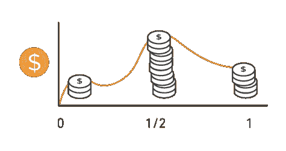
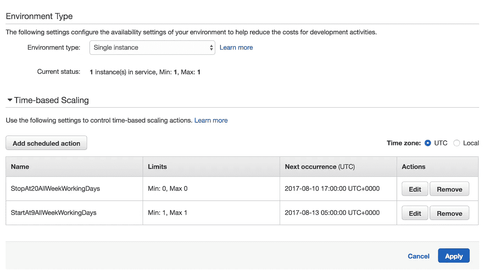
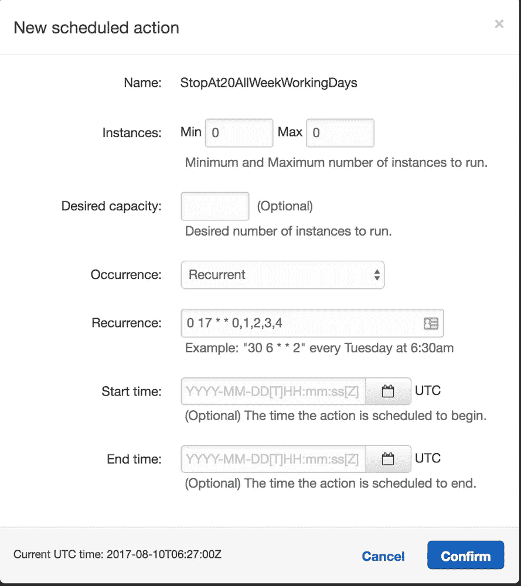
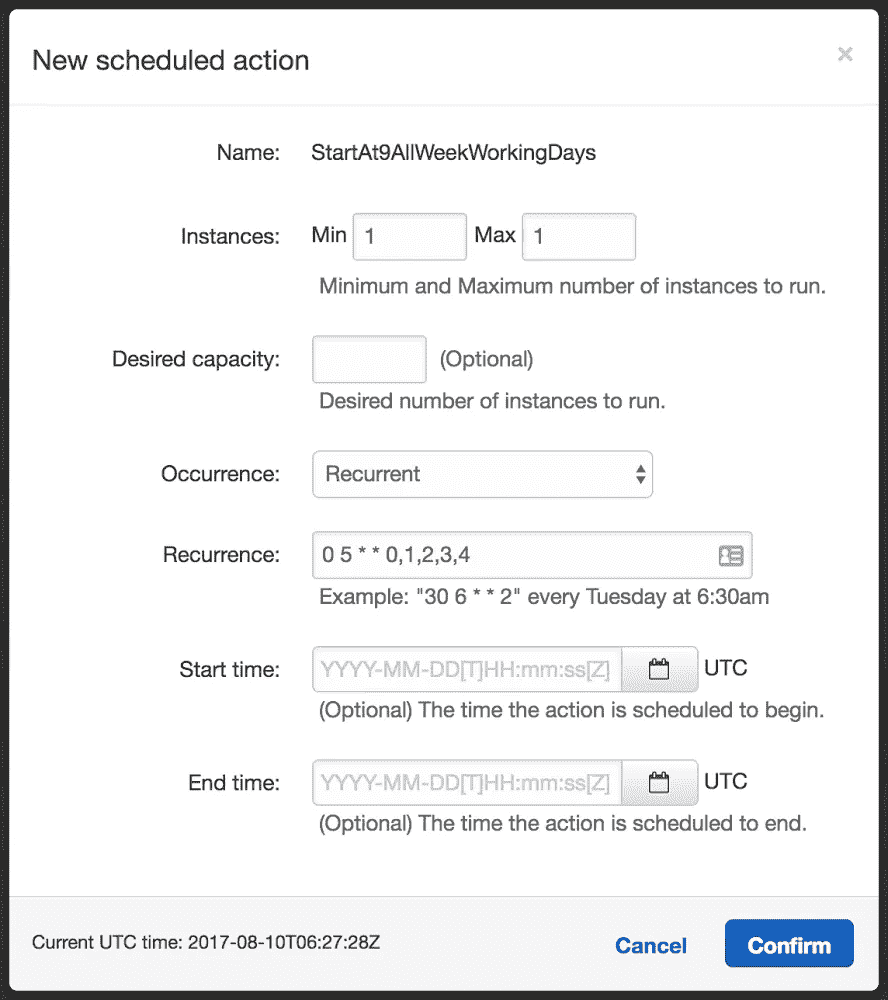

# 我如何在下班期间通过暂停机器来优化 AWS 弹性豆茎的成本

> 原文：<https://medium.com/hackernoon/how-to-save-on-aws-elastic-beanstalk-ec2-machines-by-putting-them-to-sleep-d8533aeb610a>

如果您在 AWS Elastic Beanstalk 上运行一些非生产环境，您可能想知道如何在下班时间让它的服务器休眠，以便节省一些资源💰💰💰？

有一个简单的窍门 [AWS](https://hackernoon.com/tagged/aws) 提供，但不要因为一个原因而推广它。因此，没有多少人知道它。；)

你所需要做的就是在你的[环境](https://hackernoon.com/tagged/environment) *配置- >缩放- >* ***基于时间的缩放*** *部分定义两个时间段。*

一个周期使用基于 cron 的时间设置来停止 EC2 环境机器，另一个周期启动它们。

这里是 cron 定义，在每个工作日的 17:00 UTC 将 EC2 机器的数量减少到零— *0 17 * * 0，1，2，3，4*

cron 定义在每个工作日的 05:00 UTC 将 EC2 机器的数量增加到一台— *0 5 * * 0，1，2，3，4*

它实际做的是终止并重新创建机器，因为 AWS 不允许挂起/暂停 EC2 机器。

如果你可以在没有弹性负载平衡器的情况下运行，这将为你节省更多，因为这个技巧不会终止 LB。🤑