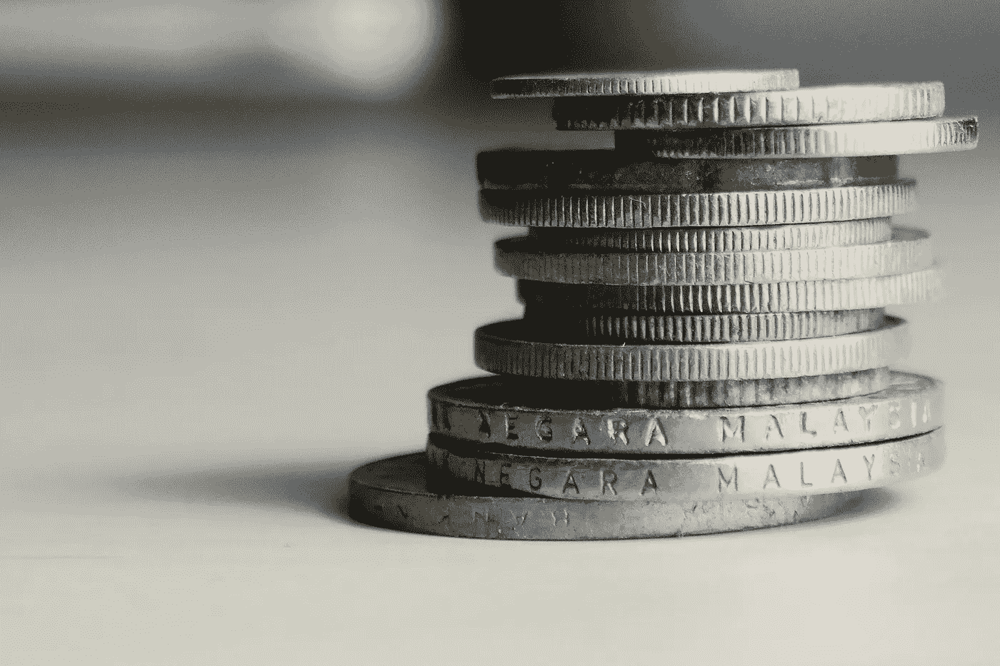
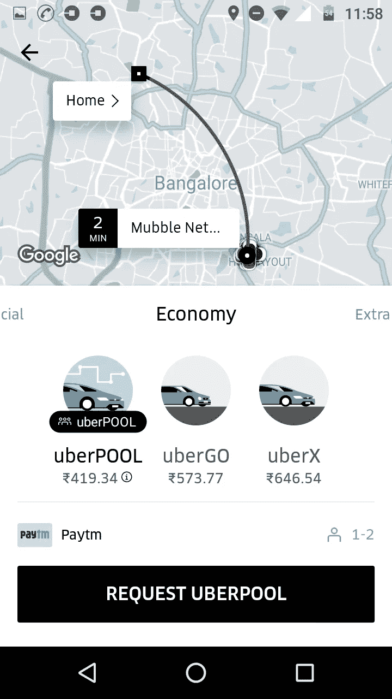
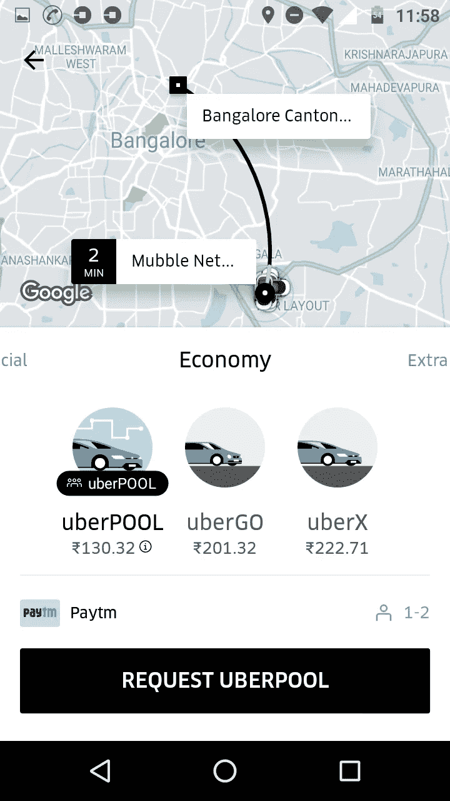
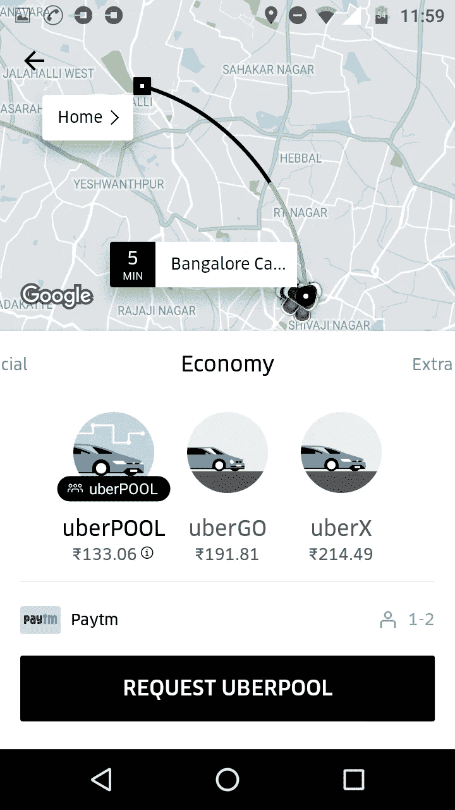
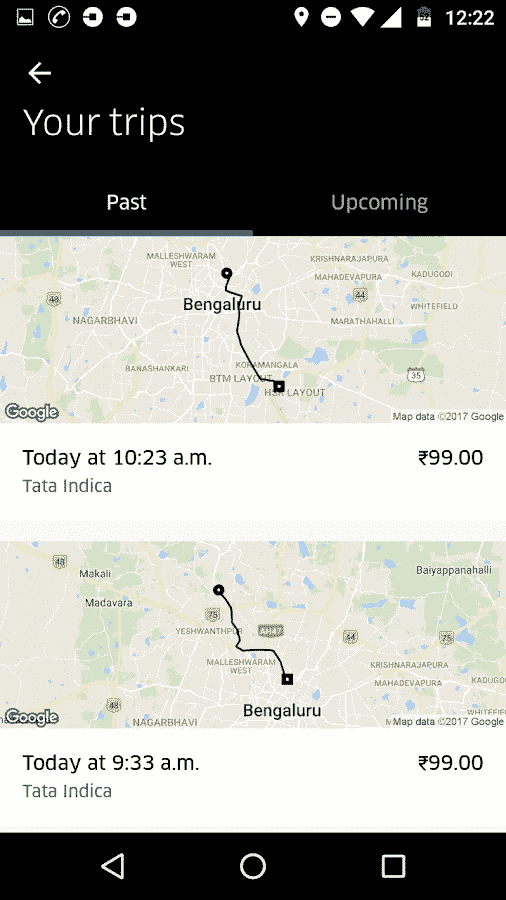

# 为什么两个优步游泳池比一个便宜？

> 原文：<https://medium.com/hackernoon/how-to-save-on-uber-rides-d24f9935ca73>

## 在优步游乐设施上省钱:

我想进行一次 14 英里的旅行。因为我所在的城市(班加罗尔)交通拥挤。通常需要一个小时。

我输入了来源和目的地

优步池显示价格为 419 卢比或 6.49 美元。我想，如果我去旅行两次呢？

总数现在是 4.02 美元。我可以节省 2 美元。

# 你去旅行了吗？

我有优步通行证。特价在 6 美元左右(我没有截图，上面的截图是很久以后拍的)。我去了两趟。

总费用是 3 美元。我存了 50%。

# 为什么会这样呢？

我不确定，但我只能说这和优步用来计算价格的算法有关。把你的长途旅行分成短的一次，你可以节省很多。