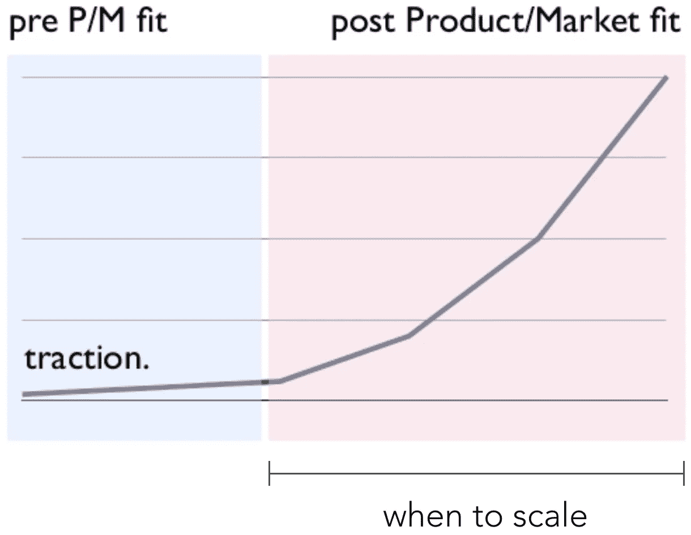
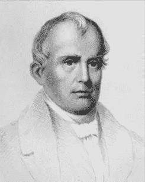
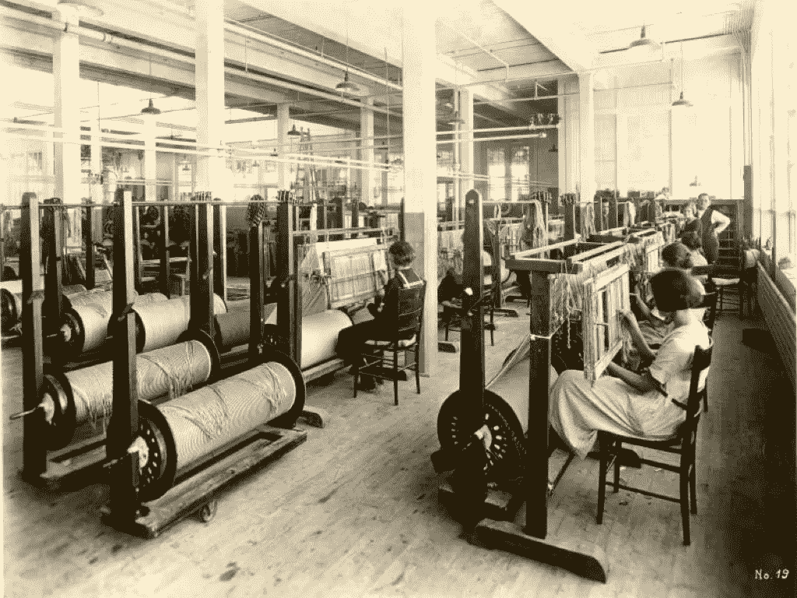

# 如何扩大你的创业规模:一个介绍

> 原文：<https://medium.com/hackernoon/how-to-scale-your-startup-an-intro-219185513449>

via [Digital Trends](http://www.digitaltrends.com/photography/scaling-asias-anti-everest-mountain/)

作为初创公司的员工，我们都渴望打造伟大而永恒的公司。在早期，我们专注于将产品推出市场，寻找早期用户/客户。然后就是招聘员工，增加一些流程，努力把一群衣衫褴褛的多面手变成一家“真正的公司”。这就是它会变得混乱的地方。

早期阶段比较匆忙，比如发布产品、吸引用户、筹集资金，关键是要快速行动，把事情做完。但随着公司的成长，你会雇佣更多的人来执行不同的职能，并让自己远离日常事务。然后，你可能会开始怀疑，自己到底应该做些什么，以及自己的公司到底能带来多少价值。

这是为处于那个阶段的创业者准备的。

那么我是谁呢？我很早就加入了 T2 Xpenser T3 公司(加入时我们只有 2 个人)。后来又有一些人加入了我们的团队，最终我们被 SaaS 的一家新兴企业 [Coupa](http://www.coupa.com) 收购，该公司从事消费管理领域的业务。在 3.5 年多的时间里，我帮助公司从约 100 人发展到 650 多人，在全球各地设有[办事处](http://www.coupa.com/company/our-offices/)(也成为该领域的领导者)。在这个过程中，我学到了一些关于如何扩大公司规模的知识。

*这一系列文章将被分解为几个帖子。这是介绍。*

**首先，什么是规模经济？**

> “扩张是指[你可以]自信地、系统地加速增长的时期。”
> 
> - [Fred Destin，Accel](https://www.quora.com/What-is-involved-in-a-startup-scaling)

一旦有什么东西起作用了，你就往火上浇汽油。结垢是一门艺术，倒入气体，而不是被大火吞没。它包括雇佣更多的人，在你的公司建立几个不同的组织/职能，筹集资金等。不过，这主要涉及一种心态转变，我们将在下文中探讨。

务必注意扩展的时间和地点。[初创公司基因组报告](https://s3.amazonaws.com/startupcompass-public/StartupGenomeReport2_Why_Startups_Fail_v2.pdf)的一项研究显示，74%的高速增长的互联网初创公司由于规模过早扩张而失败。[弗雷德还指出:“太多初创公司都错过了在恰当的时候不换挡就成功的机会。”因此，时机至关重要。](https://www.quora.com/What-is-involved-in-a-startup-scaling)

via [Andrew Chen](https://twitter.com/andrewchen)’s [Zero to Product/Market Fit](http://andrewchen.co/zero-to-productmarket-fit-presentation/) (slide 22)

如果我们描绘一家初创公司的发展历程，在早期应该有一个单一的焦点——找到适合市场的产品。如何找到 PMF 超出了本系列的范围，但是如果你需要的话，网上有几个好的帖子。

但是一旦你达到了 PMF，你就必须趁热打铁。

**但是为什么缩放很重要呢？**

为了说明为什么良好的扩展将好的公司与伟大的公司区分开来，我将借用一个历史上的例子，这个例子是我在参加[管理](https://www.harrisonmetal.com/courses/foundations-general-management)课程期间从[哈里森金属](https://www.harrisonmetal.com/)的[迈克尔·迪尔林](https://twitter.com/mcgd)那里学到的(你应该报名)。

via [NNDB](http://www.nndb.com/people/359/000351303/)

以上是[山姆·斯莱特](https://en.wikipedia.org/wiki/Samuel_Slater)。他出生在英格兰，1789 年来到罗德岛。纺织品贸易在美国几乎不存在，所以他记住了一家棉纺厂的设计，并来到美国获利。他一到这里，就从一个叫阿尔米·布朗的组织那里筹集了一些钱，他们一起建立了美国第一家纺织厂。

A Slater Mill

在某个时候，他决定与 Almy & Brown 分道扬镳，成立自己的公司。不幸的是，他不是一个伟大的经理。他的员工不断辞职，选择与他竞争或为他的工厂提供服务。不仅如此，他与现实脱节。由于没有关注需求，他一度过度生产了价值 3 年的棉花(价值约 10 万美元)——随之而来的是他的工厂的裁员和关闭。众所周知，他错过了纺织行业的一项重大创新——动力工厂。值得注意的是，这并不是因为他不相信 power mill 更好，他只是更喜欢做他已经知道的事情。

via [Encyclopedia](http://www.encyclopedia.com/topic/Francis_Cabot_Lowell.aspx)

大约在同一时间，一个名叫弗朗西斯·卡伯特·洛威尔的人出现在马萨诸塞州。他在国外呆了两年，研究英国的发电厂设计。他一回到美国，就从[波士顿联合公司](https://en.wikipedia.org/wiki/The_Boston_Associates)筹集了一些资金，成立了[波士顿制造公司。](https://en.wikipedia.org/wiki/Boston_Manufacturing_Company)

他的故事有点不同。他对员工很好——支付比预期更多的工资，他建造住房、学校、教堂等等(与工厂传统的恶劣工作条件形成鲜明对比)。他的工厂取得了巨大的成功——当时是美国最大的工厂，有 300 多名员工。它是如此的成功，使这个小镇从几十户人家发展成为一个大城市，并成为工业革命的领导者。10 年以上 2500 到 18K)。洛厄尔式的工厂成了几十年后效仿的榜样，他们甚至以他的名字命名了马萨诸塞州的洛厄尔市。

A comparison of a Slater mill vs Lowell style factories

现在，要明确的是——斯莱特绝不是一个失败者。斯莱特和洛厄尔都很聪明。但是洛厄尔拥抱缩放和管理，而斯莱特则异常专注，把自己限制在一个自我强加的上限内。

创始人和企业家也会陷入同样的模式。过度关注他们早期喜欢做的事情(构建产品等)，一旦他们实现了产品的市场适应性，就会忽略更大的图景。为了建立一个伟大而持久的公司，对于创始人和企业家来说，考虑规模扩张是至关重要的。

**如何看待缩放**

当你过渡到扩展模式时，最大的变化是精神上的——你必须学会从制造者过渡到管理者。你必须开始深入思考你的公司如何运作，而不是发布什么功能。你必须关注文化和价值观，而不是达成交易。你的影响变得不那么直接有形，但如果做得好，产出会更大。

> “建立业务意味着专注于产品特性、吸引早期客户、竞争以及制造轰动效应。
> 
> 建立公司意味着对人力资源政策、公司价值观和文化、长期战略和投资者报告等问题的痴迷。"
> 
> [-马特·布伦伯格，Return Path 的创始人&首席执行官](https://www.onlyonceblog.com/2011/10/building-the-company-vs-building-the-business)

我发现一个有助于思考如何扩大公司规模的框架，它来自英特尔前首席执行官[安迪·格罗夫](https://en.wikipedia.org/wiki/Andrew_Grove)的[高产出管理](https://www.amazon.com/High-Output-Management-Andrew-Grove/dp/0679762884)。如果你还没有读过他的[书](https://hackernoon.com/tagged/book)，你真的应该停下一切，现在就去读一读。

在他的书中，他指的是下面的图，黑盒。这个想法是，你把一些东西放进这个黑盒子，一些事情发生了，其他的东西出来了。

via [High Output Management](https://www.amazon.com/High-Output-Management-Andrew-Grove/dp/0679762884)

这和创业有什么关系呢？上面的黑盒显然有 3 个元素——输入、机器和输出。如果我们把你的初创公司想象成一个黑匣子，就更容易识别和关注什么是重要的。

*   输入→人员
*   机器→组织结构
*   输出→结果

所以，一旦你到了 PMF，改变你的思维状态，开始把自己看作是你创业的黑匣子的管理者。你的工作是持续关注上面列出的三件事——人、组织结构、结果，并确保所有这些都全力以赴。

> “创始人应该把自己的公司视为一种产品，并以同样的热情和关怀来打造和塑造它。”
> 
> [-鲁洛夫·博塔](http://avc.com/2011/10/building-a-company-vs-building-a-business/)

在随后的文章中，我们将探讨每个主题以及每个领域需要记住的一些关键事项。下面的链接，仍在进行中！

[如何扩大你的创业规模第二部分:人](/@chriseyin/how-to-scale-your-startup-part-2-people-6bee26696ae8#.pae05oxys)

[如何扩大你的创业规模第三部分:组织设计](https://hackernoon.com/how-to-scale-your-startup-part-3-organizational-structure-1e3c8736e33c#.82m7j9n11)

[如何扩展你的创业第四部分:结果](/@chriseyin/how-to-scale-your-startup-part-4-results-e1ff5a982bd1#.10c8g447n)

*如果你喜欢这个帖子，点击下面的心形，在*[*Twitter(@ chriseyin)*](https://twitter.com/chriseyin)*上关注我。任何反馈/想法、评论或* [*随时给我发邮件*](mailto:christopher.e.yin@gmail.com) *。*

> [黑客中午](http://bit.ly/Hackernoon)是黑客如何开始他们的下午。我们是 [@AMI](http://bit.ly/atAMIatAMI) 家庭的一员。我们现在[接受投稿](http://bit.ly/hackernoonsubmission)，并乐意[讨论广告&赞助](mailto:partners@amipublications.com)机会。
> 
> 如果你喜欢这个故事，我们推荐你阅读我们的[最新科技故事](http://bit.ly/hackernoonlatestt)和[趋势科技故事](https://hackernoon.com/trending)。直到下一次，不要把世界的现实想当然！

