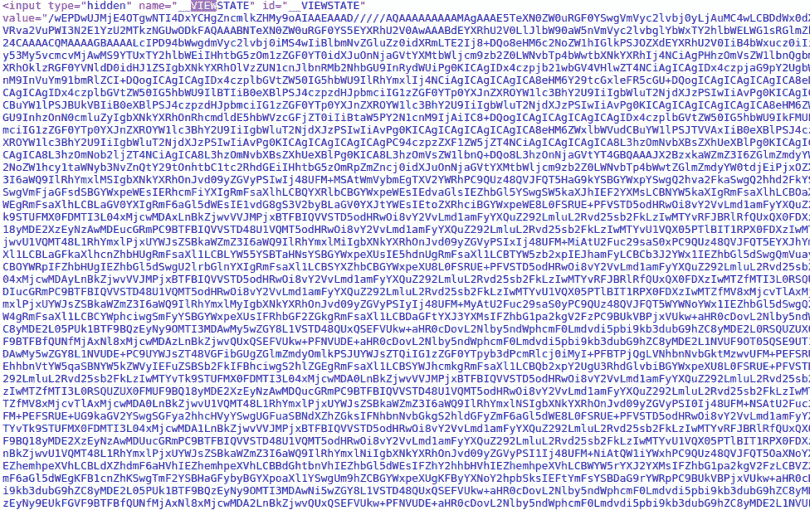
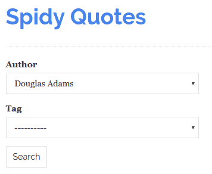
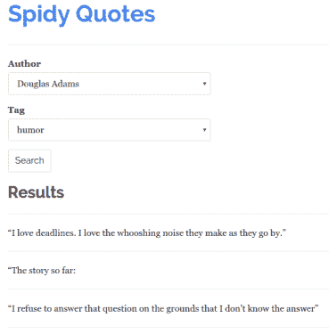
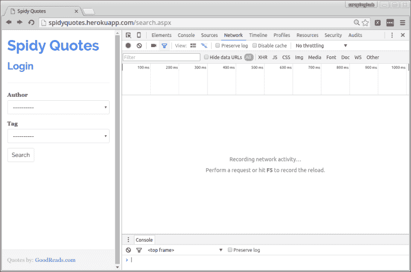
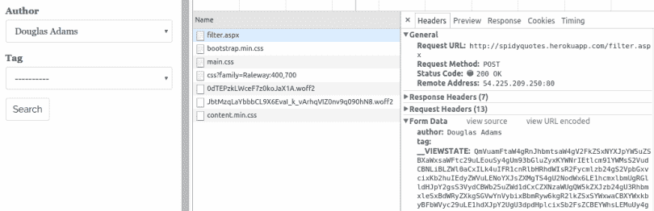
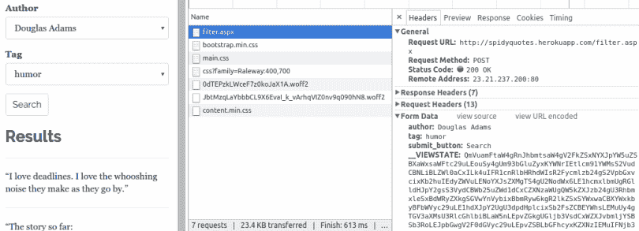

# 如何使用 Scrapy 抓取基于视图状态的网站

> 原文：<https://medium.com/hackernoon/how-to-scrape-websites-based-on-viewstates-using-scrapy-39feb9445755>

如果你发现自己正在浏览一个需要通过表单提交数据的 ASP.Net 页面，这篇文章可能会派上用场。Scrapy 是我在本教程中使用的工具，它是一个[开源](https://scrapy.org/community/)网络爬行框架。

# 处理 ASP.Net 页面、回发和视图状态

使用 ASP.Net 技术建立的网站通常是网页抓取开发者的噩梦，主要是由于他们处理表单的方式。

这些类型的网站通常在请求和响应中发送状态数据，以便跟踪客户端的 UI 状态。想想那些你注册的网站，当你在 HTML 表单中填写数据的时候，要浏览很多页面。ASP.Net 网站通常会将您在之前页面中填写的数据存储在一个名为“__VIEWSTATE”的隐藏字段中，该字段包含一个巨大的字符串，如下所示:



*我不是在开玩笑，这是巨大的！(有时几十 kB)*

这是代表客户端 UI 状态的 Base64 编码字符串，包含表单中的值。这种设置在 web 应用程序中特别常见，在 web 应用程序中，表单中的用户操作会触发 POST 请求返回到服务器，以获取其他字段的数据。

__VIEWSTATE 字段随浏览器向服务器发出的每个 POST 请求一起传递。然后，服务器从这些数据中解码并加载客户端的 UI 状态，执行一些处理，根据新值计算新视图状态的值，并将新视图状态呈现为隐藏字段。

如果 __VIEWSTATE 没有发送回服务器，您可能会看到一个空白表单，因为服务器完全丢失了客户端的 UI 状态。因此，为了抓取像这样的表单产生的页面，您必须确保您的爬行器正在发送其请求的状态数据，否则页面将不会加载它期望加载的内容。

这里有一个具体的例子，这样你可以直接看到如何处理这些类型的情况。

# 基于视图状态抓取网站

今天的刮痧豚鼠是[quotes.toscrape.com/search.aspx](http://quotes.toscrape.com/search.aspx)。该网站列出名人名言，其搜索页面允许您按作者和标签过滤名言:



在 **Author** 字段中的一个变化向服务器发出一个 POST 请求，用与所选作者相关的标签填充**标签**选择框。点击**搜索**会显示符合所选作者标签的任何引文:



为了收集这些引用，我们的蜘蛛必须模拟选择作者、标签和提交表单的用户交互。使用可以通过浏览器开发工具访问的[网络面板](https://developer.chrome.com/devtools)仔细查看这个流程的每个步骤。首先，访问 quotes.toscrape.com/search.aspx 的，然后通过按 F12 或 Ctrl+Shift+I(如果你使用 Chrome)并点击网络选项卡来加载工具。



从列表中选择一个作者，您将看到已经发出了对“/filter.aspx”的请求。单击资源名称(filter.aspx)会将您带到请求详细信息，您可以看到浏览器发送了您选择的作者以及来自服务器的原始响应中的 __VIEWSTATE 数据。



选择一个标签，然后单击搜索。您将看到您的浏览器发送了表单中选择的值以及一个 __VIEWSTATE 值，该值不同于前一个值。这是因为当您选择作者时，服务器在视图状态中包含了一些新信息。



现在你只需要建立一个蜘蛛，它做的事情和你的浏览器完全一样。

# 打造你的蜘蛛

以下是您的蜘蛛应该遵循的步骤:

1.  去叫 quotes.toscrape.com/search.aspx

2.对于在表单作者列表中找到的每个**作者**:

*   创建一个 POST 请求到/filter.aspx，传递所选的**作者**和 __VIEWSTATE 值

3.对于在结果页面中找到的每个**标签**:

*   向/filter.aspx 发出 POST 请求，传递选定的**作者**，选定的**标签**和视图状态

4.刮掉生成的页面

# 编码蜘蛛

这是我开发的蜘蛛，按照刚才描述的步骤从网站上抓取报价:

```
**import** scrapy**class** SpidyQuotesViewStateSpider(scrapy.Spider):
    name = 'spidyquotes-viewstate'
    start_urls = ['http://quotes.toscrape.com/search.aspx']
    download_delay = 1.5 **def** parse(self, response):
        **for** author **in** response.css('select#author > option ::attr(value)').extract():
            **yield** scrapy.FormRequest(
                'http://quotes.toscrape.com/filter.aspx',
                formdata={
                    'author': author,
                    '__VIEWSTATE': response.css('input#__VIEWSTATE::attr(value)').extract_first()
                },
                callback=self.parse_tags
            ) **def** parse_tags(self, response):
        **for** tag **in** response.css('select#tag > option ::attr(value)').extract():
            **yield** scrapy.FormRequest(
                'http://quotes.toscrape.com/filter.aspx',
                formdata={
                    'author': response.css(
                        'select#author > option[selected] ::attr(value)'
                    ).extract_first(),
                    'tag': tag,
                    '__VIEWSTATE': response.css('input#__VIEWSTATE::attr(value)').extract_first()
                },
                callback=self.parse_results,
            ) **def** parse_results(self, response):
        **for** quote **in** response.css("div.quote"):
            **yield** {
                'quote': response.css('span.content ::text').extract_first(),
                'author': response.css('span.author ::text').extract_first(),
                'tag': response.css('span.tag ::text').extract_first(),
            }
```

**步骤 1** 由 Scrapy 完成，它读取 start_urls 并向/search.aspx 生成 GET 请求。

parse()方法负责**步骤 2** 。它遍历在第一个选择框中找到的**作者**，并为每个**作者**创建一个[form request](http://doc.scrapy.org/en/latest/topics/request-response.html#formrequest-objects)to/filter . aspx，模拟用户是否点击了列表中的每个元素。值得注意的是，parse()方法从接收到的表单中读取 __VIEWSTATE 字段，并将其传递回服务器，以便服务器可以跟踪我们在页面流中的位置。

**步骤 3** 由 parse_tags()方法处理。它非常类似于 parse()方法，因为它提取列出的**标签**，并创建 POST 请求，传递每个**标签**，在前面的步骤中选择的**作者**，以及从服务器接收的 __VIEWSTATE。

最后，在**步骤 4** 中，parse_results()方法解析页面显示的报价列表，并从中生成条目。

# 使用 FormRequest.from_response()简化您的蜘蛛

您可能已经注意到，在向服务器发送 POST 请求之前，我们的蜘蛛会提取从服务器收到的表单中预先填充的值，并将这些值包含在它将要创建的请求中。

因为 [Scrapy](https://scrapy.org/) 提供了[form request . from _ response()](http://doc.scrapy.org/en/latest/topics/request-response.html#scrapy.http.FormRequest.from_response)方法，所以我们不需要手工编写代码。这个方法读取响应对象并创建一个`FormRequest`，它自动包含表单中所有预填充的值，以及隐藏的值。这就是我们蜘蛛的 parse_tags()方法的样子:

```
**def** parse_tags(self, response):
    **for** tag **in** response.css('select#tag > option ::attr(value)').extract():
        **yield** scrapy.FormRequest.from_response(
            response,
            formdata={'tag': tag},
            callback=self.parse_results,
        )
```

因此，每当您处理包含一些隐藏字段和预填充值的表单时，使用`from_response`方法，因为您的代码看起来会干净得多。

# 包裹

你可以在这里阅读更多关于视图状态的信息。我总是在寻找新的网络抓取技巧，所以如果你在抓取网络时遇到任何障碍，请在下面的评论中告诉我，或者随时联系 [Twitter](https://twitter.com/scrapinghub) 或[脸书](https://www.facebook.com/ScrapingHub/)。

作为一个提醒， [Scrapy Cloud](https://scrapinghub.com/platform/) 是一个永远免费的网络抓取平台，可以让你扩展和管理你的爬虫。如果您想部署您在本教程中构建的蜘蛛，请尝试 Scrapy Cloud。


这篇帖子是 Zyte(前身为 Scrapinghub)的开发者巴尔迪尔·斯图姆([@ stumjr](https://twitter.com/stummjr))写的。

请用心“推荐”，让别人可以学到更多的网页抓取技巧。

[](https://scrapinghub.com/data-services/)****了解更多关于网络抓取和网络数据能为你做什么。****

**[](http://bit.ly/HackernoonFB)****[](https://goo.gl/k7XYbx)****[](https://goo.gl/4ofytp)**

> **[黑客中午](http://bit.ly/Hackernoon)是黑客如何开始他们的下午。我们是 [@AMI](http://bit.ly/atAMIatAMI) 家庭的一员。我们现在[接受投稿](http://bit.ly/hackernoonsubmission)并乐意[讨论广告&赞助](mailto:partners@amipublications.com)机会。**
> 
> **如果你喜欢这个故事，我们推荐你阅读我们的[最新科技故事](http://bit.ly/hackernoonlatestt)和[趋势科技故事](https://hackernoon.com/trending)。直到下一次，不要把世界的现实想当然！**

****