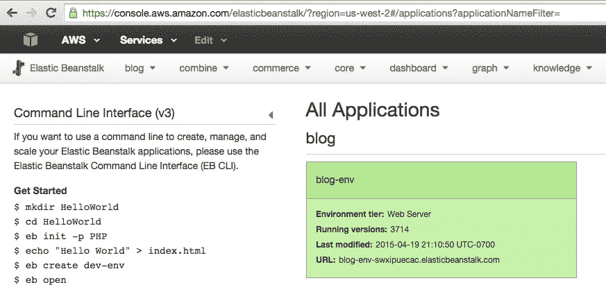
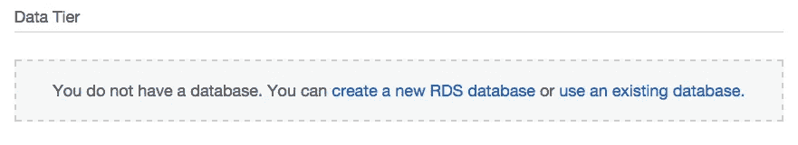
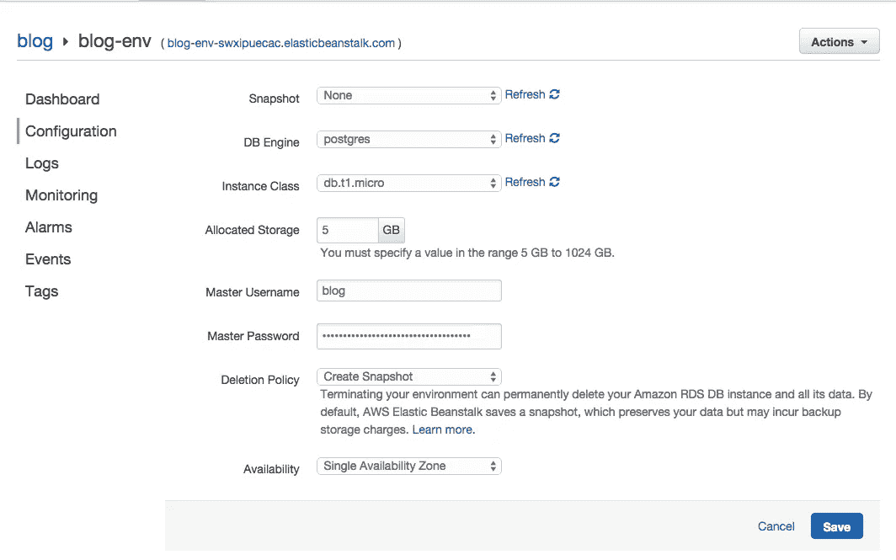
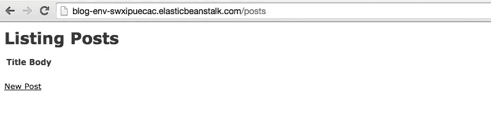

# 如何用 Elastic Beanstalk 和 PostgreSQL 在 AWS 上设置 Rails 4.2 应用程序

> 原文：<https://medium.com/hackernoon/how-to-set-up-a-rails-4-2-app-on-aws-with-elastic-beanstalk-and-postgresql-3f9f29c046e2>


*我之前在一年前发布过关于* [*如何在 rails 4.1*](/@jatescher/how-to-set-up-a-rails-4-1-app-on-aws-with-elastic-beanstalk-and-postgresql-66d4e3412629) *旧版本的 Elastic Beanstalk 上做到这一点的说明。这是更新的版本。*

部署 Rails 应用程序可能很棘手。对于简单的项目，像 Heroku 这样的工具可能是完美的。它非常适合制作应用原型和测试不同的想法，没有太多的麻烦。然而，当您的项目变得更加复杂，并且您想要更好地控制您的服务器、负载平衡器、工作人员、自动伸缩条件等时，您将无法获得您想要的灵活性。

有许多服务可以用来快速启动和运行 Rails 应用程序，同时仍然保持对基础设施的完全控制。一个合理的选择是亚马逊的[弹性豆茎](http://aws.amazon.com/elasticbeanstalk/)。亚马逊对这项服务的描述非常贴切:

> AWS Elastic Beanstalk 使开发人员更容易在 AWS 云中快速部署和管理应用程序。开发人员只需上传他们的应用程序，Elastic Beanstalk 就会自动处理容量供应、负载平衡、自动伸缩和应用程序健康监控的部署细节。

现在，Amazon [通过 RDS](http://aws.amazon.com/rds/postgresql/) 支持 PostgreSQL，拥有一个完全托管的 postgres 支持的 Rails 应用程序变得前所未有的简单！

你可以在[github . com/jtescher/example-rails-4.2-elastic-beanstalk-blog](https://github.com/jtescher/example-rails-4.2-elastic-beanstalk-blog)找到这篇文章的所有代码

如果你卡住了或者有其他问题，关于弹性豆茎的文档是非常好的。

# 入门指南

通过 [AWS 控制台](https://console.aws.amazon.com/elasticbeanstalk/)上的说明注册一个 [AWS](https://hackernoon.com/tagged/aws) 账户，然后通过自制软件下载 Elastic Beanstalk 命令行工具(或[此处](http://docs.aws.amazon.com/elasticbeanstalk/latest/dg/eb-cli3-getting-set-up.html#eb_cli3-install-with-pip)用于 PC)。

```
$ brew update
$ brew install aws-elasticbeanstalk
```

# 初始化 Rails 应用程序

在撰写本文时，rails 的最新版本是 4.2.1，所以我们现在将使用它。

```
$ gem install rails -v 4.2.1
$ rails new blog
$ cd blog
$ git init && git add -A && git commit -m "Add rails scaffold"
```

# 搭建帖子资源

我们将创建一个简单的示例应用程序，允许您操作帖子。要在 Rails 中生成这个，请使用:

```
$ rails generate scaffold post title:string body:text
$ bundle exec rake db:migrate
$ git add -A && git commit -am "Add post resource"
```

# 初始化弹性 Beanstalk 应用程序

现在我们可以通过 eb 命令初始化一个新的 Beanstalk 应用程序。

```
$ eb init
```

我会选择以下设置，但是关于每个选项的描述，请参见 AWS 示例[这里的](http://docs.aws.amazon.com/elasticbeanstalk/latest/dg/create_deploy_Ruby_rails.html#create_deploy_Ruby_eb_init-rds)。

```
Select a default region
3) us-west-2 : US West (Oregon)Select an application to use
[ Create new Application ]Enter Application Name
blog
Application blog has been created.It appears you are using Ruby. Is this correct?
(y/n): ySelect a platform version.
1) Ruby 2.2 (Puma)Do you want to set up SSH for your instances?
(y/n): n
```

这将在项目的根目录下建立一个. elasticbeanstalk 目录，并将其添加到您的。gitignore 文件。您不希望您的配置存储在 git 中，因为那里可能有私人信息。让我们现在提交这些更改:

```
$ git commit -am "Ignore elasticbeanstalk settings"
```

# 创造弹性豆茎环境

每个弹性 Beanstalk 应用程序可以有许多环境。这对于为同一个应用程序提供开发和生产环境非常有用。

要创建新环境，请运行以下命令:

```
$ eb create blog-env: Creating application version archive "b303".
  Uploading blog/b303.zip to S3\. This may take a while.
  Upload Complete.
  Environment details for: blog-env
    Application name: blog
    Region: us-west-2
    Deployed Version: b303
    Environment ID: e-g5mkeawrnz
    Platform: 64bit Amazon Linux 2015.03 v1.3.0 running Ruby 2.2 (Puma)
    Tier: WebServer-Standard
    CNAME: UNKNOWN
    Updated: 2015-04-19 23:38:50.955000+00:00
  Printing Status:
  INFO: createEnvironment is starting.
  INFO: Using elasticbeanstalk-us-west-2-83376862866 as Amazon S3 storage bucket for environment data.
  INFO: Created load balancer named: awseb-e-g-AWSEBLoa-7R0CSEMQ6W2M
  INFO: Created security group named: awseb-e-g5mkeawrnz-stack-AWSEBSecurityGroup-56IUD2ZYQ5FR
  INFO: Created Auto Scaling launch configuration named: awseb-e-g5mkeawrnz-stack-AWSEBAutoScalingLaunchConfigurat...
  INFO: Created Auto Scaling group named: awseb-e-g5mkeawrnz-stack-AWSEBAutoScalingGroup-2URXDKL0NCIJ
  INFO: Waiting for EC2 instances to launch. This may take a few minutes.
  INFO: Created Auto Scaling group policy named: arn:aws:autoscaling:us-west-2:833768628226:scalingPolicy:02920f8b...
  INFO: Created Auto Scaling group policy named: arn:aws:autoscaling:us-west-2:833768628666:scalingPolicy:b143cea1...
  INFO: Created CloudWatch alarm named: awseb-e-g5mkeawrnz-stack-AWSEBCloudwatchAlarmHigh-APCUnlMHNIS1
  INFO: Created CloudWatch alarm named: awseb-e-g5mkeawrnz-stack-AWSEBCloudwatchAlarmLow-1UL48B2CC2OM8
  INFO: Added EC2 instance 'i-7f4b6eb7' to Auto Scaling Group 'awseb-e-g7mkeawrnz-stack-AWSEBAutoScalingGroup-2URX...
  INFO: Application available at blog-env-zckzptpdgy.elasticbeanstalk.com.
  INFO: Successfully launched environment: blog-env
```

环境现在应该正在运行。要查看状态和 URL:

```
$ eb status
  Environment details for: blog-env
    Application name: blog
    Region: us-west-2
    Deployed Version: b303
    Environment ID: e-g5mkeawrn
    Platform: 64bit Amazon Linux 2015.03 v1.3.0 running Ruby 2.2
    Tier: WebServer-Standard
    CNAME: blog-env-zckzptpdg2.elasticbeanstalk.com
    Updated: 2015-04-19 23:51:59.259000+00:00
    Status: Ready
    Health: Green
```

设置 Rails 的最后一件事是添加一个 *SECRET_KEY_BASE* 环境变量。

要生成新的密钥，请使用:

```
$ rake secret
  f655b5cfeb452e49d9182c6b5e6856704e6e1674082fa1e5f1a330782bad1833ba4cc30951e094f9250c87573dc0bbd3d46d37c5d79ff57...
```

然后，为了将这个秘密添加到您的弹性 beanstalk 环境中，请使用:

```
$ eb setenv SECRET_KEY_BASE=f655b5cfeb452e49d9182c6b5e6856704e6e1674082fa1e5f1a330782bad1833ba4cc30951e094f9250...
```

现在，如果您导航到[YOUR-ENV]. elastic beanstalk . com/posts，您应该会看到您的帖子索引视图:


# 结合 Rails 使用 PostgreSQL

现在我们的应用程序只是使用 SQLite，它不是为生产使用而设计的，也不能跨实例共享。我们可以通过将 [PostgreSQL](https://hackernoon.com/tagged/postgresql) 添加到您的应用程序和弹性 Beanstalk 环境中来解决这个问题。

# 添加 pg gem

打开您的 Gemfile。将 sqlite3 gem 移动到您的开发和测试模块中，并添加一个包含 pg gem 的生产组。之后，它应该看起来像这样:

```
source 'https://rubygems.org' # Bundle edge Rails instead: gem 'rails', github: 'rails/rails'
  gem 'rails', '4.2.1'
  # Use SCSS for stylesheets
  gem 'sass-rails', '~> 5.0'
  # Use Uglifier as compressor for JavaScript assets
  gem 'uglifier', '>= 1.3.0'
  # Use CoffeeScript for .coffee assets and views
  gem 'coffee-rails', '~> 4.1.0'
  # See [https://github.com/rails/execjs#readme](https://github.com/rails/execjs#readme) for more supported runtimes
  # gem 'therubyracer', platforms: :ruby # Use jquery as the JavaScript library
  gem 'jquery-rails'
  # Turbolinks makes following links in your web application faster. Read more: [https://github.com/rails/turbolinks](https://github.com/rails/turbolinks)
  gem 'turbolinks'
  # Build JSON APIs with ease. Read more: [https://github.com/rails/jbuilder](https://github.com/rails/jbuilder)
  gem 'jbuilder', '~> 2.0'
  # bundle exec rake doc:rails generates the API under doc/api.
  gem 'sdoc', '~> 0.4.0', group: :doc # Use ActiveModel has_secure_password
  # gem 'bcrypt', '~> 3.1.7' # Use Unicorn as the app server
  # gem 'unicorn' # Use Capistrano for deployment
  # gem 'capistrano-rails', group: :development group :development, :test do
    # Use sqlite3 as the database for Active Record
    gem 'sqlite3', '~> 1.3.10' # Call 'byebug' anywhere in the code to stop execution and get a debugger console
    gem 'byebug' # Access an IRB console on exception pages or by using <%= console %> in views
    gem 'web-console', '~> 2.0' # Spring speeds up development by keeping your application running in the background. Read more: [https://github.com/rails/spring](https://github.com/rails/spring)
    gem 'spring'
  end group :production do
    # Use PostgreSQL as the database for Active Record
    gem 'pg', '~> 0.18.1'
  end
```

现在运行 *$ bundle install* 来安装 gem。

# 配置 database.yml 以使用 RDS postgres

数据库凭证不应该被硬编码，而 Elastic Beanstalk 使得将它们设置为环境变量变得非常简单。RDS 变量是自动配置和更新的，因此 *config/database.yml* 的生产部分可以更新为以下内容:

```
production:
    <<: *default
    adapter: postgresql
    encoding: unicode
    database: <%= ENV['RDS_DB_NAME'] %>
    username: <%= ENV['RDS_USERNAME'] %>
    password: <%= ENV['RDS_PASSWORD'] %>
    host: <%= ENV['RDS_HOSTNAME'] %>
    port: <%= ENV['RDS_PORT'] %>
```

# 让 pg gem 在弹性豆茎上工作

现在让我们将数据库添加到我们的环境中。这需要几个步骤，但我会带你走一遍。首先转到 AWS 控制台中的弹性豆茎部分:[console.aws.amazon.com/elasticbeanstalk/?region=us-west-2](https://console.aws.amazon.com/elasticbeanstalk/?region=us-west-2)(注意地区是 us-west-2，如果您部署到不同的地区，请检查那里。)



现在点击 *blog-env* 并进入左侧导航的配置。在底部，您应该会看到:



现在单击“创建新的 RDS 数据库”，将 DB 引擎设置为“postgres ”,并创建主用户名和主密码。



单击“Save ”,您将拥有一个功能完整的 PostgreSQL 实例，并且环境变量将自动添加到您的 Beanstalk 环境中。

现在，要在您的服务器上安装 pg gem，需要使用 *postgresql93-devel* yum 包。在弹性 Beanstalk 实例上配置包就像删除 YAML 格式的一样简单。配置文件放在顶层。ebextensions 文件夹。

```
# .ebextensions/packages.config
  packages:
    yum:
      postgresql93-devel: []
```

现在提交此更改并重新部署应用程序。

```
$ git add -A && git commit -am "Add PostgreSQL as production database"
$ eb deploy
```

一旦完成，你就可以重新加载/posts 页面，看到你的全功能 postgres 支持的 Rails 应用！万岁！

