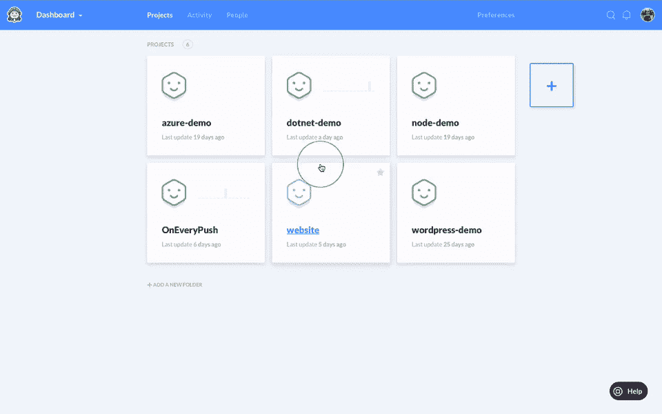

# 如何设置向 Heroku 的连续交货

> 原文：<https://medium.com/hackernoon/how-to-set-up-continuous-delivery-to-heroku-265cb0cd2033>

持续交付的主要思想是允许开发人员更快、更频繁地构建、测试和部署软件。

本教程将向您解释如何优化您的工作流程，以便在每次使用 Buddy CI/CD 将应用程序推送到主分支时，您的应用程序会被自动测试并推送到 [Heroku](https://hackernoon.com/tagged/heroku) 。请记住，您需要一个 Heroku 帐户和一个空应用程序，才能在您的好友管道中使用它。

# 正在初始化项目的版本控制

首先，我们需要将您的项目导入 Buddy，并将其置于版本控制之下。对于这个演示，我们应该使用一个简单的基于 servlet 的 [Java](https://hackernoon.com/tagged/java) web 应用程序。

*   创建一个**新项目**，选择 **Buddy** 作为 Git 提供者，使用
    **Import ZIP archive** 选项并将链接粘贴到 Java 项目:`https://assets.buddy.works/guides/buddy-simple-java-project.zip`

Importing project to Buddy

**备注:**

*   如果您是 GitHub 用户，您可以从 [**我们的简介**](https://github.com/buddy-works/simple-java-project) 中派生出示例项目，选择 GitHub 作为提供者，集成后从列表中选择项目
*   如果你不熟悉 Git， [**本指南**](https://buddy.works/guides/first-steps-with-git?utm_source=medium&utm_medium=post&utm_campaign=how-to-set-up-continuous-delivery-to-heroku&utm_content=link) 将帮助你入门

# 喜欢你读的吗？点击这里查看全文。

> [黑客中午](http://bit.ly/Hackernoon)是黑客如何开始他们的下午。我们是阿美族家庭的一员。我们现在[接受投稿](http://bit.ly/hackernoonsubmission)并乐意[讨论广告&赞助](mailto:partners@amipublications.com)机会。
> 
> 如果你喜欢这个故事，我们推荐你阅读我们的[最新科技故事](http://bit.ly/hackernoonlatestt)和[趋势科技故事](https://hackernoon.com/trending)。直到下一次，不要把世界的现实想当然！

