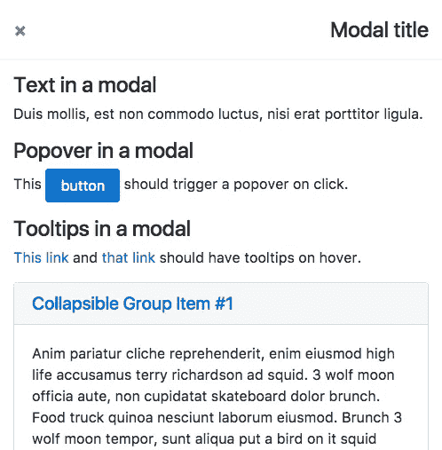
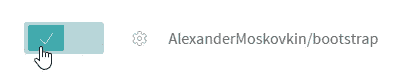
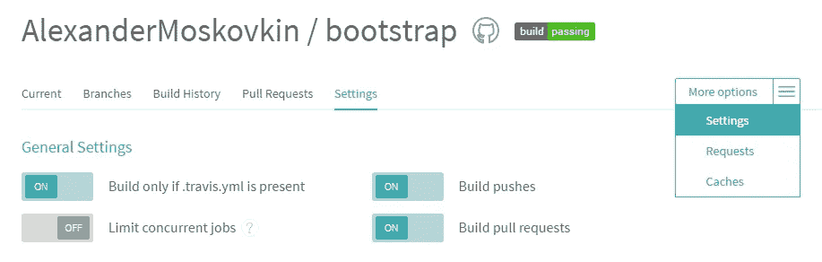
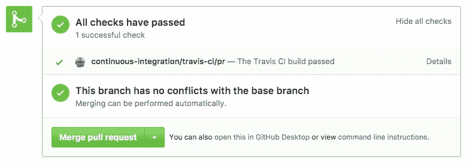
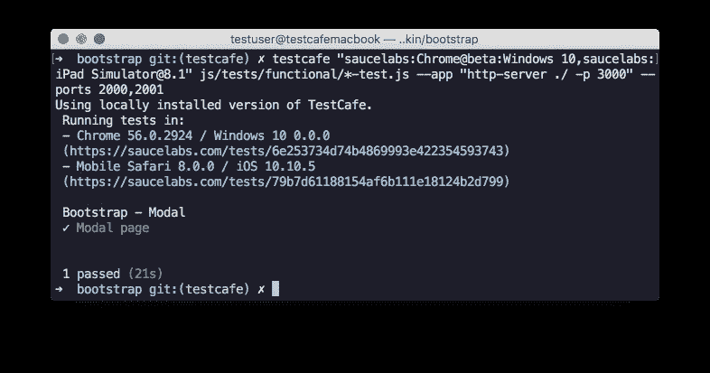

# 如何为您的 GitHub 项目设置 E2E 浏览器测试

> 原文：<https://medium.com/hackernoon/how-to-set-up-e2e-browser-testing-for-your-github-project-89c24e15a84>

如今，大量大大小小的项目都是使用 [Node.js](https://nodejs.org/en/) 工具开发的，并托管在 [GitHub](https://github.com/) 上。这些项目的作者经常面临选择端到端测试工具的需求。当我们在 DevExpress 创建 [TestCafe](https://devexpress.github.io/testcafe/) 时，我们希望它能够完美地适应现代 [Node.js](https://hackernoon.com/tagged/nodejs) 开发工作流程。

*   在测试和你正在开发的项目中使用相同的语言——现代的 [JavaScript](https://hackernoon.com/tagged/javascript) ,支持 ES6 和 ES7 特性。
*   易于安装和启动。无需安装和维护额外的产品和浏览器插件。测试可以在`npm install`之后立即运行。
*   易于与 CI 系统集成。
*   TestCafe 功能可以用插件来扩展。
*   测试可以使用任何第三方 Node.js 模块。

在本文中，我将展示在 GitHub 上为 Node.js web 项目设置自动化测试是多么容易。使用一个真实的项目( [Bootstrap](https://github.com/twbs/bootstrap) )作为例子，我将描述如何在开发人员的机器上的本地浏览器中设置测试，以及如何一步一步地在 [Travis CI](https://travis-ci.org/) 上配置持续集成测试。在 CI 测试部分，我将展示如何在 Travis CI 提供的浏览器(Chrome 和 Firefox)、headless 浏览器(the[NightmareJS](http://www.nightmarejs.org/)browser automation library)以及提供各种操作系统和浏览器进行测试的云服务( [SauceLabs](https://saucelabs.com/) )中运行测试。

我将展示如何在项目工作流程的每个阶段使用端到端测试:

*   在本地机器上。您可以在任何浏览器中运行测试，而无需安装额外的库和插件。
*   在拉取请求中。这允许您在将更改推送到主分支之前，确保项目运行良好。
*   将提交推送到主分支时。

为了运行测试，我们将使用 [TestCafe](https://github.com/DevExpress/testcafe) 测试框架。

我们将为用于开发 web 项目的最流行的 HTML、CSS 和 JavaScript 框架 [Bootstrap](https://github.com/twbs/bootstrap) 编写测试。为此，我分叉了引导库并创建了一个新的分支`testcafe`。撰写本文时，存储库有基于 QUnit 的单元测试，这些单元测试在发送每个 pull 请求并合并到主分支时运行。此外，repo 包含用于视觉测试组件的[页面](https://github.com/AlexanderMoskovkin/bootstrap/tree/v4-dev/js/tests/visual)，由人工进行手动验证。我们将为其中一个页面编写功能测试。

# 写作测试

我们将在测试中使用[页面对象](https://martinfowler.com/bliki/PageObject.html)模式。这种方法允许我们创建更多的声明性测试。在本文中，我们不会关注测试语法。有关测试 API 的信息，请参考 TestCafe [文档](https://devexpress.github.io/testcafe/documentation/test-api/)。

让我们用 Bootstrap 的模态组件为一个页面编写一个测试。模态对话框内部包含许多其他组件(手风琴、按钮等)。



TestCafe 选择器系统将帮助我们创建一个页面对象。我们将用一个单独的`page-model.js`文件中的类来描述整个页面及其组件。

你可以在这里找到整个页面对象。

有了 page 对象，测试不必使用 HTML 标记。相反，它们操作页面的对象表示。

此测试夹具的完整版本可从[这里](https://github.com/AlexanderMoskovkin/bootstrap/blob/testcafe/js/tests/functional/modal-test.js)获得。

# 开发期间在本地浏览器中测试

为了测试一个模态对话框页面，您需要一个 HTTP 服务器来提供这个页面。您可能已经有了一种在项目中提供测试页面的机制。我将使用一个简单的零配置 http 服务器。

安装 TestCafe 和 http-server。

```
npm install -g testcafe http-server
```

在此之后，您将能够在您的机器上安装的任何浏览器中运行测试，只需在控制台中输入一行代码。

```
testcafe chrome,firefox js/tests/functional/*-test.js --app "http-server ./ -p 3000"
```

`--app`选项允许您指定一个命令来部署您要测试的应用程序。

TestCafe 将启动 http-server，启动指定的浏览器，在其中运行测试，停止服务器并输出报告。

TestCafe [CLI](https://devexpress.github.io/testcafe/documentation/using-testcafe/command-line-interface.html) 还可以通过可执行文件的路径启动浏览器(适用于便携式浏览器)，向浏览器启动命令传递参数，并在远程浏览器中运行测试。

# 设置持续集成测试

我们将使用 [Travis](https://travis-ci.org/) 作为 CI 服务。或者，我们可以使用具有不同特性的其他服务( [AppVeyor](https://www.appveyor.com/) 、 [CircleCI](https://circleci.com/) 等)。

Travis CI 提供预装 Chrome 和 Firefox 的 Linux 虚拟机。

首先，我们应该将之前安装的模块添加到项目的开发依赖项中。您可以通过手动编辑`package.json`或运行以下命令来实现

```
npm install testcafe http-server --save-dev
```

## 设置 Travis CI

让我们配置 Travis CI 来为每个 pull 请求运行测试。首先，您需要为您的项目启用 Travis。

[使用您的 GitHub 帐户登录](https://travis-ci.org/auth)Travis CI。Travis CI 将从 GitHub 同步您的存储库。您可以在您的[个人资料页面](https://travis-ci.org/profile/)上看到他们。

通过打开开关，为您想要构建的存储库启用 Travis CI。



默认情况下，Travic CI 基于推送和拉取请求运行构建。您可以在存储库的设置中更改此行为。



让我们配置一下`.travis.yml`文件。在这个文件中，我们将指定 Node.js 版本和浏览器设置。此外，由于 Travis CI 使用没有常规图形环境的 Ubuntu 服务器虚拟机，我们[设置并使用 Xvfb](https://docs.travis-ci.com/user/gui-and-headless-browsers/#Using-xvfb-to-Run-Tests-That-Require-a-GUI) 来无标题地运行浏览器。

有关 Travis 配置的详细信息，请参见其[文档](https://docs.travis-ci.com/user/customizing-the-build)。

## 在预安装的浏览器中对拉请求运行测试

要在预先安装到 Travis CI 的浏览器中运行测试，向`package.json`添加一个`npm test`命令，其中包含我们用来在本地运行测试的行。

现在，当对主分支的拉请求被创建时，测试将在 Travis 上运行，您将能够查看一个[测试运行报告](https://travis-ci.org/AlexanderMoskovkin/bootstrap/builds/194429019)。拉请求中的提交状态将相应地改变。



在拉请求被合并并且变更被拉入主分支之后，Travis CI 将再次运行测试。您可以在您的 Travis CI 帐户中查看他们的状态，或者您可以将[徽章](https://docs.travis-ci.com/user/status-images/)添加到您的存储库自述文件中。

# 将测试配置为在无头浏览器中运行

如果您不需要测试依赖于浏览器的行为，您可能会发现在无头浏览器中运行测试非常有用。这允许您避免在测试机器上安装真正的浏览器。你只需要用`npm install`安装单个模块。例如，一个 TestCafe 社区成员创建了一个[插件](https://github.com/ryx/testcafe-browser-provider-nightmare)，它允许你开箱即用地运行 NighmareJS 中的测试。让我们安装这个插件。

```
npm install testcafe-browser-provider-nightmare --save-dev
```

之后，您可以将`nightmare`作为浏览器名称传递给测试运行命令。

```
testcafe nightmare js/tests/functional/*-test.js
```

TestCafe 允许你轻松地为任何这样的库创建你自己的插件。您可以在我们的[文档](https://devexpress.github.io/testcafe/documentation/extending-testcafe/browser-provider-plugin/)中找到说明。

# 使用跨浏览器测试服务在任何浏览器中进行测试

如果上面描述的测试选项不能满足您的需求，请考虑在具有跨浏览器测试服务的真实浏览器中进行测试( [BrowserStack](https://www.browserstack.com/) 、 [SauceLabs](https://saucelabs.com/) 等)。TestCafe 有一个[插件](https://github.com/DevExpress/testcafe-browser-provider-saucelabs)，可以让你在 SauceLabs 的虚拟机上运行测试。一个 SauceLabs 账户是免费的，如果你用它来测试一个开源项目。

要运行测试，首先安装一个插件。

```
npm install testcafe-browser-provider-saucelabs --save-dev
```

然后，您需要在全局变量中为您的 SauceLabs 帐户指定登录和访问密钥(`SAUCE_USERNAME`、`SAUCE_ACCESS_KEY`)。在本地运行测试时，您可以通过控制台来完成。要对 Travis 运行测试，请在您的 Travis 帐户中指定凭据。

TestCafe 可以使用以下命令通过 SauceLabs 显示所有可用的浏览器:

```
testcafe --list-browsers saucelabs
```

让我们在桌面和移动浏览器中运行我们的测试:

```
testcafe "saucelabs:Chrome@beta:Windows 10,saucelabs:iPad Simulator@8.1" js/tests/functional/*-test.js --app "http-server ./ -p 3000"
```

TestCafe 将在你的机器和 SauceLabs 服务器之间建立一个隧道，启动虚拟机，运行测试并输出结果。



如果您从存储库分支打开一个拉请求，有一些限制。不可能通过 Travis CI 在 pull 请求中进行跨浏览器测试，因为这可能会危及您的 SauceLabs 凭证。幸运的是，您可以通过使用 [Savage](https://github.com/twbs/savage) 来解决这个问题。

# 结论

如你所见，配置 TestCafe 不需要任何困难的操作。它只需一个控制台命令即可完成。TestCafe 可以输出不同格式的报告(json、nunit、spec、list、minimal)，并允许你用一个[插件](https://devexpress.github.io/testcafe/documentation/extending-testcafe/reporter-plugin/)创建自己的报告格式。这使您能够在每个 CI 系统中使用 TestCafe。你也可以用一个[吞咽](https://github.com/DevExpress/gulp-testcafe)或[咕哝](https://github.com/crudo/grunt-testcafe)的任务来运行你的测试。

由于 TestCafe 是为 Node.js 编写的，并且具有命令行和编程 API，因此您可以灵活地配置测试过程以适应您的特定任务，并使用第三方 Node.js 库。

如果你对 TestCafe 感兴趣，你可以在我们的[网站](https://devexpress.github.io/testcafe/)或者[资源库](https://github.com/DevExpress/testcafe)了解更多。

如果您在使用现有解决方案构建 CI 时有任何问题，请使用评论部分。你认为 TestCafe 可以帮助你吗？我将感谢您的意见和反馈。我准备好回答你的问题了。

[](http://bit.ly/HackernoonFB)[](https://goo.gl/k7XYbx)[](https://goo.gl/4ofytp)

> [黑客中午](http://bit.ly/Hackernoon)是黑客如何开始他们的下午。我们是 AMI 家庭的一员。我们现在[接受投稿](http://bit.ly/hackernoonsubmission)并乐意[讨论广告&赞助](mailto:partners@amipublications.com)机会。
> 
> 如果你喜欢这个故事，我们推荐你阅读我们的[最新科技故事](http://bit.ly/hackernoonlatestt)和[趋势科技故事](https://hackernoon.com/trending)。直到下一次，不要把世界的现实想当然！

