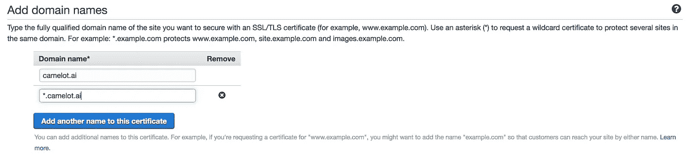
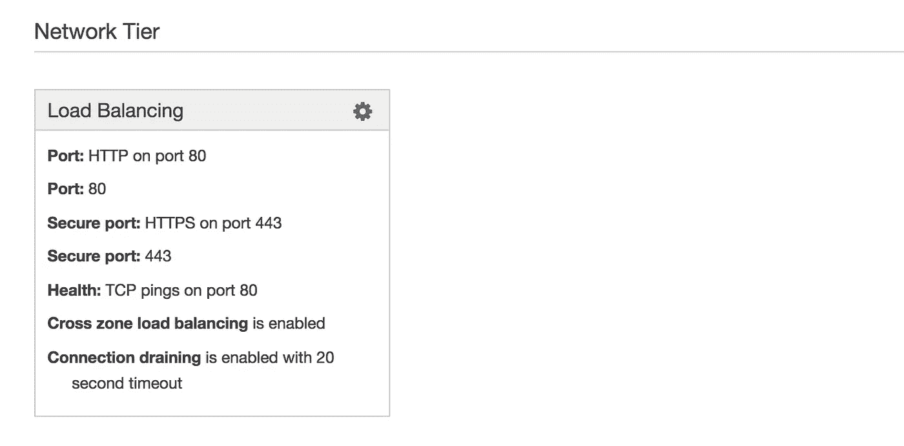
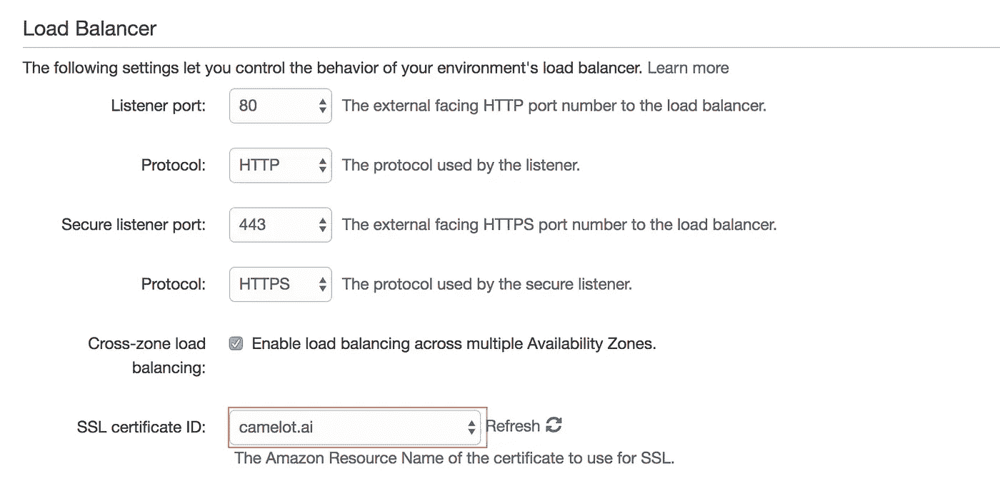
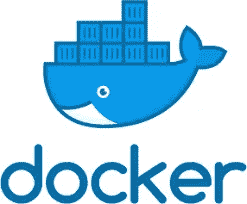
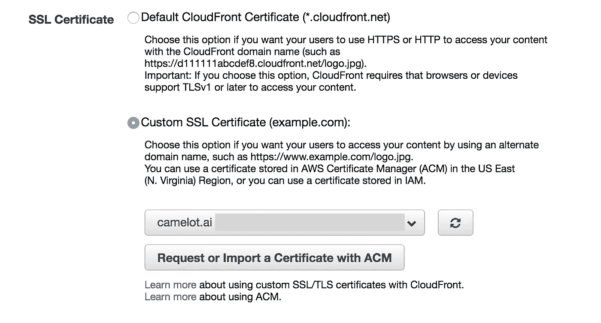
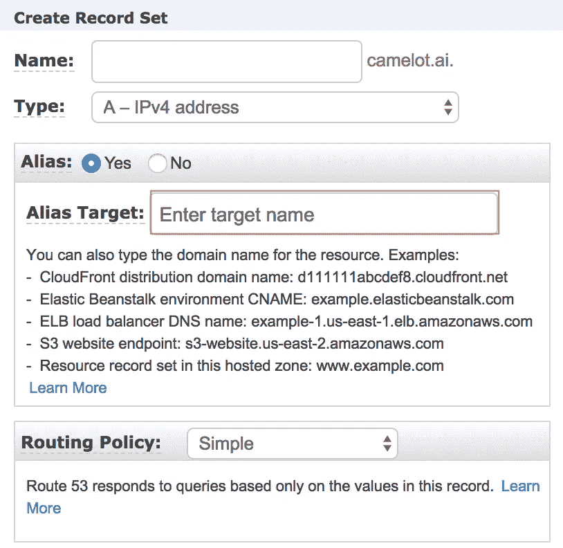
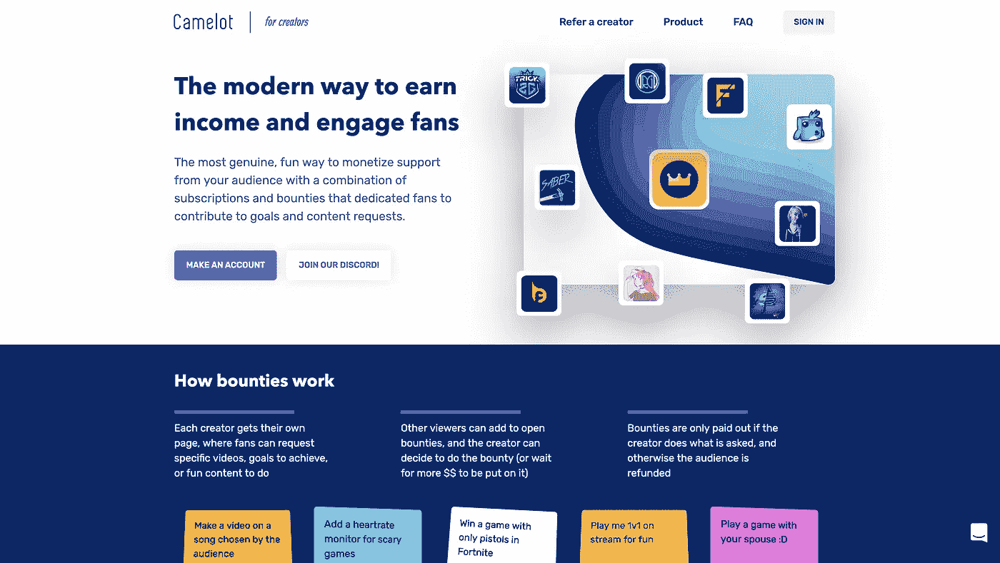

# 如何在 AWS 上为您的域名设置 HTTPS

> 原文：<https://medium.com/hackernoon/how-to-set-up-https-for-your-domain-on-aws-8f771686603d>

你可以在 AWS 上托管所有这些不同的页面，还有大量的指南，如果你想在你的域名前放上绿色 HTTPS，那会变得相当混乱。


This is what we want

在这里，我将为下面的每一种情况分解一步一步达到 HTTPS 的方法。总的来说，这个策略包括(a)获得一个 [SSL 证书](https://en.wikipedia.org/wiki/Certificate_authority) , (b)将它链接到你的域名，并且可选地(c)将所有 [HTTP](https://hackernoon.com/tagged/http) 流量定向到 HTTPS。

1.  弹性豆茎上的静态页面
2.  亚马逊 S3 上的静态页面
3.  使用 NGINX 的 EC2 实例上的通用 web 应用程序

请注意，您的域名不一定需要通过 AWS 获得(例如。不支持“ai”名称)，但是您总是可以将您的 DNS 服务器迁移到 AWS Route 53 托管区域。

# **1。弹性豆茎**

## a)获取 SSL 证书

要获得您的 SSL 证书，只需访问 [AWS 证书管理器](https://aws.amazon.com/certificate-manager/) (ACM)，它会免费发布证书。



Register SSL certificate through ACM

第一步，你输入你想注册的域名。随后，在第二步中，它将要求您验证您是否确实是该域的所有者。这两个选项是(1) DNS 和(2)电子邮件，只需按照说明，很快你就会有你的证书(可能需要 60 分钟)。如果您的域已经在 AWS 托管区域上，我推荐 DNS 路由。

## b)链接到您的 EB 实例

接下来，您只需将证书链接到与您的 EB 实例相关联的负载平衡器。转到 AWS 控制台中的 [EB 页面](https://console.aws.amazon.com/elasticbeanstalk/home)，选择您的应用程序。单击左侧菜单上的“配置”，并在“网络层”下找到您的负载平衡器。



Click on the settings icon

单击设置图标，并在“SSL 证书 ID”下拉列表中找到您刚刚注册的 ACM SSL 证书。



Attach SSL certificate to EB Load Balancer

## c)通过重定向 HTTP 流量来强制 HTTPS

这一步是迄今为止最烦人的。我发现这很困难，因为缺乏可用的文档，而且所有的指南要么已经过时，要么只适用于特定的案例。我将介绍适用于所有情况的一般策略，但这里的细节将针对*单集装箱码头应用*。



总体思路是，你的 EB 应用背后的服务器是另一个 EC2 实例，你可以在你的 AWS 控制台的 [EC2 部分](https://console.aws.amazon.com/ec2/v2/home)中找到它。您必须在这台机器上定制 Nginx 配置，将 HTTP 流量(端口 80)重定向到 HTTPS(端口 443)。

你可能会看到很多指南告诉你使用`.ebextensions`目录，但是很难知道在那里做什么，因为对别人有用的东西可能对你没用。通过使用 Nginx，您可以在基础级别设置路由。点击此处了解更多信息:


现在 SSH 进入 EC2 实例。如果你已经知道如何做到这一点，很好。否则，最简单的方法是获取 EB CLI，并运行`eb ssh`。

一旦进入，找到 nginx 配置文件，并打开它。

```
$ sudo vim /etc/nginx/nginx.conf
```

在里面，您会看到一个`include`语句，指向路由实际发生的文件。在我们的例子中，它是`elasticbeanstalk-nginx-docker-proxy.conf`。

```
$ sudo vim /etc/nginx/sites-enabled/elasticbeanstalk-nginx-docker-proxy.conf
```

机器将总是监听端口 80，您可以看到它正在代理传递到 Docker 容器。现在，HTTP 和 HTTPS 都被路由到 Docker，只是有所不同。用下面的代码替换`server`部分。

本质上，因为请求必须通过端口 80，您只需测试它是否已经是 HTTPS，在这种情况下，您继续将它路由到 Docker。否则，你重定向它使用 HTTPS。

现在，重启 Nginx，我们就完成了！

```
$ sudo service nginx restart
```

# 2.亚马逊 S3

## a)获取 SSL 证书

同样，最好使用 AWS 证书管理器发布的免费 SSL 证书。有关说明，请参见第 1 节。

## b)链接到您的 S3 页面

要使用你的 SSL 证书才能把你的 S3 页面放到 HTTPS，我们必须使用一种叫做 CloudFront 的服务。你可以在你的 AWS 控制台上找到它。点击“创建发行版”,浏览各个字段——您可以保留大部分字段。

重要的字段是原点设置，通过它你可以链接到已经存在的 S3 页面。此外，再往下，您可以选择相应的 SSL 证书。



Create a CloudFront distribution

一旦创建了发行版，基本上就有了一个可以处理 HTTPS 的页面外层。

你如何让你的 URL 地址真正指向那里？转到 AWS 控制台中的 [Route 53](https://console.aws.amazon.com/route53/home) 管理器。现在单击“托管区域”，选择您的域，然后“创建记录集”。这里的目标是创建一个*别名*，将您的域链接到您刚刚创建的 CloudFront 发行版。



Create an alias in your Record Set

从“别名目标”下拉列表中选择您的 CloudFront 发行版，并创建。这些更改可能需要一点时间来传播，但是您已经完成了！

# 3.使用 NGINX 的 EC2 实例

## a)获取 SSL 证书

我稍后使用的策略需要 SSL 证书的实际密钥文件，这是无法从 ACM 获得的(ACM 的证书只能应用于负载平衡器或 S3)。

因此，我们转向另一种选择，这也很容易: [Certbot](https://certbot.eff.org/) 。SSH 进入您的机器，并按照网站上的说明获取您的 SSL 证书文件。这些命令会在`/etc/letsencrypt/`将 SSL 全链和私钥下载到您的本地机器上。

## b)将 SSL 证书链接到您的 web 应用程序

同样，所有的路由都发生在 NGINX 中。没有 HTTPS，你可能只是监听端口 80，并将其重定向到你的应用程序进程。现在，我们想把文件修改成这样。

请注意，现在我们正在监听端口 80 和 443。在端口 443 上，当您收到 HTTPS 请求时，您利用您的 SSL 证书将其重定向到您的应用程序。

## c)通过重定向 HTTP 流量来强制 HTTPS

上面的代码实际上是一举两得。第 33–38 行告诉服务器也监听端口 80，并将其重定向到使用 HTTPS。如果你不想要这个功能，只需去掉那些线条。

希望这有助于总结在 AWS 上设置 HTTPS 的不同技术！一如既往，如果你有什么要补充的，欢迎反馈或评论。

如果你想知道什么是 [camelot.ai](https://camelot.ai) ，我们的团队正在为内容创作者建立一种新的赚钱方式，让粉丝在他们的内容中发表意见或直接与他们交流。您可能会认出平台上已经有的许多游戏彩带！



Our landing page