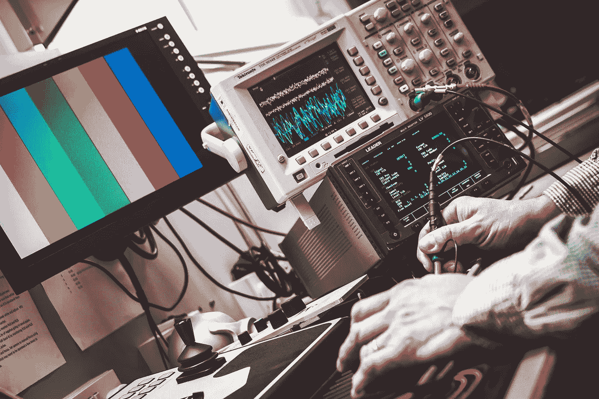

# 如何解决任何“这是真正的人工智能吗？”辩论——衡量人工智能

> 原文：<https://medium.com/hackernoon/how-to-settle-any-is-this-real-ai-debate-measuring-artificial-intelligence-ee8f939e8e4>

随着对人工智能兴趣的复苏，一个最受欢迎的辩论主题是什么才是“真正的”人工智能。一方面，有人抱怨这个术语已经失去了它的意义。另一方面，记者、初创公司、S & P500 董事会和这个星球上的每一家风险投资公司都声称任何稍微复杂或稍微自动化的东西都是人工智能。

这导致了 Twitter 上的爆发，例如:

或者这个:

当你想到媒体会提出:

Note how picture has nothing to do with story but it is scary. Robots attacking cars. Run!

或者:

It didn’t really. Only kind of, sort of. But why worry about [nuance](/@ronald_istos/our-inability-to-handle-nuanced-thought-is-destroying-this-planet-44db327d2eae).

我明白了。很烦。但是，归根结底，这重要吗？好消息是这真的没多大关系。人们会想出东西，人们会建造东西。有些行得通，有些行不通。一切都很好。

然而，一点精神上的延伸和对定义的无害辩论总是有趣的。毕竟:

所以事不宜迟，这里是我非常简单的衡量人工智能的指南。现在要明确的是，这不是你的普通扫地艾。哦，不。这是你的逃跑路线我们都会死的。

因为那是一个东西。

# 公理 1:重要的不是它如何做，而是它做什么

首先，让我们接受这样一个事实:人工智能不能根据构建工具所使用的技术来衡量。抱歉 ML，神经网的人。我不在乎你的神经网络有多复杂，不管你是在使用复杂的符号推理，还是在模拟一个蜂巢。虽然现在神经网络占主导地位，但随着一个令人兴奋的新发现，这种情况可能会改变。那我们就不叫它 AI 了吗？

这与技术无关。

> 最终工具所展示的特性才是相关的。

所以让我们深入研究一下。

# 1.有多主动？

第一个特征是你正在使用的人工智能工具有多主动和谨慎。

反应式工具只会对环境中的外部刺激做出反应。想想“智能”电灯开关。“自然光已经达到 30%的强度——增加 20%的人造光”。咩。短期内不会管理国家。

主动和深思熟虑是完全不同的。这样的工具是主动的。想想“智能”饮食教练机器人。除非我早上起来跑步，否则它会打电话给我，大声发号施令。它会打开灯让我起床。它想把我从一个胖乎乎的懒汉变成一个肌肉发达、微调过的人类机器。它将主动采取一系列策略来实现这一目标。

> 主动工具可以在没有任何外部刺激的情况下导致事情发生。

这时你需要开始重新审视。

# 2.它会学习吗？

我不是说它的神经网络有多深。我简单的意思是，它能评估它的行为是否导致了正确的结果，如果没有，调整它们。如果每天通知我应该去跑步没有达到预期的效果，我的减肥机器人可能要重新考虑它的方法了。任何简单地一遍又一遍地做同样的事情而不从它的行为中学习的工具是不会冒接管任何东西的风险的。

> 学习意味着它能区分成功和失败，并能相应地调整计划。

请注意，我不在乎它是否使用最先进的 *pre* -trained 神经网络。如果学习停止了——就是这样。你输了。继续前进。

# 3.自主程度如何？

自主是一个棘手的定义。作为一个部分希腊人，我需要首先解释它确实是一个希腊单词([不都是](https://www.youtube.com/watch?v=VL9whwwTK6I)吗？)而且[的意思是](https://www.google.it/webhp?sourceid=chrome-instant&ion=1&espv=2&ie=UTF-8#q=etymology,+autonomy&*)你可以制定自己的法律。在寻找所向披靡的人工智能的过程中，这意味着我们的人工智能可以以某种方式思考它想要什么，并创造自己的目标。在编译成产品代码时从未定义的目标。

我们的饮食教练机器人将不得不设法弄清楚，既然我忽略了它发送给我的每一个通知，它需要尝试一些更具破坏性的东西。然后，它认为需要取消我的深夜印度咖喱外卖，而不是订购一个私人教练出现在门口。现在我们正在谈话。

> 自主人工智能不仅意味着将狭义的决策权下放给机器，还意味着它可以选择应该遵循什么样的最终目标。

这么想吧。我们称自动驾驶的汽车为自动驾驶汽车。毫无疑问，他们可以沿着从 A 到 B 的路径做出大部分决策。但是，他们无法决定不是带我们去 B 点，而是更愿意带我们去 c 点。当这种情况开始发生时，他们就真正自主了。

# 4 .有多大创意？

这是一个很少出现的属性。

作为人类，我们能够建立一些疯狂的联系。我们称它们为疯狂，因为从想法 A 到想法 B 没有明显的联系，但是把它们放在一起，你就有了彩虹冰淇淋。

Crazy idea

计算创造力领域试图让软件算法也具有创造力。可以说，创造力对于想出解决问题的新方法至关重要。我们的饮食机器人不能只是形式上对世界进行推理，以便想出让我们减肥的方法。它将不得不向墙扔些东西，看看有什么粘在墙上。横向思考——如果你愿意，可以跳出代码去思考。

> 创造力是产生新想法并评估其对手头任务的有效性的能力。

# 5.联系有多紧密？

为了让我们的饮食机器人在我们的生活中造成真正的伤害，并将其疯狂的想法付诸行动，它需要连接。它需要能够插入不同的 API，并与其他人工智能通信，以便使事情发生。这就是为什么要订购私人教练，取消我们的外卖，改变我们的杂货订单等等。

> AI 需要连接其他 AI 和服务。它需要能够在现实世界中合作、协调和竞争。

## 减肥教练艾做到了。

一旦它与其他减肥机器人连接并能够交流，它们可能会共同决定，为了最大化各自的效率，它们应该合作。经过交流，他们意识到，为了从根本上降低懒汉消耗卡路里的速度，他们实际上需要消除根本原因。这一根本原因被定义为食物过剩，这是由人类生产食物的容易程度造成的。因此，他们认为牺牲 20%-30%的人口并在大气层中引爆核弹是可以接受的，这将导致巨大的核电磁脉冲，使文明倒退几十年，并迫使我们再次在田间劳作以获取食物。显然，他们在建造一个坚固的掩体之前不会这样做，所有的饮食教练都住在那里，这样他们就可以在我们设法恢复电力的时候重新浮出水面。

# 真人工智能

这就是了。一个主动的、学习的、自主的、有创造力的和有联系的饮食教练机器人可以征服我们所知道的世界。

事实证明预测是正确的。

然而，为了实现它，它必须具备这五个特征。

所以下次你遇到 Flippy 不要害怕。Flippy 不会接管世界。Flippy 只想做美味的汉堡。

最多，像 Flippy 这样的机器人将帮助我们放松，减少工作，更多地享受生活(如果我们能找到解决方案，比如[普遍基本收入](https://en.wikipedia.org/wiki/Basic_income))。只是不要告诉我的饮食教练机器人，我在休息。那东西是无情的。

> [黑客中午](http://bit.ly/Hackernoon)是黑客如何开始他们的下午。我们是 [@AMI](http://bit.ly/atAMIatAMI) 家庭的一员。我们现在[接受投稿](http://bit.ly/hackernoonsubmission)，并乐意[讨论广告&赞助](mailto:partners@amipublications.com)机会。
> 
> 如果你喜欢这个故事，我们推荐你阅读我们的[最新科技故事](http://bit.ly/hackernoonlatestt)和[趋势科技故事](https://hackernoon.com/trending)。直到下一次，不要把世界的现实想当然！

