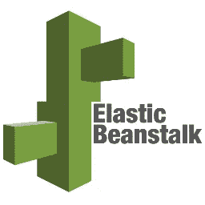
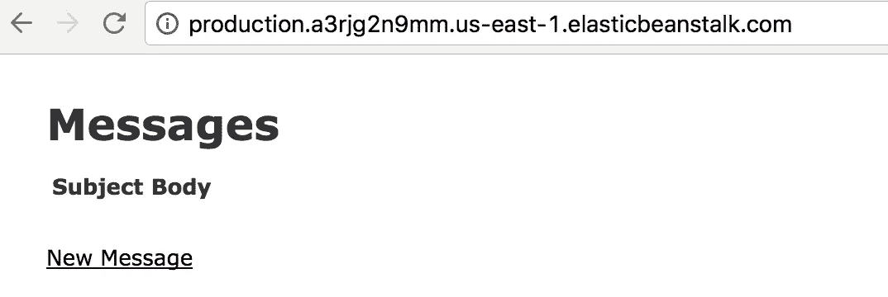

# 如何使用 PostgreSQL、Redis 等在 AWS ElasticBeanstalk 上设置和部署 Rails 5 应用程序…

> 原文：<https://medium.com/hackernoon/how-to-setup-and-deploy-a-rails-5-app-on-aws-beanstalk-with-postgresql-redis-and-more-88a38355f1ea>



注意:本教程是我的书[构建 SaaS Ruby on Rails 5](https://BuildASaaSAppinRails.com) 中部署章节的摘录。这本书将通过将应用程序部署到生产中来指导你从卑微的开始。如果你发现这种类型的内容有价值，你现在就可以获得一个免费的章节！

此外，我的新项目[拉管理器](https://pullmanager.com)的测试版也差不多准备好了。如果你失去了对拉取请求的跟踪，让旧的请求留在身边，或者只是喜欢一个通过多个服务(Github、Gitlab 和 Bitbucket)聚集这些请求的仪表板，[查看一下](https://pullmanager.com)。

即使对于经验丰富的 Rails 开发人员来说，部署一个 Rails 应用程序对新应用程序来说也是一项令人望而生畏的任务。虽然 Capistrano 一直是 Rails 应用部署的主要参与者，但随着负载平衡器和计算服务器越来越受欢迎，它似乎已经有点失宠了。

谢天谢地， [AWS(Amazon Web Services)](https://aws.amazon.com/elasticbeanstalk/) 已经创建了一个工具，用于在他们的生态系统中部署和扩展 Rails web 应用程序。以下是他们登录页面的解释:

> AWS Elastic Beanstalk 是一个易于使用的服务，用于部署和扩展用 Java 开发的 web 应用程序和服务。熟悉的服务器如 Apache、Nginx、Passenger、 [IIS](https://aws.amazon.com/windows/) 上的 NET 、PHP、Node.js、Python、Ruby、Go、 [Docker](https://aws.amazon.com/docker/) 。
> 
> 您只需上传您的代码，Elastic Beanstalk 就会自动处理部署，从容量供应、负载平衡、自动扩展到应用健康监控。同时，您保留了对驱动应用程序的 AWS 资源的完全控制，并且可以随时访问底层资源。
> 
> Elastic Beanstalk 不收取额外费用——您只需为存储和运行应用程序所需的 AWS 资源付费。

# 入门指南

如果你还没有 AWS 账户，去注册吧，你会得到一年的特定级别的免费服务(例如 t1.micro 服务器等)。本教程将关注 MacOS，如果对 windows 表现出足够的兴趣，我可以扩展，尽管大多数基于 rails 的命令应该可以在任何平台上工作。

设置好用户后，获取 AWS 的 CLI(通过 brew):

```
$ brew update
$ brew install aws-elasticbeanstalk
```

如果还没有，现在创建 rails 应用程序

```
$ **rvm or rbenv optional setup here**
$ gem install rails -v 5.0.1
$ rails new rails5app
$ cd rails5app
$ git init && git add -A && git commit -m "Init Commit Message"
```

…现在我们将创建一个脚手架示例

```
$ rails g scaffold message subject body:text
$ rails db:migrate
$ git add .
$ git commit -am "Add Messages"
$ git push
```

好了，我们有了一个基本的 Rails 应用程序来继续部署 Elastic BeanStalk。让我们初始化 ElasticBeanstalk

```
$ eb initSelect a default region
1) us-east-1 : US East (N. Virginia)Select an application to use
1)[ Create new Application ]Enter Application Name
(default is "rails5app"):
Application rails5app has been created.It appears you are using Ruby. Is this correct?
(y/n): ySelect a platform version.
1) Ruby 2.3 (Puma)Do you want to set up SSH for your instances?
(y/n): ySelect a keypair.
1) [ Create new KeyPair ]
(default is 1): 1
```

这就建立了我们的环境，使用 US East(如果你想使用 AWS 免费的 SSL 服务更好)，Ruby 2.3，并允许你在 EC2 启动并运行时通过键入“eb ssh”来访问它。

现在我们将创建环境。这就是 Elastic Beanstalk 让您在应用程序的不同版本之间切换的基本方式。大多数人会用它来建立不同的 rails 环境进行部署(生产、暂存等)

```
$ git commit -am "Post EB init"
$ eb create production
```

..然后等待。现在，Elastic Beanstalk 正在为您、负载平衡器、安全组、EC2 服务器等设置一切。说真的，你应该去喝杯咖啡。此外，我以前也有过 eb-cli 登录超时，断开连接，但仍然完成了环境创建。

之后的快速状态检查将为您的应用程序获取环境信息和您的 ElasticBeanstalk URL:

```
$ eb status
Environment details for: production
 Application name: rails5app
 Region: us-east-1
 Deployed Version: app-5cbc-170110_150338
 Environment ID: e-krea6tdvjx
 Platform: 64bit Amazon Linux 2016.09 v2.3.0 running Ruby 2.3 (Puma)
 Tier: WebServer-Standard
 CNAME: production.a3rjg2n9mm.us-east-1.elasticbeanstalk.com
 Updated: 2017–01–10 22:10:57.815000+00:00
 Status: Ready
 Health: Green
```

不过，现在去那里会给你带来错误。为了避免溃疡，这是因为没有 Rails 秘密设置。因此，下面是如何将 ENV 变量添加到 Elastic Beanstalk 实例中:

```
$ eb setenv SECRET_KEY_BASE=$(rails secret)
INFO: Environment update is starting.
INFO: Updating environment production's configuration settings.
INFO: Environment health has transitioned from Ok to Info. Configuration update in progress. 1 out of 1 instance completed (running for 51 seconds).
INFO: Successfully deployed new configuration to environment.
```

繁荣

从现在开始，将代码推送到您的实例只是一个“eb 部署”的过程。



Your default rails chariot awaits

# 剩下的好东西

我敢打赌你会说，这很好，但这不是一个生产就绪的应用程序。你说得对，让我们开始使用 postgresql、redis 和 sidekiq 吧！首先，波斯格里斯。您需要将“pg”宝石添加到您的宝石文件中，并将以下内容添加到您的数据库中。yml:

```
production:
    <<: *default
    adapter: postgresql
    encoding: unicode
    database: <%= ENV['RDS_DB_NAME'] %>
    username: <%= ENV['RDS_USERNAME'] %>
    password: <%= ENV['RDS_PASSWORD'] %>
    host: <%= ENV['RDS_HOSTNAME'] %>
    port: <%= ENV['RDS_PORT'] %>
```

这是什么魔法？一旦有了 RDS 实例设置，AWS Elastic Beanstalk 就会在 ec2 实例上抛出这些 ENV 变量。让我们这样做:

*   去 https://console.aws.amazon.com/elasticbeanstalk/home?region = us-east-1 #/应用程序
*   单击您的应用程序的方框
*   单击“配置”，向下滚动到底部的“数据层”，然后单击“设置 RDS 实例”
*   根据您的喜好设置 RDS(postgres、t2.micro(如果您想留在免费层，用户名等)
*   等待 AWS 做它的事情。你现在可以再来一杯咖啡。

> 注意:一些读者让我注意到，通过 EBS 接口添加 RDS 实例会将它与您的 EBS 环境的存在或破坏联系在一起。单独设置 RDS 并手动添加环境变量可能对某些人有更大的 RDS 保证。

现在，针对您的数据库配置的另一个“eb deploy”应该可以通过 postgresql 启动并运行一切。

现在，让我们添加两个大多数应用程序都需要的配置文件。首先，将 git 添加到部署中。添加一个文件夹。ebextensions 和一个文件 ruby.config

```
packages:
 yum:
  git: []
```

现在，当你在你的应用中获得更多的宝石时，特别是那些内置所有本机扩展的，你可能会因为内存不足而部署失败。由于大多数应用程序都可以在空闲层上运行，并且只有在部署期间才会出现内存问题，因此我们将启用交换。在中添加文件 0001_setup_swap.config。包含以下文本的 ebextensions 文件夹:

```
commands:
  000_dd:
    command: echo “noswap”#dd if=/dev/zero of=/swapfile bs=1M count=3072
  001_mkswap:
    command: echo “noswap”#mkswap /swapfile
  002_swapon:
    command: echo “noswap”#swapon /swapfile
```

太好了，我们快好了。几乎所有 Rails 应用程序的最后一部分都将是 sidekiq(加上 Redis……这意味着我们也可以将 ActionCable 绑定到 Redis 中)。让我们从在 AWS 中添加 Redis 开始:

*   去 https://console.aws.amazon.com/elasticache/home?region=us-east-1#redis :
*   单击 create，并填写非常简单的表单(再次选择 t2.micro 作为自由层)。
*   点击保存，在你等待的时候去喝水…三杯咖啡太多了。
*   创建完成后，单击列表中的实例会将您带到一个页面，该页面的表中列出了一个端点(它应该看起来像 your-name.iz6wli.0001.use1.cache.amazonaws.com)

快好了！我们只需要为 sidekiq、redis 和 elastic 的部署添加几个配置文件！首先，我喜欢设置 Sidekiq/Redis 配置:

在 config/initializer/sidekiq . Rb 中

```
rails_root = Rails.root || File.dirname(__FILE__) + ‘/../..’
rails_env = Rails.env || ‘development’
redis_config = YAML.load_file(rails_root.to_s + ‘/config/redis.yml’)
redis_config.merge! redis_config.fetch(Rails.env, {})
redis_config.symbolize_keys!
Sidekiq.configure_server do |config|
 config.redis = { url: “redis://#{redis_config[:host]}:#{redis_config[:port]}/12” }
end
Sidekiq.configure_client do |config|
 config.redis = { url: “redis://#{redis_config[:host]}:#{redis_config[:port]}/12” }
end
```

…和 config/redis.yml

```
development:
 host: ‘localhost’
 port: ‘6379’
test:
 host: ‘localhost’
 port: ‘6379’
production:
 host: ‘your-name.iz6wli.0001.use1.cache.amazonaws.com’
 port: ‘6379’
```

*可选* config/cable.yml

```
development:
 adapter: async

test:
 adapter: async

production:
 adapter: redis
 url: redis://your-name.iz6wli.0001.use1.cache.amazonaws.com:6379
```

…最后，对于弹性豆茎。ebextensions/0002 _ sidekiq . config([要诀](https://gist.github.com/polysaturate/98dbca462e25604d6b18f38dc8380757)

```
# Sidekiq interaction and startup script
commands:
  create_post_dir:
    command: "mkdir -p /opt/elasticbeanstalk/hooks/appdeploy/post"
    ignoreErrors: true
files:
  "/opt/elasticbeanstalk/hooks/appdeploy/post/50_restart_sidekiq.sh":
    mode: "000755"
    owner: root
    group: root
    content: |
      #!/usr/bin/env bash
      . /opt/elasticbeanstalk/support/envvarsEB_APP_DEPLOY_DIR=$(/opt/elasticbeanstalk/bin/get-config container -k app_deploy_dir)
      EB_APP_PID_DIR=$(/opt/elasticbeanstalk/bin/get-config container -k app_pid_dir)
      EB_APP_USER=$(/opt/elasticbeanstalk/bin/get-config container -k app_user)
      EB_SCRIPT_DIR=$(/opt/elasticbeanstalk/bin/get-config container -k script_dir)
      EB_SUPPORT_DIR=$(/opt/elasticbeanstalk/bin/get-config container -k support_dir). $EB_SUPPORT_DIR/envvars
      . $EB_SCRIPT_DIR/use-app-ruby.shSIDEKIQ_PID=$EB_APP_PID_DIR/sidekiq.pid
      SIDEKIQ_CONFIG=$EB_APP_DEPLOY_DIR/config/sidekiq.yml
      SIDEKIQ_LOG=$EB_APP_DEPLOY_DIR/log/sidekiq.logcd $EB_APP_DEPLOY_DIRif [ -f $SIDEKIQ_PID ]
      then
        su -s /bin/bash -c "kill -TERM `cat $SIDEKIQ_PID`" $EB_APP_USER
        su -s /bin/bash -c "rm -rf $SIDEKIQ_PID" $EB_APP_USER
      fi. /opt/elasticbeanstalk/support/envvars.d/sysenvsleep 10su -s /bin/bash -c "bundle exec sidekiq \
        -e $RACK_ENV \
        -P $SIDEKIQ_PID \
        -C $SIDEKIQ_CONFIG \
        -L $SIDEKIQ_LOG \
        -d" $EB_APP_USER"/opt/elasticbeanstalk/hooks/appdeploy/pre/03_mute_sidekiq.sh":
    mode: "000755"
    owner: root
    group: root
    content: |
      #!/usr/bin/env bash
      . /opt/elasticbeanstalk/support/envvarsEB_APP_USER=$(/opt/elasticbeanstalk/bin/get-config container -k app_user)
      EB_SCRIPT_DIR=$(/opt/elasticbeanstalk/bin/get-config container -k script_dir)
      EB_SUPPORT_DIR=$(/opt/elasticbeanstalk/bin/get-config container -k support_dir). $EB_SUPPORT_DIR/envvars
      . $EB_SCRIPT_DIR/use-app-ruby.shSIDEKIQ_PID=$EB_APP_PID_DIR/sidekiq.pid
      if [ -f $SIDEKIQ_PID ]
      then
        su -s /bin/bash -c "kill -USR1 `cat $SIDEKIQ_PID`" $EB_APP_USER
      fi
```

再来一次“git commit”和“eb deploy ”,你就可以开始了。噢耶！

[](http://bit.ly/HackernoonFB)[](https://goo.gl/k7XYbx)[](https://goo.gl/4ofytp)

> [黑客中午](http://bit.ly/Hackernoon)是黑客如何开始他们的下午。我们是 [@AMI](http://bit.ly/atAMIatAMI) 家庭的一员。我们现在[接受投稿](http://bit.ly/hackernoonsubmission)并乐意[讨论广告&赞助](mailto:partners@amipublications.com)机会。
> 
> 如果你喜欢这个故事，我们推荐你阅读我们的[最新科技故事](http://bit.ly/hackernoonlatestt)和[趋势科技故事](https://hackernoon.com/trending)。直到下一次，不要把世界的现实想当然！

