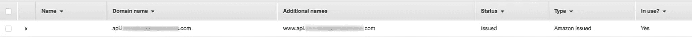
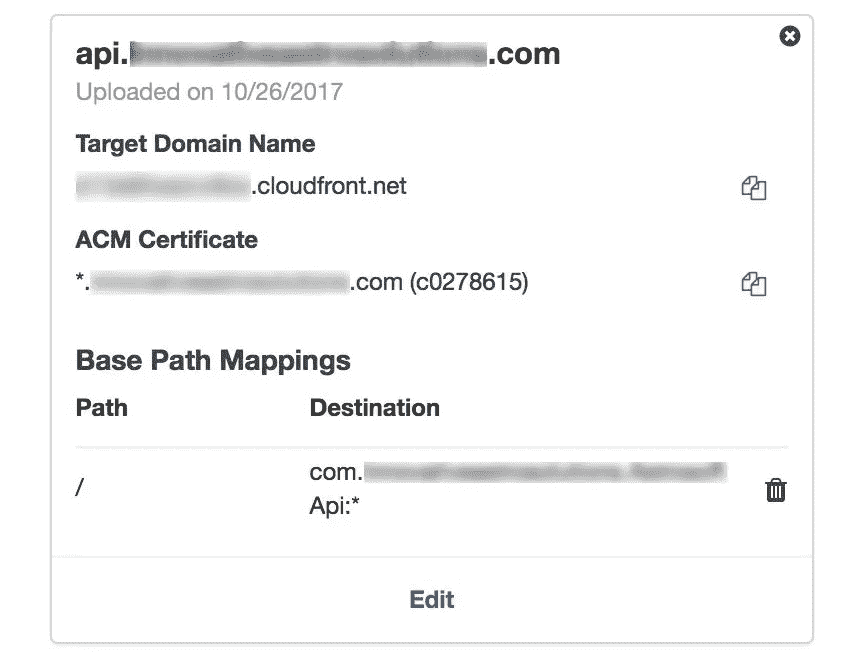
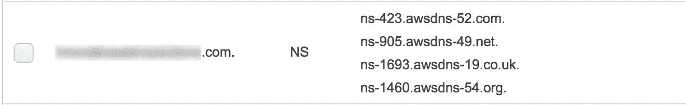

# 如何为 aws api 网关设置子域？

> 原文：<https://medium.com/hackernoon/how-to-setup-subdomain-for-aws-api-gateway-d526a9fd6722>

2017 年 11 月 1 日。5 分钟读取。

我需要为 AWS API Gateway 中托管的 REST 服务设置一个子域。

许多组件必须正确配置才能让所有组件协同工作。我在网上找不到简明的说明，AWS 文档中有太多的东西需要阅读。我将分享我为使它工作所做的具体步骤，这样其他人就不必像我一样用一种困难的方式来解决它。

# 目标

在这篇文章中，我将使用`mydomain.com`作为一个示例域。

我已经拥有了一辆和 namecheap.com 一起购买的 mydomain.com。此外，根域——mydomain.com 已经由 Wix.com 提供服务，并且是通过[配置名称服务器](https://support.wix.com/en/article/tutorial-connecting-your-domain-using-name-servers)设置的。我的目标是创建子域***api.mydomain.com***指向 AWS API 网关，并且仍然有*mydomain.com*与 Wix 一起工作。

以下是我如何让它工作的逐步说明:

# 1.从 ACM 获得 HTTPs 证书

第一步是我需要在 Amazon Certificate Manager (ACM)中为我的站点申请证书。以下是步骤:

1.  登录 Amazon Certificate Manager (ACM)并将地区切换到 N. Virginia(这是**重要的**)
2.  点击了请求证书
3.  为域名输入了`*.mydomain.com`。
4.  点击“添加另一个名字到此证书”并输入`mydomain.com`。
5.  点击审查和请求。
6.  我收到了一封带有批准请求链接的电子邮件。

批准后，证书看起来像这样

# 2.在 API 网关中创建了自定义域

下一步是将自定义域添加到 API 网关:

1.  登录到亚马逊 API 网关
2.  点击左侧导航栏上的*“自定义域名”*
3.  为域名输入了`api.mydomain.com`。
4.  在上一步中为 ACM 证书创建的选定证书。
5.  添加了路径`/`到目的地的基本路径映射，作为我部署的 API 网关应用程序。
6.  点击*【保存】*
7.  记下“目标域名”处显示的云前端分发 url。

这是我的 API 网关配置的快照

# 3.在 AWS 路线 53 中创建了托管区域。

接下来，我定义了 DNS 设置 AWS 路由 53:

1.  登录到 AWS 路线 53。
2.  点击*“创建托管区域”*
3.  提供域名为`mydomain.com`，点击创建。(**注意域应该是根域，而不是子域**)
4.  选择已创建的域来配置`A`记录。
5.  点击“创建记录集”
6.  输入`api.mydomain.com`作为名称
7.  选择*“A-IP v4 地址”*作为类型。
8.  选择*【是】*为别名。
9.  输入上一步创建的云锋分布 id 作为值。

我的托管区域别名看起来像 ethis

# 4.在 Name price 中添加了 Route 53 名称服务器

我在我域名的 DNS 设置下有 wix 域名服务器。我删除了 Wix 名称服务器，添加了 AWS Route 53 名称服务器。我在 Route 53*“NS”*类型的记录集中找到了我的域名托管区域的域名服务器，如下图所示

# 5.将 Wix 域设置切换到指向配置

我需要从 dns 服务器将 wix 域连接类型更改为*“指向”*。所以我从 wix 断开了我的域，并通过域设置向导。我选择连接类型为*“指向”*，并遵循 Wix 提供的这些说明。

> *对于 yourdomain.com，*创建一个指向 23.236.62.147 的 A 记录
> 
> 对于[www.yourdomain.com，](http://www.yourdomain.com,)创建一个 Cname 记录，指向:www174.wixdns.net
> 
> 对于 m.yourdomain.com，创建一个 Cname 记录，指向:www174.wixdns.net

所以再次登录 53 号公路来设置这些 A 和 CNAME 记录集。

# 提示和技巧

以下是我遇到的问题和解决问题的建议。

# 不能同时使用 Wix 和 Route 53 名称服务器。

我首先尝试将 Wix 名称服务器与 Route 53 名称服务器放在一起。但是域 api.mydomain.com 变得无法解析。然后，我没有使用 Route 53，而是尝试在 wix 中直接添加 CNAME，将`api.mydomain.com`指向为我的定制域配置的 cloudfront 目标域。但是我得到了它返回的这个错误:

> *错误无法满足请求。错误的请求。由 cloudfront(云锋)生成*

因此，我必须删除 wix 名称服务器，并将 Wix 自定义域设置切换到指向类型配置。

# API 网关中的自定义域名应该是子域。

当我在 API 网关自定义域配置中使用根域名时，我得到了以下 SSL 错误:

> *不支持的协议。ERR _ SSL _ VERSION _ OR _ CIPHER _ MISMATCH*

该错误具有误导性，但真正的原因是自动创建的云分布对于备用域名具有错误的值，因为我使用了根域名而不是子域名。

# 自定义域设置需要基本路径映射。

首先，我错过了添加自定义域设置中的基本路径映射，我得到了`Bad request. Generated by cloudfront (CloudFront)`错误。这是因为如果没有基本路径映射，云前端将不知道将请求路由到哪个目的地。在添加了基本路径之后，它的工作就像一个魔咒！

*最初发布于*[*http://erajasekar . com/posts/how-to-setup-subdomain-for-AWS-API-gateway/*](http://erajasekar.com/posts/how-to-setup-subdomain-for-aws-api-gateway/)*。*